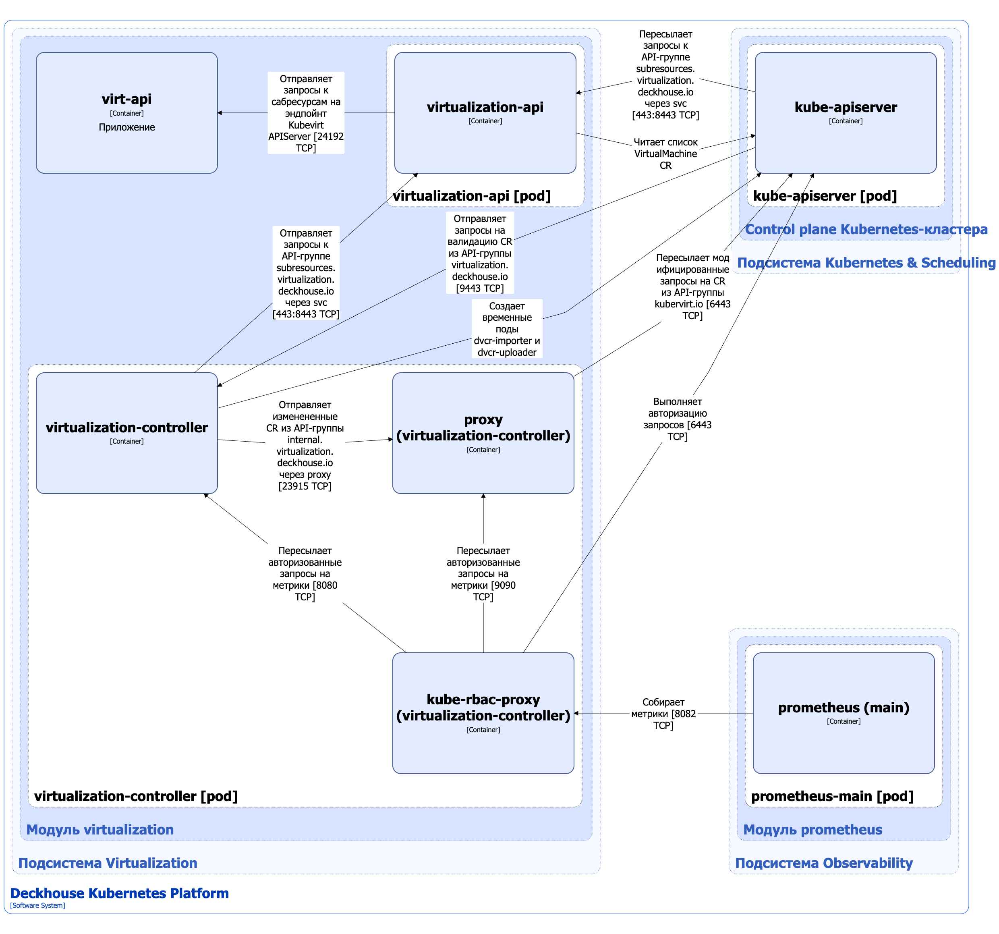

Компонент virtualization сontroller/API модуля [`virtualization`](/modules/virtualization/) управляет кастомными ресурсами следующих API-групп:

1. `Virtualization.deckhouse.io` — основная группа, включает в себя следующие кастомные ресурсы:

   - VirtualMachine — ресурс, описывающий конфигурацию и статус виртуальной машины (ВМ);
   - VirtualMachineClass — ресурс, описывающий набор параметров для ресурсов VirtualMachine, таких как спецификации CPU и RAM, NodeSelector и Tolerations;
   - VirtualDisk — ресурс, описывающий желаемую конфигурацию диска ВМ;
   - VirtualImage — ресурс, описывающий образ диска ВМ, который может использоваться в качестве источника данных для новых ресурсов VirtualDisks или установочный образ (ISO), который может быть смонтирован в ресурс VirtualMachine напрямую.

   Полный список ресурсов основной API-группы приведён [в документации модуля](/modules/virtualization/cr.html).

   Ресурсами основной группы управляет компонент virtualization-сontroller.

2. `Subresources.virtualization.deckhouse.io` — группа сабресурсов. Сабресурсы — это дополнительные операции или действия, которые можно выполнять над основными ресурсами (например, VirtualMachine) через API Kubernetes. Они предоставляют интерфейсы для управления конкретными аспектами ресурсов, не затрагивая весь объект. Вместо привычного для Kubernetes декларативного ресурса они представляют собой эндпойнт для императивных операций. Группа включает в себя следующие сабресурсы:
   
   - virtualmachines/console;
   - virtualmachines/vnc;
   - virtualmachines/portforward;
   - virtualmachines/addvolume;
   - virtualmachines/removevolume;
   - virtualmachines/freeze;
   - virtualmachines/unfreeze;
   - virtualmachines/addresourceclaim;
   - virtualmachines/removeresourceclaim.

   Сабресурсами управляет компонент virtualization-api.

Компонент virtualization сontroller/API модуля для управления ВМ, дисками и образами ВМ использует в качестве бэкенда кастомные ресурсы KubeVirt. [KubeVirt](https://github.com/kubevirt/kubevirt) — это открытый проект, который позволяет запускать, развёртывать и управлять ВМ с использованием Kubernetes в качестве платформы оркестрации. Он позволяет сосуществовать традиционным виртуальным машинам и контейнерным рабочим нагрузкам в одном кластере Kubernetes, обеспечивая единую плоскость управления. 

## Архитектура virtualization сontroller/API


Для упрощения схемы приняты следующие допущения:

- На схеме контейнеры разных подов показаны как взаимодействующие напрямую. Фактически обмен выполняется через соответствующие сервисы Kubernetes (внутренние балансировщики). Названия сервисов не указываются, если они очевидны из контекста. В остальных случаях название сервиса приводится над стрелкой.
- Поды могут быть запущены в нескольких репликах, однако на схеме каждый под показан в единственном экземпляре.


Архитектура компонента virtualization сontroller модуля [`virtualization`](/modules/virtualization/) на уровне 2 модели C4 и его взаимодействия с другими компонентами DKP изображены на следующей диаграмме:

<!--- Source: structurizr code from https://fox.flant.com/team/d8-system-design/doc/-/tree/main/architecture/diagrams/C4_RU --->

## Компоненты virtualization сontroller/API

Virtualization сontroller/API состоит из следующих компонентов:

1. **Virtualization-api** — [Kubernetes Extension API Server](https://kubernetes.io/docs/tasks/extend-kubernetes/setup-extension-api-server/), обслуживающий запросы к API-группе `subresources.virtualization.deckhouse.io`. В качестве бэкенда virtualization-api использует сабресурсы из API-группы `subresources.kubevirt.io`. Virtualization-api обращается напрямую на эндпойнт компонента virt-api, который является [Kubernetes Extension API Server](https://kubernetes.io/docs/tasks/extend-kubernetes/setup-extension-api-server/), обслуживающий запросы к аналогичным сабресурсам из API-группы `subresources.kubevirt.io`.

   Состоит из одного контейнера:

   - **virtualization-api**.

2. **Virtualization-controller** — контроллер, выполняющий следующие операции:

   - управление кастомными ресурсами основной API-группы `virtualization.deckhouse.io`.Virtualization-controller ограничен в изменении большей части лейблов, аннотаций и атрибутов спецификации ресурсов. Virtualization-controller разрешено вносить следующие изменения в кастомные ресурсы:

     - добавление и удаление finalizers в атрибуте `metadata.finalizers`;
     - добавление и удаление owners в атрибуте `metadata.ownerReferences`;
     - изменение статуса ресурса.

     В качестве бэкенда virtualization-controller использует кастомные ресурсы из API-группы `kubevirt.io`.
   
   - валидация ресурсов из API-группы `virtualization.deckhouse.io` с помощью механизма [Validating Admission Controllers](https://kubernetes.io/docs/reference/access-authn-authz/admission-controllers/)
   
   - запуск подов dvcr-importer и dvcr-uploader для выполнения сценариев импорта и загрузки дисков и образов ВМ в хранилище образов DVCR. [DVCR (или Deckhouse Virtualization Container Registry)](dvcr.html) — специализированный реестр для хранения и кеширования образов ВМ.

   - выполнение операций над виртуальными машинами посредством запросов к сабресурсам API-группы `subresources.virtualization.deckhouse.io`, например, freeze/unfreeze, port-forward и т.д.

   Компонент содержит следующие контейнеры:

      - **virtualization-controller** — основной контейнер, реализующий контроллер и вебхук-сервер;
      - **proxy** (он же **kube-api-rewriter**) —  сайдкар-контейнер, выполняющий модификацию проходящих через него запросов API, а именно переименование метаданных кастомных ресурсов. Это необходимо, поскольку компоненты Kubevirt используют API-группы вида `*.kubevirt.io`, а другие компоненты модуля [`virtualization`](/modules/virtualization/) используют аналогичные ресурсы, но с API-группой вида `*.virtualization.deckhouse.io`. Kube-api-rewriter является шлюзом, проксирующим запросы между контроллерами, управляющими ресурсами из разных API-групп. Является [Open Source-проектом](https://github.com/deckhouse/kube-api-rewriter);
      - **kube-rbac-proxy** — сайдкар-контейнер с авторизующим прокси на основе Kubernetes RBAC для организации защищенного доступа к метрикам контроллера и сайдкар-контейнера proxy. Является [Open Source-проектом](https://github.com/brancz/kube-rbac-proxy).

## Взаимодействия компонента virtualization сontroller/API

Virtualization-api взаимодействует со следующими компонентами:

1. **Kube-apiserver** — читает список кастомных ресурсов VirtualMachine, которые нужны для обработки запросов к сабресурсам.
1. **Virt-api** — отправляет запросы к сабресурсам KubeVirt. Запросы проходят через аналогичный сайдкар-контейнер **proxy**, который переименовывает метаданные из API-группы `subresources.virtualization.deckhouse.io` в API-группу `subresources.kubevirt.io` и проксирует их на эндпойнт virt-api (Kubernetes Extension API Server KubeVirt).

Virtualization-controller взаимодействует со следующими компонентами:

1. **Kube-apiserver**:

   - отправляет измененные [кастомные ресурсы модуля virtualization](/modules/virtualization/cr.html) через сайдкар-контейнер proxy, который переименовывает метаданные из API-группы `internal.virtualization.deckhouse.io` в API-группу `kubevirt.io`;
   - выполнятет авторизацию запросов на получение метрик.

С virtualization controller/API взаимодействуют следующие внешние компоненты:

1. **Kube-apiserver**:

   - пересылает запросы к сабресурсам API-группы `subresources.virtualization.deckhouse.io`;
   - отправляет запросы на валидацию ресурсов API-группы `virtualization.deckhouse.io`.

1. **Prometheus-main** — собирает метрики компонентов.
