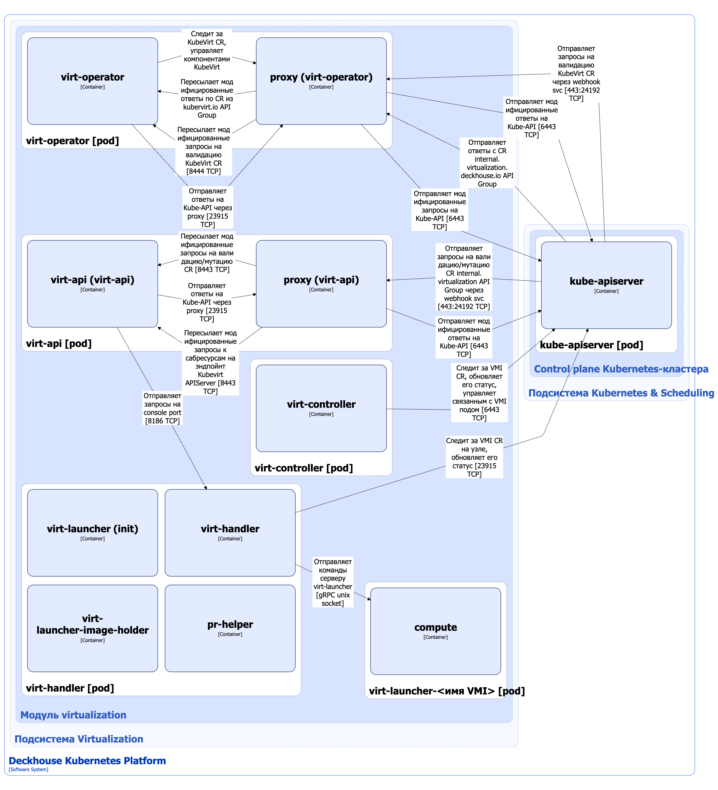

Ядро модуля [`virtualization`](/modules/virtualization/) непосредственно отвечает за работу с виртуальными машинами (ВМ). Ядро основано на проекте KubeVirt. [KubeVirt](https://github.com/kubevirt/kubevirt) — это Open Source-проект, который позволяет запускать, развёртывать и управлять ВМ с использованием Kubernetes в качестве платформы оркестрации. Он обеспечивает совместную работу традиционных ВМ и контейнерных рабочих нагрузок в одном кластере Kubernetes, предоставляя единую плоскость управления. В модуле [`virtualization`](/modules/virtualization/) используется [форк KubeVirt](https://github.com/deckhouse/3p-kubevirt) от компании «Флант».

Для управления ВМ ядро модуля использует кастомные ресурсы следующих API-групп:

1. `internal.virtualization.deckhouse.io` — основная группа, аналог API-группы `kubevirt.io` оригинального KubeVirt.
   Включает следующие кастомные ресурсы:
   - InternalVirtualizationVirtualMachine — описание конфигурации и статуса ВМ;
   - InternalVirtualizationVirtualMachineInstance — описание работающей ВМ.
   После выключения ВМ ресурс InternalVirtualizationVirtualMachineInstance удаляется, но остаётся ресурс InternalVirtualizationVirtualMachine, который управляет жизненным циклом InternalVirtualizationVirtualMachineInstance.

   Ресурсами основной группы управляет компонент virt-controller. Ресурс InternalVirtualizationVirtualMachine основной API-группы `internal.virtualization.deckhouse.io` KubeVirt используется в качестве бэкенда для ресурса VirtualMachine API-группы `virtualization.deckhouse.io`, управляемой virtualization-controller.

   
   Для упрощения для ресурсов InternalVirtualizationVirtualMachine и InternalVirtualizationVirtualMachineInstance далее будут использоваться сокращённые наименования VirtualMachine и VirtualMachineInstance соответственно (из API-группы `kubevirt.io` оригинального KubeVirt).
   

2. `subresources.kubevirt.io` — группа субресурсов. Субресурсы — это дополнительные операции или действия, которые можно выполнять над основными ресурсами (например, VirtualMachineInstance) через API Kubernetes. Они предоставляют интерфейсы для управления конкретными аспектами ресурсов, не затрагивая весь объект. Вместо привычного для Kubernetes декларативного ресурса они представляют собой эндпоинт для императивных операций. В модуле [`virtualization`](/modules/virtualization/) используются следующие субресурсы KubeVirt:

   - `virtualmachines/{name}/addvolume`;
   - `virtualmachines/{name}/removevolume`;
   - `virtualmachines/{name}/addresourceclaim`;
   - `virtualmachines/{name}/removeresourceclaim`;
   - `virtualmachineinstances/{name}/console`;
   - `virtualmachineinstances/{name}/vnc`;
   - `virtualmachineinstances/{name}/portforward`;
   - `virtualmachineinstances/{name}/freeze`;
   - `virtualmachineinstances/{name}/unfreeze`.

   Субресурсами управляет компонент virt-api. Перечисленные выше субресурсы KubeVirt используются в качестве бэкенда для аналогичных ресурсов из `subresources.virtualization.deckhouse.io` API-групп, управляемых компонентом virtualization-api.

## Архитектура ядра модуля


Для упрощения схемы приняты следующие допущения:

- На схеме контейнеры разных подов показаны как взаимодействующие напрямую. Фактически обмен выполняется через соответствующие сервисы Kubernetes (внутренние балансировщики). Названия сервисов не указываются, если они очевидны из контекста. В остальных случаях название сервиса приводится над стрелкой.
- Поды могут быть запущены в нескольких репликах, однако на схеме каждый под показан в единственном экземпляре.


Архитектура ядра модуля [`virtualization`](/modules/virtualization/) на уровне 2 модели C4 и его взаимодействия с другими компонентами DKP изображены на следующей диаграмме:

<!--- Source: structurizr code from https://fox.flant.com/team/d8-system-design/doc/-/tree/main/architecture/diagrams/C4_RU --->

## Компоненты ядра модуля

Ядро модуля состоит из следующих компонентов:

1. **Virt-api** — [Kubernetes Extension API Server](https://kubernetes.io/docs/tasks/extend-kubernetes/setup-extension-api-server/), обслуживающий запросы к `subresources.kubevirt.io` API-группы. Virt-api выполняет валидацию и мутацию кастомных ресурсов из `internal.virtualization.deckhouse.io` API-группы с помощью механизма [Validating/Mutating Admission Controllers](https://kubernetes.io/docs/reference/access-authn-authz/admission-controllers/). Запросы проходят через сайдкар-контейнер **proxy**, который переименовывает метаданные из API-группы `internal.virtualization.deckhouse.io` в API-группу `kubevirt.io` и проксирует их на эндпоинт virt-api.

   Состоит из следующих контейнеров:

   - **virt-api** — основной контейнер, реализующий контроллер и вебхук-сервер;
   - **proxy** (он же **kube-api-rewriter**) — сайдкар-контейнер, выполняющий модификацию проходящих через него запросов API, а именно переименование метаданных кастомных ресурсов. Это необходимо, поскольку компоненты KubeVirt используют API-группы вида `*.kubevirt.io`, а другие компоненты модуля [`virtualization`](/modules/virtualization/) используют аналогичные ресурсы, но с API-группой вида `*.virtualization.deckhouse.io`. Kube-api-rewriter является шлюзом, проксирующим запросы между контроллерами, управляющими ресурсами из разных API-групп;
   - **kube-rbac-proxy** — сайдкар-контейнер с авторизующим прокси на основе Kubernetes RBAC для организации защищённого доступа к метрикам контроллера и сайдкар-контейнера proxy. Является [Open Source-проектом](https://github.com/brancz/kube-rbac-proxy).

1. **Virt-controller** — контроллер, управляющий кастомными ресурсами основной `internal.virtualization.deckhouse.io` API-группы и отвечающий за функциональность виртуализации на уровне кластера (cluster wide). Для каждого ресурса VirtualMachineInstance он создаёт отдельный под, в котором запускается ВМ. Virt-controller следит за VirtualMachineInstance ресурсами, обновляет их статус и управляет связанными с ними подами.

   Состоит из следующих контейнеров:

   - **virt-controller** — основной контейнер;
   - **proxy** (он же **kube-api-rewriter**) — сайдкар-контейнер, выполняющий модификацию проходящих через него запросов API. Подробно описан выше;
   - **kube-rbac-proxy** — сайдкар-контейнер, обеспечивающий авторизованный доступ к метрикам и состоянию контроллера. Подробно описан выше.

1. **Virt-handler** (DaemonSet) — отдельный контроллер, запускающийся на всех узлах кластера. Virt-handler выполняет следующие функции:

   - расширяет функционал [kubelet](../kubernetes-and-scheduling/kubelet.html), донастраивая окружение пода для запуска ВМ внутри него. На данный момент virt-handler отвечает за создание сетевых интерфейсов, а также используется для проброса `dev/kvm` и других устройств с узла внутрь пода. Для проброса устройств virt-handler использует [kubelet device plugins](https://kubernetes.io/docs/concepts/extend-kubernetes/compute-storage-net/device-plugins/);

   - как и virt-controller, virt-handler следит за VirtualMachineInstance ресурсами, соответствующими запущенным на узле ВМ. При обнаружении изменений virt-handler отправляет команду процессу virt-launcher, запущенному в контейнере compute пода ВМ. Virt-launcher изменяет состояние ВМ в соответствии с полученной командой. Virt-handler также следит за событиями ВМ, которые возвращает virt-launcher, и синхронизирует состояние соответствующего VirtualMachineInstance ресурса;

   - принимает через `console-port` команды от компонента virt-api, соответствующие запросам на субресурсы, и пересылает их на исполнение в virt-launcher. Благодаря функционалу субресурсов осуществляется проброс портов до ВМ, а также обычной и VNC-консоли.

     Virt-handler взаимодействует с virt-launcher по gRPC-протоколу через Unix-сокет.

   Состоит из следующих контейнеров:

   - **virt-launcher** — init-контейнер, запускающий через virt-launcher скрипт `node-labeller.sh`. Этот скрипт подготавливает данные по характеристикам процессоров, их функциям и типам машин, которые virt-handler будет использовать для установки соответствующих лейблов на ресурсах Node. Эти лейблы в свою очередь будут использоваться для планирования ВМ на узлах, которые поддерживают соответствующие параметры;
   - **virt-handler** — основной контейнер;
   - **virt-launcher-image-holder** — служебный сайдкар-контейнер для предварительного скачивания образа virt-launcher. Контейнер стоит на паузе и выполняет только функцию хранения образа;
   - **pr-helper** — [QEMU persistent reservation helper](https://www.qemu.org/docs/master/tools/qemu-pr-helper.html), служебный сайдкар-контейнер, создаёт сокет-слушатель, который принимает входящие соединения для коммуникации с QEMU. Это необходимо, поскольку операционная система ограничивает отправку команд SCSI с постоянным резервированием непривилегированным программам, что не позволяет совместно использовать блочные SCSI-устройства несколькими ВМ, например в случае кластеризации. [QEMU](https://www.qemu.org/) — Open Source-проект для эмуляции аппаратного обеспечения различных платформ, который используется для запуска ВМ в поде.

1. **Virt-operator** — оператор Kubernetes, управляющий жизненным циклом компонентов KubeVirt при помощи кастомного ресурса InternalVirtualizationKubeVirt. Virt-operator устанавливает в кластере virt-api, virt-controller и virt-handler, а также выполняет их настройку.

   Состоит из следующих контейнеров:

   - **virt-operator** — основной контейнер;
   - **proxy** (он же **kube-api-rewriter**) — сайдкар-контейнер, выполняющий модификацию проходящих через него запросов API. Подробно описан выше.

1. **Virt-launcher-[имя VMI]** — под, в котором запускается ВМ (точнее VirtualMachineInstance).

   Состоит из одного контейнера:

   - **compute** — контейнер, в котором запускается virt-launcher. Virt-launcher реализует cmd-server (gRPC-сервер для удалённого выполнения команд).

     Virt-launcher в зависимости от поступающей от virt-handler команды формирует XML-спецификацию запускаемой или обновляемой ВМ и отправляет её в libvirtd. Libvirtd — это демон серверной части системы управления виртуализацией libvirt. Он работает на хост-серверах и выполняет задачи управления для виртуальных гостевых систем.

     Libvirtd в свою очередь запускает ВМ и управляет её жизненным циклом. ВМ запускается при помощи QEMU и KVM. [QEMU](https://www.qemu.org/) — свободно разрабатываемый эмулятор, который поддерживает аппаратную виртуализацию и работает в связке с гипервизором [KVM](https://linux-kvm.org/page/Main_Page).

     Фактически libvirtd запускает процесс QEMU, который и есть ВМ (точнее VirtualMachineInstance).

     Также virt-handler постоянно следит за состоянием запущенной ВМ, которое возвращает libvirtd через virt-launcher, и обновляет статус VirtualMachineInstance.

## Взаимодействия ядра модуля

Ядро модуля взаимодействует со следующими компонентами:

1. **Kube-apiserver**:

   - следит за кастомными ресурсами KubeVirt, управляет компонентами KubeVirt;
   - следит за VirtualMachineInstance ресурсами, обновляет их статус и управляет связанными с ними подами;
   - выполняет авторизацию запросов на получение метрик.

1. [**CDI (Containerized-Data-Importer)**](cdi.html) — KubeVirt на основе спецификации диска и ссылки на образ ВМ в секции `DataVolumeTemplate` ресурса VirtualMachine создаёт DataVolume. CDI импортирует в PVC образ диска из указанного в DataVolume источника. Созданный PVC является диском ВМ, управляемой KubeVirt.

С ядром модуля взаимодействуют следующие внешние компоненты:

1. **Kube-apiserver**:

   - отправляет запросы на валидацию кастомных ресурсов InternalVirtualizationKubeVirt;
   - отправляет запросы на валидацию и мутацию кастомных ресурсов из `internal.virtualization.deckhouse.io` API-группы.

1. **Prometheus-main** — собирает метрики компонентов.
