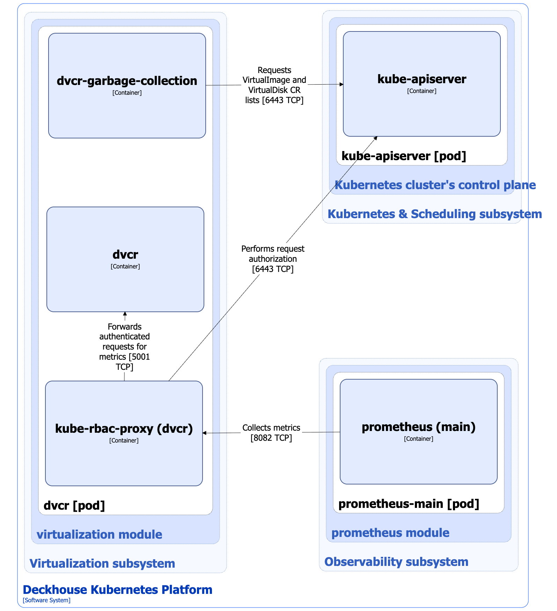

The Deckhouse Virtualization Container Registry (DVCR) component of the [`virtualization`](/modules/virtualization/) module is a specialized container registry for storing and caching virtual machine (VM) images. Virtualization-controller of the [Virtualization-API](api.html) component of the [`virtualization`](/modules/virtualization/) module allows you to import images stored in DVCR into PVC volumes used as VM disks managed by KubeVirt. For more details on importing and uploading VM images and disks, refer to the [relevant documentation section](import.html).


[KubeVirt](https://github.com/kubevirt/kubevirt) is an open-source project that allows you to launch, deploy, and manage VMs using Kubernetes as an orchestration platform. It enables cooperation between traditional VMs and container workloads in the same Kubernetes cluster, providing a single control plane.


## DVCR architecture


The following simplifications are made in the diagram:

* The diagram shows containers in different pods interacting directly with each other. In reality, they communicate via the corresponding Kubernetes Services (internal load balancers). Service names are omitted if they are obvious from the diagram context. Otherwise, the Service name is shown above the arrow.
* Pods may run multiple replicas. However, each pod is shown as a single replica in the diagram.


The Level 2 C4 architecture of the DVCR component of [`virtualization`](/modules/virtualization/) module and its interactions with other components of DKP are shown in the following diagrams:

## DVCR components

DVCR consists of the following components:

1. **Dvcr**: A container registry based on [Distribution](https://github.com/distribution/distribution). Distribution is an open-source project that provides a framework for storing and distributing container images and other content using the [OCI Distribution Specification](https://github.com/opencontainers/distribution-spec). Dvcr is used for storing and caching VM images.

   It consists of the following containers:

   - **dvcr**:  Main container.
   - **dvcr-garbage-collection**: Sidecar container that periodically deletes images which do not have the appropriate resources in the cluster.
   - **kube-rbac-proxy**: Sidecar container with an authorization proxy based on Kubernetes RBAC that provides secure access to the metrics of the dvcr container. It is an [open-source project](https://github.com/brancz/kube-rbac-proxy).

## DVCR interactions

DVCR interacts with the following components:

1. **Kube-apiserver**: Sends `get`/`list`/`watch`-requests for VirtualImages, ClusterVirtualImages, and VirtualDisks to clean up unused images and for coordination.

The following external components interact with the DVCR component:

1. **Prometheus-main**: Collects metrics of the dvcr component.
