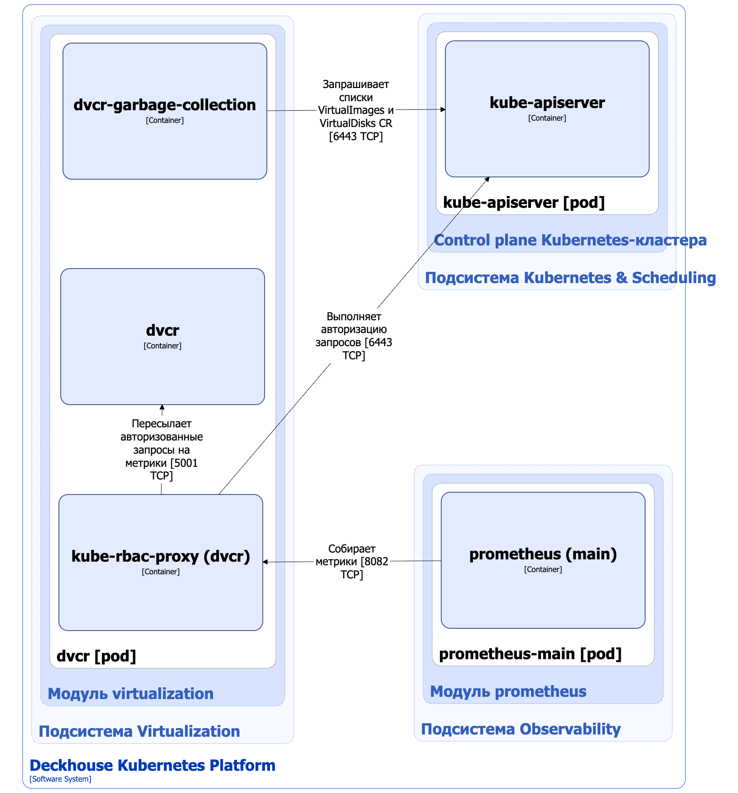

Компонент Deckhouse Virtualization Container Registry (DVCR) модуля [`virtualization`](/modules/virtualization/) — это специализированное хранилище образов контейнеров для хранения и кеширования образов виртуальных машин (ВМ). Virtualization-controller компонента [Virtualization-API](api.html) модуля [`virtualization`](/modules/virtualization/) позволяет импортировать хранящиеся в DVCR образы в PVC-тома, используемые в качестве дисков ВМ, управляемых KubeVirt. Подробнее с описанием импорта и загрузки образов и дисков ВМ можно ознакомиться [на соответствующей странице документации](import.html).


[KubeVirt](https://github.com/kubevirt/kubevirt) — это Open Source-проект, который позволяет запускать, развёртывать и управлять ВМ с использованием Kubernetes в качестве платформы оркестрации. Он обеспечивает совместную работу традиционных ВМ и контейнерных рабочих нагрузок в одном кластере Kubernetes, предоставляя единую плоскость управления.


## Архитектура DVCR


Для упрощения схемы приняты следующие допущения:

* На схеме контейнеры разных подов показаны как взаимодействующие напрямую. Фактически обмен выполняется через соответствующие сервисы Kubernetes (внутренние балансировщики). Названия сервисов не указываются, если они очевидны из контекста. В остальных случаях название сервиса приводится над стрелкой.
* Поды могут быть запущены в нескольких репликах, однако на схеме каждый под показан в единственном экземпляре.


Архитектура компонента DVCR модуля [`virtualization`](/modules/virtualization/) на уровне 2 модели C4 и его взаимодействия с другими компонентами DKP изображены на следующей диаграмме:

## Компоненты DVCR

DVCR состоит из следующих компонентов:

1. **Dvcr** — хранилище образов на базе [Distribution](https://github.com/distribution/distribution). Distribution — это Open Source-проект, который является основой для хранения и распределения контейнерных образов и другого контента с использованием спецификации [OCI Distribution Specification](https://github.com/opencontainers/distribution-spec). Dvcr используется для хранения и кеширования образов ВМ.

   Компонент содержит следующие контейнеры:

   * **dvcr** — основной контейнер;
   * **dvcr-garbage-collection** — сайдкар-контейнер, выполняющий периодическое удаление образов, у которых нет соответствующих ресурсов в кластере;
   * **kube-rbac-proxy** — сайдкар-контейнер с авторизующим прокси на основе Kubernetes RBAC для организации защищенного доступа к метрикам контейнера dvcr. Является [Open Source-проектом](https://github.com/brancz/kube-rbac-proxy).

## Взаимодействия DVCR

DVCR взаимодействует со следующими компонентами:

1. **Kube-apiserver** — выполняет `get`/`list`/`watch`-запросы ресурсов VirtualImages, ClusterVirtualImages и VirtualDisks для очистки неиспользуемых образов и координации.

С DVCR взаимодействуют следующие внешние компоненты:

1. **Prometheus-main** — сбор метрик хранилища.
