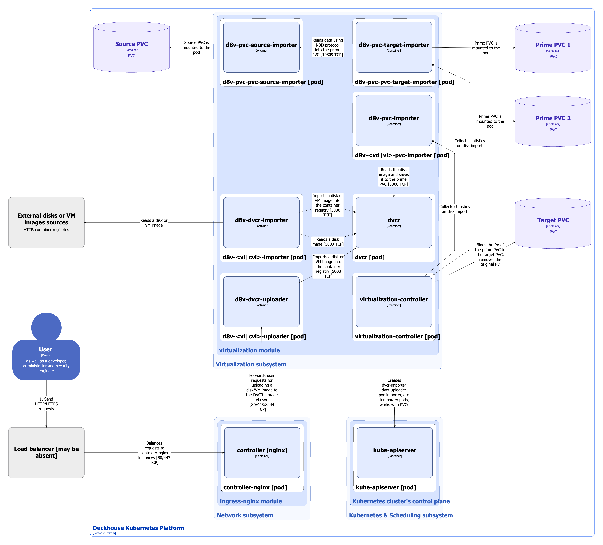

Virtualization-controller of the [Virtualization-API](api.html) component of the [`virtualization`](/modules/virtualization/) module allows you to import VM images and dusks from different sources into PVC volumes used as VM disks managed by KubeVirt.


[KubeVirt](https://github.com/kubevirt/kubevirt) is an open-source project that allows you to launch, deploy, and manage VMs using Kubernetes as an orchestration platform. It enables cooperation between traditional VMs and container workloads in the same Kubernetes cluster, providing a single control plane.


Depending on the scenarios for importing or uploading VM images and disks, virtualization-controller launches the following *temporary* pods:

1. **D8v-<vi|cvi>-importer**: Pod consisting of a single **d8v-dvcr-importer** container, that is launched to implement the following scenarios for importing VM images and disks to DVCR storage:

   * Import of a VM image from external sources (HTTP source available via URL or container registry).
   * Import of a VM image, disk or snapshot from VirtualImage, ClusterVirtualImage, VirtualDisk or VirtualDiskSnapshot resources.

1. **D8v-<vi|cvi>-uploader**: Pod consisting of a single **d8v-dvcr-uploader** container, that is launched to upload VM images and disks to DVCR storage *by the user*.

1. **D8v-<vd|vi>-pvc-importer**: Pod consisting of a single **d8v-pvc-importer** container, that is launched to import VM image from container registry (DVCR) into PVC volume. Only KubeVirt data import is supported, meaning the imported image must be a KubeVirt VM disk. If necessary, d8v-pvc-importer will automatically decompress and convert the file from the supported format to `raw` or `qcow2` format (depending on the volume mode). It will also resize the disk to use all available space. The data during the import process is saved to a temporary prime PVC. After successfully copying the data to the prime PVC, the virtualization-controller binds the target PVC to the PV of the prime PVC, and then the prime PVC as well as original PV of target PVC are deleted.

1. **D8v-pvc-pvc-source-importer** and **d8v-pvc-pvc-target-importer**: Pod consisting of a single **d8v-pvc-source-importer** container and pod consisting of a single **d8v-pvc-target-importer** container, respectively, that are launched to import a VM image from one PVC volume to another PVC volume (cloning over the network). The PVC source is mounted as a network block device using the [Network Block Device (NBD)](https://github.com/NetworkBlockDevice/nbd) protocol in the d8v-pvc-pvc-source-importer pod, which is accessed by an application running in the d8v-pvc-pvc-target-importer pod container. The data during the import process is saved in a temporary primary (prime) PVC. After successfully copying the data to the primary PVC, the virtualization-controller binds the target PVC (PVC receiver) to the PV of the primary PVC, and then the prime PVC as well as original PV of target PVC are deleted.

Virtualization-controller also supports the following scenarios for importing VM images and disks that do not require launching temporary pods:

* Importing a VM image from container registry into PVC volume.
* Importing a VM image from volume snapshot (VolumeSnapshot resource) into PVC volume.
* Importing a VM image from one PVC volume to another PVC volume (cloning by CSI driver).
* Creating an empty PVC volume.


The following simplifications are made in the diagram:

* The diagram shows containers in different pods interacting directly with each other. In reality, they communicate via the corresponding Kubernetes Services (internal load balancers). Service names are omitted if they are obvious from the diagram context. Otherwise, the Service name is shown above the arrow.
* Pods may run multiple replicas. However, each pod is shown as a single replica in the diagram.


Interactions of [`virtualization`](/modules/virtualization/) module components while importing and uploading VM images and disks are shown in the following diagram:

During the processes of importing and uploading VM images and disks [`virtualization`](/modules/virtualization/) module components interact with the following external components:

1. **External sources of VM disks and images**: Reads disks or VM images when implementing some scenarios for importing to DVCR storage.
1. **Ingress-controller**: Forwards user requests to upload VM image or disk to DVCR storage via HTTP endpoint of dvcr-uploader service.
