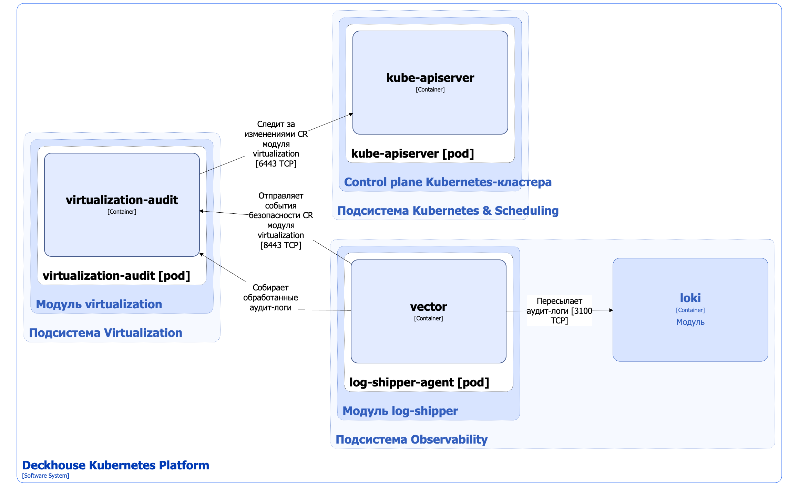
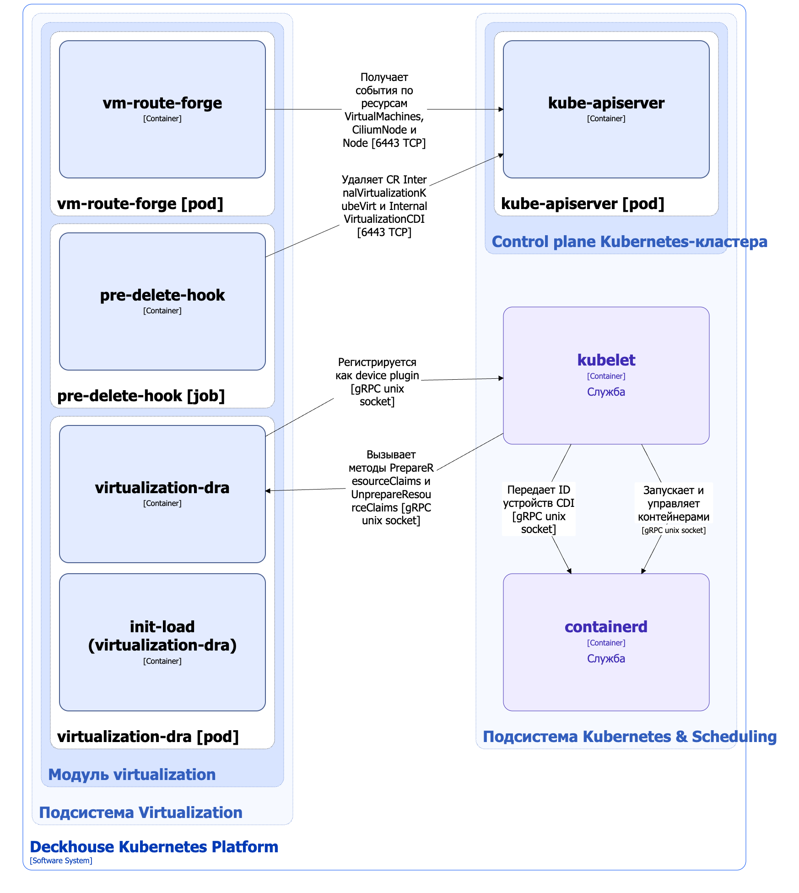

В модуле [`virtualization`](/modules/virtualization/) используются компоненты, реализующие следующие вспомогательные функции:

- аудит событий безопасности;
- проброс USB-устройств в виртуальные машины;
- обновление сетевых маршрутов;
- зачистка кастомных ресурсов KubeVirt и CDI.

## Аудит событий безопасности

С инструкцией по активации аудита событий безопасности модуля [`virtualization`](/modules/virtualization/) можно ознакомиться в [документации модуля](/modules/virtualization/stable/admin_guide.html#%D0%BE%D0%BF%D0%B8%D1%81%D0%B0%D0%BD%D0%B8%D0%B5-%D0%BF%D0%B0%D1%80%D0%B0%D0%BC%D0%B5%D1%82%D1%80%D0%BE%D0%B2).

### Архитектура


Для упрощения схемы приняты следующие допущения:

- На схеме контейнеры разных подов показаны как взаимодействующие напрямую. Фактически обмен выполняется через соответствующие сервисы Kubernetes (внутренние балансировщики). Названия сервисов не указываются, если они очевидны из контекста. В остальных случаях название сервиса приводится над стрелкой.
- Поды могут быть запущены в нескольких репликах, однако на схеме каждый под показан в единственном экземпляре.


Архитектура компонентов, реализующих аудит событий безопасности модуля [`virtualization`](/modules/virtualization/) на уровне 2 модели C4 изображена на следующей диаграмме:

<!--- Source: structurizr code from https://fox.flant.com/team/d8-system-design/doc/-/tree/main/architecture/diagrams/C4_RU --->

### Компоненты

Аудит событий безопасности реализован одним компонентом:

- **Virtualization-audit** — компонент, состоящий из одного контейнера и принимающий поток событий безопасности модуля [`virtualization`](/modules/virtualization/). Отправка событий реализована с использованием модуля [`log-shipper`](/modules/log-shipper/). Агент логирования vector согласно настройкам в кастомных ресурсах ClusterLoggingConfig  отбирает из аудит-лога кластера события, связанные с кастомными ресурсами модуля [`virtualization`](/modules/virtualization/), и отправляет их на эндпойнт сервиса virtualization-audit, указанный в кастомном ресурсе ClusterLogDestination.

Можно перенаправить события безопасности в систему логирования кластера (например, Loki). В этом случае аналогичным образом используются ресурсы ClusterLoggingConfig и агент vector модуля [`log-shipper`](/modules/log-shipper/).

### Взаимодействия

Virtualization-audit взаимодействует со следующими компонентами:

1. **Kube-apiserver** — cледит за изменениями кастомных ресурсов модуля [`virtualization`](/modules/virtualization/).

С virtualization-audit взаимодействуют следующие внешние компоненты:

1. **Log-shipper-agent**:

   - отправляет события безопасности модуля [`virtualization`](/modules/virtualization/);
   - cобирает обработанные аудит-логи.

## Virtualization-DRA и прочие компоненты

### Архитектура

Архитектура прочих вспомогательных компонентов модуля [`virtualization`](/modules/virtualization/) на уровне 2 модели C4 изображена на следующей диаграмме:

<!--- Source: structurizr code from https://fox.flant.com/team/d8-system-design/doc/-/tree/main/architecture/diagrams/C4_RU --->

### Компоненты

1. **Virtualization-dra** (DaemonSet) — драйвер DRA, с помощью которого реализуется проброс USB-устройств в виртуальные машины. Для проброса USB-устройств используется технология [DRA (Dynamic Resource Allocation)](https://kubernetes.io/docs/concepts/scheduling-eviction/dynamic-resource-allocation/). DRA — это встроенный в Kubernetes механизм (начиная с версии 1.35 включён по умолчанию), который зашивает всю сложную логику выделения устройств и управления ими прямо в ядро, чтобы вместо конструктора из сторонних инструментов получать единый, предсказуемый API. Драйвер DRA выполняет следующие операции:

   - автоматически обнаруживает USB-устройства на узлах кластера и создаёт кастомные ресурсы NodeUSBDevice, которые дальше используются для настройки проброса USB-устройств. Подробнее с настройкой проброса USB-устройств можно ознакомиться в [документации модуля](/modules/virtualization/stable/user_guide.html#usb-%D1%83%D1%81%D1%82%D1%80%D0%BE%D0%B9%D1%81%D1%82%D0%B2%D0%B0);

   - регистрируется в [kubelet](../kubernetes-and-scheduling/kubelet.html) как [Kubernetes device plugin](https://kubernetes.io/docs/concepts/extend-kubernetes/compute-storage-net/device-plugins/). Kubernetes device plugin — это фреймворк расширения kubelet, который позволяет подключить к узлу внешний процесс (обычно в виде DaemonSet) и через него:

     - обнаруживать устройства;
     - сообщать kubelet о доступных устройствах и их состоянии;
     - отвечать на запрос kubelet на выделение конкретных устройств для контейнера (Allocate). Device plugin возвращает kubelet параметры: какие устройства примонтировать, какие переменные окружения установить, какие устройства пробросить. Kubelet передает результаты вызова Allocate в container runtime (containerd), который запускает контейнер с подготовленными ресурсами.
   
     DRA-драйвер взаимодействует с kubelet по протоколу gRPC через Unix-сокеты.

   - реализует USBIP-сервер, благодаря чему USB-устройство автоматически по сети пробрасывается на узел, где запущена виртуальная машина. Нет необходимости вручную размещать ВМ на том же узле, где находится устройство.

   Cостоит из следующих контейнеров:

   - **init-load** — init-контейнер, загружающий модули ядра Linux, необходимые для работы DRA-драйвера;
   - **virtualization-dra** — основной контейнер.

1. **Vm-route-forge** — контроллер, следящий за кастомными ресурсами VirtualMachines из `virtualization.deckhouse.io` API group и обновляющий сетевые маршруты для маршрутизации трафика между ВМ через агентов [CNI Cilium](/modules/cni-cilium/). 

1. **Pre-delete-hook** (Job) — задание, удаляющее кастомные ресурсы KubeVirt и CDI `internal.virtualization.deckhouse.io` API Group перед деактивацией модуля [`virtualization`](/modules/virtualization/).

### Взаимодействия

Virtualization-dra взаимодействует со следующими компонентами:

1. **Kubelet** — регистрируется в kubelet как Kubernetes device plugin.

Vm-route-forge взаимодействует со следующими компонентами:

1. **Kube-apiserver** — следит за кастомными ресурсами VirtualMachines из `virtualization.deckhouse.io` API group.

Pre-delete-hook взаимодействует со следующими компонентами:

1. **Kube-apiserver** — удаляет кастомные ресурсы KubeVirt и CDI internal.virtualization.deckhouse.io API Group.

С Virtualization-dra взаимодействуют следующие внешние компоненты:

1. **Kubelet** — вызывает gRPC-метод Allocate для выделения устройств для контейнера.
