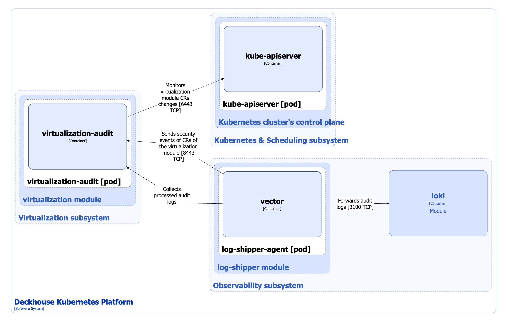
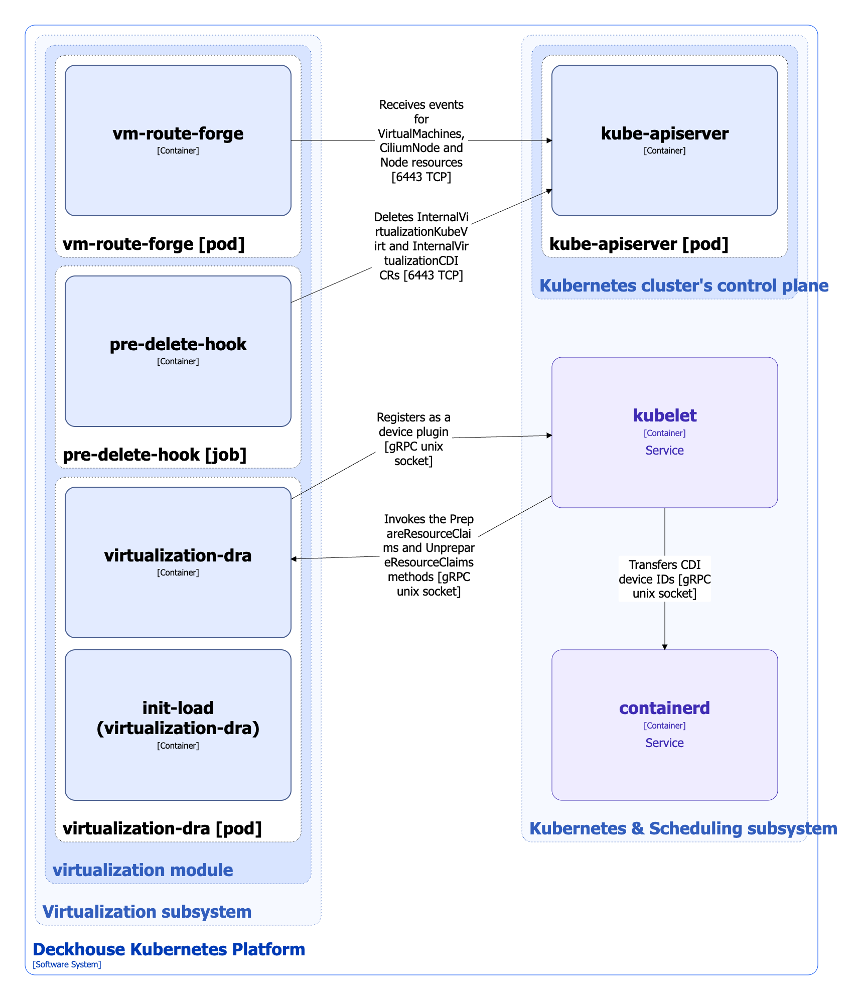

The [`virtualization`](/modules/virtualization/) module uses components that implement the following auxiliary functions:

* Security events audit.
* Forwarding USB devices to virtual machines (VMs).
* Updating network routes.
* Deleting resources before deactivating the [`virtualization`](/modules/virtualization/) module.

## Security events audit

For instructions on [`virtualization`](/modules/virtualization/) module security events audit activation, refer to the [module documentation](/modules/virtualization/stable/admin_guide.html#%D0%BE%D0%BF%D0%B8%D1%81%D0%B0%D0%BD%D0%B8%D0%B5-%D0%BF%D0%B0%D1%80%D0%B0%D0%BC%D0%B5%D1%82%D1%80%D0%BE%D0%B2).

### Architecture


The following simplifications are made in the diagram:

* The diagram shows containers in different pods interacting directly with each other. In reality, they communicate via the corresponding Kubernetes Services (internal load balancers). Service names are omitted if they are obvious from the diagram context. Otherwise, the Service name is shown above the arrow.
* Pods may run multiple replicas. However, each pod is shown as a single replica in the diagram.


The Level 2 C4 architecture of the [`virtualization`](/modules/virtualization/) module auxiliary components and its interactions with other components of DKP are shown in the following diagrams:

<!--- Source: structurizr code from https://fox.flant.com/team/d8-system-design/doc/-/tree/main/architecture/diagrams/C4_RU --->

### Components

Security events audit is implemented by following component:

* **Virtualization-audit**: A component that receives the [`virtualization`](/modules/virtualization/) module security events stream. Sending events is implemented by the [`log-shipper`](/modules/log-shipper/) module. Vector logging agent, according to the settings in the ClusterLoggingConfig custom resources, selects events, related to the [`virtualization`](/modules/virtualization/) module custom resources, from the cluster's audit log and sends them to the virtualization-audit service endpoint. Virtualization-audit processes the received audit events, enriches them with data from the Kubernetes API, and saves the processed events to its own log. It consists of a single container.

You can forward security events to the cluster logging system (for example, Loki). In this case, ClusterLoggingConfig resources and the vector agent of the [`log-shipper`](/modules/log-shipper/) module are used in a similar way.

### Interactions

Virtualization-audit interacts with the following components:

1. **Kube-apiserver**: Watches for [`virtualization`](/modules/virtualization/) module custom resources.

The following external components interact with the virtualization-audit:

1. **Log-shipper-agent**:

   * Sends [`virtualization`](/modules/virtualization/) module security events.
   * Collects processed audit logs.

## Virtualization-DRA and other components

### Architecture

The Level 2 C4 architecture of other [`virtualization`](/modules/virtualization/) module auxiliary components are shown in the following diagrams:

<!--- Source: structurizr code from https://fox.flant.com/team/d8-system-design/doc/-/tree/main/architecture/diagrams/C4_RU --->

### Components

1. **Virtualization-dra** (DaemonSet): The DRA driver, that is implemented to forward USB devices to VMs. The [DRA (Dynamic Resource Allocation)](https://kubernetes.io/docs/concepts/scheduling-eviction/dynamic-resource-allocation/) technology is used to forward USB devices. DRA is a Kubernetes API, scheduler, and kubelet engine for describing, scheduling, and provisioning dynamically allocated resources through external drivers. The DRA driver performs the following operations:

   * Automatic USB devices detection on cluster nodes and publishing them as a ResourceSlice resource. Virtualization-controller synchronizes this data into NodeUSBDevice custom resources, which are used to configure USB device forwarding then. For more information about configuring USB devices forwarding, refer to the [module documentation](/modules/virtualization/stable/user_guide.html#usb-%D1%83%D1%81%D1%82%D1%80%D0%BE%D0%B9%D1%81%D1%82%D0%B2%D0%B0).

   * Registration in [kubelet](../kubernetes-and-scheduling/kubelet.html) as the DRA kubelet plugin. The DRA kubelet plugin prepares and releases allocated resources for pods through the PrepareResourceClaims and UnrepareResourceClaims operations. The PrepareResourceClaims method returns CDI (Container Device Interface) devices IDs that kubelet passes to containerd. Data on available USB devices is published via ResourceSlice, and device selection is performed by the Kubernetes DRA mechanism based on ResourceClaim/ResourceClaimTemplate and DeviceClass.

   The DRA driver interacts with kubelet via the gRPC protocol and Unix sockets.

   * USBIP server implementation, so that the USB device is automatically forwarded over the network to the node where the VM is running. There is no need to manually place the VM on the same node where the device is located.

   It consists of the following containers:

   * **init-load**: Init container that loads the Linux kernel modules necessary for the DRA driver operation.
   * **virtualization-dra**: Main container.

1. **Vm-route-forge**: A controller that monitors `virtualization.deckhouse.io` API group VirtualMachine custom resources and updates via Linux netlink/eBPF network routes on a node in routing tables used by [CNI Cilium](/modules/cni-cilium/) for routing traffic between VMs.

1. **Pre-delete-hook** (Job): A job started by the Deckhouse controller before deleting the [`virtualization`](/modules/virtualization/) module, that deletes the InternalVirtualizationKubeVirt and InternalVirtualizationCDI custom resources named `config`.

### Interactions

Virtualization-dra interacts with the following components:

1. **Kubelet**: Registers in kubelet as the DRA kubelet plugin.

Vm-route-forge interacts with the following components:

1. **Kube-apiserver**: Receive events on VirtualMachines, CiliumNode and Node resources.
1. **Host network/Linux kernel**: Updates routes and routing rules on the node.
1. **Cilium data plane**: Uses data from the CiliumNode and Cilium routing tables to route VM traffic.

Pre-delete-hook interacts with the following components:

1. **Kube-apiserver**: Deletes InternalVirtualizationKubeVirt and InternalVirtualizationCDI resources named `config`.

The following external components interact with virtualization-dra:

1. **Kubelet**: Calls PrepareResourceClaims and UnprepareResourceClaims gRPC methods to prepare and release resources associated with USB devices.
