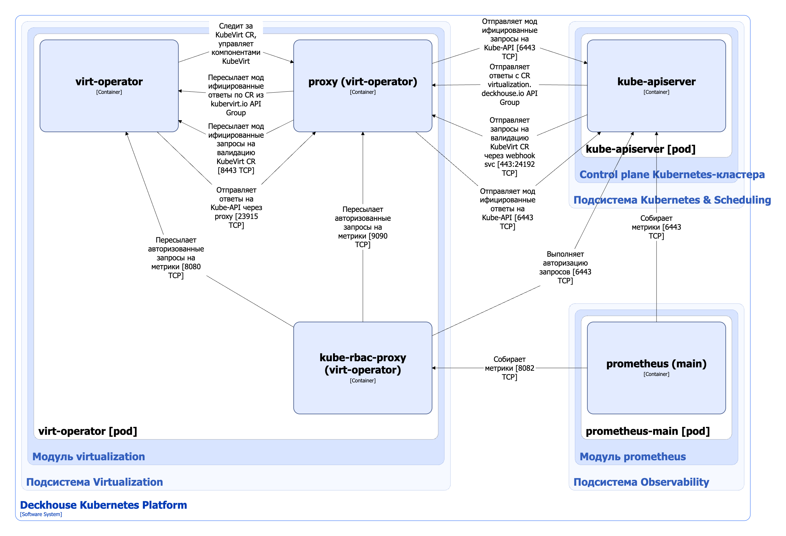

Компонент virt-operator модуля [`virtualization`](/modules/virtualization/) — оператор Kubernetes, управляющий жизненным циклом компонентов [KubeVirt](https://github.com/kubevirt/kubevirt) при помощи кастомного ресурса KubeVirt. Virt-operator устанавливает в кластере virt-api, virt-controller и virt-handler, а также выполняет их настройку.

## Архитектура virt-operator


Для упрощения схемы приняты следующие допущения:

- На схеме контейнеры разных подов показаны как взаимодействующие напрямую. Фактически обмен выполняется через соответствующие сервисы Kubernetes (внутренние балансировщики). Названия сервисов не указываются, если они очевидны из контекста. В остальных случаях название сервиса приводится над стрелкой.
- Поды могут быть запущены в нескольких репликах, однако на схеме каждый под показан в единственном экземпляре.


Архитектура компонента virt-operator модуля [`virtualization`](/modules/virtualization/) на уровне 2 модели C4 и его взаимодействия с другими компонентами DKP изображены на следующей диаграмме:

<!--- Source: structurizr code from https://fox.flant.com/team/d8-system-design/doc/-/tree/main/architecture/diagrams/C4_RU --->

## Компоненты virt-operator

Virt operator состоит из следующих контейнеров:

1. **Virt-operator** — основной контейнер.
2. **Proxy** (он же **kube-api-rewriter**) — сайдкар-контейнер, выполняющий модификацию проходящих через него запросов API, а именно переименование метаданных кастомных ресурсов. Это необходимо, поскольку компоненты Kubevirt используют API Group вида `*.kubervirt.io`, а другие компоненты модуля [`virtualization`](/modules/virtualization/) используют аналогичные ресурсы, но с API Group вида `*.virtualization.deckhouse.io`. Kube-api-rewriter является шлюзом, проксирующим запросы между контроллерами, управляющими ресурсами из разных API Group;
3. **Kube-rbac-proxy** — сайдкар-контейнер с авторизующим прокси на основе Kubernetes RBAC для организации защищенного доступа к метрикам контроллера и сайдкар-контейнера proxy. Является [Open Source-проектом](https://github.com/brancz/kube-rbac-proxy).

## Взаимодействия компонента virt-operator

Virt operator взаимодействует со следующими компонентами:

1. **Kube-apiserver**:

   - cледит за кастомными ресурсами KubeVirt, управляет компонентами KubeVirt;
   - выполняет авторизацию запросов на получение метрик.

С virt-operator взаимодействуют следующие внешние компоненты:

1. **Kube-apiserver** — отправляет запросы на валидацию кастомных ресурсов KubeVirt;
1. **Prometheus-main** — собирает метрики компонента.
