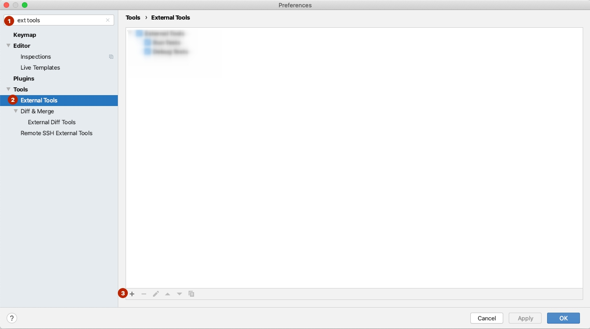
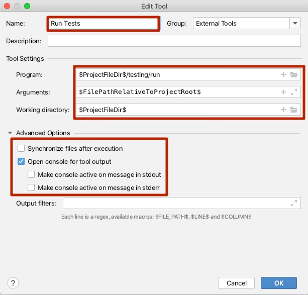
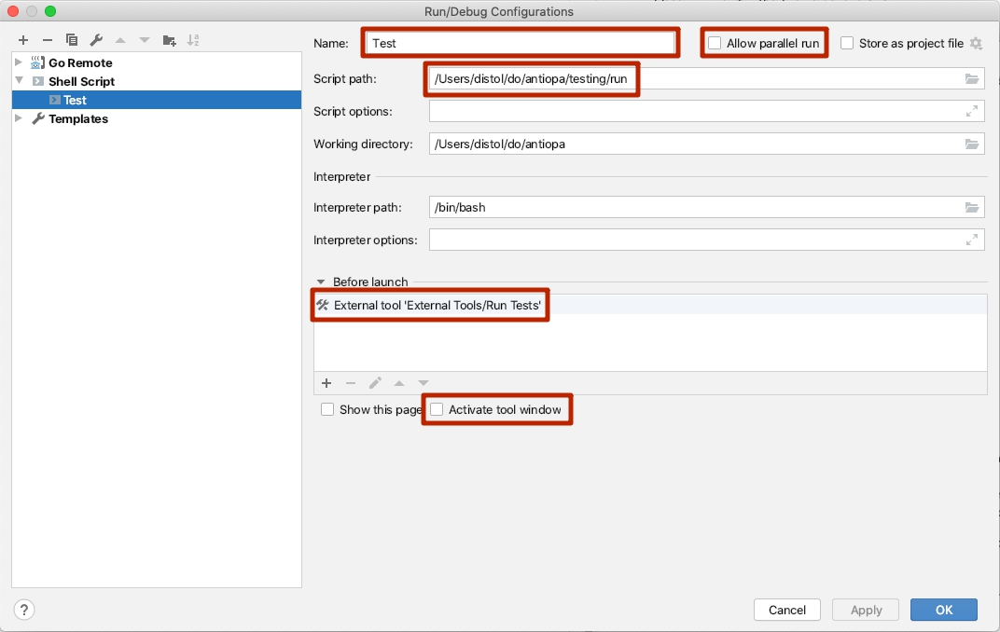
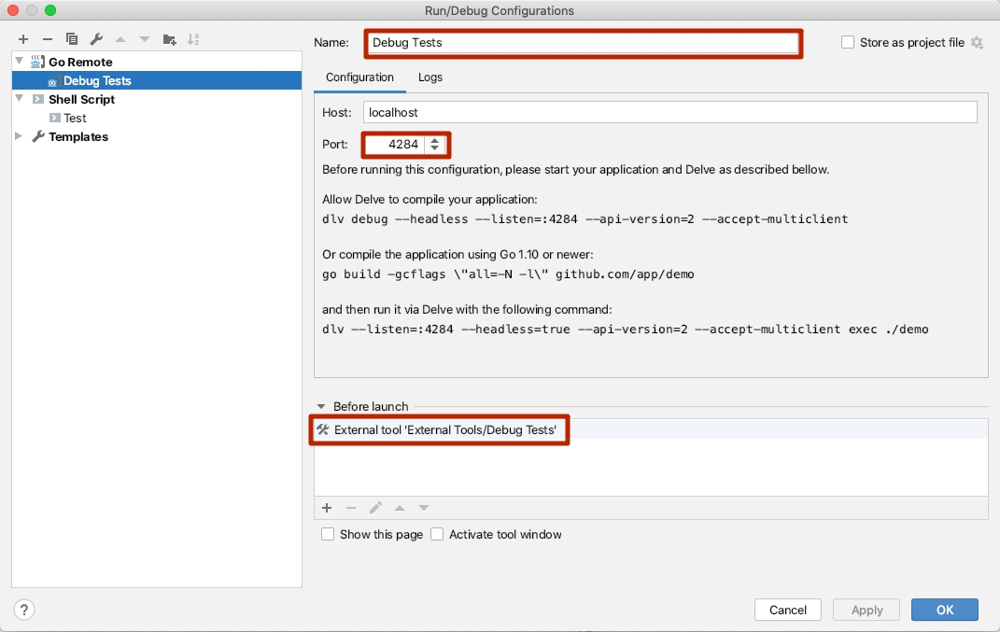

## Releases and versions

- `Release`, `version` (noun) — a logically complete and announced program that is somewhat different from its previous (or later) [forms](#versioning). A [GitHub Release](https://docs.github.com/en/repositories/releasing-projects-on-github/about-releases). As a noun, both of these terms can be used interchangeably. 
- The code within some branch that is not a part of a release is considered a dev version.
- Release (verb) — the process of creating, announcing, and releasing a new form (version) of the program.
*Do not confuse* it with changing the version within the release channel.
- Release channel — the following release channels are available (from less to more stable): `alpha`, `beta`, `early-access`, `stable`, and `rock-solid` (see more below). For example, the phrase "early-access or above" means `early-access`, `stable`, and `rock-solid`. [More](https://deckhouse.io/en/documentation/v1/deckhouse-release-channels.html) about release channels on the site.
- We use the versioning scheme similar to the [semver](https://semver.org/) one.
- Patch release changing — the process of changing version on a release channel when increments only patch version number.   
- Release changing — the process of changing version on a release channel when increments minor version number.   

## How to test the Deckhouse version
The CI pipeline is configured to build an image based on each branch. This image is available at  `dev-registry.deckhouse.io/sys/deckhouse-oss:<prNUM>`.
All you need to do to test the new dev version is to change the image in the Deckhouse deployment.

## Auto-updates
When you commit changes to git, a new Deckhouse docker-image gets built.

A copy of Deckhouse running in the cluster regularly checks if a new image is available in the docker registry (if there is a new digest for the same image tag).
If the digest for the tag in the registry does not match the one for the image in the cluster, Deckhouse modifies its deployment manifest and shuts down.
The new image is pulled from the registry when a new Deckhouse Pod is being created.

## The process of releasing new versions and changing versions in the release channels
### Changing release in the release channels

> As a rule, release changing brings a version with **new** functionality/modifications

Periodicity and timing of updates in the release channels when a minor version changes:
1. The Deckhouse team can switch version in the `Alpha` release channel at any time at its own discretion with any periodicity and without prior warning.
1. The Deckhouse team can switch versions in the `Beta` release channel at any time at its own discretion with any periodicity and without prior warning but not earlier than the next day after changing the version on the `Alpha` release channel.
1. The Deckhouse team can **only** switch versions in the `Early Access`, `Stable`, and `Rock Solid` release channels in the **8:30-10:00 UTC interval** only on certain days of the week:
   1. `Rock Solid` — on Mondays, but not earlier than on the 13th day after switching to this version in the `Stable` channel.
   1. `Stable` — on Tuesdays, but not earlier than on the 6th day after switching to this version in the `Early Access` channel.
   1. `Early Access` — on Wednesdays, but not earlier than the day after switching to this version in the `Beta` channel.

### Releasing a patch-release version (containing hotfixes) and switching versions in the release channels

There can be several possibilities if a bug is detected in the release progressed to the `Beta` channel (or above):
1. The bug is in the new functionality:
    1. The release in question contains only the new functionality (that no one uses yet) – in this case, switching versions is canceled (this release will not be advanced to more stable release channels), and the appropriate notification is posted. The bug will be fixed in the subsequent releases.
    1. The release in question contains other urgently needed changes, or the new functionality is in high demand – in this case, the bug is fixed via hotfix releases.
1. The bug is in the existing functionality: the bug is fixed via hotfix releases.

Patch-releases are not stand-alone releases but a set of fixes that are backported to all active releases ASAP (if necessary). Since these changes are backported to all active releases, they should be kept to the minimum necessary!

**If the bug is not urgent, you better be patient and wait until the fix is implemented as part of the standard release process. This is especially true for the `Stable` and `Rock Solid` release channels.**

Periodicity and timing of patch-release updates in the release channels:
1. The Deckhouse team can change patch-release versions in the `Alpha` channel at any time at its own discretion with any periodicity and without prior warning.
1. For the `Beta` and `Early Access` channels, the Deckhouse team can switch to a patch-release version at any time at its own discretion but not earlier than two hours after switching to this version in the `Alpha` and `Beta` release channels, accordingly.
1. For the `Stable` and `Rock Solid` channels, the switching to the patch-release version can be performed on any day:
   1. `Stable`, `Rock Solid` — not earlier than the next day after the switching to this version in the `Early Access` and `Stable` release channels, accordingly.
1. These rules may be breached if there is a **real need** to make urgent changes due to a critical bug/vulnerability (note that all actions **must be coordinated with the team leaders**).

### Canceling a scheduled version change

1. If degradation of the previously existing functionality is discovered in the release (patch-release), the planned upgrade to this version is suspended.
1. If a new version (patch-release) is released to fix the degradation, the version switching is performed according to the previous section. If the patch-release turns out to be successful, it is propagated further to the release channels according to the channel stability level.
1. The current release is considered canceled if the necessary fixes are included in the next standard release (instead of the hotfix one). The switching to a canceled release is no longer performed in the release channels (there is no point in changing the version to the one known to result in degradation).

Style Guide
-----------

### Naming convention

* We use the [Shell Style Guide](https://google.github.io/styleguide/shell.xml) for shell scripts/utilities.
* We use [this standard](https://github.com/kubernetes/community/blob/master/contributors/design-proposals/architecture/identifiers.md) for Kubernetes identifiers.
* We use camelCase (the same as in Kubernetes) for Helm Values, as per the [official recommendation](https://helm.sh/docs/chart_best_practices/values/). The only exception is forwarding some values unchanged to Kubernetes (e.g., as with nodeSelector).
* We use lowercase letters and hyphens (kebab-case) for Helm Charts (as per the [official recommendation](https://helm.sh/docs/chart_best_practices/conventions/)).
* The module name must match the name of the Helm Chart in all cases.
* We use lowercase letters and hyphens for module image names (those in `modules/*/images/*`). This way, their names have the same style as a link to the image (that also contains the module name).
* We use a camelCase naming convention for variables in Helm Charts' Go templates (the common practice in Go).
* If the same name is used in different places, for example, in ConfigMap (the Kubernetes identifier), Helm Values, Shell, and Go, — we use the appropriate naming convention in each case: `use-proxy-protocol`, `useProxyProtocol`, `use_proxy_protocol`. This rule results in the module name and module image name (that contain a hyphen) becoming camelCase when used in Helm Values.
* Underscores (`_`) and periods (`.`) are considered preferred delimiters when naming files rather than hyphens (`-`).
* The namespace's name is the same as that of the module except for the `d8-` prefix (it symbolizes a "system component" and NOT a user application). For example, the namespace of the `prometheus` module is called `d8-prometheus`.

### Helm Values

* The real boolean value (and not a string) is used for bool values in all cases. It can be either true or false.
* We use CamelCase for naming constants (the same as in Kubernetes) — that is, starting with an uppercase letter. Examples: `LoadBalancer`, `ClusterIP`.

### Mandatory Deckhouse labels

All resources **created and managed by Deckhouse** must have two labels:
* `heritage: deckhouse`
* `module: <module name>`

**Caution!!!** This does not mean that these labels should be attached to objects created by other controllers.
You should only attach them to the primary resources managed by Deckhouse.

### Recommendations for using labels

We recommend using the `app` and `component` labels.

### Documentation

* The site has two parts: the versioned one is tied to a specific version (documentation), while the unversioned one includes the main pages of the site and shared assets. 
* The **versioned** documentation is located in the /docs/documentation/ (the doc pages themselves are in /docs/documentation/pages/) and the module's docs directory (/modules/<module name>/docs/).
* The **unversioned** documentation is located in the /docs/site/ directory (the pages themselves are in /docs/site/pages/).
* Note that all **cross-references** in the versioned documentation are **relative**.
  * Wrong: [link](/module/020-two/configuration.html)
  * Correct:
    * `[link](../../module/010-some-module/configuration.html)`
    * `[link](../010-some-module/configuration.html)`
    * `[link]({{ "/module/020-some-module/configuration.html" | true_relative_url }})` (the filter will make a relative link from an absolute one when rendering the site) - a universal, but cumbersome method.
* The documentation inside the module is stored in the `docs` folder as markdown files. An example: `/modules/050-some-module/docs/README.md`
* Insert the YAML [front-matter](https://jekyllrb.com/docs/front-matter/) block In the header of the md file with the following data:
  * title - The title of the document
  * lang - Set it to `en` if the document is in English.
* The **images** used in the module documentation are stored in the `/docs/documentation/images/<module-name>/` directory.
  The link to the picture looks like this ``
* Put the `<!-- SCHEMA -->` placeholder in the appropriate place on the page in the CR.md (and CR_RU.md) file so that CRDs in the module's `crds` directory can be generated on the site.
* Put the `<!-- SCHEMA -->` placeholder in the appropriate place on the page in the docs/CONFIGURATION.md and docs/CONFIGURATION_RU.md files to post the OpenAPI specification data on the module configuration page.


#### OpenAPI specification

The `x-doc-` prefix in the parameter names is reserved in the OpenAPI specifications for rendering the documentation. Parameters with this prefix are only used for rendering the documentation and are not mandatory.
A list of `x-doc-` parameters:
- `x-doc-required:` (boolean). It is used to indicate explicitly on the site if a particular parameter is mandatory or optional.
- `x-doc-default:` (arbitrary type). The default value to show on the site. It is helpful if you cannot specify the `default` parameter for some reason. The x-doc specification value must be of the same type as the target parameter, and it **cannot contain** markdown elements or arbitrary text (well, it can, but the rendering will be ugly). **Only** the value from the English version of the resource is used.
- `x-doc-d8Revision` (string). Sets a limit on the Deckhouse version the target parameter can be used with. Possible values: `ce`, `ee` (`ce` is the default value).
- `x-doc-featureStatus` (string). Sets the status of the feature and can be one of `experimental` or `proprietaryOkmeter`.  
- `x-doc-example` (arbitrary type). Provides an example of the target parameter's value. If specified, it takes precedence over the `example` and `x-examples` parameters. The x-doc-example specification value can contain markdown elements or arbitrary text. **Only** the value from the English version of the resource is used.

#### Running a site with the documentation locally

See instructions [here](../../../site/LOCAL_DEV.md).

## Check-list for the new module
----------------------------
### Bundle


Bundle is the Deckhouse delivery edition. Possible values:
* `Default` — includes the recommended set of modules required for proper cluster operation: monitoring, authorization control, networking, and other needs. The current list can be found [here](/deckhouse/blob/main/modules/values-default.yaml).
* `Minimal` — the minimum viable set of modules (only the `20-deckhouse` module is included).
* `Managed` — a set of modules adapted for managed solutions of cloud providers. A list of supported providers:
   * Google Kubernetes Engine (GKE)

To include your module in the specific bundle by default, add the following line to the appropriate `modules/values-${bundle}.yaml` file: `${mobdule_name}Enabled: true`.

[Read more](https://github.com/flant/addon-operator/blob/main/LIFECYCLE.md#modules-discovery) about the algorithm for determining if the module should be enabled.

### Helm

* `helm upgrade --install` is invoked if the `/modules/<module-name>/Chart.yaml` file is present.
* A separate helm release is created for each module. Tiller is responsible for creating resources in the cluster. It is running in the Deckhouse Pod as a separate process.
This command outputs the list of helm release:
  ```bash
  kubectl -n d8-system exec deploy/deckhouse -- helm list
  ```
* When rolled out for the first time, the helm release deployment will fail if the resources described in the release already exist in the cluster. Thus, the release will have have the FAILED state.
This error will persist until duplicate resources are deleted from the cluster.

The release checksum is the checksum of all the helm chart files and values that Deckhouse generates for the release.

Releases in helm do not get updated when the module is restarted if the following conditions are met:
  * The status of the previous release is not FAILED (you can check it in the helm list);
  * The release checksum is the same;
  * The checksum of all manifests in the release after the rendering stays the same.

Thus, restarting modules does not result in the accumulation of unneeded copies of the current helm release.

#### Module values

Values for a specific module are declared in the global key with the module name. Click [here](https://github.com/flant/addon-operator/blob/main/VALUES.md) to read more about values for modules.

#### Priority Class
A special helper is implemented in `helm_lib` to facilitate setting the `priorityClassName` parameter.
Note that you **MUST** use it in all controllers without exception.

An example:
```gotemplate
spec:
  {{- include "helm_lib_priority_class" (tuple . "cluster-critical") | nindent 2 }}
```
The helper gets the global context and the desired priorityClassName value as an input. If the `010-priority-class` module is enabled in Deckhouse, the template will look like this:
```yaml
spec:
  priorityClassName: cluster-critical
```
Otherwise:
```yaml
spec:
```


For more information about what classes Deckhouse uses, see the description of the [priority-class module](/modules/010-priority-class/).

#### Node Selector

A special helper is also implemented in `helm_lib` to facilitate setting the `nodeSelector` option.


An example:
```gotemplate
      {{- include "helm_lib_node_selector" (tuple . "monitoring") | nindent 6 }}
```
The helper gets the global context and the desired strategy as the input to set the nodeSelector parameter.

There are four strategies in total:
1. `frontend`, `system` - these two use the following logic:
    * Use the value of the `nodeSelector` variable if it is present in module values. Otherwise:
    * If nodes with the `node-role.deckhouse.io/{{ .Chart.Name }}=""` label are found in the cluster, then this value is used as the nodeSelector. These nodes are considered dedicated for this chart's components. Otherwise:
    * If nodes with the `node-role.deckhouse.io/{{ strategy_name }}=""` label are found in the cluster, then this value is used as the nodeSelector. These nodes are considered dedicated for all components that use this deployment strategy.

2. `monitoring` - uses the same logic as the `system` and `frontend` strategies but includes an extra step after all of the above:
    * If nodes with the `node-role.deckhouse.io/system=""` label are found in the cluster, then this value is used as the nodeSelector. It is assumed that if there are no dedicated monitoring nodes in the cluster, then the components of monitoring-related modules run on the system nodes.

3. `master` - this strategy uses the following logic:
    * If nodes with the `node-role.kubernetes.io/master="""` label are found in the cluster, then this value is used as the nodeSelector. These nodes are considered dedicated for all components that use this deployment strategy.
    * If nodes with the `node-role.deckhouse.io/master="""` label are found in the cluster, then this value is used as the nodeSelector. It is assumed that if there are no master nodes in the cluster (e.g., in the managed cluster), then the components of such modules run on the nodes set as masters.
    * If nodes with the `node-role.deckhouse.io/system=""` label are found in the cluster, then this value is used as the nodeSelector. It is assumed that if there are no master nodes and nodes with labels designating these nodes as masters in the cluster, then the components of such modules run on system nodes.

If none of the above conditions for the strategy is met, the nodeSelector will not be set.

The helper **MUST** be used for all Deckhouse components (wherever possible) except for DaemonSets that are deployed to all cluster nodes (node-exporter, csi-node, flannel, etc.).

### Tolerations

A special helper is also implemented in `helm_lib` to facilitate setting the `tolerations`.

An example:
```gotemplate
  {{- include "helm_lib_tolerations" (tuple . "monitoring") | nindent 2 }}
```
The helper gets the global context and the desired strategy as the input to set the tolerations parameter.

* If the module has the `tolerations` variable in values, it will be used to set this parameter.
* If the `frontend` or `system` strategy is used, the following rules will be added to the manifest:

  ```yaml
  tolerations:
  - key: dedicated.deckhouse.io
    operator: Equal
    value: {{ .Chart.Name }}
  - key: dedicated.deckhouse.io
    operator: Equal
    value: {{ strategy_name }}
  ```
* For the `monitoring` strategy, the rules will look as follows:

  ```yaml
  tolerations:
  - key: dedicated.deckhouse.io
    operator: Equal
    value: {{ .Chart.Name }}
  - key: dedicated.deckhouse.io
    operator: Equal
    value: {{ strategy_name }}
  - key: dedicated.deckhouse.io
    operator: Equal
    value: "system"
  ```
* For the `any-node` strategy, the rules will look as follows:

  ```yaml
  tolerations:
  - key: node-role.kubernetes.io/master
  - key: dedicated.deckhouse.io
  - key: dedicated
  - key: node.deckhouse.io/uninitialized
    operator: "Exists"
    effect: "NoSchedule"
  - key: node.deckhouse.io/csi-not-bootstrapped
    operator: "Exists"
    effect: "NoSchedule"
  - key: node.kubernetes.io/not-ready
  - key: node.kubernetes.io/out-of-disk
  - key: node.kubernetes.io/memory-pressure
  - key: node.kubernetes.io/disk-pressure
  ```

* For the `wildcard` strategy, the rules will look as follows:
  ```yaml
  tolerations:
  - operator: Exists
  ```

The helper **MUST** be used for all Deckhouse components (wherever possible) except for DaemonSets that are deployed to all cluster nodes (node-exporter, csi-node, flannel, etc.).

#### The HA mode for the module

The high availability (HA) mode protects crucial modules against possible downtime or failure.

`helm_lib` provides auxiliary templates to facilitate using the HA mode.
* `helm_lib_ha_enabled` - returns a non-empty string of the HA mode is enabled for the cluster.
  ```yaml
  {{- if (include "helm_lib_ha_enabled" .) }}
  HA enabled in Kubernetes cluster!
  {{-end }}
  ```
* `helm_lib_is_ha_to_value` - is used as an `if else` expression. If the HA mode is enabled in the cluster, this template returns the first argument passed to it, and if not, it returns the second one.
  ```yaml
  # There will be two replicas if the HA mode is enabled for the cluster and one if disabled.
  replicas: {{ include "helm_lib_is_ha_to_value" (list . 2 1) }}
  ```

The rules below ensure the correct operation and update of module components (Deployment or StatefulSet):

* Always set podAntiAffinity for a Deployment and StatefulSet to ensure that the Pods are not run on the same node. Below is an example for prometheus:

  ```yaml
        {{- include "helm_lib_pod_anti_affinity_for_ha" (list . (dict "app" "deployment-label")) | nindent 6 }}
  ```
* Set the correct `replicas` and `strategy` values for a Deployment:
  * If the Deployment is NOT running on master nodes:

    ```yaml
      {{- include "helm_lib_deployment_strategy_and_replicas_for_ha" . | nindent 2 }}
    ```
    It prevents blocking updates when the number of Deployment Pods is equal to the number of nodes, and nodeSelector and podAntiAffinity parameters are set.
  * If the Deployment is running on master nodes (on each master node!):

    ```yaml
      {{- include "helm_lib_deployment_on_master_strategy_and_replicas_for_ha" . | nindent 2 }}
    ```
    It prevents blocking the Deployment update even if one of the master nodes is unavailable (if there are three or more master nodes!).

### Evaluating complex conditions

We recommend creating your own helper (if a similar helper has not been implemented already) if there is a need to evaluate some complex condition repeatedly.

* If the result of evaluating the helper is `true`, it must return some `non-empty string`.
* If the result of evaluating the helper is `false`, it must return an `empty string`.

Here is an example of helper implementation:
```gotemplate
{{- define "helm_lib_module_https_ingress_tls_enabled" -}}
  {{- $context := . -}}

  {{- $mode := include "helm_lib_module_https_mode" $context -}}

  {{- if or (eq "CertManager" $mode) (eq "CustomCertificate" $mode) -}}
    not empty string
  {{- end -}}
{{- end -}}
```
Usage:
```gotemplate
{{- if (include "helm_lib_module_https_ingress_tls_enabled" .) }}
- name: ca-certificates
  mountPath: "/usr/local/share/ca-certificates/"
  readOnly: true
{{- end }}
```

### Hooks

For more information about hooks, their structure, and binding to events, see the [addon-operator documentation](https://github.com/flant/addon-operator/blob/main/HOOKS.md).

In Deckhouse, **global hooks** are stored in the `/global-hooks` directory, **module hooks** are placed in the module's `/modules/MODULE/hooks` directory.

You can pass information to the hook using environment variables with paths to files in /tmp. The hook's results are also returned via files. Click [here](https://github.com/flant/addon-operator/blob/main/VALUES.md) to read more about using parameters in hooks.

### Validating admission webhooks

Validation hooks are similar to regular webhooks in their interfaces and running. They use the same shell framework. For more information about conversion webhooks, see the shell-operator [documentation](https://github.com/flant/shell-operator/blob/main/BINDING_VALIDATING.md).

In Deckhouse, validating hooks are located in the module's `/modules/MODULE/webhooks/validation/` directory.

### Conversion webhooks

Conversion webhooks are similar to regular hooks in their interfaces and running mechanism. They use the same shell framework. For more information about conversion webhooks, see the shell-operator [documentation](https://github.com/flant/shell-operator/blob/main/BINDING_CONVERSION.md).

In Deckhouse, conversion webhooks are located in the module's `/modules/MODULE/webhooks/conversion/` directory.

#### kubectl

We do not recommended using kubectl in hooks. It leads to a loss of idempotency since the hook depends on the cluster state in addition to the input parameters (that creates some difficulties during debugging/testing).
* Use the [built-in shell-operator functionality](https://github.com/flant/addon-operator/blob/main/HOOKS.md#kubernetes) (it is fully integrated into Deckhouse) to track objects;
* Use the shell_lib functionality (the `kubernetes::`-prefixed functions in particular: kubernetes::create_yaml, kubernetes::patch_jq, kubernetes::delete_if_exists, etc.) to create, edit, and delete objects.

#### The "enabled" webhooks

The "enabled" webhooks are located in the root directory of the module. You can use them to describe the conditions under which the module must be enabled/disabled.

An example:
```bash
#!/bin/bash

source /deckhouse/shell_lib.sh

function __main__() {
  if values::has global.modules.publicDomainTemplate ; then
    echo "true" > $MODULE_ENABLED_RESULT
  else
    echo "false" > $MODULE_ENABLED_RESULT
  fi
}

enabled::run $@
 ```
This webhook disables the module in all clusters in which the `global.modules.publicDomainTemplate` option is not set.

Regular checks are implemented in `shell_lib` functions with the `enabled::` prefix. For example, the hook below disables the module in all clusters with the Kubernetes version < 1.19.0:
```bash
function __main__() {
  enabled::disable_module_in_kubernetes_versions_less_than 1.19.0
  echo "true" > $MODULE_ENABLED_RESULT
}
```

See the [documentation](https://github.com/flant/addon-operator/blob/main/LIFECYCLE.md#enabled-script) for more info.

### OpenAPI schemas for validating values

Deckhouse support validation for values passed using the Deckhouse ConfigMap and for Deckhouse-generated values.

The OpenAPI value validation scheme is needed:
  * To make sure that the user has entered valid values into the Deckhouse ConfigMap, and to let the user know if the values entered are invalid.
  * To ensure that all the necessary parameters (in the correct format) are passed for rendering the module's helm templates. It ensures the expected behavior within the cluster and that only the planned objects will end up in the cluster.
  * To generate the [documentation](#documentation) for the module parameters on the site.

The OpenAPI validating schemes are stored in the `$GLOBAL_HOOKS_DIR/openapi` directory for global values, and in the `$MODULES_DIR/<module-name>/openapi` for modules.

Refer to the [addon-operator documentation](https://github.com/flant/addon-operator/blob/main/VALUES.md#validation) for more information about schema validation.

The validation schemas have the OpenAPI Schema Object format. The detailed description of the format is available in the [documentation](http://json-schema.org/understanding-json-schema/).

Note that `addon-operator` extends the schema format with additional properties. The additional information is available in the [documentation](https://github.com/flant/addon-operator/blob/main/VALUES.md#extending).

**Caution!!!** If the `additionalProperties` property is not defined, it will be set to `false` at all schema levels!!!

* The `openapi/config-values.yaml` scheme validates values passed by the user via a ConfigMap.

An example:
```yaml
type: object
properties:
  podNetworkMode:
    type: string
    enum: ["HostGW", "VXLAN"]
    default: "HostGW"
    description: |
      Work mode.
```
* The `openapi/values.yaml` scheme validates combined values consisting of values from ConfigMap and values generated by hooks (learn more [here](https://github.com/flant/addon-operator/blob/main/VALUES.md#merged-values)).

  * **Caution !!!** Note that the `openapi/values.yaml` scheme validates values generated by webhooks. Thus, the scheme will fire up an error when validating combined values since it does not have the description of the ConfigMap-derived values.
    The `x-extend` parameter extends the `openapi/values.yaml` schema with parameters of the `openapi/config-values.yaml` schema (as in the example below), thus avoiding duplicating them.
    The `x-extend` parameter must be used in all cases. Learn more [here](https://github.com/flant/addon-operator/blob/main/VALUES.md#extending).

An example:
```yaml
x-extend:
  schema: config-values.yaml
type: object
properties:
  internal:
    type: object
    default: {}
    x-required-for-helm:
    - podNetworkMode
    properties:
      podNetworkMode:
        type: string
        enum: ["HostGW", "VXLAN"]
```

How to create a validation scheme for a module:
* `openapi/config-values.yaml`:
  * The scheme is based on the module documentation.
  * Set the default values for the fields. The default values can be specified in the:
    * documentation;
    * `$MODULES_DIR/<module-name>/values.yaml` file;
    * hardcoded in the webhook's code;
  * The `required` property must be set for all required fields.
* `openapi/values.yaml`:
  * The schema is created for the values set by webhooks (usually, the `internal` group's variables).
  * Set the `x-extend` property to load the `config-values.yaml` scheme.
  * Set the default values for the fields. The default values can be specified in the:
    * `$MODULES_DIR/<module-name>/values.yaml` file;
    * hardcoded in the webhook's code;
  * The `x-required-for-helm` property must be set for all mandatory fields.

After creating the schemas for the module, delete the `$MODULES_DIR/<module-name>/values.yaml` file.

### Using the storage class

If the module uses Persistent Storage, the effective storage class (EFC) should be determined as follows:
1. If the EFC is defined in the module's config (values) – use the one explicitly specified in the module.
2. If the PV exists – use the storage class of the existing PV.
3. Otherwise, use either globally defined or default (determined automatically) EFC.
4. If none of the above are suitable, use an emptyDir volume.

Such an approach allows you to avoid the re-provisioning of PVs (and data loss) that the global or default storage class change can trigger. To re-provision a PV, you must explicitly specify a different storage class right in the module configuration.

Note that you cannot mutate the `volumeClaimTemplate`.  Thus, you must delete a statefulset (e.g., using a webhook) when changing the storageClass.

You can find a relevant example in the [prometheus](https://github.com/deckhouse/deckhouse/blob/main/modules/300-prometheus/hooks/prometheus_storage_class_change) and [openvpn](https://github.com/deckhouse/deckhouse/blob/main/modules/500-openvpn/hooks/storage_class_change.go) modules' hooks.

### CRDs

CRDs must be stored in the `crds` directory in the module's root.

The module must contain a dedicated hook called `ensure_crds.go` with the following content:
```go
/*
Copyright 2021 Flant JSC

Licensed under the Apache License, Version 2.0 (the "License");
you may not use this file except in compliance with the License.
You may obtain a copy of the License at

    http://www.apache.org/licenses/LICENSE-2.0

Unless required by applicable law or agreed to in writing, software
distributed under the License is distributed on an "AS IS" BASIS,
WITHOUT WARRANTIES OR CONDITIONS OF ANY KIND, either express or implied.
See the License for the specific language governing permissions and
limitations under the License.
*/

package hooks

import (
	"github.com/deckhouse/deckhouse/go_lib/hooks/ensure_crds"
)

var _ = ensure_crds.RegisterEnsureCRDsHook("/deckhouse/modules/MODULE_NAME/crds/*.yaml")
```

If resources described via CRDs are used in other modules, you need to make a separate module for those CRDs.

An example: `010-vertical-pod-autoscaled-crd`. Most Deckhouse modules use these.

#### Creating your own CRDs

1. The description of the `openAPIV3Schema` resource validation schema should be as detailed as possible; the `description` of objects should be in English.
2. Use the `spec.additionalPrinterColumns` property to add a description for additional columns. It will be displayed in the `kubectl get` command's output, thus improving the user experience.

### Testing

Each module must be properly covered with tests. There are three types of tests:
* Webhook tests. These are stored in the `hooks` directory and use the following naming convention: `${hook_name}_test.go`. Webhook tests check the result of running hooks.
* Helm tests. These are stored in a separate `template_tests` directory in the module's root. Helm tests check the logic in helm templates.
* Matrix tests. These are described in the `values_matrix_test.yaml` file on the module's root. Matrix tests check the rendering of helm templates and if these templates match our standards for a large number of values.yaml the matrix describes.

Troubleshooting Deckhouse
--------------------------------

### Debug
Addon-operator provides specialized commands to facilitate the troubleshooting process.

Run the following command to learn more about them:
```bash
kubectl -n d8-system exec deploy/deckhouse -- deckhouse-controller help
```
(or read the [docs](https://github.com/flant/addon-operator/blob/main/RUNNING.md#debug)).

### A script for getting all the necessary debugging information

Run the following script on a master node:
```shell
#!/bin/bash

# Prepare deckhouse info for debug
deckhouse_pod=$(kubectl -n d8-system  get pod -l app=deckhouse -o name)
deckhouse_address=$(kubectl -n d8-system  get pod -l app=deckhouse -o json | jq '.items[] | .status.podIP' -r)
deckhouse_debug_dir=$(mktemp -d)
debug_date=$(date +%s)

# Get deckhouse version
kubectl -n d8-system exec -ti ${deckhouse_pod} -- deckhouse-controller version > ${deckhouse_debug_dir}/version
# Get go trace
curl -s ${deckhouse_address}:9650/debug/pprof/trace?seconds=60 > ${deckhouse_debug_dir}/trace
# Get goroutine
curl -s ${deckhouse_address}:9650/debug/pprof/goroutine > ${deckhouse_debug_dir}/goroutine
# Get go heap
curl -s ${deckhouse_address}:9650/debug/pprof/heap > ${deckhouse_debug_dir}/heap
# Get process dump
curl -s ${deckhouse_address}:9650/debug/pprof/profile?seconds=60 > ${deckhouse_debug_dir}/profile
# Get process list
kubectl -n d8-system  exec -ti $deckhouse_pod -- ps auxfww > ${deckhouse_debug_dir}/ps_aux
# Get deckhouse log
kubectl -n d8-system  logs $deckhouse_pod  > ${deckhouse_debug_dir}/log
# Get deckhouse metrics
curl -s ${deckhouse_address}:9650/metrics > ${deckhouse_debug_dir}/metrics
# Get deckhouse queue
kubectl -n d8-system exec -ti ${deckhouse_pod} -- deckhouse-controller queue list > ${deckhouse_debug_dir}/queue_list
# Get modules values
mkdir ${deckhouse_debug_dir}/values
for module in $(kubectl -n d8-system exec -ti ${deckhouse_pod} -- helm list | grep -v NAME | awk '{print $1}'); do kubectl -n d8-system exec -ti ${deckhouse_pod} -- deckhouse-controller module values ${module} -o json > ${deckhouse_debug_dir}/values/${module}; done

# tar debug files
tar -czf /tmp/deckhouse_debug_${debug_date}.tar.gz ${deckhouse_debug_dir}
ls -lah /tmp/deckhouse_debug_${debug_date}.tar.gz

# Clear debug folder
rm -rf ${deckhouse_debug_dir}
```


This script runs for about 2.5 minutes and generates a `.tar.gz` file that you need to send to the Deckhouse developers.

### Prometheus metrics

You can find a description and a list of available metrics [here](https://github.com/flant/addon-operator/blob/main/METRICS.md).

### Browsing Deckhouse logs

Currently, al Deckhouse logs are displayed in the json format. Use `jq` to convert them into a viewable form (this tool is excellent at converting strings within a stream).

#### Examples:



* Colored:
```bash
kubectl -n d8-system logs deploy/deckhouse -f | jq -r 'select(.module != null) | .color |= (if .level == "error" then 1 else 4 end) | "\(.time) \u001B[1;3\(.color)m[\(.level)]\u001B[0m\u001B[1;35m[\(.module)]\u001B[0m - \u001B[1;33m\(.msg)\u001B[0m"'
```
* Monochrome version:
```bash
kubectl -n d8-system logs deploy/deckhouse -f | jq -r 'select(.module != null) | "\(.time) [\(.level)][\(.module)] - \(.msg)"'
```
* The specific module:
```bash
kubectl -n d8-system logs deploy/deckhouse -f | jq -r --arg mod cloud-instance-manager 'select(.module == $mod) | "\(.time) [\(.level)][\(.module)] - \(.binding) - \(.msg)"'
```






* Colored:
```bash
kubectl -n d8-system logs deploy/deckhouse -f | jq -r 'select(.hook != null) | .color |= (if .level == "error" then 1 else 4 end) | "\(.time) \u001B[1;3\(.color)m[\(.level)]\u001B[0m\u001B[1;35m[\(.hook)]\u001B[0m - \(.binding) - \u001B[1;33m\(.msg)\u001B[0m"'
```
* Monochrome version:
```bash
kubectl -n d8-system logs deploy/deckhouse -f | jq -r 'select(.hook != null) | "\(.time) [\(.level)][\(.hook)] - \(.binding) - \(.msg)"'
```
* The specific hook:
```bash
kubectl -n d8-system logs deploy/deckhouse -f | jq -r --arg hook 402-ingress-nginx/hooks/ensure_crds 'select(.hook == $hook) | "\(.time) [\(.level)][\(.hook)] - \(.binding) - \(.msg)"'
```



Debugging hooks
-------------


* You can insert the following into any place of any webhook: `debug::breakpoint 127.0.0.1 4284` to make it wait until the connection to the specified port is established.
* You can use telnet to connect to this port (`telnet 127.0.0.1 4284`). Any entered command will be evaluated based on the context in which the `debug::breakpoint` was set, and you will get its output.
* It is best to start the debugging session by setting `set +e` so that the webhook does not exit at the first error.
* Use the if expression for the `debug::breakpoint` if you need to debug a specific situation.
* For local development, it is recommended to use the  `0.0.0.0` address and `4284` port. In this case, you can telnet directly on the local machine and do not need to exec to the container.

Local development
--------------------
Create the following symlink to make the development process more convenient:
```bash
sudo ln -s "$PWD" /deckhouse
```
In macOS, if the root filesystem is in a Read-only mode, use the following command to create a symlink:
```bash
echo "deckhouse\t$PWD" >> /etc/synthetic.conf
```
and reboot the OS.

NB: Both commands must be executed in the root directory of the repository.

### Running tests

1. [Login](https://pult.flant.com/projects/dev-rnd/services/2c15f630-8072-43bc-a17b-61135fa88fcf) to the docker registry to store werf stages:

```shell
docker login https://dev-registry.deckhouse.io/
```

2. Invoke the `./testing/run` script and pass to it the filename.

Type                                    | File
----------------------------------------|-----------------------------------------------------------------
All tests in the current directory      | `./testing/run .`
All matrix tests                        | `./testing/run testing/matrix`
Hook configuration tests                | `./testing/run testing/hooks_configuration`
All global hook tests                   | `./testing/run global-hooks`
All tests of a specific module          | `./testing/run modules/150-user-authn`
Helm template tests of the module       | `./testing/run modules/150-user-authn/template_tests`<small><br />(any file in the template_tests or templates directory)</small>
Matrix tests of the module              | `./testing/run modules/150-user-authn/values_matrix_test.yaml`
All tests of hooks of a specific module | `./testing/run modules/150-user-authn/hooks`
Single hook test                        | `./testing/run modules/150-user-authn/hooks/some_hook_test.go`<small><br />or<br /></small>`./testing/run ./modules/150-user-authn/hooks/some_hook`<small><br />or<br /></small>`./testing/run ./gobal-hooks/some_hook_test.go`<small><br />or<br /></small>`./testing/run ./global-hooks/some_hook`<small><br />(you can find out how to run a specific `Context` or `It` in the Ginkgo [documentation](https://onsi.github.io/ginkgo/#focused-specs))</small>
All hook tests in the directory         | `./testing/run modules/150-user-authn/hooks/some_dir/and_yet_another`<small><br />or<br /></small>`./testing/run ./global-hooks/some_dir/and_yet_another`

**Caution!** Multiwerf is required to run tests; please, [install it](https://werf.io/documentation/guides/installation.html).

Enter the following command to exec to the container where the tests are running:
```shell
docker exec -ti deckhouse-testing bash
```

### Running and debugging Goland tests

#### Usage

#### Running tests

1. Select the Run/Debug Configuration in the upper-right corner of the screen:

    
2. Select the file (or directory) to run the tests for (either in Project or by focusing on the open file).
3. Run the tests by pressing `Ctrl-R`.

**Caution!**
1. Note that the first run takes some time.
2. The stop button works as intended – click it if you need to stop the test (it does not work during debugging).
#### Debugging tests

1. Set the brake point.
2. Switch to Debug Tests from Run/Debug Configuration.
3. Make sure that the file to run is in focus.
4. Run debugging by pressing `Ctrl-D`.

**Caution!**
1. Note that the first run takes some time.
1. Currently, you cannot view stout during debugging due to Goland bugs. Use the following command:
    ```bash
    tail -f /tmp/deckhouse-testing-debug.log
    ```
2. In some cases, the Stop button does not stop the debugging process. Suppose you run some "heavy" task that takes a long time to complete and eats up CPU resources (e.g., all the tests). In this case, you need to exec to the deckhouse-testing container and kill the relevant processes.
3. Suppose the hotkey stopped responding (and the Debug button in the Debug Tests configuration is gone) for some reason. In this case, you need to find the running testing/run script and kill it.

#### Configuring

1. Add two External Tools:
    1. Open the External Tools section on the project's Preferences and click "+":

        
    2. Enter the following parameters and create an External Tool for running the tests:

        
    3. Similarly, create a second External Tool for debugging tests:

        

        **Caution!!!** Note that the `--debug` argument is added and all the checkboxes are unchecked!
2. Add the Run/Debug Configuration for **running tests**:
    1. In the top menu, open Run -> Edit Configurations;
    2. Add the shell-based configuration:

        
    3. Fill in all the fields as follows:

        
3. Add the Run/Debug Configuration for **debugging tests**:
    1. In the top menu, open Run -> Edit Configurations;
    2. Add the Go Remote-based configuration:

        
    3. Fill in all the fields as follows:

        

Minor upgrade of Deckhouse-supported Kubernetes versions
------------------------------------------------------

When new patch versions of [Kubernetes](https://github.com/kubernetes/kubernetes/tree/master/CHANGELOG) are released, we need to update versions contained in the [version_map.yml](/candi/version_map.yml) file and
run [additional scripts to build and push registry package images](https://github.com/deckhouse/deckhouse/candi/tools/registrypackages).

Bashible tips
------------------------------------------------------

## Install software from our registry.
Installing packages from third-party repositories (for example, epel) in bashible steps forbidden.
If we need to install additional software, we **must** install it from original distro repository or from our registry.

Bashible supports installing software from registry images, but we need to prepare special images.

#### Example
We need to install jq binary to nodes.
[How to build jq.](https://github.com/deckhouse/modules/007-registrypackages/jq)

To install this image in bashible script we must use special helper function:
```shell
bb-rp-install "jq:{{ .images.registrypackages.jq16 }}"
```
* `{{ .images.registrypackages.jq16 }}` is autofilled from deckhouse global values.

To uninstall:
```shell
bb-rp-remove "jq"
```

Helper function ```bb-rp-install``` downloads image and unpacks it into temporary dir, then run install script, then save install/uninstall scripts with image tag to the special
hold directory ```/var/cache/registrypackages```.

Helper function ```bb-rb-remove``` executes uninstall script from ```/var/cache/registrypackages/{IMAGE}``` and
removes dir ```/var/cache/registrypackages/{IMAGE}```.
