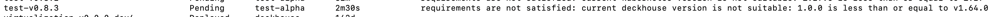
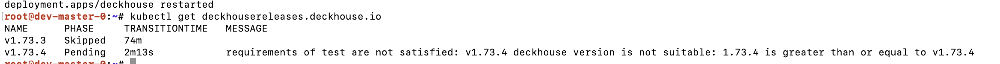
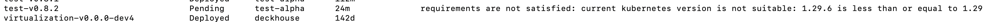
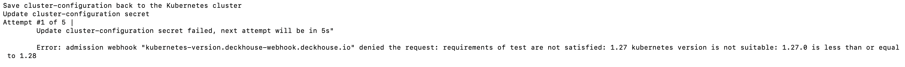
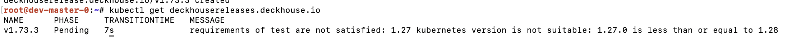

В этом разделе описаны зависимости, которые могут быть установлены для модуля.

На текущий момент Deckhouse Kubernetes Platform (DKP) поддерживает следующие типы зависимостей:

### Зависимость от версии Deckhouse Kubernetes Platform

Эта зависимость позволяет указать минимальную или максимальную версию DKP с которой совместим модуль, текущая версия DKP берется из файла `version`.

Зависимость проверяется в следующих случаях:

1. **При установке или обновлении модуля:**  
   Если версия DKP не соответствует требованиям, указанным в зависимостях модуля релиза, его установка или обновление не будет выполнено.

   

2. **При обновлении Deckhouse Kubernetes Platform:**  
   Проверяется, соответствует ли новая версия DKP зависимостям установленных и активных модулей. Если хотя бы один модуль не совместим с новой версией, обновление DKP не выполнится.

   

3. **При первичном анализе модулей:**  
   Проверяется текущая версия DKP и зависимости уже установленных модулей. Если обнаружено несоответствие, модуль будет отключен.

Пример настройки зависимости в файле `module.yaml`:

```yaml
name: test
weight: 901
requirements:
    deckhouse: ">= 1.61"
```

Для тестирования можно задать переменную окружения `TEST_EXTENDER_DECKHOUSE_VERSION`, чтобы симулировать желаемую версию Deckhouse Kubernetes Platform.

### Зависимость от версии Kubernetes

Эта зависимость определяет минимальную или максимальную версию Kubernetes совместимую с модулем — текущая версия Kubernetes берётся из файла `/tmp/kubectl`.

Зависимость проверяется в следующих случаях:

1. **При установке или обновлении модуля:**  
   Если версия Kubernetes не соответствует требованиям, указанным в зависимостях модуля релиза, установка или обновление не будет выполнено.

    

2. **При обновлении версии Kubernetes:**  
   Проверяются зависимости активных модулей, и если хотя бы один модуль несовместим с новой версией Kubernetes, обновление не будет выполнено.

   

3. **При первичном анализе модулей:**  
   Если версия Kubernetes не соответствует зависимостям уже установленных модулей, DKP отключит такие модули.

4. **При обновлении Deckhouse Kubernetes Platform:**  
   Проверяется значение `autoK8Version` в новой версии DKP, и если оно не совместимо с активными модулями, обновление DKP не будет выполнено.

   

Пример настройки зависимости в файле `module.yaml`:

```yaml
name: test
weight: 901
requirements:
    kubernetes: ">= 1.27"
```

Для тестирования можно задать переменную окружения `TEST_EXTENDER_KUBERNETES_VERSION`, чтобы симулировать желаемую версию Kubernetes.

### Зависимость от статуса установки кластера (bootstrapped)

Эта зависимость указывает, требуется ли модулю наличие кластера, который был инициализирован и настроен для работы с помощью `bootstrap`. Зависимость актуальна для встроенных модулей — определяется проверкой наличия файла `/tmp/bootstrapped`.

Проверка выполняется только один раз — при первичном анализе модулей. Если кластер не инициализирован и настроен для работы с помощью `bootstrap`, модуль не будет включен.

Пример настройки зависимости в файле `module.yaml`:

```yaml
name: ingress-nginx
weight: 402
description: |
    Ingress controller for nginx
    https://kubernetes.github.io/ingress-nginx

requirements:
    bootstrapped: true
```
