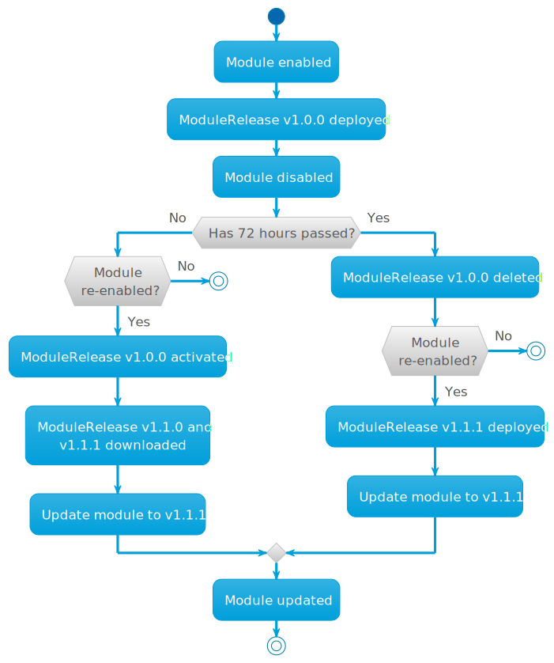

When developing modules, you may want to pull and deploy a module bypassing the release channels. The [ModulePullOverride](../../cr.html#modulepulloverride) resource is used for this purpose.


The ModulePullOverride resource is intended **for development and debugging environments only**.
Using it in production clusters is **not recommended*. Support for the resource might be removed in future Deckhouse Kubernetes Platform versions.




An example of ModulePullOverride:

```yaml
apiVersion: deckhouse.io/v1alpha2
kind: ModulePullOverride
metadata:
  name: <module-name>
spec:
  imageTag: <tag of the module image>
  scanInterval: <image digest check interval. Default: 15s>
```

The `maintenance mode` can also be used for development purposes. In this mode, Deckhouse disables resource management for the module and does not apply changes automatically. This mode is not intended for use in production clusters.

Example:

```yaml
apiVersion: deckhouse.io/v1alpha1
kind: ModuleConfig
...
spec:
  enabled: true
  maintenance: NoResourceReconciliation
  settings: 
```

Requirements for the resource parameters:

* The module name (`metadata.name`) must match the module name in the ModuleSource (`.status.modules.[].name`).

* The container image tag (`spec.imageTag`) can be anything, e.g., `pr333`, `my-branch`.

The `spec.scanInterval` time interval (optional) defines the interval for scanning images in the registry. The default interval is 15 seconds.
To force scan you can change the interval or set the `renew=""` annotation on ModulePullOverride.

The `spec.rollback` indicates whether the deployed module release should be rollback after deleting the `ModulePullOverride`.

You can get the result of applying ModulePullOverride in the message (column `MESSAGE`) when retrieving ModulePullOverride information. The value `Ready` indicates the successful application of ModulePullOverride parameters. Any other value indicates conflict.

Example of absence of conflicts when using ModulePullOverride:

```console
$ kubectl get modulepulloverrides.deckhouse.io 
NAME      UPDATED   MESSAGE   ROLLBACK
example1  10s       Ready     false
```

Requirements for the module:

* The module must exist; otherwise the message for ModulePullOverride will be *The module not found*.

  An example:

  ```console
  $ kubectl get modulepulloverrides.deckhouse.io 
  NAME      UPDATED   MESSAGE                ROLLBACK
  example1  10s       The module not found   false
  ```

* The module must not be embedded Deckhouse module; otherwise the message in ModulePullOverride will be *The module is embedded*.

  An example:

  ```console
  $ kubectl get modulepulloverrides.deckhouse.io 
  NAME           UPDATED  MESSAGE                  ROLLBACK
  ingress-nginx  10s      The module is embedded   false
  ```

* The module must be enabled; otherwise, the message for ModulePullOverride will be *The module disabled*.

  An example:

  ```console
  $ kubectl get modulepulloverrides.deckhouse.io 
  NAME     UPDATED   MESSAGE               ROLLBACK
  example  7s        The module disabled   false
  ```

* The module must have a source; otherwise the message at ModulePullOverride will be *The module does not have an active source*.
  
  An example:

  ```console
  $ kubectl get modulepulloverrides.deckhouse.io 
  NAME       UPDATED   MESSAGE                                     ROLLBACK
  example    12s       The module does not have an active source   false
  ```

* The source for the module must exist; otherwise the message for ModulePullOverride will be *The source not found*.

  An example:

  ```console
  $ kubectl get modulepulloverrides.deckhouse.io 
  NAME       UPDATED   MESSAGE                 ROLLBACK
  example    12s       The source not found    false
  ```

To update the module without waiting for the next update cycle to begin, you can execute the following command:

```sh
kubectl annotate mpo <name> renew=""
```

## Module auto-update logic



> ModuleRelease versions v1.0.0 and v1.1.1 are provided as examples.

1. **Module installation**. When a module is enabled (`enable module <module name>`), the latest available version from the selected stability channel is automatically downloaded and deployed to the cluster. For example, this could be ModuleRelease v1.0.0. The most recent version is used; older versions are not installed.

1. **Module disabling**. When a module is disabled (`disable module <module name>`):
   - The module stops receiving new releases.
   - The currently deployed version remains in the cluster with the `Deployed` status.

1. **Behavior on re-enabling**.

   If the module is re-enabled within 72 hours:
   - The previously deployed version (ModuleRelease v1.0.0) is used.
   - New releases are checked.
   - If available, they are downloaded (e.g., v1.1.0, v1.1.1).
   - The module is then updated according to [the standard update rules](../../deckhouse-release-channels.html) (Update). [More information](../../modules/deckhouse/configuration.html#parameters-update)

   If the module is re-enabled after 72 hours:
   - The old version is deleted (`delete ModuleRelease v1.0.0`).
   - Upon re-enabling, the latest available version is downloaded (e.g., v1.1.1).
   - The cycle starts again as if the module was enabled for the first time (see step 1).

1. **Behavior of a disabled module**. If a module is disabled, no new releases are downloaded. The previously deployed version (the last one that was enabled) is removed after 72 hours if the module is not re-enabled within that time.

## How it works

After creating ModulePullOverride, the corresponding module will not consider ModuleUpdatePolicy, and will also not load and create ModuleRelease objects. The module will be loaded upon every change of the `imageDigest` parameter, after which it will be applied in the cluster. The ModuleSource status will have `overridden: true`, which indicates that ModulePullOverride is being used instead of ModuleUpdatePolicy. Also, the corresponding Module object will have an `IsOverridden` field in its status, and the module version from `imageTag`.

An example:

```yaml
apiVersion: deckhouse.io/v1alpha1
kind: Module
metadata:
  creationTimestamp: "2024-11-18T15:34:15Z"
  generation: 16
  labels:
    deckhouse.io/epoch: "1326105356"
  name: example
  resourceVersion: "230347744"
  uid: 7111cee7-50cd-4ecf-ba20-d691b13b0f59
properties:
  availableSources:
  - example
  releaseChannel: Stable
  requirements:
    deckhouse: '> v1.63.0'
    kubernets: '> v1.30.0'
  source: example
  version: mpo-tag
  weight: 910
status:
  conditions:
  - lastProbeTime: "2024-12-03T15:57:20Z"
    lastTransitionTime: "2024-12-03T15:57:20Z"
    status: "True"
    type: EnabledByModuleConfig
  - lastProbeTime: "2024-12-03T15:59:58Z"
    lastTransitionTime: "2024-12-03T15:57:26Z"
    status: "True"
    type: EnabledByModuleManager
  - lastProbeTime: "2024-12-03T15:59:58Z"
    lastTransitionTime: "2024-12-03T15:56:23Z"
    status: "True"
    type: IsReady
  - lastProbeTime: "2024-12-03T15:59:48Z"
    lastTransitionTime: "2024-12-03T15:56:47Z"
    status: "True"
    type: IsOverridden
  phase: Ready
```

The module will keep running after ModulePullOverride is removed. But if there is a [ModuleUpdatePolicy](../../cr.html#moduleupdatepolicy) for the module, new releases of the module (ModuleRelease) will be pulled to replace the current "developer version".

### An example

1. Suppose there are two modules, `echo` and `hello-world`, defined in [ModuleSource](../../cr.html#modulesource). The update policy is set for them, and they are pulled in and installed in DKP:

   ```yaml
   apiVersion: deckhouse.io/v1alpha1
   kind: ModuleSource
   metadata:
     name: test
   spec:
     registry:
       ca: ""
       dockerCfg: someBase64String==
       repo: registry.example.com/deckhouse/modules
       scheme: HTTPS
   status:
     modules:
     - name: echo
       policy: test-alpha
     - name: hello-world
       policy: test-alpha
     modulesCount: 2
   ```

1. Enable the module and create [ModulePullOverride](../../cr.html#modulepulloverride) for the `echo` module:

   ```yaml
   apiVersion: deckhouse.io/v1alpha2
   kind: ModulePullOverride
   metadata:
     name: echo
   spec:
     imageTag: main-patch-03354
   ```

  After creating ModulePullOverride, the image tag `registry.example.com/deckhouse/modules/echo:main-patch-03354` will be used for the module (`ms:spec.registry.repo/mpo:metadata.name:mpo:spec.imageTag`).

1. The ModulePullOverride will change with each update of the module:

   ```yaml
   apiVersion: deckhouse.io/v1alpha2
   kind: ModulePullOverride
   metadata:
     name: echo
   spec:
     imageTag: main-patch-03354
     scanInterval: 15s
   status:
     imageDigest: sha256:ed958cc2156e3cc363f1932ca6ca2c7f8ae1b09ffc1ce1eb4f12478aed1befbc
     message: "Ready"
     updatedAt: "2023-12-07T08:41:21Z"
   ```

   where:
   - `imageDigest` is the unique identifier of the container image that was pulled.
   - `lastUpdated` is the time when the image was last pulled.

1. In this case, ModuleSource would look as follows:

   ```yaml
   apiVersion: deckhouse.io/v1alpha1
   kind: ModuleSource
   metadata:
     name: test
   spec:
     registry:
       ca: ""
       dockerCfg: someBase64String==
       repo: registry.example.com/deckhouse/modules
       scheme: HTTPS
   status:
     modules:
     - name: echo
       overridden: true
     - name: hello-world
       policy: test-alpha
     modulesCount: 2
   ```



## Module artifacts in the container registry

After a module has been built, its artifacts must be pushed to the container registry at a path that is the *source* path for pulling and running modules in DKP. The path where module artifacts are pushed to the registry is specified in the [ModuleSource](../../cr.html#modulesource) resource.

Below is an example of the container image hierarchy after pushing the `module-1` and `modules-2` module artifacts into the registry:

```tree
registry.example.io
📁 modules-source
├─ 📁 module-1
│  ├─ 📦 v1.23.1
│  ├─ 📦 d4bf3e71015d1e757a8481536eeabda98f51f1891d68b539cc50753a-1589714365467
│  ├─ 📦 e6073b8f03231e122fa3b7d3294ff69a5060c332c4395e7d0b3231e3-1589714362300
│  ├─ 📦 v1.23.2
│  └─ 📁 release
│     ├─ 📝 v1.23.1
│     ├─ 📝 v1.23.2
│     ├─ 📝 alpha
│     └─ 📝 beta
└─ 📁 module-2
   ├─ 📦 v0.30.147
   ├─ 📦 d4bf3e71015d1e757a8481536eeabda98f51f1891d68b539cc50753a-1589714365467
   ├─ 📦 e6073b8f03231e122fa3b7d3294ff69a5060c332c4395e7d0b3231e3-1589714362300
   ├─ 📦 v0.31.1
   └─ 📁 release
      ├─ 📝 v0.30.147
      ├─ 📝 v0.31.1
      ├─ 📝 alpha
      └─ 📝 beta
```


The container registry must support a nested repository structure. See [the requirements section](../#requirements) for more details.  


Below is a list of commands for working with the module source. The examples use the [crane](https://github.com/google/go-containerregistry/tree/main/cmd/crane#crane) tool. Follow the [instructions](https://github.com/google/go-containerregistry/tree/main/cmd/crane#installation) to install it. For macOS, use `brew`.

### Print the list of modules in the module source

```shell
crane ls <REGISTRY_URL>/<MODULE_SOURCE>
```

An example:

```shell
$ crane ls registry.example.io/modules-source
module-1
module-2
```

### Print the list of module images

```shell
crane ls <REGISTRY_URL>/<MODULE_SOURCE>/<MODULE_NAME>
```

An example:

```shell
$ crane ls registry.example.io/modules-source/module-1
v1.23.1
d4bf3e71015d1e757a8481536eeabda98f51f1891d68b539cc50753a-1589714365467
e6073b8f03231e122fa3b7d3294ff69a5060c332c4395e7d0b3231e3-1589714362300
v1.23.2
```

In the example above, there are two module images and two application container images in `module-1`.

### Print the list of files in the module image

```shell
crane export <REGISTRY_URL>/<MODULE_SOURCE>/<MODULE_NAME>:<MODULE_TAG> - | tar -tf -
```

An example:

```shell
crane export registry.example.io/modules-source/module-1:v1.23.1 - | tar -tf -
```

The output will be quite large.

### Print the list of images of the module's application containers

```shell
crane export <REGISTRY_URL>/<MODULE_SOURCE>/<MODULE_NAME>:<MODULE_TAG> - | tar -Oxf - images_digests.json
```

An example:

```shell
$ crane export registry.example.io/modules-source/module-1:v1.23.1 -  | tar -Oxf - images_digests.json
{
  "backend": "sha256:fcb04a7fed2c2f8def941e34c0094f4f6973ea6012ccfe2deadb9a1032c1e4fb",
  "frontend": "sha256:f31f4b7da5faa5e320d3aad809563c6f5fcaa97b571fffa5c9cab103327cc0e8"
}
```

### Print the list of releases

```shell
crane ls <REGISTRY_URL>/<MODULE_SOURCE>/<MODULE_NAME>/release
```

An example:

```shell
$ crane ls <REGISTRY_URL>/<MODULE_SOURCE>/<MODULE_NAME>/release
v1.23.1
v1.23.2
alpha
beta
```

In the example above, there are two releases in the container registry; two release channels, `alpha` and `beta`, are also used:

### Print the version in use on the `alpha` release channel

```shell
crane export <REGISTRY_URL>/<MODULE_SOURCE>/<MODULE_NAME>/release:alpha - | tar -Oxf - version.json
```

An example:

```shell
$ crane export registry.example.io/modules-source/module-1/release:alpha - | tar -Oxf - version.json
{"version":"v1.23.2"}
```
