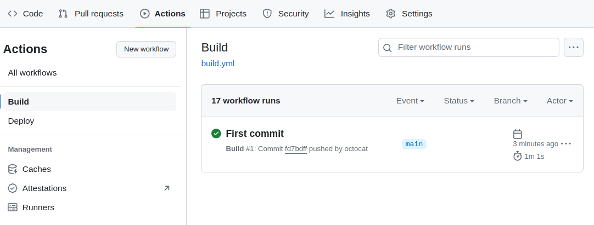
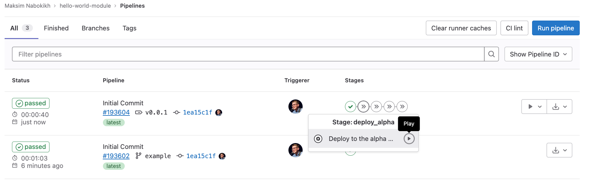



Пример создания модуля `hello-world-module` на основе [шаблона модуля](https://github.com/deckhouse/modules-template/) и адаптации Helm-чарта [hello-world](https://github.com/giantswarm/hello-world-app).

## Подготовка исходного кода модуля и сборка

1. Установите необходимые утилиты.
   - [git](https://git-scm.com)
   - [sed](https://github.com/mirror/sed)
   - [yq](https://github.com/mikefarah/yq)

1. Сделайте форк или скопируйте [репозиторий шаблона модуля](https://github.com/deckhouse/modules-template/).

   ```shell
   git clone git@github.com:deckhouse/modules-template.git hello-world-module \
     && cd hello-world-module
   ```

1. Укажите имя модуля в файле `Chart.yaml`.

   В примере будет использоваться имя модуля `hello-world-module`, но вы можете выбрать свое.

   > Обратите внимание, что в некоторых местах в примере имя модуля может быть записано в разных форматах — *kebab-case* или *camelCase*. Если вы используете свое имя модуля, то учитывайте изменение формата имени модуля в приводимых командах.

   Выполните следующую команду, чтобы указать имя модуля в файле `Chart.yaml`, либо отредактируйте его вручную:

   ```shell
   sed -Ei 's/^name:(.*)/name: hello-world-module/g' Chart.yaml
   ```

1. Склонируйте исходный код чарта [hello-world](https://github.com/giantswarm/hello-world-app) во временную директорию.

   ```shell
   git clone https://github.com/giantswarm/hello-world-app .tmp-chart
   ```

1. Скопируйте шаблоны чарта в директорию `templates` модуля, предварительно очистив ее.

   ```shell
   rm -rf templates/*
   cp -fR .tmp-chart/helm/hello-world/templates/* templates/
   ```

1. Замените в шаблонах чарта путь `.Values` на `.Values.helloWorld`.

   > Это архитектурная особенность [addon-operator](https://github.com/flant/addon-operator), ей необходимо следовать для обращения к values модуля.

   ```shell
   sed -i -e 's/.Values/.Values.helloWorldModule/g' $(find templates/ -type f)
   ```

1. Добавьте OpenAPI-схему настроек модуля.

   Параметры модуля указываются в OpenAPI-схеме в директории [openapi](structure/#openapi). Выполните следующую команду, чтобы преобразовать JSON-схему параметров чарта в OpenAPI-схему модуля:

   ```shell
   yq -P .tmp-chart/helm/hello-world/values.schema.json > openapi/config-values.yaml
   ```

1. Опишите правило сборки образа контейнера приложения.

   Правила сборки образов контейнеров приложений должны находиться в подкаталоге директории [images](structure/#images) модуля. Выполните следующую команду, чтобы создать директорию образа приложения и Dockerfile с правилами сборки образа.

   ```shell
   rm -rf images/*
   mkdir images/hello-world-module
   echo "FROM quay.io/giantswarm/helloworld:0.2.0" > images/hello-world-module/Dockerfile
   ```

1. Замените образ в манифесте Deployment на хелпер библиотеки Deckhouse Kubernetes Platform. Это позволит использовать актуальный content-based-тэг образа.

   ```shell
   sed -Ei 's/image\:(.*)/image: {{ include "helm_lib_module_image" (list . "helloWorldModule") }}/g' templates/deployment.yaml
   ```

1. Удалите хуки модуля, CRD и временные файлы.

   Пример не использует хуки и СustomResourceDefinition. Выполните следующие команды, чтобы очистить папки `hooks` и `crds`:

   ```shell
   rm -rf hooks/
   rm -rf crds/
   rm -rf .tmp-chart
   ```

1. Настройте CI/CD.

   В шаблоне проекта в директории `.github` находятся готовые файлы workflow GitHub Actions, которые реализуют простую схему сборки и публикации модуля с использованием registry [GitHub Packages](https://github.com/features/packages) (ghcr.io). Артефакты модуля будут загружаться по адресу `ghcr.io/<OWNER>/modules/`, который будет являться [источником модулей](../../cr.html#modulesource). Внесите изменения в файлы workflow, если вам не подходит предложенный вариант.

   Выполните следующие настройки в свойствах вашего проекта на GitHub, чтобы workflow модуля работал корректно:
   - Откройте страницу *Settings -> Actions -> General*.
   - Установите параметр *Read and write permissions* в разделе *Workflow permissions*.

1. Зафиксируйте изменения в репозитории (укажите адрес Git-репозитория модуля).

   ```shell
   git add .
   git commit -m "Initial Commit"
   git push --set-upstream origin <GIT_REPO_URL>
   ```

1. Убедитесь, что сборка модуля выполнилась успешно.

   Перейдите в раздел *Actions* репозитория модуля и слева, в списке workflow, выберите *Build*. Workflow, запущенный после того, как вы выполнили команду `git push` на предыдущем шаге, должен выполниться успешно.

   Пример:

   

## Публикация модуля на канале обновлений

Пример публикации версии `v0.0.1` модуля на канале обновлений *Alpha*:

1. Создайте новый релиз модуля `v0.0.1` в репозитории GitHub или установите тег `v0.0.1`.

1. Перейдите в раздел *Actions* репозитория модуля и слева, в списке workflow, выберите *Deploy*.

1. В правой части страницы нажмите на выпадающий список *Run workflow* и выберите `alpha`. Укажите тег `v0.0.1` в поле ввода тега. Нажмите кнопку *Run workflow*.

   

1. Убедитесь, что workflow публикации модуля выполнился успешно.

Модуль стал доступным для подключения в кластере Deckhouse Kubernetes Platform.

## Подключение модуля в кластере

Пример подключения модуля `hello-world-module` в кластере Deckhouse Kubernetes Platform.

1. Создайте токен доступа в репозитории GitHub с правами для работы с GitHub Packages.
1. Сгенерируйте строку аутентификации для доступа к GitHub Packages container registry в формате [dockerconfigjson](https://kubernetes.io/docs/tasks/configure-pod-container/pull-image-private-registry/#registry-secret-existing-credentials), указав имя пользователя (или организации) GitHub и токен доступа:

   ```shell
   base64 -w0 <<EOF
   {
     "auths": {
       "ghcr.io": {
         "auth": "$(echo -n '<OWNER>:<TOKEN>' | base64 -w0)"
       }
     }
   }
   EOF
   ```

1. Создайте в кластере ресурс [ModuleSource](../../cr.html#modulesource) (укажите адрес container registry и строку аутентификации).

   ```shell
   kubectl apply -f - <<EOF
   apiVersion: deckhouse.io/v1alpha1
   kind: ModuleSource
   metadata:
     name: ghcr
   spec:
     registry:
       # Укажите имя пользователя (или организации) GitHub. Например: ghcr.io/octocat/modules
       repo: ghcr.io/<!OWNER>/modules
       # Строка аутентификации для доступа к GitHub Packages из предыдущего шага.
       dockerCfg: <!REGISTRY_CREDENTIALS>
   EOF
   ```

   Синхронизация данных после создания ресурса может занять несколько секунд.

1. Посмотрите список доступных модулей:

   ```shell
   kubectl  get ms ghcr -o jsonpath='{.status.modules[*].name}'
   ```

   В списке должен быть только модуль `hello-world-module`.

1. Создайте ресурc [ModuleUpdatePolicy](../../cr.html#moduleupdatepolicy), определяющий политику обновления модуля.

   Выполните следующую команду, чтобы создать политику обновления для модуля `hello-world-module` с каналом обновления *Alpha* и режимом обновления *Auto*:

   ```shell
   kubectl apply -f - <<EOF
   apiVersion: deckhouse.io/v1alpha1
   kind: ModuleUpdatePolicy
   metadata:
     name: hello-world-module
   spec:
     moduleReleaseSelector:
       labelSelector:
         matchLabels:
           source: ghcr
     releaseChannel: Alpha
     update:
       mode: Auto
   EOF
   ```

1. Проверьте ресурс *ModuleSource* (в статусе не должно содержаться ошибок и должны быть перечислены доступные модули):

   ```shell
   kubectl get ms ghcr -o yaml
   ```

1. Убедитесь, что были созданы новые ресурсы [ModuleRelease](../../cr.html#modulerelease) для модуля:

   ```shell
   kubectl get mr
   ```

   Пример вывода:

   ```console
   $ kubectl get mr
   NAME                                PHASE        UPDATE POLICY        TRANSITIONTIME   MESSAGE
   hello-world-module-v0.0.1           Deployed     hello-world-module   22m            
   ```

1. В случае успешной установки релизов дождитесь перезапуска пода Deckhouse Kubernetes Platform.

   ```shell
   kubectl -n d8-system get pod -l app=deckhouse
   ```

1. Включите модуль, выполнив следующую команду:

   ```shell
   kubectl -ti -n d8-system exec deploy/deckhouse -- deckhouse-controller module enable hello-world-module
   ```

   Через некоторое время объекты модуля появятся в кластере.

   Если при запуске модуля возникли ошибки, посмотрите журнал DKP:

   ```shell
   kubectl -n d8-system logs deploy/deckhouse -f | jq -rc '.msg'
   ```

   Или проверьте состояние очереди DKP:

   ```shell
   kubectl -n d8-system exec deploy/deckhouse -- deckhouse-controller queue list
   ```


