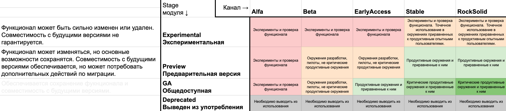

Для версионирования модулей используется [семантическое версионирование](https://semver.org/lang/ru/).

При выборе номера версии руководствуйтесь следующими рекомендациями:
- изменение **patch-версии** (например, c `0.0.1` на `0.0.2`) — исправление дефекта;
- изменение **Minor-версии** (например, c `0.0.1` на `0.1.0`) — добавление новой функции;
- изменение **Major-версии** (например, c `0.0.1` на `1.0.0`) — добавление функции, которая кардинально меняет возможности модуля; масштабное изменение интерфейса или завершение крупного этапа работы.

Перед номером версии в теге git и контейнере registry **всегда** добавляется буква "v". Примеры: `v0.0.73`, `v1.0.0`.

## Каналы обновлений

Версия модуля при публикации должна *перемещаться* по [каналам обновлений](../../deckhouse-release-channels.html) от менее стабильного к более стабильному: `Alpha` -> `Beta` -> `EarlyAccess` -> `Stable` -> `RockSolid`.

Каналы обновлений позволяют опубликовать версию модуля для ограниченного числа пользователей и получить обратную связь на раннем этапе. Вы сами определяете степень стабильности версии модуля и на какой канал обновлений ее можно опубликовать.

Важно понимать, что выбор канала обновлений не определяет, насколько стабилен модуль и на какой стадии жизненного цикла он находится. Каналы являются инструментом доставки и определяют степень стабильности конкретного релиза.

## Стадия жизненного цикла модуля

Во время разработки модуль может находиться на следующих стадиях:

**Experimental** — экспериментальная версия. Функциональность модуля может сильно измениться. Совместимость с будущими версиями не гарантируется.

**Preview** — предварительная версия. Функциональность модуля может измениться, но основные возможности сохранятся. Совместимость с будущими версиями обеспечивается, но может потребовать дополнительных действий по миграции.

**General Availability (GA)** — общедоступная версия. Модуль готов к использованию в production-средах.

**Deprecated** — версия модуля устарела.

## Как понять, насколько модуль стабилен?

В зависимости от этапа жизненного цикла модуля и канала обновлений, из которого была установлена версия модуля, общая стабильность может быть определена в соответствии со следующей таблицей:

Выводы:
- Модуль на стадии `Experimental` в канале `Stable` не рекомендуется использовать в production-средах.
- Модуль на стадии `GA` в канале `Alpha` также не рекомендуется использовать в production-средах.
- Для production-сред подходят только модули, находящиеся на стадии `GA`, установленные из каналов `EarlyAccess`, `Stable`, или `RockSolid`.
- Модули, находящиеся на стадии `Deprecated`, рекомендуется заменить согласно рекомендациям в документации.

<!--
## Стадии отдельных возможностей модуля @TODO

Ресурс *ModuleConfig* позволяет управлять дополнительными возможностями модуля. Эти опции могут быть помечены как `Experimental`, `Preview`, `GA` или `Deprecated` в параметре `x-feature-stage` в схеме OpenAPI `x-feature-stage: Experimental|Preview|GA|Deprecated` (значение по умолчанию — `GA`).

При включении функций на стадии, отличной от `GA`, выдается предупреждение.

В настройках Deckhouse Kubernetes Platform (DKP) можно задать глобальные правила, определяющие, какие функции и на каком этапе могут быть включены в кластере. Это помогает предотвратить случайное использование Experimental-функций в рабочих средах.
-->

## Версионирование API

Модули в DKP используют кастомные ресурсы для взаимодействия с пользователями. Параметр `apiVersion` с версией API этих ресурсов обновляется в соответствии со следующими правилами:

- `v1alphaX` — только что опубликованный API. Нужно проверить, насколько он удобен и понятен для пользователей, а также насколько корректны и логичны его настройки.
- `v1betaX` — API прошел первичное тестирование. Продолжается его логическое развитие и доработка.
- `v1stableX` — стабильный API. С этого момента его поля не удаляются из спецификации и правила валидации не меняются в сторону большей строгости.

Можно выпустить новую версию API v2, которая проходит те же этапы, но с префиксом `v2`. Важно помнить, что после выпуска версии `v1stableX` Kubernetes будет считать её более приоритетной, чем `alpha`- или `beta`-версии, до выпуска новой стабильной версии `v2stableX`. При выполнении команд `kubectl apply` и `kubectl edit` будет использоваться именно `v1stableX`.

Причины для выпуска новой версии:
* изменение структуры;
* обновление устаревших параметров.

Добавлять новые параметры можно без изменения версии.

Для обеспечения возможности автоматической конвертации параметров модуля из одной версии в другую необходимо включить в модуль соответствующие [конверсии](../structure/#conversions). Конверсии могут быть необходимы в случаях, когда в новой версии OpenAPI-спецификации параметр переименовывается или переносится в другое место.

Рекомендации, которых стоит придерживаться при выходе новой версии *CustomResourceDefinition* (CRD):
* Предыдущим версиям проставлять параметр `deprecated: true` (читайте подробнее в документации [Kubernetes](https://kubernetes.io/docs/tasks/extend-kubernetes/custom-resources/custom-resource-definition-versioning/#version-deprecation)).
* Версию, в которой данные хранятся внутри etcd ([storage-версия](https://kubernetes.io/docs/tasks/extend-kubernetes/custom-resources/custom-resource-definition-versioning/#upgrade-existing-objects-to-a-new-stored-version)), менять не ранее чем через два месяца после выхода новой версии.
