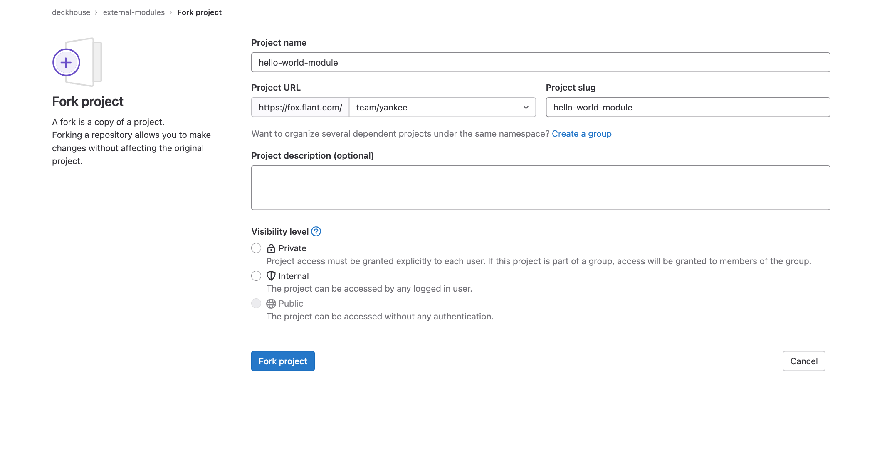
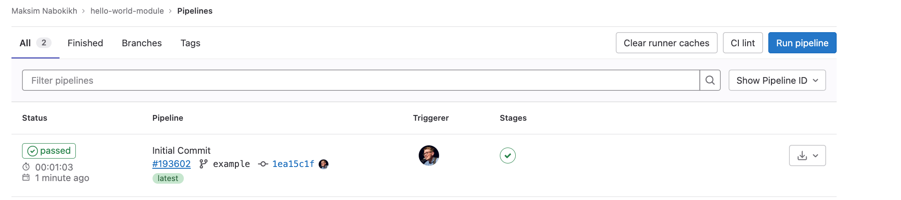

<!-- DRAFT -->

Команда Deckhouse Kubernetes Platform всегда готова проконсультировать. Вы можете обратиться к нам в канале #tech-deckhouse-modules внутреннего слака Flant.

В качестве примера можно посмотреть на [модули, разработанные компанией Flant](existing_modules/modules.md)

## Установите утилиты

Установите утилиты до выполнения инструкции:

* [git](https://git-scm.com) – система контроля версий;
* [sed](https://github.com/mirror/sed) – редактор потоков;
* [yq](https://github.com/mikefarah/yq) – командная строка для JSON и YAML.

## Сделайте форк или скопируйте шаблон репозитория с модулем

Команда Deckhouse Kubernetes Platform подготовила репозиторий для удобного создания модулей. Внутри репозитория представлен пример минимального модуля, который содержит все возможные функции. Предлагаем использовать этот репозиторий как основу.

1. Сделайте форк шаблона для модуля в Gitlab [из репозитория](https://fox.flant.com/deckhouse/modules/template):

   

1. Клонируйте его.

   ```sh
   git clone git@fox.flant.com:***/hello-world-module.git hello-world-module \
     && cd hello-world-module
   ```

   > Подставьте свой адрес для команды `git clone`.

## Адаптируйте шаблоны

Выберите имя, которое будет соответствовать имени модуля в Deckhouse Kubernetes Platform. В некоторых местах оно может быть записано в формате kebab case или camel case. В инструкции следует использовать то же самое имя, которое было выбрано.

Откройте `Chart.yaml` и в параметре `name` впишите имя модуля `hello-world`.

```sh
sed -Ei '' 's/^name:(.*)/name: hello-world/g' Chart.yaml
```

### Подготовьте шаблоны

1. Клонируйте исходный код чарта для `hello-world`.

   ```sh
   git clone https://github.com/giantswarm/hello-world-app .tmp-chart
   ```

2. Скопируйте шаблоны.

   ```sh
   rm -rf templates/*
   cp -fR .tmp-chart/helm/hello-world/templates/ templates/
   ```

3. Замените в шаблонах путь `.Values` на `.Values.helloWorld`.

   ```sh
   sed -i '' -e 's/.Values/.Values.helloWorld/g' $(find templates/ -type f)
   ```

### Добавьте схему для настроек

Чтобы пользователь настраивал модуль, необходимо добавить Open API схему для возможных опций. Это запретит пользователю вводить неверные настройки.

> Команда Deckhouse Kubernetes Platform старается тщательно подходить к выбору параметров, которые могут настраивать пользователи. Мы стремимся помочь пользователям, предоставляя возможность настраивать только те параметры, которые важны для их работы.

В Helm-чарте приложения `hello-world` уже имеется JSON-схема. Преобразуйте ее.

```sh
yq -P .tmp-chart/helm/hello-world/values.schema.json > openapi/config-values.yaml
```

Если в вашем чарте нет схемы, необходимо написать ее самостоятельно. Посмотрите примеры схем в репозитории, который клонировали на первом шаге.

## Соберите образ контейнера

Полезный подход — хранить образы для модулей в нашем registry. Очистите папку с образами `/images/*` и загрузите туда наш образ для приложения `hello-world`.

```sh
rm -rf images/*
mkdir images/hello-world
echo "FROM quay.io/giantswarm/helloworld:0.2.0" > images/hello-world/Dockerfile
```

> Поддерживаются любые Docker файлы. Если необходимо собрать приложение из исходного кода, поместите его рядом с **Dockerfile** и включите его в образ с помощью команды `COPY`.

Чтобы использовать наш образ в шаблонах, замените его в манифестах на хелпер из библиотеки Deckhouse Kubernetes Platform.

```sh
sed -Ei '' 's/image\:(.*)/image: {{ include "helm_lib_module_image" (list . "helloWorld") }}/g' templates/deployment.yaml
```

Проверьте результат командой `cat` и убедитесь, что изменения применились.

> Можно пользоваться вспомогательными функциями из [библиотеки Deckhouse Kubernetes Platform](https://github.com/deckhouse/lib-helm/tree/main/charts/helm_lib).

## Добавьте хуки

Прочитайте документацию операторов о концепции хуков, например, [что такое конфигурация хука и какие функции она предоставляет](https://flant.github.io/shell-operator/HOOKS.html#hook-configuration).

Хуки используются модулем для динамического взаимодействия с API Kubernetes. Например, они могут быть использованы для обработки событий, связанных с созданием или удалением объектов в кластере.

> Для модулей Deckhouse Kubernetes Platform написание хуков поддерживается только на языке Python.

В репозитории, клонированном на первом шаге, содержатся примеры возможных хуков. Ваш модуль не требует использования хуков, поэтому существующие хуки в примере можно удалить.

<!-- TODO: Пример написания полезного хука -->

```sh
rm -rf hooks/
rm -rf crds/
```

## Опубликуйте модуль

В файле `.gitlab-ci.yml` укажите собственные переменные вместо тех, которые указаны в шаблоне.

```yaml
MODULES_MODULE_NAME: echoserver
MODULES_REGISTRY: registry.flant.com
MODULES_MODULE_SOURCE: registry.flant.com/deckhouse/modules/template
MODULES_MODULE_TAG: ${CI_COMMIT_REF_NAME}
```

В GitLab добавьте аутентификационные данные для доступа к container registry в разделе **Settings** → **CI/CD**.

Например:

```text
MODULES_REGISTRY_LOGIN = username
MODULES_REGISTRY_PASSWORD = password
```

> Если вы используете **fox**, то доступы указывать не нужно.

Внесите  изменения в git.

```sh
rm -rf .tmp-chart
git add .
git commit -m "Initial Commit"
git push --set-upstream origin example
```
<!-- TODO: Сквош коммитов? -->

Убедитесь, что сборка прошла успешно.



Поместите тег v0.0.1. Теперь нажмите кнопку **Deploy to alpha**.


Модуль станет доступным для подключения в кластерах Deckhouse Kubernetes Platform.

## Разверните модуль в кластере

### Подключение модуля

1. Зайдите в существующий кластер и подключите репозиторий с модулями для CI/CD (указанный выше) при помощи создания объекта в Deckhouse.

   ```yaml
   apiVersion: deckhouse.io/v1alpha1
   kind: ModuleSource
   metadata:
     name: hello-world
   spec:
     releaseChannel: alpha #deprecated field
     registry:
       # Пример: dev-registry.deckhouse.io/deckhouse/modules-source
       repo: <ваш регистри></путь/до/репозитория/с/модулями>
       # Строка в формате [dockerconfigjson](https://kubernetes.io/docs/tasks/configure-pod-container/pull-image-private-registry/#registry-secret-existing-credentials)
       #
       # Пример: 
       # base64 -w0 <<EOF
       # {
       #   "auths": {
       #     "dev-registry.deckhouse.io": {
       #       "auth": "$(echo -n 'username:password' | base64 -w0)"
       #     }
       #   }
       # }
       # EOF
       dockerCfg: <base64 encoded credentials>
   ```

   После успешного создания и синхронизации *ModuleSource*, посмотрите какие модули доступны для установки:

   ```sh
   kubectl  get ms hello-world -o jsonpath='{.status.modules[*].name}'
   ```

1. Для установки и последующего обновления, определите *ModuleUpdatePolicy* для *ModuleSource* (обратите внимание, что канал обновления теперь указывается в политике обновления в параметре `.spec.releaseChannel`), например:

   ```yaml
   apiVersion: deckhouse.io/v1alpha1
   kind: ModuleUpdatePolicy
   metadata:
     name: hello-world
   spec:
     moduleReleaseSelector:
       labelSelector: # селектор на основе лейблов. Важно избегать ситуации, когда один модуль соответствует нескольким политикам обновления (см. ниже).
         matchLabels: # гарантированно наличие лейблов module и source, по ним необходимо описать селектор
           module: hello-world-server
           source: hello-world
     releaseChannel: Alpha
     update:
       mode: Auto # <Auto|Manual>
       windows:
       - days:
         - "Mon"
         - "Tue"
         - "Wed"
         from: "13:30" # время UTC
         to: "14:00"
   ```

    Важно:
    * Если какой-либо модуль попадает под лейбл *labelSelector* нескольких политик обновления, новые релизы для этого модуля не будут создаваться до тех пор, пока не будет устранена неоднозначность в применяемых политиках. В *ModuleSource* указывается ошибка с пояснением, какой модуль затрагивается несколькими политиками и какими именно.
    * Наличие политики обновления является обязательным условием для создания нового релиза модуля, так как через эту политику определяется канал обновления и режим обновления (полностью автоматический, обновляющийся по расписанию или ручной).

1. Проверьте *ModuleSource* (в статусе не должно содержаться ошибок и должны быть перечислены доступные модули):

   ```sh
   kubectl get ms hello-world -o yaml
   ```

1. Убедитесь, что были созданы новые ресурсы *ModuleRelease* для модулей, подпадающих под *ModuleUpdatePolicy*, и что они имеют статус Pending (если режим обновления ручной или автоматический с указанием окна обновления за пределами текущей даты/временного интервала) или Deployed (при условии, что обновление является автоматическим без указания окна обновления, или окно обновления совпадает с текущей датой/временным интервалом):

   ```sh
   kubectl get mr
   ```

   Если в политике обновления выставлен ручной режим обновления, необходимо в ручную подтвердить установку новой версии модуля. Для этого добавьте аннотацию на указанный релиз:

   ```sh
   kubectl annotate mr <module_release_name> modules.deckhouse.io/approved="true"
   ```

   Для автоматического режима обновления подтверждение не нужно.

1. В случае успешной установки релизов, дождитесь перезапуска пода Deckhouse Kubernetes Platform.

   ```sh
   kubectl -n d8-system get pod -l app=deckhouse
   ```

1. Включите модуль при помощи создания объекта в Deckhouse Kubernetes Platform.

   ```yaml
   apiVersion: deckhouse.io/v1alpha1
   kind: ModuleConfig
   metadata:
     name: hello-world
   spec:
     enabled: true
     settings: {}
     version: 1
   ```

Через некоторое время объекты модуля появятся в кластере.

* Команда для просмотра логов Deckhouse Kubernetes Platform в ожидании объектов модуля:

     ```sh
     kubectl -n d8-system logs deploy/deckhouse -f | jq -rc '.msg'
     ```

* Команда для получения объектов:

     ```sh
     kubectl get pods -A | grep hello
     ```

### Переключение модуля на другой ModuleSource

1. Если необходимо развернуть определенный модуль из другого *ModuleSource*, определите, под какую политику обновлений подпадает этот модуль:

   ```sh
   kubectl get mr
   ```

   Проверьте `UPDATE POLICY` для релизов модуля.

2. Прежде чем удалить эту политику обновления, убедитесь, что нет ожидающих развертывания (в состоянии Pending) релизов, которые подпадают под удаляемую или изменяемую политику (или *labelSelector*, используемый политикой, больше не соответствует вашему модулю):

   ```sh
   kubectl delete mup <policy_name>
   ```

3. Установите новый *ModuleSource* (см. раздел ## Подключение модуля п.1).

4. Создайте новую *ModuleUpdatePolicy* с указанием правильных меток (source) для нового *ModuleSource* (см. раздел ## Подключение модуля п.2).

5. Проверьте, что новые *ModuleRelease* для модуля создаются из нового *ModuleSource* в соответствии с политикой обновления.

   ```sh
   kubectk get mr
   ```

### Примеры moduleReleaseSelector

1. Примените политику ко всем модулям *ModuleSorce* `deckhouse`:

   ```yaml
   ...
     moduleReleaseSelector:
       labelSelector:
         matchLabels:
           source: deckhouse
   ...
   ```

2. Примените политику к модулю `deckhouse-admin` независимо от *ModuleSource*:

   ```yaml
   ...
     moduleReleaseSelector:
       labelSelector:
         matchLabels:
           module: deckhouse-admin
   ...
   ```

3. Примените политику к модулю `deckhouse-admin` из *ModuleSource* `deckhouse`:

   ```yaml
   ...
     moduleReleaseSelector:
       labelSelector:
         matchLabels:
           module: deckhouse-admin
           source: deckhouse
   
   ...
   ```

4. Примените политику только к модулям `deckhouse-admin` и `secrets-store-integration` в *ModuleSource* `deckhouse`:

   ```yaml
   ...
     moduleReleaseSelector:
       labelSelector:
         matchExpressions:
         - key: module
           operator: In
           values:
           - deckhouse-admin
           - secrets-store-integration
         matchLabels:
           source: deckhouse
   ...
   ```

5. Примените политику ко всем модулям *ModuleSource* `deckhouse`, кроме `deckhouse-admin`:

   ```yaml
   ...
     moduleReleaseSelector:
       labelSelector:
         matchExpressions:
         - key: module
           operator: NotIn
           values:
           - deckhouse-admin
         matchLabels:
           source: deckhouse
   ...
   ```
