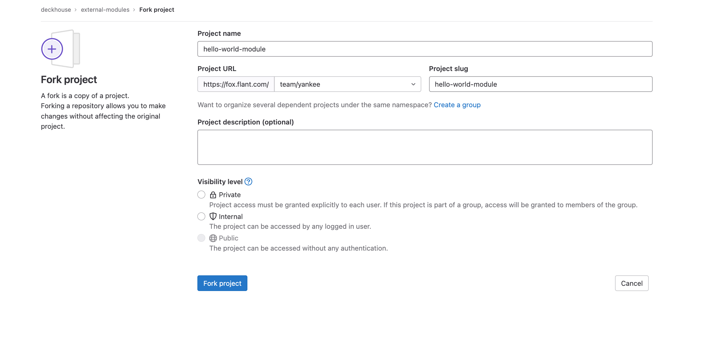

## Сделайте форк или скопируйте шаблон репозитория с модулем

Команда Deckhouse Kubernetes Platform подготовила репозиторий для удобного создания модулей. Внутри репозитория представлен пример минимального модуля, который содержит все возможные функции. Предлагаем использовать этот репозиторий, как основу.

1. Сделайте форк шаблона для модуля в Gitlab [из репозитория](https://fox.flant.com/deckhouse/modules/template):

   

1. Клонируйте его.

   ```sh
   git clone git@fox.flant.com:***/hello-world-module.git hello-world-module \
     && cd hello-world-module
   ```

   > **NOTE:** Подставьте свой адрес для команды git clone.
