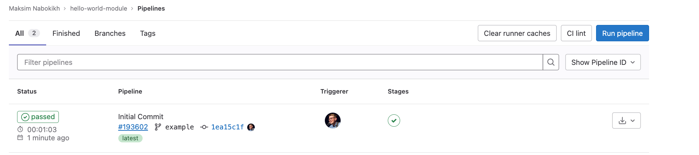
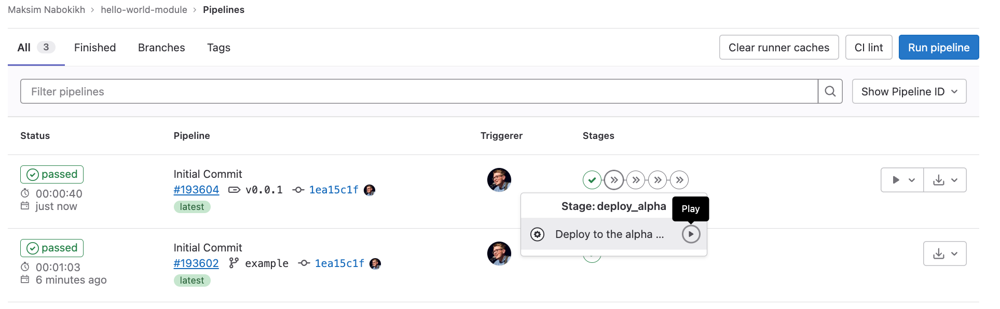

В файле `.gitlab-ci.yml` укажите собственные переменные вместо тех, которые указаны в шаблоне.

```yaml
MODULES_MODULE_NAME: echoserver
MODULES_REGISTRY: registry.flant.com
MODULES_MODULE_SOURCE: registry.flant.com/deckhouse/modules/template
MODULES_MODULE_TAG: ${CI_COMMIT_REF_NAME}
```

В GitLab добавьте аутентификационные данные для доступа к container registry в разделе **Settings** -> **CI/CD**.

Например:

```text
MODULES_REGISTRY_LOGIN = username
MODULES_REGISTRY_PASSWORD = password
```

> **NOTE:** если вы используете **fox**, то доступы указывать не нужно.

Внесите  изменения в git.

```sh
rm -rf .tmp-chart
git add .
git commit -m "Initial Commit"
git push --set-upstream origin example
```
<!-- TODO: Сквош коммитов? -->

  Убедитесь, что сборка прошла успешно.



Поместите тег v0.0.1. Теперь нажмите кнопку **Deploy to alpha**.



Модуль станет доступным для подключения в кластерах Deckhouse Kubernetes Platform.
