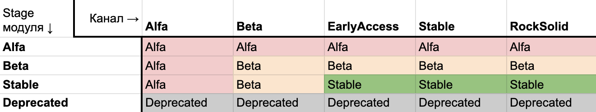

## Версия модуля

Для версионирования модулей используется [`semver`][semver]. Какую версию поднимать выбирается по следующей логике:

**Patch-версия** — исправление бага.

**Minor-версия** — добавление нового функционала.

**Major-версия** — добавление функционала, которое кардинально меняет возможности модуля. Значительный refactoring, заметный пользователю. Закрытие большого milestone’а.

> Перед самой версией в tag в git и в container registry всегда добавляется буква v.

Примеры: `v0.0.73`, `v1.0.0`

## Changelog

Чтобы добавить в релиз модуля информацию об изменениях, нужно положить файл `changelog.yaml` в образ релиза. Формат данных в файле должен быть вида `map[string]any`.

Например:

```yaml
features:
    - point A
    - point B
    - point C
fixes:
    - fix 1
    - fix 2
chore:
    some information that you need to know
```

Вложенная информация появится в объекте `ModuleRelease` в кластере.

## Каналы стабильности

Выпущенная версия модуля передвигается по каналам стабильности от менее стабильного к более стабильному: `Alpha`, `Beta`, `EarlyAccess`, `Stable`, `RockSolid`.

Каналы стабильности позволяют выложить только что выпущенную версию только для ограниченного количества пользователей и получить раннюю обратную связь. Канал стабильности выбирает пользователь.

Важно понимать, что канал не определяет насколько стабилен сам модуль и в какой стадии жизненного цикла он находится. Они являются инструментом доставки и определяют стабильность конкретного релиза.

## Стадия жизненного цикла модуля

Во время разработки модуль может находиться на разных стадиях (stage) готовности:

**Alpha** — каждый только что добавленный модуль начинает с этой стадии. Это значит что модуль можно включать и пробовать им пользоваться, но у него еще нет большого общего числа инсталляций.

**Beta** — модуль используется во многих инсталляциях. Есть известные не критичные проблемы, которые необходимо исправит. Часть запланированного функционала еще не была имплементирована. На данном этапе уже возможно использования модуля в production-средах.

**Stable** — модуль полностью готов к использованию в production-средах.

**Deprecated** — модуль объявлен устаревшим. Он не будет получать обновления и будет выведен из обращения после указанного периода времени. Пользователю будет приходить уведомления о всех подобных модулях включенных в кластере.

## Как понять, насколько модуль стабилен?

В зависимости от стадии жизненного цикла модуля и канала обновления, из которого установлена версия модуля, общую стабильность можно определить руководствуясь следующей таблицей:



Выводы:
- Модуль находящийся на стадии `Alpha` в канале `Stable` — не рекомендуется использовать в production-средах.
- Модуль находящийся на стадии `Stable` в канале `Alpha` — также не рекомендуется использовать в production-средах.
- Для production-сред подходят только модули находящиеся на стадии `Stable`, установленные из каналов `EarlyAccess`, `Stable`, или `RockSolid`.
- Отдельно стоит отметить, что модули находящиеся на стадии `Deprecated` рекомендуется заменить согласно с рекомендациями в документации.

## Стадии отдельных возможностей модуля

При помощи ModuleConfig, можно управлять включением дополнительных возможностей модуля. Опции могут быть помечены как `Alpha`, `Beta`, `Stable` или `Deprecated` при помощи поля в OpenAPI схеме: `x-feature-stage: Alpha|Beta|Stable|Deprecated` (Stable является значением по умолчанию).

При включении функций на стадии, отличной от Stable, выдается предупреждение.

В настройках Deckhouse можно глобально определить, функции на каком этапе можно включать в кластере. Это необходимо чтобы предотвратить случайное включение Alpha функций в production-окружениях.

## Версионирование API

Модули используют Custom Resources как интерфейс работы с пользователем. Поле apiVersion версионируется по следующей логике:

- `v1alphaX` — только что выпущенный API. Необходимо проверить, насколько удобно и понятно оно пользователям, и насколько корректны и логичны настройки.
- `v1betaX` — API прошел первичную проверку. Происходит логичное дальнейшее развитие и доработка.
- `v1stableX` — API признан стабильным. С этого момента поля не будут удаляться из спецификации, и не будут меняться правила валидации в сторону более запрещающих.

Допускается выпуск новой версии API v2 с прохождением тех же стадий, только с префиксом `v2`. **Важно помнить**, что после выпуска версии v1stableX Kubernetes будет считать ее более приоритетной чем alpha или beta версии, пока не будет выпущена новая стабильная версия v2stableX. При запуска команд `kubectl apply` и `kubectl edit` будет использоваться именно v1stableX.

Когда выпускать новую версию?
* Чтобы поменять структуру
* Если накопилось много deprecated полей

> Добавлять новые поля можно без изменения версии.

При выходе новой версии CRD:
* Предыдущим версиям проставляется параметр [`deprecated: true`][crd-deprecation]
* [Storage-версия][crd-storage-version] (версия, в которой данные хранятся внутри etcd) меняется не ранее чем через два месяца после выхода новой версии.

---
[crd-deprecation]: https://kubernetes.io/docs/tasks/extend-kubernetes/custom-resources/custom-resource-definition-versioning/#version-deprecation
[crd-storage-version]: https://kubernetes.io/docs/tasks/extend-kubernetes/custom-resources/custom-resource-definition-versioning/#upgrade-existing-objects-to-a-new-stored-version
[semver]: https://semver.org/
