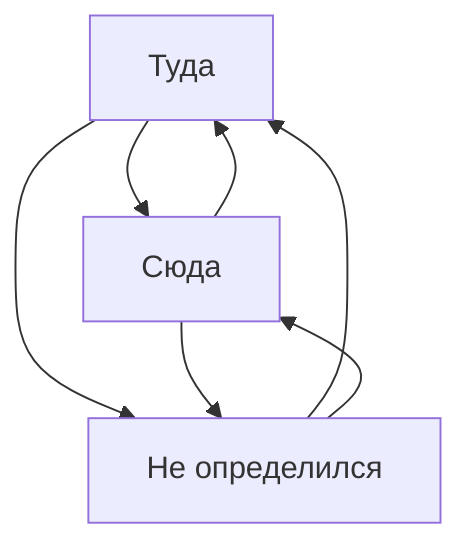

Библиотека модулей доступных для использования в Deckhouse.

Используйте фильтр по категориям слева для поиска модулей по их функциональности.

Пример:

```mermaid
graph TD
    A[Туда] --> B[Сюда]
    A --> C[Не определился]
    B --> A
    B --> C
    C --> A
    C --> B
```
