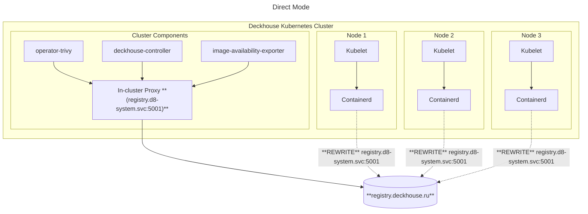

## Description

The module implements an internal container image registry. It allows you to use a local registry to optimize image downloading and storage, as well as to provide high availability and fault tolerance.

The module supports several operating modes, allowing it to be adapted to different usage scenarios.

The module operates in `Direct`, `Proxy`, and `Local` modes (currently, only the `Direct` mode is supported).

### Direct mode

In this mode, requests to the registry are processed directly, without intermediate caching.


To use the `Direct` mode, you must use the `Containerd` or `ContainerdV2` CRI on all cluster nodes.


Redirecting registry requests from the CRI is done using its settings, which are specified in the `containerd` configuration.

For components that access the registry directly, such as `operator-trivy`, `image-availability-exporter`, `deckhouse-controller`, and several others, requests will go through the In-Cluster Proxy located on the control plane nodes.

