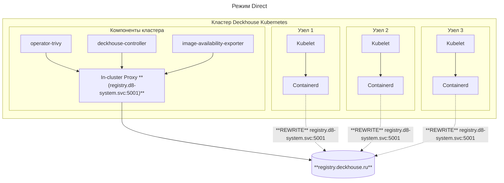

## Описание

Модуль реализует внутренний реестр container образов. Он позволяет использовать локальный реестр для оптимизации загрузки и хранения образов, а также обеспечивает высокую доступность и отказоустойчивость.

Существует несколько режимов работы модуля, которые позволяют адаптировать его под различные сценарии использования. 

Модуль реализует работу в режимах `Direct`, `Proxy` и `Local` (на данный момент поддерживается только режим `Direct`).

### Direct режим

В этом режиме запросы к реестру обрабатываются напрямую, без промежуточного кэширования.


Для работы режима `Direct` необходимо использовать CRI `Containerd` или `ContainerdV2` на всех узлах кластера.


Перенаправление запросов к registry от CRI осуществляется при помощи его настроек, которые прописываются в конфигурации `containerd`.

В случае компонентов, обращающихся к реестру напрямую, таких как `operator-trivy`, `image-availability-exporter`, `deckhouse-controller` и ряда других, обращения будут идти через In-Cluster Proxy, расположенный на узлах control plane.



<!--
## Основные функции

Модуль `embedded-registry` предоставляет возможность использования внутреннего Docker registry для хранения Docker образов компонентов Deckhouse. Ключевые функции:

- **Управление жизненным циклом компонентов `embedded-registry`**:
  - Настройка и reconcile компонентов `embedded-registry` для поддержания Registry в соответствия заданной конфигурации.
  - **TODO**: Создание и управление учетными записями пользователей `embedded-registry` (`ro` и `rw` пользователи).
  - Обновление сертификатов для внутренних компонентов `embedded-registry`.
  - **TODO**: Выполнение проверок при переключении между режимами работы (`Mirror` и `Proxy` режимы).
  - Проверка доступности и работоспособности `upstream registry` при переключении между различными upstream источниками в `Proxy` режиме.
  - **TODO**: Переключение в режим работы `HA` (`High Availability`), для повышения надежности и отказоустойчивости (доступно в `Proxy` режиме).

- **Управление образами для Mirror режима**:
  - Ротация образов для старых релизов (доступно в `Mirror` режиме). Позволяет удалять неиспользуемые образы прошлых релизов, тем самым оптимизируя использование хранилища и поддерживая актуальность данных в registry.

## Компоненты

- **embedded-registry-manager** - контроллер осуществляющий управление компонентами `embedded-registry`, который запускается на всех master-узлах кластера (узлы с лейблом `nnode-role.kubernetes.io/master: ""`). Контроллер предназначенный для развертывания `embedded-registry` и поддержки конфигурации registry в актуальном состоянии.

- **embedded-registry** - **TODO**(что управляется manager-ом): static pod комопнент выполняющий функцию хранилища docker образов, построенный на базе [docker distribution](https://github.com/distribution/distribution) и [docker auth](https://github.com/cesanta/docker_auth).

## Режимы работы

Модуль предоставляет 2 возможных режима работы: `Proxy` и `Mirror`.

- **TODO: Detauch**

- **Proxy** режим используется для кэширования образов, скачиваемых из удалённого реестра (`upstream registry`). Данный режим позволяет `embedded-registry` выступать в качестве промежуточного прокси-сервера между клиентом и удалённым реестром, оптимизируя доступ к часто используемым образам и уменьшая нагрузку на сеть.
   Основные особенности:
  - Кэширование образов: При первом запросе образ загружается из удалённого реестра и сохраняется в локальном кэше. При повторных запросах образ будет загружаться из локального реестра, что увеличивает скорость раздачи
  - Снижение нагрузки на внешнюю сеть: Кэширование уменьшает количество обращений к удалённым серверам для часто используемых образов.

   Пример конфигурации:

   ```yaml
   apiVersion: deckhouse.io/v1alpha1
   kind: ModuleConfig
   metadata:
     name: registry
   spec:
     version: 1
     enabled: true
     settings:
       mode: Proxy
       proxy:
         host: registry.deckhouse.ru
         scheme: https
         path: /deckhouse/ee
         password: "password"
         user: "user"
   ```


**Обратите внимание!** Перед применением ModuleConfig следует обратить внимание на раздел [FAQ](./faq.html) и [Примеры](./examples.html)


- **Mirror** режим позволяет создавать локальную копию registry внутри кластера. Образы из удалённого реестра полностью скопированы в локальное хранилище.
   Основные особенности:
  - Автономность: Возможность работы в изолированных средах, где требуется минимизировать зависимость от внешних сервисов. Полная автономность обеспечивает большую устойчивость к сбоям и доступность регистри независимо от состояния внешних ресурсов.
  - Снижение нагрузки на внешнюю сеть: Снижает нагрузку на внешние сети, так как все операции с образами происходят внутри кластера.

   Пример конфигурации:

   ```yaml
   apiVersion: deckhouse.io/v1alpha1
   kind: ModuleConfig
   metadata:
     name: embedded-registry
   spec:
     version: 1
     enabled: true
     settings:
       mode: Detached
       detached:
   ```


**Обратите внимание!** Перед применением ModuleConfig следует обратить внимание на раздел [FAQ](./faq.html) и [Примеры](./examples.html)

-->
