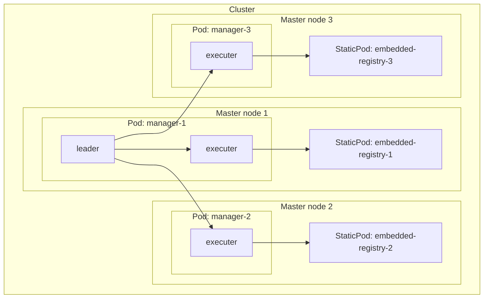
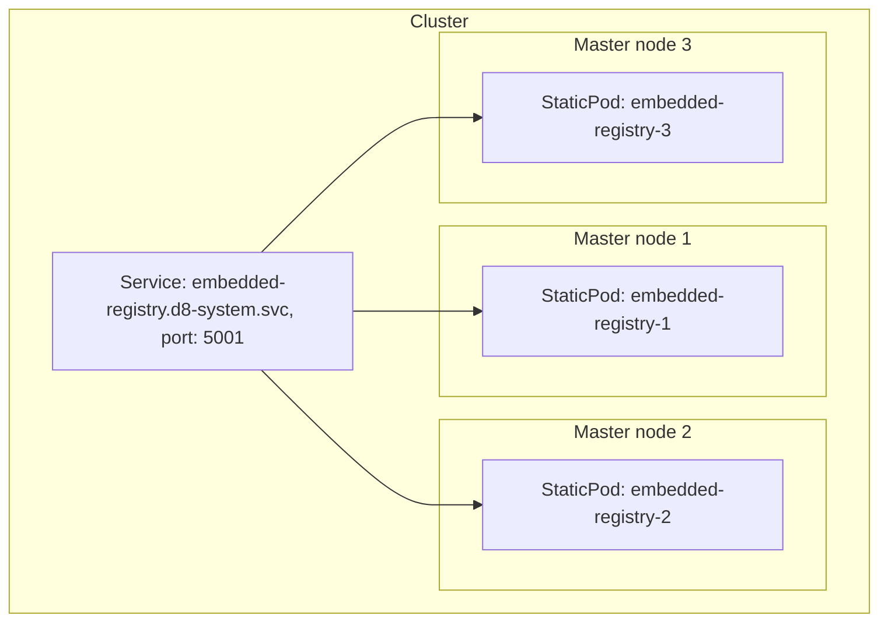

The module consists of the `embedded-registry-manager` daemonset, which includes:

- **Leader**: The manager, only one is elected.
- **Executer**: Runs on each pod of the daemonset.

During the manager's startup:
- It checks for the presence of secrets for `ro` and `rw` users. If they don't exist, it creates them.
- It checks for the `pki` secret with CA certificates for the internal registry. If it's not present, it creates it.
- It checks for `pki` secrets with certificates for each static pod. If they don't exist, it creates them.
- It subscribes to the above secrets and `moduleConfig`, monitoring their changes.

Depending on the configuration, it creates static pods on the master nodes.

To access the registry from within the cluster, the service `embedded-registry.d8-system.svc` is used.

