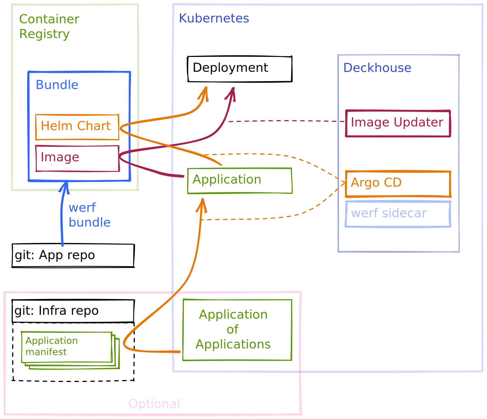

- [Дисклеймер](#дисклеймер)
- [Концепция](#концепция)
- [Конфигурация с WerfSource CRD](#конфигурация-с-werfsource-crd)
- [Публикация артефакта в registry](#публикация-артефакта-в-registry)
- [Автообновление бандла](#автообновление-бандла)
  - [Правила обновлений образов](#правила-обновлений-образов)
  - [Настройки доступа к registry](#настройки-доступа-к-registry)
    - [Индивидуальная настройка для Application](#индивидуальная-настройка-для-application)
- [Особенности аутентификации командной утилиты `argocd`](#особенности-аутентификации-командной-утилиты-argocd)
  - [Пользователь Argo CD](#пользователь-argo-cd)
  - [kubectl](#kubectl)
  - [Dex — не работает](#dex--не-работает)
- [Частичное использование WerfSource CRD](#частичное-использование-werfsource-crd)
  - [Без репозитория Argo CD](#без-репозитория-argo-cd)
    - [Как  самостоятельно создать репозиторий Argo CD для OCI-регистри](#как--самостоятельно-создать-репозиторий-argo-cd-для-oci-регистри)
      - [Argo CD CLI](#argo-cd-cli)
      - [Веб-интерфейс и kubectl](#веб-интерфейс-и-kubectl)
  - [Без регистри для Image Updater](#без-регистри-для-image-updater)

## Дисклеймер

Мы ожидаем, что читатель знаком с Argo CD, поэтому далее описываем особенности его работы в поставке
с Deckhouse.

Данные, которые используются в примерах ниже:

- Веб-интерфейс и API Argo CD доступны на адресе `https://argocd.example.com`. Это предполагает, что
  параметр `publicDomainTemplate` выставлен в `%s.example.com`.
- `APP_NAME=myapp` — название приложения.
- `CHART_NAME=mychart` — название Helm-чарта и werf-бандла, в этой схеме они должны
  совпадать. Для явности мы выбрали это название отличным от названия приложения.
- `REGISTRY_HOST=cr.example.com` — хостнейм OCI-регистри.
- `REGISTRY_REPO=cr.example.com/myproject` — репозиторий бандла в OCI-регистри.

## Концепция

Модуль предлагает способ развертывания приложений с помощью связки
[werf bundle](https://werf.io/documentation/v1.2/advanced/bundles.html#bundles-publication)
и [OCI-based registries](https://helm.sh/docs/topics/registries/).

Преимущество этого подхода заключается в том, что есть единое место доставки артефакта — container
registry. Артефакт содержит в себе как образы контейнеров, так и Helm-чарт. Он используется как для
первичного деплоя приложения, так и для автообновлений по pull-модели.

Используемые компоненты:

- Argo CD
- Argo CD Image Updater с [патчем для поддержки OCI-репозиториев](https://github.com/argoproj-labs/argocd-image-updater/pull/405)
- werf-argocd-cmp-sidecar, чтобы сохранить аннотации werf во время рендеринга манифестов

Чтобы использовать OCI-регистри как репозиторий, в параметрах репозитория Argo CD нужно использовать
флаг `enableOCI=true`. Модуль delivery его устанавливает автоматически.

Чтобы автоматически обновлять приложения в кластере после доставки артефакта, используется ArgoCD
Image Updater. Мы используем наш
[патч](https://github.com/argoproj-labs/argocd-image-updater/pull/405), чтобы Image Updater
мог работать с werf-бандлами.

Ниже приведена схема с паттерном [«Application of
Applications»](https://argo-cd.readthedocs.io/en/stable/operator-manual/cluster-bootstrapping/#app-of-apps-pattern),
подразумевающая два git-репозитория: для приложения и для инфраструктуры. Инфраструктурный
git-репозиторий и паттерн Application of Applications необязательны, если допускается создавать
ресурсы Application вручную. Для простоты, в примерах ниже мы будем придерживаться ручного управления
ресурсами Application.



## Конфигурация с WerfSource CRD

Чтобы использовать ArgoCD и Image Updater, достаточно настроить доступ к регистри и сам Application.
Доступ к регистри нужен в двух местах — в репозитории Argo CD и в конфигурации Argo CD
Image Updater. Для этого нужно сконфигурировать:

1. Секрет для доступа к регистри.
2. Объект Application с конфигурацией приложения.
3. Регистри для Image Updater в его configmap, в нем будет ссылка на секрет (1) для регистри.
4. Секрет репозитрия Argo CD, в нем будет копия параметров доступа из секрета (1).

Данный модуль упрощает конфигурацию для использования werf bundle и Argo CD. Упрощение касается двух
объектов: репозитория Argo CD и конфигурации регистри для Image Updater. Эта конфигурация задается
одним ресурсов WerfBundle. Поэтому в рамках модуля нужно определить конфигурацию в трех местах:

1. Смекрет для доступа к регистри в формате `dockerconfigjson`.
2. Объект Application с конфигурацией приложения.
3. Объект WerfSource в котором содержится информация о регистри и ссылка на секрет (1) для доступа.

Таким образом, для деплоя из OCI-репозитория нужно создать три объекта. Все объекты, предполагающие
область видимости namespace, должны быть созданы в namespace `d8-delivery`. Пример:

```yaml
---
apiVersion: deckhouse.io/v1alpha1
kind: WerfSource
metadata:
  name: example
spec:
  imageRepo: cr.example.io/myproject  # репозиторий бандлов и образов
  pullSecretName: example-registry    # секрет с доступом
---
apiVersion: v1
kind: Secret
metadata:
  namespace: d8-delivery              # namespace модуля
  name: example-registry
type: kubernetes.io/dockerconfigjson  # поддерживается только этот тип секретов
data:
  .dockerconfigjson: ...
---
apiVersion: argoproj.io/v1alpha1
kind: Application
metadata:
  annotations:
    argocd-image-updater.argoproj.io/chart-version: ~ 0.0
  name: myapp
  namespace: d8-delivery  # неймспейс модуля
spec:
  destination:
    namespace: myapp
    server: https://kubernetes.default.svc
  project: default
  source:
    chart: mychart                    # бандл — cr.example.com/myproject/mychart
    helm: {}
    repoURL: cr.example.com/myproject # репозиторий Argo CD из WerfBundle
    targetRevision: 1.0.0
  syncPolicy:
    automated:
      prune: true
      selfHeal: true
    syncOptions:
    - CreateNamespace=true
```


## Публикация артефакта в registry

OCI-чарт хельма требует, чтобы имя чарта в `Chart.yaml` совпадало с последним элементом пути
в OCI-registry. Поэтому название чарта необходимо использовать в названии бандла:

```sh
werf bundle publish --repo cr.example.com/myproject/mychart --tag 1.0.0
```

Подробнее о бандлах — в документации werf: [подготовка
артефактов релиза](https://ru.werf.io/documentation/v1.2/advanced/ci_cd/werf_with_argocd/configure_ci_cd.html).


## Автообновление бандла

ArgoCD Image Updater используется для автоматического обновления Application из опубликованного
werf-бандла в pull-модели. Image Updater сканирует OCI-репозиторий с заданным интервалом и обновляет
`targetRevision` в Application, посредством чего обновляется всё приложение из обновленного
артефакта. Мы используем пропатченный форк Image Updater, который умеет работать с OCI-регистри, и,
соответственно, с werf-бандлами.

### Правила обновлений образов

В Application нужно добавить аннотацию с правилами обновления образа
([документация](https://argocd-image-updater.readthedocs.io/en/stable/basics/update-strategies/)).
Пример правила, обновляющего патч-версии приложения (`1.0.*`):

```yaml
apiVersion: argoproj.io/v1alpha1
kind: Application
metadata:
  annotations:
    argocd-image-updater.argoproj.io/chart-version: ~ 1.0
```

### Настройки доступа к registry

У сервис-аккаунта `argocd-image-updater` есть права на работу с ресурсами только в namespace'е
`d8-delivery`, поэтому именно в нем необходимо создать Secret с параметрами доступа к регистри, на
который ссылается поле `credetials`.

#### Индивидуальная настройка для Application

Сослаться на параметры доступа можно индивидуально в каждом Application с помощью аннотации:

```yaml
apiVersion: argoproj.io/v1alpha1
kind: Application
metadata:
  annotations:
    argocd-image-updater.argoproj.io/chart-version: ~ 1.0
    argocd-image-updater.argoproj.io/pull-secret: pullsecret:d8-delivery/example-registry
```

## Особенности аутентификации командной утилиты `argocd`

### Пользователь Argo CD

Задайте username и password в конфигурации Argo CD или используйте пользователя `admin`. `admin` по
умолчанию выключен, поэтому его необходимо включить:

Откройте конфиг

```sh
kubectl edit mc delivery
```

Установите `spec.settings.argocd.admin.enabled=true`

```yaml
apiVersion: deckhouse.io/v1alpha1
kind: ModuleConfig
metadata:
  name: delivery
  # (...)
spec:
  enabled: true
  settings:
    argocd:
      admin:
        enabled: true
  version: 1
```

### kubectl

Если настроен внешний доступ к Kubernetes API
([настройка publishAPI](../../modules/150-user-authn/configuration.html#параметры)), то `argocd`
может использовать запросы к kube-apiserver:

```sh
argocd login argocd.example.com --core
```

Утилита `argocd` [не позволяет указывать namespace](https://github.com/argoproj/argo-cd/issues/9123)
во время вызова и рассчитывает на установленное значение в `kubectl`. Модуль с ArgoCD в Deckhouse
находится в namespace `d8-delivery`. Поэтому на время работы с argocd нужно переключиться в него по
умолчанию:

```sh
# временно переключите namespace по умолчанию
$ kubectl config set-context --current --namespace=d8-delivery
```

### Dex

Авторизация через Dex не работает для CLI, но работает в веб-интерфейсе.

```sh
argocd login argocd.example.com --sso # не работает
```

## Частичное использование WerfSource CRD

### Без репозитория Argo CD

WerfSource отвечает за создание репозитория в Argo CD и за внесение регистри в конфигурацию
Image Updater. От создания репозитория можно отказаться в WerfSource, для этого нужно установить
параметр `spec.argocdRepoEnabled=false`. Это пригодится, если используется тип репозитория,
отличный от OCI, например Chart Museum или git:

```yaml
---
apiVersion: deckhouse.io/v1alpha1
kind: WerfSource
metadata:
  name: example
spec:
  # ...
  argocdRepoEnabled: false
```


#### Как самостоятельно создать репозиторий Argo CD для OCI-регистри

Регистри играет роль репозитория бандлов. Чтобы это работало, нужно в репозитории включить режим
OCI. Однако веб-интерфейс не позволяет установить флаг `enableOCI`, поэтому его нужно добавить вне веб-интерфейса.

##### Argo CD CLI

Утилита `argocd` поддерживает флаг `--enable-oci`:

```sh
$ argocd repo add cr.example.com/myproject \
  --enable-oci \
  --type helm \
  --name REPO_NAME \
  --username USERNAME \
  --password PASSWORD
```

##### Веб-интерфейс и kubectl

В существующий репозиторий недостающий флаг можно добавить вручную:

```sh
kubectl -n d8-delivery edit secret repo-....
```

```yaml
apiVersion: v1
kind: Secret
stringData:           # <----- добавить
  enableOCI: "true"   # <----- и сохранить
data:
  # (...)
metadata:
  # (...)
  name: repo-....
  namespace: d8-delivery
type: Opaque
```

### Без регистри для Image Updater

Регистри в `configmap/argocd-image-updater-config` могут быть настроены только через WerfSource,
потому что deckhouse генерирует этот ConfigMap, используя объекты WerfSource. Если этот способ не
подходит, то конфигурацию Image Updater можно задать при помощи аннотаций в каждом
Application индивидуально:

```yaml
apiVersion: argoproj.io/v1alpha1
kind: Application
metadata:
  annotations:
    argocd-image-updater.argoproj.io/chart-version: ~ 1.0
    argocd-image-updater.argoproj.io/pull-secret: pullsecret:d8-delivery/example-registry
```
