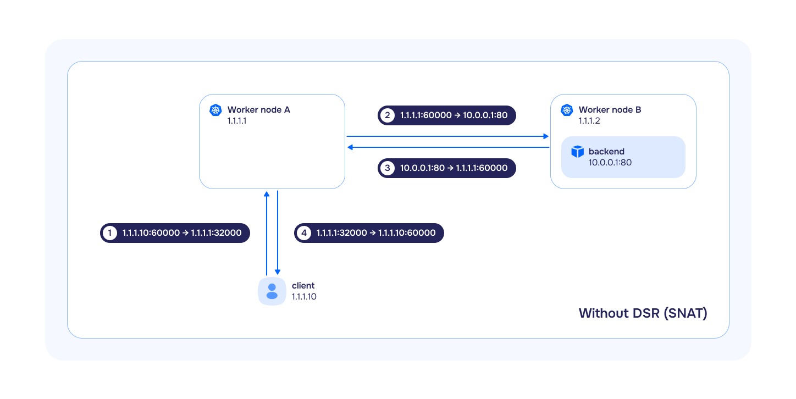
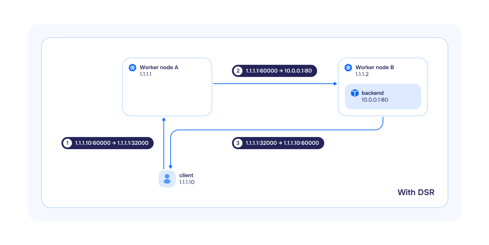

The `cni-cilium module` provides a network in a cluster. It is based on the [Cilium](https://cilium.io/) project.

## Limitations

1. Services with type `NodePort` and `LoadBalancer` are incompatible with hostNetwork endpoints in LB mode `DSR`. Switch to `SNAT` mode if it is required.
2. `HostPort` pods only bind to [one IP address](https://github.com/deckhouse/deckhouse/issues/3035). If the OS has multiple interfaces/IP, Cilium will choose one, preferring `private` to `public`.
3. To ensure the stable operation of `cni-cilium` on cluster nodes, disable Elastic Agent or restrict its access to the Elastic management server. Elastic Agent includes an Elastic Endpoint component which uses the Extended Berkeley Packet Filter (eBPF) technology on cluster nodes and may remove critical eBPF programs required for `cni-cilium` to work correctly. For detailed information and discussion of the issue, refer to the publications of the [Cilium](https://github.com/cilium/cilium/issues/28433) and [Elastic](https://discuss.elastic.co/t/network-disruption-on-kubernetes-node-with-elastic-security-integration-on-debian/354202) projects.
4. Kernel requirements:
   * Linux kernel version not lower than `5.8` for the `cni-cilium` module to work and work together with the [istio](../istio/), [openvpn](../openvpn/) or [node-local-dns]({{ site.urls.ru}}/modules/../node-local-dns/) modules.
5. OS compatibility:
    * Ubuntu:
      * incompatible with version 18.04;
      * HWE kernel installation required for working with version 20.04.
    * CentOS:
      * for versions 7 and 8, a new kernel from the [repository](https://elrepo.org) is required.

## Handling external traffic in different `bpfLB` modes (replacing kube-proxy from Cilium)

Kubernetes typically uses schemes where traffic comes to a balancer that distributes it among many servers. Both incoming and outgoing traffic passes through the balancer. Thus, the total throughput is limited by the resources and channel width of the balancer. To optimize traffic and unload the balancer, the `DSR` mechanism was invented, in which incoming packets go through the balancer, and outgoing ones go directly from the terminating servers. Since responses are usually much larger in size than requests, this approach can significantly increase the overall throughput of the scheme.

To extend the capabilities, the module allows [selectable mode of operation](configuration.html#parameters-bpflbmode), which affects the behavior of `Service` with the `NodePort` and `LoadBalancer` types:

* `SNAT` (Source Network Address Translation) — is a subtype of NAT in which, for each outgoing packet, the source IP address is translated to the IP address of the gateway from the target subnet, and incoming packets passing through the gateway are translated back based on a translation table. In this mode, `bpfLB` fully replicates the logic of `kube-proxy`:
  * if `externalTrafficPolicy: Local` is specified in the `Service`, the traffic will be forwarded and balanced only to those target pods running on the same node where the traffic arrived. If the target pod is not running on this node, the traffic will be dropped.
  * if `externalTrafficPolicy: Cluster` is specified in the `Service`, the traffic will be forwarded and balanced to all target pods in the cluster. At the same time, if the target pods are located on other nodes, SNAT will be performed when transmitting traffic to them (the source IP address will be replaced with the InternalIP of the node).

   

* `DSR` (Direct Server Return) — is a method where all incoming traffic passes through the load balancer, and all outgoing traffic bypasses it. This method is used instead of `SNAT`. Often, responses are much larger than requests, and `DSR` can significantly increase the overall throughput of the scheme:
  * if `externalTrafficPolicy: Local` is specified in the `Service`, its behavior is completely analogous to `kube-proxy` and `bpfLB` in `SNAT` mode.
  * if `externalTrafficPolicy: Cluster` is specified in the `Service`, the traffic will be forwarded and balanced to all target pods in the cluster.
  It is important to take into account the following features:
    * if the target pods are on other nodes, then the source IP address will be preserved when incoming traffic is sent to them;
    * outgoing traffic will go directly from the node on which the target pod was launched;
    * the source IP address will be replaced with the external IP address of the node to which the incoming request **originally** came.

   


In case of using `DSR` and `Service` mode with `externalTrafficPolicy: Cluster` additional network environment settings are required.
Network equipment must be ready for asymmetric traffic flow: IP address anti-spoofing tools (`uRPF`, `sourceGuard`, etc.) must be disabled or configured accordingly.


* `Hybrid` — in this mode, TCP traffic is processed in `DSR` mode, and UDP in `SNAT` mode.

## Using CiliumClusterwideNetworkPolicies


Using CiliumClusterwideNetworkPolicies if the `policyAuditMode` option is absent in the cni-cilium module settings may lead to incorrect operation of Control plane or loss of SSH access to all cluster nodes.


Follow these steps to use CiliumClusterwideNetworkPolicies:

1. Apply the primary set of `CiliumClusterwideNetworkPolicy` objects. To do this, in the settings of the cni-cilium module add the configuration option [`policyAuditMode`](../cni-cilium/configuration.html#parameters-policyauditmode) with the value `true`.
The option can be removed after applying all `CiliumClusterwideNetworkPolicy` objects and verifying their functionality in Hubble UI.

1. Apply network security policy rule:

   ```yaml
   apiVersion: "cilium.io/v2"
   kind: CiliumClusterwideNetworkPolicy
   metadata:
     name: "allow-control-plane-connectivity"
   spec:
     ingress:
     - fromEntities:
       - kube-apiserver
     nodeSelector:
       matchLabels:
         node-role.kubernetes.io/control-plane: ""
   ```

If CiliumClusterwideNetworkPolicies are not used, the control plane may work incorrectly for up to a minute during the reboot of `cilium-agent` pods. This occurs due to [Conntrack table reset](https://github.com/cilium/cilium/issues/19367). Binding to the `kube-apiserver` entity helps to bypass the bug.

## Changing Cilium Operation Mode

When changing Cilium's operation mode (the [tunnelMode](configuration.html#parameters-tunnelmode) parameter) from `Disabled` to `VXLAN` or vice versa, it is necessary to reboot all nodes, otherwise, pod availability issues may occur.

## Disabling the kube-proxy Module

Cilium fully replaces the functionality of the `kube-proxy` module, so `kube-proxy` is automatically disabled when the `cni-cilium` module is enabled.

## Using selective load balancing algorithm for services

In Deckhouse Kubernetes Platform, you can apply the following algorithms to load balance service traffic:

* `Random`: Randomly select a backend for each connection. Easy to implement, but does not always provide even distribution.
* `Maglev`: Uses consistent hashing to distribute traffic evenly, suitable for large-scale services.
* `Least Connections`: Directs traffic to the backend with the lowest number of active connections, optimizing load for applications with long-lived connections.

By default, the **Random** balancing algorithm is set for all services. However, Deckhouse allows you to override the algorithm for individual services. To use a selective balancing algorithm for a specific service, follow these steps:

* Edit the `cni-cilium` module configuration in Deckhouse by enabling the [`extraLoadBalancerAlgorithmsEnabled`](configuration.html#parameters-extralbalgorithmsenabled) parameter. This activates support for service annotations for selective algorithms.
* In the service manifest, specify the `service.cilium.io/lb-algorithm` annotation with one of the values: `random`, `maglev`, or `least-conn`.


This mechanism requires Linux kernel version 5.15 or higher to work correctly.


## Using Egress Gateway

The feature is available only in the following Deckhouse Kubernetes Platform editions: SE+, EE.

Egress Gateway in Deckhouse Kubernetes Platform can be used in one of two modes: [Basic](#basic-mode) and [Mode with Virtual IP](#mode-with-virtual-ip). Use Custom Resource [EgressGateway](cr.html#egressgateway) (parameter `spec.sourceIP.node`) to select the mode.

### Basic mode

Pre-configured IP addresses are used on egress nodes.

<div data-presentation="presentations/egressgateway_base_en.pdf"></div>
<!--- Source: https://docs.google.com/presentation/d/1Gp8b82WQQnYr6te_zBROKnKmBicdhtX4SXNXDh3lB6Q/ --->

### Virtual IP mode

The ability to dynamically assign additional IP addresses to nodes is implemented.

<div data-presentation="presentations/egressgateway_virtualip_en.pdf"></div>
<!--- Source: https://docs.google.com/presentation/d/1jdn39uDFSraQIXVdrREBsRv-Lp4kPidhx4C-gvv1DVk/ --->
