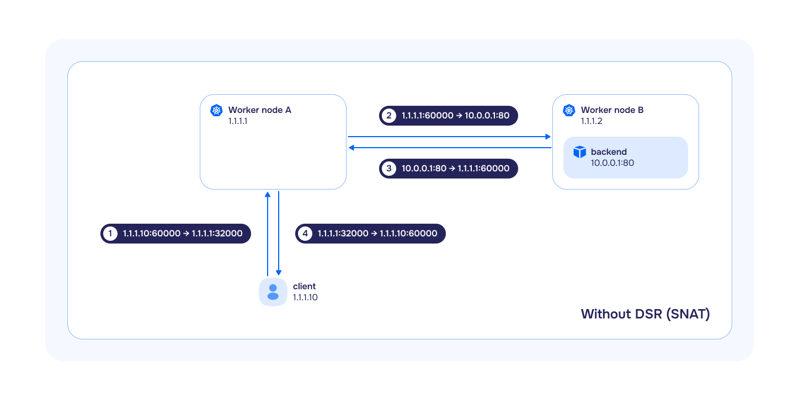

Модуль `cni-cilium` обеспечивает работу сети в кластере. Основан на проекте Cilium.

## Ограничения

1. Сервисам с типом `NodePort` и `LoadBalancer` не подходят эндпоинты в LB-режиме `DSR`, работающие с hostNetwork. Если это необходимо, переключитесь на режим `SNAT`.
1. Поды `HostPort` связываются только с одним IP-адресом. Если в ОС есть несколько интерфейсов/IP, Cilium выберет один, предпочитая «серые» «белым».
1. Для обеспечения стабильной работы `cni-cilium` на узлах кластера отключите Elastic Agent или ограничьте доступ этого агента к серверу управления Elastic. В состав Elastic Agent входит компонент Elastic Endpoint, который использует технологию Extended Berkeley Packet Filter (eBPF) на узлах кластера и может удалять критически важные eBPF-программы, необходимые для корректной работы `cni-cilium`. Детальная информация и обсуждение проблемы доступны в публикациях проектов Cilium.
1. Требования к ядру:
   * ядро Linux версии не ниже `5.8` для работы модуля `cni-cilium` и его совместной работы с модулями [istio](../istio/), [openvpn](/modules/openvpn/), [node-local-dns]({{ site.urls.ru}}/modules/../node-local-dns/).
1. Совместимость с ОС:
   * Ubuntu:
     * несовместим с версией 18.04;
     * для работы с версией 20.04 необходима установка ядра HWE.
   * Astra Linux:
     * несовместим с изданием «Смоленск».

## Обработка внешнего трафика в разных режимах работы `bpfLB` (замена kube-proxy от Cilium)

В Kubernetes обычно используются схемы, где трафик приходит на балансировщик, который распределяет его между многими серверами. Через балансировщик проходит и входящий, и исходящий трафик. Таким образом, общая пропускная способность ограничена ресурсами и шириной канала балансировщика. Для оптимизации трафика и разгрузки балансировщика и был придуман механизм `DSR`, в котором входящие пакеты проходят через балансировщик, а исходящие идут напрямую с терминирующих серверов. Так как обычно ответы имеют много больший размер чем запросы, то такой подход позволяет значительно увеличить общую пропускную способность схемы.

В модуле возможен [выбор режима работы](configuration.html#parameters-bpflbmode), влияющий на поведение `Service` с типом `NodePort` и `LoadBalancer`:

* `SNAT` (Source Network Address Translation) — один из подвидов NAT, при котором для каждого исходящего пакета происходит трансляция IP-адреса источника в IP-адрес шлюза из целевой подсети, а входящие пакеты, проходящие через шлюз, транслируются обратно на основе таблицы трансляций. В этом режиме `bpfLB` полностью повторяет логику работы `kube-proxy`:
  * если в `Service` указан `externalTrafficPolicy: Local`, то трафик будет передаваться и балансироваться только в те целевые поды, которые запущены на том же узле, на который этот трафик пришел. Если целевой под не запущен на этом узле, то трафик будет отброшен.
  * если в `Service` указан `externalTrafficPolicy: Cluster`, то трафик будет передаваться и балансироваться во все целевые поды в кластере. При этом, если целевые поды находятся на других узлах, то при передаче трафика на них будет произведен SNAT (IP-адрес источника будет заменен на InternalIP узла).

   

* `DSR` - (Direct Server Return) — метод, при котором весь входящий трафик проходит через балансировщик нагрузки, а весь исходящий трафик обходит его. Такой метод используется вместо `SNAT`. Часто ответы имеют много больший размер чем запросы и `DSR` позволяет значительно увеличить общую пропускную способность схемы:
  * если в `Service` указан `externalTrafficPolicy: Local`, то поведение абсолютно аналогично `kube-proxy` и `bpfLB` в режиме `SNAT`.
  * если в `Service` указан `externalTrafficPolicy: Cluster`, то трафик так же будет передаваться и балансироваться во все целевые поды в кластере.
  При этом важно учитывать следующие особенности:
    * если целевые поды находятся на других узлах, то при передаче на них входящего трафика будет сохранен IP-адрес источника;
    * исходящий трафик пойдет прямо с узла, на котором был запущен целевой под;
    * IP-адрес источника будет заменен на внешний IP-адрес узла, на которую изначально пришел входящий запрос.

   


В случае использования режима `DSR` и `Service` с `externalTrafficPolicy: Cluster` требуются дополнительные настройки сетевого окружения.
Сетевое оборудование должно быть готово к ассиметричному прохождению трафика: отключены или настроены соответствующим образом средства фильтрации IP адресов на входе в сеть (`uRPF`, `sourceGuard` и т.п.).


* `Hybrid` — в данном режиме TCP-трафик обрабатывается в режиме `DSR`, а UDP — в режиме `SNAT`.

## Использование CiliumClusterwideNetworkPolicies


Использование CiliumClusterwideNetworkPolicies при отсутствии опции `policyAuditMode` в настройках модуля cni-cilium может привести к некорректной работе Control plane или потере доступа ко всем узлам кластера по SSH.


Для использования CiliumClusterwideNetworkPolicies выполните следующие шаги:

1. Примените первичный набор объектов `CiliumClusterwideNetworkPolicy`. Для этого в настройки модуля cni-cilium добавьте конфигурационную опцию [`policyAuditMode`](/modules/cni-cilium/configuration.html#parameters-policyauditmode) со значением `true`.
Опция `policyAuditMode` может быть удалена после применения всех `CniliumClusterwideNetworkPolicy`-объектов и проверки корректности их работы в Hubble UI.

1. Примените правило политики сетевой безопасности:

   ```yaml
   apiVersion: "cilium.io/v2"
   kind: CiliumClusterwideNetworkPolicy
   metadata:
     name: "allow-control-plane-connectivity"
   spec:
     ingress:
     - fromEntities:
       - kube-apiserver
     nodeSelector:
       matchLabels:
         node-role.kubernetes.io/control-plane: ""
   ```

В случае, если CiliumClusterwideNetworkPolicies не будут использованы, Control plane может некорректно работать до одной минуты во время перезагрузки `cilium-agent`-подов. Это происходит из-за сброса Conntrack-таблицы. Привязка к entity `kube-apiserver` позволяет избежать проблемы.

## Смена режима работы Cilium

При смене режима работы Cilium (параметр [tunnelMode](configuration.html#parameters-tunnelmode)) c `Disabled` на `VXLAN` или обратно, необходимо перезагрузить все узлы, иначе возможны проблемы с доступностью подов.

## Выключение модуля kube-proxy

Cilium полностью заменяет собой функционал модуля `kube-proxy`, поэтому `kube-proxy` автоматически отключается при включении модуля `cni-cilium`.

## Использование выборочного алгоритма балансировки нагрузки для сервисов

В Deckhouse Platform Certified Security Edition для балансировки нагрузки трафика сервисов можно применять следующие алгоритмы:

* `Random` — случайный выбор бэкенда для каждого соединения. Прост в реализации, но не всегда обеспечивает равномерное распределение.
* `Maglev` — использует консистентное хеширование для равномерного распределения трафика, подходит для масштабных сервисов с множеством бэкендов, которые часто ротируются.
* `Least Connections` — направляет трафик на бэкенд с наименьшим количеством активных соединений, оптимизируя нагрузку для приложений с длительными соединениями.

По умолчанию для всех сервисов задан алгоритм балансировки **Random**. Однако Deckhouse позволяет переопределять алгоритм для отдельных сервисов. Чтобы использовать выборочный алгоритм балансировки для конкретного сервиса, выполните следующие шаги:

* Отредактируйте конфигурацию модуля `cni-cilium` в Deckhouse, включив параметр [`extraLoadBalancerAlgorithmsEnabled`](configuration.html#parameters-extralbalgorithmsenabled). Это активирует поддержку аннотаций сервисов для выборочных алгоритмов.
* В манифесте сервиса укажите аннотацию `service.cilium.io/lb-algorithm` с одним из значений: `random`, `maglev` или `least-conn`.


Для корректной работы данного механизма требуется версия ядра Linux 5.15 и выше.


## Использование Egress Gateway

Доступно в следующих редакциях Deckhouse Platform Certified Security Edition: SE+, EE, CSE Lite (1.67), CSE Pro (1.67).

Egress Gateway в Deckhouse Platform Certified Security Edition может быть использован в одном из двух режимов: [Базовый](#базовый-режим) и [Режим с Virtual IP](#режим-с-virtual-ip). Для выбора режима используйте ресурс [EgressGateway](cr.html#egressgateway) (параметр `spec.sourceIP.node`).

### Базовый режим

Используются предварительно настроенные IP-адреса на egress-узлах.

<div data-presentation="../../presentations/cni-cilium/egressgateway_base_ru.pdf"></div>


### Режим с Virtual IP

Реализована возможность динамически назначать дополнительные IP-адреса узлам.

<div data-presentation="../../presentations/cni-cilium/egressgateway_virtualip_ru.pdf"></div>

