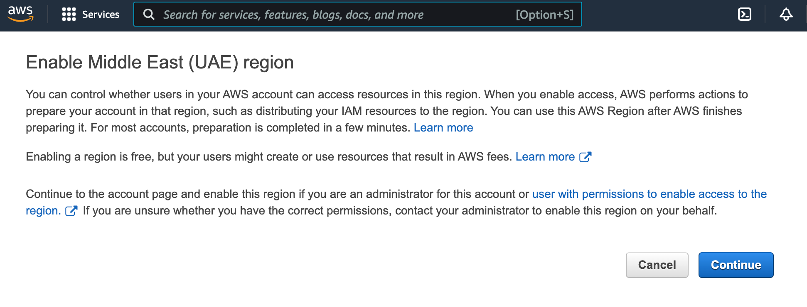



To use the `cloud-provider` and `machine-controller-manager` modules, you must access the AWS API as an IAM user with a sufficient set of privileges.


Make sure that you have access to the desired regions and that you have the necessary quotas.



The provider supports working with only one disk in the virtual machine template. Make sure the template contains only one disk.


## JSON Policy

First, prepare a JSON file with the configuration of the necessary privileges:

```json
{
    "Version": "2012-10-17",
    "Statement": [
        {
            "Sid": "VisualEditor0",
            "Effect": "Allow",
            "Action": [
                "autoscaling:DescribeAutoScalingGroups",
                "autoscaling:DescribeLaunchConfigurations",
                "autoscaling:DescribeTags",
                "ec2:AllocateAddress",
                "ec2:AssociateAddress",
                "ec2:AssociateRouteTable",
                "ec2:AttachInternetGateway",
                "ec2:AttachVolume",
                "ec2:AuthorizeSecurityGroupEgress",
                "ec2:AuthorizeSecurityGroupIngress",
                "ec2:CreateInternetGateway",
                "ec2:CreateKeyPair",
                "ec2:CreateNATGateway",
                "ec2:CreateRoute",
                "ec2:CreateRouteTable",
                "ec2:CreateSecurityGroup",
                "ec2:CreateSubnet",
                "ec2:CreateTags",
                "ec2:CreateVolume",
                "ec2:CreateVpc",
                "ec2:DeleteInternetGateway",
                "ec2:DeleteKeyPair",
                "ec2:DeleteNATGateway",
                "ec2:DeleteRoute",
                "ec2:DeleteRouteTable",
                "ec2:DeleteSecurityGroup",
                "ec2:DeleteSubnet",
                "ec2:DeleteTags",
                "ec2:DeleteVolume",
                "ec2:DeleteVpc",
                "ec2:DescribeAccountAttributes",
                "ec2:DescribeAddresses",
                "ec2:DescribeAddressesAttribute",
                "ec2:DescribeAvailabilityZones",
                "ec2:DescribeImages",
                "ec2:DescribeInstanceAttribute",
                "ec2:DescribeInstanceCreditSpecifications",
                "ec2:DescribeInstances",
                "ec2:DescribeInstanceTypes",
                "ec2:DescribeInstanceTopology",
                "ec2:DescribeInternetGateways",
                "ec2:DescribeKeyPairs",
                "ec2:DescribeNatGateways",
                "ec2:DescribeNetworkInterfaces",
                "ec2:DescribeRegions",
                "ec2:DescribeRouteTables",
                "ec2:DescribeSecurityGroups",
                "ec2:DescribeSecurityGroupRules",
                "ec2:DescribeSubnets",
                "ec2:DescribeTags",
                "ec2:DescribeVolumesModifications",
                "ec2:DescribeVolumes",
                "ec2:DescribeVpcAttribute",
                "ec2:DescribeVpcClassicLink",
                "ec2:DescribeVpcClassicLinkDnsSupport",
                "ec2:DescribeVpcs",
                "ec2:DetachInternetGateway",
                "ec2:DetachVolume",
                "ec2:DisassociateAddress",
                "ec2:DisassociateRouteTable",
                "ec2:ImportKeyPair",
                "ec2:ModifyInstanceAttribute",
                "ec2:ModifySubnetAttribute",
                "ec2:ModifyVolume",
                "ec2:ModifyVpcAttribute",
                "ec2:ReleaseAddress",
                "ec2:RevokeSecurityGroupEgress",
                "ec2:RevokeSecurityGroupIngress",
                "ec2:RunInstances",
                "ec2:TerminateInstances",
                "ec2:DescribeVpcPeeringConnections",
                "ec2:CreateVpcPeeringConnection",
                "ec2:DeleteVpcPeeringConnection",
                "ec2:AcceptVpcPeeringConnection",
                "ec2:CreateNetworkInterface",
                "ec2:DescribeNetworkInterfaceAttribute",
                "ec2:ModifyNetworkInterfaceAttribute",
                "ec2:DeleteNetworkInterface",
                "ec2:DescribeNetworkInterfaces",                
                "elasticloadbalancing:AddTags",
                "elasticloadbalancing:ApplySecurityGroupsToLoadBalancer",
                "elasticloadbalancing:AttachLoadBalancerToSubnets",
                "elasticloadbalancing:ConfigureHealthCheck",
                "elasticloadbalancing:CreateListener",
                "elasticloadbalancing:CreateLoadBalancer",
                "elasticloadbalancing:CreateLoadBalancerListeners",
                "elasticloadbalancing:CreateLoadBalancerPolicy",
                "elasticloadbalancing:CreateTargetGroup",
                "elasticloadbalancing:DeleteListener",
                "elasticloadbalancing:DeleteLoadBalancer",
                "elasticloadbalancing:DeleteLoadBalancerListeners",
                "elasticloadbalancing:DeleteTargetGroup",
                "elasticloadbalancing:DeregisterInstancesFromLoadBalancer",
                "elasticloadbalancing:DeregisterTargets",
                "elasticloadbalancing:DescribeListeners",
                "elasticloadbalancing:DescribeLoadBalancerAttributes",
                "elasticloadbalancing:DescribeLoadBalancerPolicies",
                "elasticloadbalancing:DescribeLoadBalancers",
                "elasticloadbalancing:DescribeTargetGroups",
                "elasticloadbalancing:DescribeTargetHealth",
                "elasticloadbalancing:DetachLoadBalancerFromSubnets",
                "elasticloadbalancing:ModifyListener",
                "elasticloadbalancing:ModifyLoadBalancerAttributes",
                "elasticloadbalancing:ModifyTargetGroup",
                "elasticloadbalancing:RegisterInstancesWithLoadBalancer",
                "elasticloadbalancing:RegisterTargets",
                "elasticloadbalancing:SetLoadBalancerPoliciesForBackendServer",
                "elasticloadbalancing:SetLoadBalancerPoliciesOfListener",
                "iam:AddRoleToInstanceProfile",
                "iam:CreateInstanceProfile",
                "iam:CreateRole",
                "iam:CreateServiceLinkedRole",
                "iam:DeleteInstanceProfile",
                "iam:DeleteRole",
                "iam:DeleteRolePolicy",
                "iam:GetInstanceProfile",
                "iam:GetRole",
                "iam:GetRolePolicy",
                "iam:ListInstanceProfilesForRole",
                "iam:ListRolePolicies",
                "iam:ListAttachedRolePolicies",
                "iam:PassRole",
                "iam:PutRolePolicy",
                "iam:RemoveRoleFromInstanceProfile",
                "iam:TagRole",
                "kms:DescribeKey",
                "sts:GetCallerIdentity"
            ],
            "Resource": "*"
        }
    ]
}
```

Below, you can find instructions on how to apply this policy.

## Configuring IAM via the web interface

In order to configure IAM via the web interface, first create a new Policy and apply the previously created JSON file to it:

1. Open `Identity and Access Management (IAM)`.
1. Open the `Policies` page and click `Create Policy`.
1. Select the `JSON` tab and insert the policy.
1. Click `Next: Tags`, then `Next: Review`.
1. Enter a policy name in the `Name` field (e.g., `D8CloudProviderAWS`).
1. Click `Create Policy`.

Then add a new user:

1. Open the `Users` page of IAM and click `Add users`.
1. Enter a name in the `User name` field (e.g., `deckhouse`).

And apply the created Policy to it:

1. Select `Access key - Programmatic access` in the `Select AWS credential type` area.
1. Click `Next: Permissions`.
1. Select the `Attach existing policies directly` tab.
1. Search (use the `Filter policies` field) for the policy name entered above (e.g., `D8CloudProviderAWS`) and click the checkbox next to it.
1. Click `Next: Tags`, then `Next: Review`.
1. Click `Create user`.

Save credentials (`Access key ID` and `Secret access key`).

> Make sure that you have access to the desired regions. Select the desired region from the dropdown list in the upper right corner.
>
> If there is a switch to the selected region, then there is access to the region.
>
> If there is no access to the region, then you will receive the following message (may differ):
>
> 
>
> In this case, click `Continue` to enable the region.

## Configuring IAM via the CLI

Create the `JSON specification` using the following command.

```bash
cat > policy.json << EOF
<Policy JSON spec>
EOF
```

Create a new Policy based on the specification created above with `D8CloudProviderAWS` as a policy name and the ARN identifier:

```shell
aws iam create-policy --policy-name D8CloudProviderAWS --policy-document file://policy.json
```

You will see the following:

```yaml
{
    "Policy": {
        "PolicyName": "D8CloudProviderAWS",
        "PolicyId": "AAA",
        "Arn": "arn:aws:iam::123:policy/D8CloudProviderAWS",
        "Path": "/",
        "DefaultVersionId": "v1",
        "AttachmentCount": 0,
        "PermissionsBoundaryUsageCount": 0,
        "IsAttachable": true,
        "CreateDate": "2020-08-27T02:52:06+00:00",
        "UpdateDate": "2020-08-27T02:52:06+00:00"
    }
}
```

Create a new user:

```shell
aws iam create-user --user-name deckhouse
```

You will see the following:

```yaml
{
    "User": {
        "Path": "/",
        "UserName": "deckhouse",
        "UserId": "AAAXXX",
        "Arn": "arn:aws:iam::123:user/deckhouse",
        "CreateDate": "2020-08-27T03:05:42+00:00"
    }
}
```

You need to allow access to the API and remember your `AccessKeyId` + `SecretAccessKey` values:

```shell
aws iam create-access-key --user-name deckhouse
```

You will see the following:

```yaml
{
    "AccessKey": {
        "UserName": "deckhouse",
        "AccessKeyId": "XXXYYY",
        "Status": "Active",
        "SecretAccessKey": "ZZZzzz",
        "CreateDate": "2020-08-27T03:06:22+00:00"
    }
}
```

Attach the specified `Policy` to the specified `User`:

```shell
aws iam attach-user-policy --user-name username --policy-arn arn:aws:iam::123:policy/D8CloudProviderAWS
```

## Configuring IAM via Terraform

An example of configuring IAM via Terraform:

```hcl
resource "aws_iam_user" "user" {
  name = "deckhouse"
}

resource "aws_iam_access_key" "user" {
  user = aws_iam_user.user.name
}

resource "aws_iam_policy" "policy" {
  name        = "D8CloudProviderAWS"
  path        = "/"
  description = "Deckhouse policy"

  policy = <<EOF
<JSON Policy>
EOF
}

resource "aws_iam_user_policy_attachment" "policy-attachment" {
  user       = aws_iam_user.user.name
  policy_arn = aws_iam_policy.policy.arn
}
```
