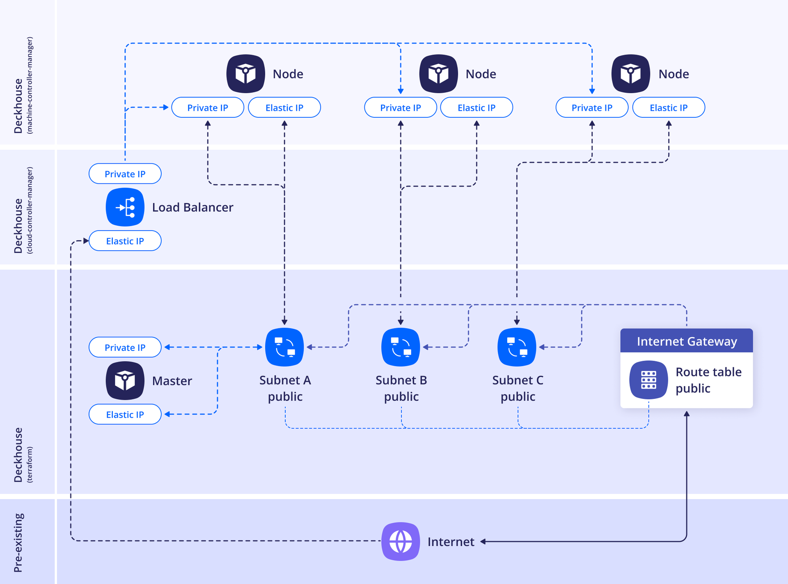
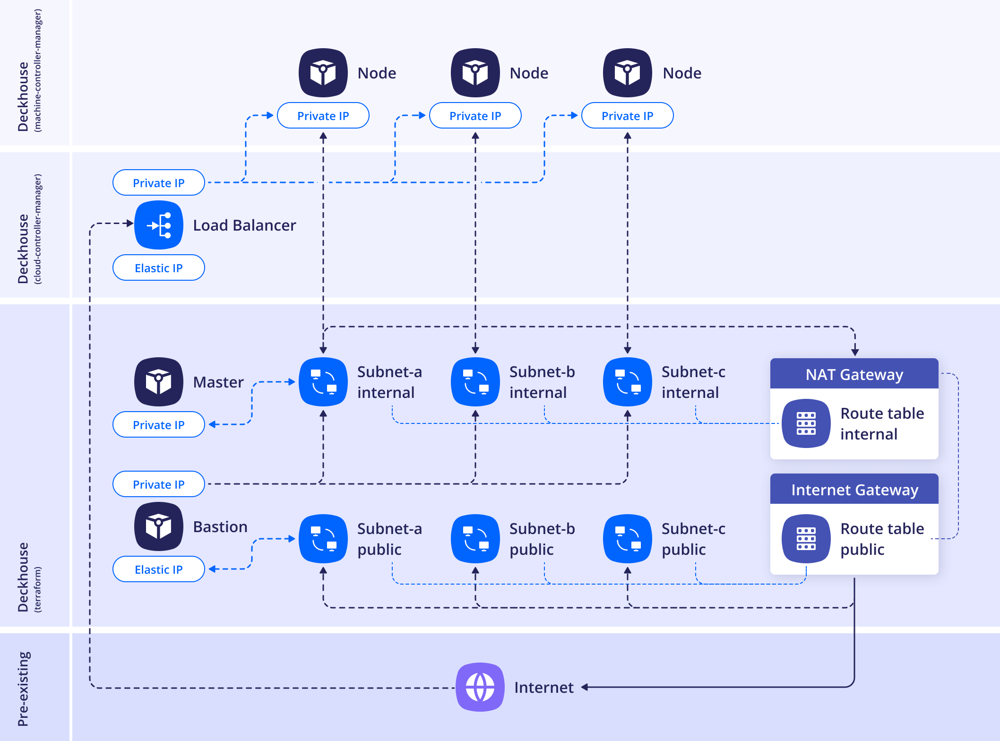

Поддерживаются две схемы размещения. Ниже подробнее о каждой их них.

## WithoutNAT

**Рекомендованная схема размещения.**

Каждому узлу присваивается публичный IP (ElasticIP). NAT не используется.


<!--- Исходник: https://www.figma.com/design/T3ycFB7P6vZIL359UJAm7g/%D0%98%D0%BA%D0%BE%D0%BD%D0%BA%D0%B8-%D0%B8-%D1%81%D1%85%D0%B5%D0%BC%D1%8B?node-id=995-10681&t=IvETjbByf1MSQzcm-0 --->

Если не задано [`disableDefaultSecurityGroup: true`](cluster_configuration.html#awsclusterconfiguration-disabledefaultsecuritygroup), при создании кластера модуль создаёт группы безопасности по умолчанию.

Будут созданы следующие группы и правила:

- `<prefix>-node` — назначается узлам кластера:
  - разрешение любого исходящего трафика в `0.0.0.0/0`;
  - разрешение любого входящего трафика от группы `<prefix>-loadbalancer`;
  - разрешение любого входящего трафика от узлов той же группы `<prefix>-node`;
  - разрешение входящего трафика по протоколу `ICMP` из CIDR, указанных в [`publicNetworkAllowList`](cluster_configuration.html#awsclusterconfiguration-publicnetworkallowlist) (по умолчанию `0.0.0.0/0`).
- `<prefix>-loadbalancer` — используется балансировщиками нагрузки:
  - разрешение любого входящего трафика из CIDR в [`publicNetworkAllowList`](cluster_configuration.html#awsclusterconfiguration-publicnetworkallowlist);
  - разрешение любого исходящего трафика к группе `<prefix>-node`.
- `<prefix>-ssh-accessible` — создаётся, если задан [`sshAllowList`](cluster_configuration.html#awsclusterconfiguration-sshallowlist); разрешает входящий трафик по протоколу `TCP` и порту 22 из указанных CIDR (по умолчанию `0.0.0.0/0`). Назначается master-узлам или bastion-хосту в схеме `WithNAT`.


При [`disableDefaultSecurityGroup: true`](cluster_configuration.html#awsclusterconfiguration-disabledefaultsecuritygroup) необходимо самостоятельно создать все необходимые группы безопасности и указать их в [`additionalSecurityGroups`](cluster_configuration.html#awsclusterconfiguration-masternodegroup-instanceclass-additionalsecuritygroups). Для балансировщиков нагрузки группы задаются аннотацией `service.beta.kubernetes.io/aws-load-balancer-security-groups`.


Собственные группы безопасности (созданные в облаке заранее) подключаются через [`additionalSecurityGroups`](cluster_configuration.html#awsclusterconfiguration-masternodegroup-instanceclass-additionalsecuritygroups):

- для master-узлов — в параметре [`masterNodeGroup.instanceClass.additionalSecurityGroups`](cluster_configuration.html#awsclusterconfiguration-masternodegroup-instanceclass-additionalsecuritygroups) ресурса [AWSClusterConfiguration](cluster_configuration.html#awsclusterconfiguration);
- для статических узлов — в параметре [`nodeGroups[].instanceClass.additionalSecurityGroups`](cluster_configuration.html#awsclusterconfiguration-nodegroups-instanceclass-additionalsecuritygroups) ресурса [AWSClusterConfiguration](cluster_configuration.html#awsclusterconfiguration);
- для эфемерных узлов — в параметре [`spec.additionalSecurityGroups`](cr.html#awsinstanceclass-v1-spec-additionalsecuritygroups) ресурса [AWSInstanceClass](cr.html#awsinstanceclass).

Пример конфигурации схемы размещения:

```yaml
apiVersion: deckhouse.io/v1
kind: AWSClusterConfiguration
layout: WithoutNAT
vpcNetworkCIDR: "10.241.0.0/16"
nodeNetworkCIDR: "10.241.32.0/20"
sshPublicKey: <SSH_PUBLIC_KEY>
provider:
  providerAccessKeyId: '<AWS_ACCESS_KEY>'
  providerSecretAccessKey: '<AWS_SECRET_ACCESS_KEY>'
  region: eu-central-1
masterNodeGroup:
  # Количество master-узлов.
  # Если указано больше одного master-узла, то etcd-кластер соберется автоматически.
  replicas: 1
  instanceClass:
    # Тип используемого инстанса.
    instanceType: m5.xlarge
    # ID образа виртуальной машины в Amazon.
    # Каталог AMI в консоли AWS: EC2 -> AMI Catalog.
    ami: ami-0aad10862ade98f27
    # Размер диска для виртуальной машины master-узла.
    diskSizeGb: 30
    # Используемый тип диска для виртуальной машины master-узла.
    diskType: gp3
nodeGroups:
  - name: mydb
    nodeTemplate:
      labels:
        node-role.kubernetes.io/mydb: ""
    replicas: 2
    instanceClass:
      instanceType: t2.medium
      ami: ami-0aad10862ade98f27
    additionalTags:
      backup: srv1
tags:
  team: torpedo
```

## WithNAT

> **Важно!** В данной схеме размещения необходим bastion-хост для доступа к узлам (его можно создать вместе с кластером, указав параметры в секции `withNAT.bastionInstance`).
>
> **Важно!** В этой схеме размещения NAT Gateway всегда создается в зоне `a`. Если узлы кластера будут заказаны в других зонах, при проблемах в зоне `a` они также будут недоступны. Другими словами, при выборе схемы размещения `WithNat` доступность всего кластера будет зависеть от работоспособности зоны `a`.

Виртуальные машины выходят в интернет через NAT Gateway с общим и единственным IP-адресом.


<!--- Исходник: https://www.figma.com/design/T3ycFB7P6vZIL359UJAm7g/%D0%98%D0%BA%D0%BE%D0%BD%D0%BA%D0%B8-%D0%B8-%D1%81%D1%85%D0%B5%D0%BC%D1%8B?node-id=995-9864&t=IvETjbByf1MSQzcm-0 --->

Если не задано [`disableDefaultSecurityGroup: true`](cluster_configuration.html#awsclusterconfiguration-disabledefaultsecuritygroup), при создании кластера модуль создаёт группы безопасности по умолчанию.

Будут созданы следующие группы и правила:

- `<prefix>-node` — назначается узлам кластера:
  - разрешение любого исходящего трафика в `0.0.0.0/0`;
  - разрешение любого входящего трафика от группы `<prefix>-loadbalancer`;
  - разрешение любого входящего трафика от узлов той же группы `<prefix>-node`;
  - разрешение входящего трафика по протоколу `ICMP` из CIDR, указанных в [`publicNetworkAllowList`](cluster_configuration.html#awsclusterconfiguration-publicnetworkallowlist) (по умолчанию `0.0.0.0/0`).
- `<prefix>-loadbalancer` — используется балансировщиками нагрузки:
  - разрешение любого входящего трафика из CIDR в [`publicNetworkAllowList`](cluster_configuration.html#awsclusterconfiguration-publicnetworkallowlist);
  - разрешение любого исходящего трафика к группе `<prefix>-node`.
- `<prefix>-ssh-accessible` — создаётся, если задан [`sshAllowList`](cluster_configuration.html#awsclusterconfiguration-sshallowlist); разрешает входящий трафик по протоколу `TCP` и порту 22 из указанных CIDR (по умолчанию `0.0.0.0/0`). Назначается master-узлам или bastion-хосту в схеме `WithNAT`.


При [`disableDefaultSecurityGroup: true`](cluster_configuration.html#awsclusterconfiguration-disabledefaultsecuritygroup) необходимо самостоятельно создать все необходимые группы безопасности и указать их в [`additionalSecurityGroups`](cluster_configuration.html#awsclusterconfiguration-masternodegroup-instanceclass-additionalsecuritygroups). Для балансировщиков нагрузки группы задаются аннотацией `service.beta.kubernetes.io/aws-load-balancer-security-groups`.


Собственные группы безопасности (созданные в облаке заранее) подключаются через [`additionalSecurityGroups`](cluster_configuration.html#awsclusterconfiguration-masternodegroup-instanceclass-additionalsecuritygroups):

- для master-узлов — в параметре [`masterNodeGroup.instanceClass.additionalSecurityGroups`](cluster_configuration.html#awsclusterconfiguration-masternodegroup-instanceclass-additionalsecuritygroups) ресурса [AWSClusterConfiguration](cluster_configuration.html#awsclusterconfiguration);
- для статических узлов — в параметре [`nodeGroups[].instanceClass.additionalSecurityGroups`](cluster_configuration.html#awsclusterconfiguration-nodegroups-instanceclass-additionalsecuritygroups) ресурса [AWSClusterConfiguration](cluster_configuration.html#awsclusterconfiguration);
- для эфемерных узлов — в параметре [`spec.additionalSecurityGroups`](cr.html#awsinstanceclass-v1-spec-additionalsecuritygroups) ресурса [AWSInstanceClass](cr.html#awsinstanceclass).

Пример конфигурации схемы размещения:

```yaml
apiVersion: deckhouse.io/v1
kind: AWSClusterConfiguration
layout: WithNAT
provider:
  providerAccessKeyId: '<AWS_ACCESS_KEY>'
  providerSecretAccessKey: '<AWS_SECRET_ACCESS_KEY>'
  region: eu-central-1
withNAT:
  bastionInstance:
    zone: eu-central-1a
    instanceClass:
      instanceType: m5.large
      ami: ami-0aad10862ade98f27
      diskType: gp3
masterNodeGroup:
  # Количество master-узлов.
  # Если указано больше одного master-узла, etcd-кластер соберется автоматически.
  replicas: 1
  instanceClass:
    # Тип используемого инстанса.
    instanceType: m5.xlarge
    # ID образа виртуальной машины в Amazon.
    # Каталог AMI в консоли AWS: EC2 -> AMI Catalog.
    ami: ami-0aad10862ade98f27
    # Размер диска для виртуальной машины master-узла.
    diskSizeGb: 30
    # Используемый тип диска для виртуальной машины master-узла.
    diskType: gp3
nodeGroups:
  - name: mydb
    nodeTemplate:
      labels:
        node-role.kubernetes.io/mydb: ""
    replicas: 2
    instanceClass:
      instanceType: t2.medium
      ami: ami-0aad10862ade98f27
    additionalTags:
      backup: me
vpcNetworkCIDR: "10.241.0.0/16"
nodeNetworkCIDR: "10.241.32.0/20"
sshPublicKey: "<SSH_PUBLIC_KEY>"
tags:
  team: torpedo
```
