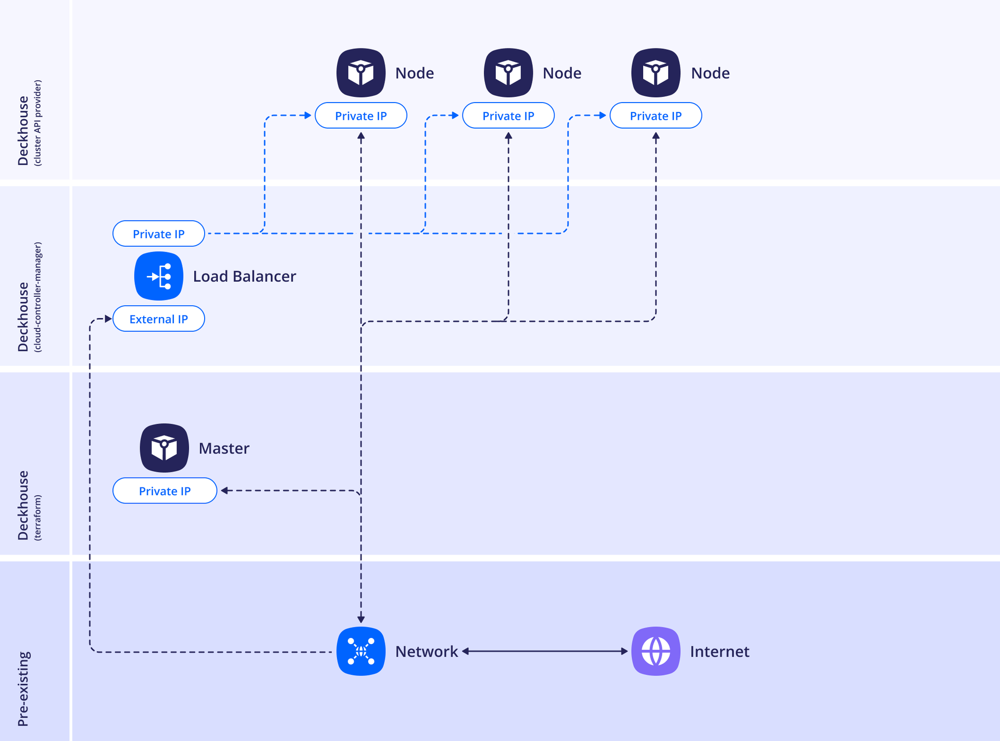

## Standard


<!--- Исходник: https://www.figma.com/design/T3ycFB7P6vZIL359UJAm7g/%D0%98%D0%BA%D0%BE%D0%BD%D0%BA%D0%B8-%D0%B8-%D1%81%D1%85%D0%B5%D0%BC%D1%8B?node-id=1314-7740&t=5VUUyoMpasR1vVxZ-4 --->

Пример конфигурации схемы размещения:

```yaml
apiVersion: deckhouse.io/v1alpha1
kind: ModuleConfig
metadata:
  name: cloud-provider-dvp
spec:
  version: 2
  enabled: true
  settings:
    nodes:
      parameters:
        layout: Standard
        sshPublicKey: <SSH_PUBLIC_KEY>
        ipAddresses:
          master:
            - Auto
    provider:
      parameters:
        namespace: demo
---
apiVersion: v1
kind: Secret
metadata:
  name: d8-credentials
  namespace: d8-cloud-provider-dvp
type: cloud-provider.deckhouse.io/credentials
stringData:
  authScheme: kubeconfig
  secret: <KUBE_CONFIG_BASE64>
---
apiVersion: deckhouse.io/v1alpha1
kind: DVPInstanceClass
metadata:
  name: master
spec:
  virtualMachine:
    cpu:
      cores: 4
      coreFraction: 100%
    memory:
      size: 8Gi
    virtualMachineClassName: generic
  rootDisk:
    size: 50Gi
    storageClass: ceph-pool-r2-csi-rbd-immediate
    image:
      kind: ClusterVirtualImage
      name: ubuntu-2204
  etcdDisk:
    size: 15Gi
    storageClass: ceph-pool-r2-csi-rbd-immediate
---
apiVersion: deckhouse.io/v1
kind: NodeGroup
metadata:
  name: master
spec:
  nodeType: CloudPermanent
  cloudInstances:
    classReference:
      kind: DVPInstanceClass
      name: master
    maxPerZone: 1
    minPerZone: 1
  nodeTemplate:
    labels:
      node-role.kubernetes.io/control-plane: ""
      node-role.kubernetes.io/master: ""
```
