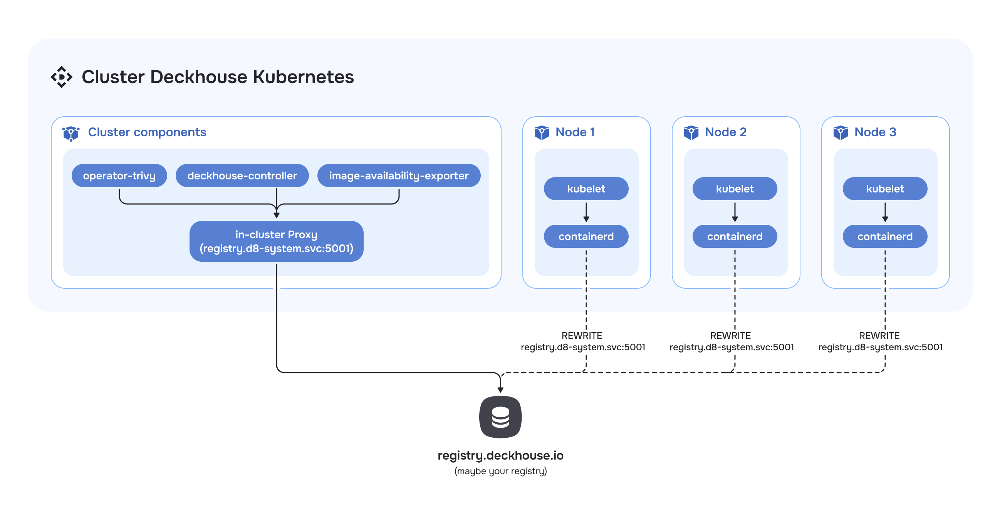

## Description

The module manages the configuration of the registry of Deckhouse components and provides an internal container image storage (container registry, registry).

The internal registry allows for optimizing the downloading and storage of images, as well as helping to ensure availability and fault tolerance for Deckhouse Kubernetes Platform.

The module can operate in the following modes:

- `Direct` — enables the internal container image registry. Access to the internal registry is performed via the fixed address `registry.d8-system.svc:5001/system/deckhouse`. This fixed address allows Deckhouse images to avoid being re-downloaded and components to avoid being restarted when registry parameters change. Switching between modes and registries is done through the `deckhouse` ModuleConfig. The switching process is automatic — see the [usage examples](examples.html) for more information.
- `Unmanaged` — operation without using the internal registry. Access within the cluster is performed directly to the external registry.
  There are two types of the `Unmanaged` mode:
  - Configurable — a mode managed via the `registry` module. Switching between modes and registries is handled through the ModuleConfig of `deckhouse`. The switch is performed automatically (see [usage examples](examples.html) for details).
  - Non-configurable (deprecated) — the default mode. Configuration parameters are set during [cluster installation](/products/kubernetes-platform/documentation/v1/reference/api/cr.html#initconfiguration-deckhouse-imagesrepo) or [changed in a running cluster](/products/kubernetes-platform/documentation/v1/admin/configuration/registry/third-party.html) using the (deprecated) `helper change registry` command.

## Restrictions and features of using the module

The `registry` module has a number of limitations and features related to installation, operating conditions, and mode switching.

### Cluster installation limitations

DKP cluster bootstrap is only supported in non-configurable `Unmanaged` mode. Registry settings during bootstrap are specified through [initConfiguration](/products/kubernetes-platform/documentation/v1/reference/api/cr.html#initconfiguration-deckhouse-imagesrepo).

Registry configuration via the `deckhouse` moduleConfig during DKP cluster bootstrap is not supported.

### Operating conditions restrictions

The module works under the following conditions:

- If CRI containerd or containerd v2 is used on the cluster nodes. To configure CRI, refer to the [ClusterConfiguration](/products/kubernetes-platform/documentation/v1/reference/api/cr.html#clusterconfiguration-defaultcri) configuration.
- The cluster is fully managed by DKP. The module will not work in Managed Kubernetes clusters.

### Mode switching restrictions

Mode switching restrictions are as follows:

- For the first switch, migration of user registry configurations must be performed. For more details, see the [Registry Module: FAQ](./faq.html) section.
- Switching to the non-configurable `Unmanaged` mode is only available from the `Unmanaged` mode. For more details, see the [Registry Module: FAQ](./faq.html) section.

## Direct Mode Architecture

In Direct mode, registry requests are processed directly, without intermediate caching.

CRI requests to the registry are redirected based on its configuration, which is defined in the `containerd` configuration.

For components such as `operator-trivy`, `image-availability-exporter`, `deckhouse-controller`, and others that access the registry directly, requests will go through the in-cluster proxy located on the master nodes.

<!--- Source: mermaid code from docs/internal/DIRECT.md --->

<!-- ### Proxy Mode
This mode allows the registry to act as an intermediate proxy server between the client and the remote registry, optimizing access to frequently used images and reducing network load.
The caching proxy registry runs as static pods on control plane nodes. To ensure high availability, a load balancer is deployed on each cluster node.
Registry access from the CRI is performed through the load balancer, with the corresponding configuration set in containerd.
For components that access the registry directly, such as `operator-trivy`, `image-availability-exporter`, `deckhouse-controller`, and others, requests will also go through the caching proxy registry.
-->

<!-- ### Local Mode
This mode enables the creation of a local registry copy inside the cluster. Images from the remote registry are fully replicated to local storage.
Operation is similar to the caching proxy. The local registry also runs as static pods on control plane nodes. A per-node load balancer is used to ensure availability.
CRI access to the local registry is set up via the load balancer and configured in containerd.
Components that access the registry directly, such as `operator-trivy`, `image-availability-exporter`, `deckhouse-controller`, and others, will go to the local registry.
Populating the local registry is handled using the d8 tool.
-->
