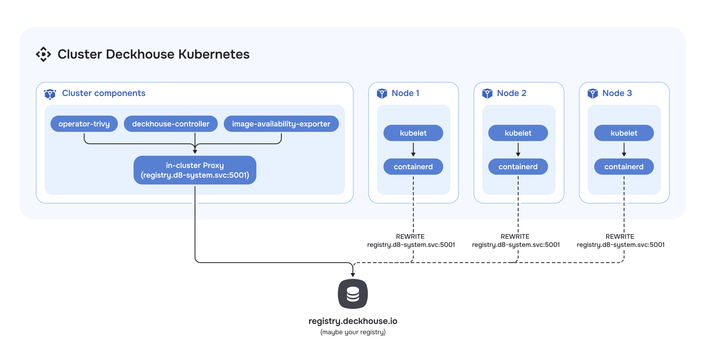
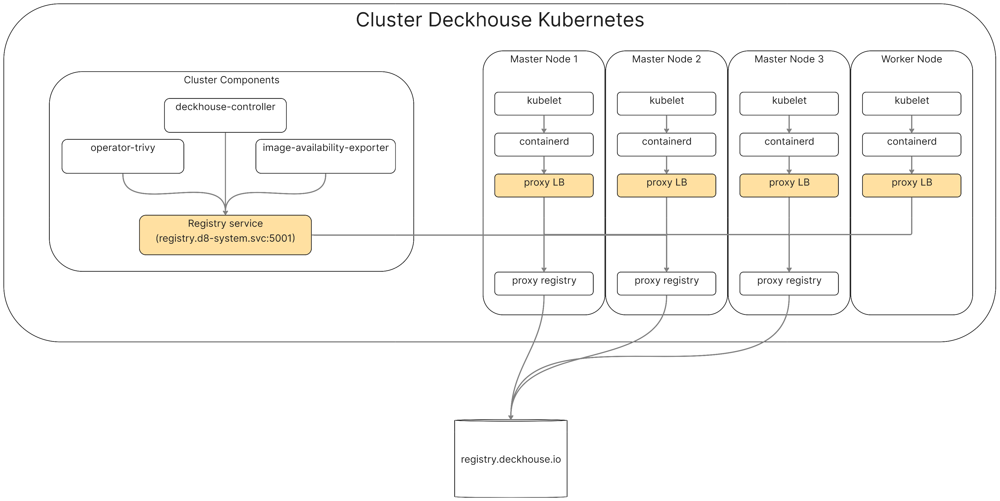
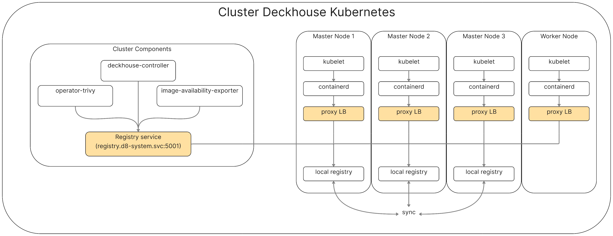

## Description

This module decides where a cluster pulls container images from, and how.

By default it decides nothing. Enabling it changes nothing on its own: with `mode: Unmanaged`
the cluster keeps pulling from the registry it was installed with, and no components are
created. You hand it the pull path deliberately, with `mode: Managed` — see
[configuration](configuration.html).

Once it manages the pull path, two independent settings describe everything the module can
do:

- whether `primary.upstream` names a registry to pull from, or the cluster is air-gapped;
- whether `storage.cache` deploys an in-cluster cache on the control-plane nodes.

There are no modes to move between and no state machine to reason about. Turning the cache on
or off, changing a registry, changing credentials — each is an ordinary reconfiguration that
can happen at any time and in any order. Exactly one change has a condition attached: removing
the upstream to become air-gapped waits until the cache holds the whole expected image set,
because it is the only change that could otherwise leave every node with nowhere to pull from.

## Architecture

<!--- Source: mermaid code from docs/internal/MANAGED.md --->

### The node agent

Every node runs a small agent as a static pod. The container runtime is pointed at it once —
at `127.0.0.1:5001`, through containerd's `_default` fallback directory — and from then on
asks it about every registry, passing the original registry name along in the request.

That single fact is what the rest of the design rests on:

- **Node configuration is static.** Adding a registry, turning the cache on, rotating
  credentials — none of it rewrites anything on any node, because the runtime already looks
  only at the agent. Nothing on a node has to be reconfigured for a change to take effect.
- **Registry credentials stay out of the runtime's configuration files.** The agent holds them
  and attaches them per request.
- **Credentials are not stored in the module's resources.** A RegistryNode, a RegistryStorage and
  the recorded effective upstream name a key in one Secret instead of carrying the credential
  itself. They are cluster-scoped and the agent's permission to read them is granted to every
  node, so a credential inside one of them would be readable through the API by every kubelet in
  the cluster. What each component reads is narrowed to that one Secret by name; the credential a
  component resolved is kept with its own copy of the routing, so a pull still works when the API
  server does not.
- **A pull works when the API server does not.** The agent keeps a copy of its routing on disk
  and falls back to it, because the images it serves include the ones needed to repair a broken
  control plane. A node that has never reached the API server uses the routing it was installed
  with.

An unconfigured registry is forwarded untouched, with whatever credentials the pull already
carried — so an ordinary `imagePullSecret` for some third-party registry keeps working without
anything being declared anywhere.

### The in-cluster cache

With `storage.cache` enabled, a registry runs on each control-plane node and keeps its blobs on
the host under `/opt/deckhouse/registry`. One replica holds a lease and fills from the
upstream; the others replicate from it ahead of time, so losing the leader does not mean
filling from scratch.

The lease is not a plain election. Only a replica holding the whole expected image set stands
for it, and one that holds it steps aside when another does — leadership is not a symmetric
role here, since the leader is the replication source and the one whose completeness gates
going air-gap. Without that condition an air-gapped cluster could deadlock: `d8 mirror push`
arrives on whichever replica the ingress chose, and an empty leader has no upstream to fill
itself from.

Agents reach a replica by node address rather than by the service name.
`registry.d8-system.svc:5001` is what every image reference in the cluster is built from, and
what a request is matched against — but nothing dials it: an agent runs in the host network,
where a cluster DNS name does not resolve.

That address takes effect in two steps, and the order matters. Nodes are given it as soon as
the module starts managing the pull path, through the same bashible rollout that installs the
agent. The image references of the platform's own workloads move only once every node's agent
is applying the layout it was given: nothing resolves this address except through that agent,
so re-rendering the cluster onto it any earlier would point every workload at something that
cannot be pulled yet. Until then image references keep naming the registry the cluster was
installed with, which is also where they return if the module is set to `Unmanaged` or
disabled. Whether the step has happened is visible as the `registry-image-address` ConfigMap
in `d8-system`.

The Deckhouse controller fetches through the same agent, at `127.0.0.1:5001` — its own release
channel and the module sources it owns. A different address for the same agent, because the
controller is a process and has to dial: an image reference is resolved by the container
runtime, which is redirected to the agent by a drop-in and can therefore name a service that
nothing ever connects to. This is what makes changing the registry a single change. The
configuration is edited in one place, the agents are reconfigured, and both what the nodes pull
and what the controller fetches follow — with no registry address written anywhere for the
controller to read, and so none to be left behind pointing at the previous registry.


Use a separate disk for the cache (`/opt/deckhouse/registry`) and for etcd data. Sharing one
disk degrades etcd while the cache is being filled.


### Air-gapped clusters

With no upstream configured, the cache is the only source of images and
[`d8 mirror push`](/products/kubernetes-platform/documentation/v1/cli/d8/) is the only way in.
It arrives through a publication endpoint that requires a client certificate from the ingress
in addition to credentials: this is the one path that can replace an image, so a leaked
password must not be enough to use it.

The endpoint exists only in this configuration. A cluster that merely caches does not get an
internet-facing write surface it never asked for.

## Requirements

- Nodes use containerd or containerd v2 as their container runtime. See
  [`ClusterConfiguration`](/products/kubernetes-platform/documentation/v1/reference/api/cr.html#clusterconfiguration-defaultcri).
- The cluster is fully managed by DKP. The module does not work in Managed Kubernetes.
- The in-cluster cache uses disks on the control-plane nodes, and is supported on static
  clusters.

## The previous implementation

Everything below describes the implementation this module is migrating away from. It is kept
because clusters are still running it, and because migrating off it is a deliberate step
rather than something an upgrade does silently.

It is configured through the [`deckhouse` ModuleConfig](/modules/deckhouse/configuration.html#parameters-registry)
rather than through this module's own settings, and works as a state machine with four modes:

- `Direct`: direct access to an external registry through the fixed address
  `registry.d8-system.svc:5001/system/deckhouse`. The fixed address is what keeps Deckhouse
  images from being re-downloaded, and components from restarting, when registry parameters
  change.
- `Proxy`: a caching proxy registry on the control-plane nodes, reachable at that same fixed
  address, which reduces requests to the external registry.
- `Local`: a full local copy of the registry inside the cluster, for isolated environments.
- `Unmanaged`: no in-cluster registry; the cluster reaches the external registry directly.
  Comes in a configurable form, managed through the `deckhouse` ModuleConfig, and a
  deprecated non-configurable form set at
  [installation](/products/kubernetes-platform/documentation/v1/reference/api/cr.html#initconfiguration-deckhouse-imagesrepo).

A cluster running any of them keeps running it until it is brought to `Unmanaged`, at which
point the handover to the current implementation happens on its own — see
[how to complete the migration](faq.html#how-do-i-complete-the-migration). The two never both
manage a cluster: which one is active decides what is created at all, so there is no state in
which both configure the same node.

### Mode switching restrictions

- Changing registry parameters and switching modes is only available after the bootstrap phase
  is fully complete.
- For the first switch, migration of user registry configurations must be performed. See the
  [FAQ](faq.html).
- Switching to the non-configurable `Unmanaged` mode is only available from `Unmanaged`.
- Switching between `Local` and `Proxy` is only possible through an intermediate `Direct` or
  `Unmanaged` mode. For example: `Local` → `Direct` → `Proxy`.
- Bootstrap in `Local` and `Proxy` modes is supported only on static clusters.

### Direct mode architecture

In `Direct` mode registry requests are processed without intermediate caching. CRI requests
are redirected based on the containerd configuration. Components that access the registry
directly — `operator-trivy`, `image-availability-exporter`, `deckhouse-controller` and others
— go through the in-cluster proxy on the master nodes.

<!--- Source: mermaid code from docs/internal/DIRECT.md --->

### Proxy mode architecture


It is recommended to use separate disks for storing registry (`/opt/deckhouse/registry`) and
etcd data. Using a single disk may lead to etcd performance degradation during registry
operations.


The caching proxy registry runs as static pods on the control-plane nodes, storing cached data
in `/opt/deckhouse/registry`. A load balancer on each node fronts it, and the containerd
configuration points at that load balancer. Components that access the registry directly go
through the caching proxy registry.

<!--- Source: mermaid code from docs/internal/PROXY.md --->

### Local mode architecture


It is recommended to use separate disks for storing registry (`/opt/deckhouse/registry`) and
etcd data. Using a single disk may lead to etcd performance degradation during registry
operations.


`Local` mode keeps a full copy of the registry inside the cluster, synchronized between
replicas on the control-plane nodes and populated with the
[`d8`](/products/kubernetes-platform/documentation/v1/cli/d8/) tool using
`d8 mirror push`/`d8 mirror pull`. Otherwise it behaves as the caching proxy does.

<!--- Source: mermaid code from docs/internal/LOCAL.md --->

