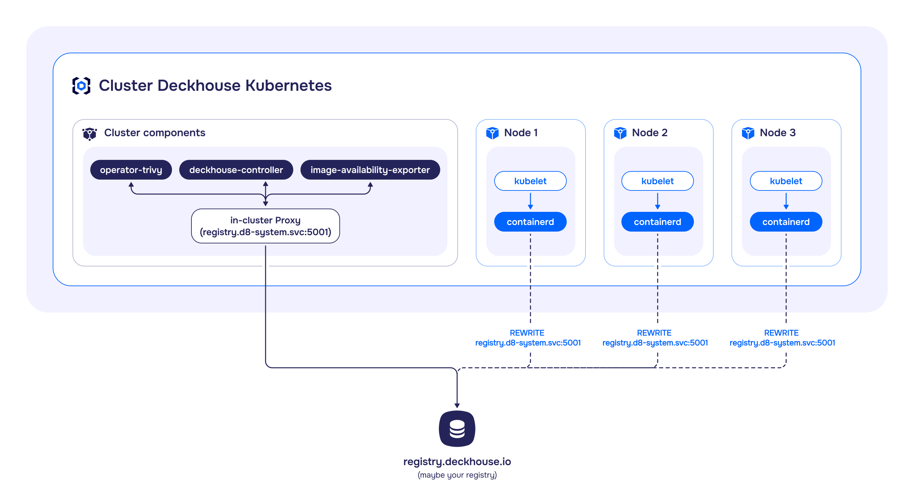

## Description

The module manages the registry settings for DKP components.

The module can operate in the following modes:

- `Direct`: Provides direct access to an external registry via the fixed address `registry.d8-system.svc:5001/system/deckhouse`. This fixed address prevents Deckhouse images from being re-downloaded and components from being restarted when registry parameters are changed. Switching between modes and registries is done through the [`deckhouse` ModuleConfig](/modules/deckhouse/configuration.html#parameters-registry). The switching process is automatic — see the [usage examples](examples.html) for more information.

- `Proxy`: Using an internal caching proxy registry that accesses an external registry, with the caching proxy registry running on control-plane (master) nodes. This mode reduces the number of requests to the external registry by caching images. Cached data is stored on the control-plane (master) nodes. Access to the internal registry is via the fixed address `registry.d8-system.svc:5001/system/deckhouse`, similar to the `Direct` mode. Switching between modes and registries is done through the [`deckhouse` ModuleConfig](/modules/deckhouse/configuration.html#parameters-registry). The switching process is automatic — see the [usage examples](examples.html) for more information.

- `Local`: Using a local internal registry, with the registry running on control-plane (master) nodes. This mode allows the cluster to operate in an isolated environment. All data is stored on the control-plane (master) nodes. Access to the internal registry is via the fixed address `registry.d8-system.svc:5001/system/deckhouse`, similar to the `Direct` and `Proxy` modes. Switching between modes and registries is done through the [`deckhouse` ModuleConfig](/modules/deckhouse/configuration.html#parameters-registry). The switching process is automatic — see the [usage examples](examples.html) for more information.

- `Unmanaged`: Operation without using the internal registry. Access within the cluster is performed directly to the external registry.
  There are two types of the `Unmanaged` mode:
  - Configurable: A mode managed via the `registry` module. Switching between modes and registries is handled through the [`deckhouse` ModuleConfig](/modules/deckhouse/configuration.html#parameters-registry). The switch is performed automatically (see [usage examples](examples.html) for details).
  - Non-configurable (deprecated): The default mode. Configuration parameters are set during [cluster installation](/products/kubernetes-platform/documentation/v1/reference/api/cr.html#initconfiguration-deckhouse-imagesrepo) or [changed in a running cluster](/products/kubernetes-platform/documentation/v1/admin/configuration/registry/third-party.html) using the (deprecated) `helper change registry` command.

## Restrictions and features of using the module

The `registry` module has a number of limitations and features related to installation, operating conditions, and mode switching.

### Cluster installation limitations

- DKP cluster bootstrap is supported only in `Direct`, `Unmanaged`, and `Proxy` modes (bootstrap in `Local` mode is not supported). Registry settings during cluster installation are configured via the [`deckhouse` ModuleConfig](/modules/deckhouse/configuration.html#parameters-registry).
- To launch a cluster in the non-configurable `Unmanaged` mode (Legacy), registry parameters must be specified in [`initConfiguration`](/products/kubernetes-platform/documentation/v1/reference/api/cr.html#initconfiguration-deckhouse-imagesrepo).

### Operating conditions restrictions

The module works under the following conditions:

- If CRI containerd or containerd v2 is used on the cluster nodes. To configure CRI, refer to the [`ClusterConfiguration`](/products/kubernetes-platform/documentation/v1/reference/api/cr.html#clusterconfiguration-defaultcri) configuration.
- The cluster is fully managed by DKP. The module will not work in Managed Kubernetes clusters.
- The `Local` and `Proxy` modes are only supported on static clusters.

### Mode switching restrictions

Mode switching restrictions are as follows:

- Changing registry parameters and switching modes is only available after the bootstrap phase is fully complete.
- For the first switch, migration of user registry configurations must be performed. For more details, see the [Registry Module: FAQ](./faq.html) section.
- Switching to the non-configurable `Unmanaged` mode is only available from the `Unmanaged` mode. For more details, see the [Registry Module: FAQ](./faq.html) section.
- Switching between `Local` and `Proxy` modes is only possible via the intermediate `Direct` or `Unmanaged` modes. Example switching sequence: `Local`/`Proxy` → `Direct` → `Proxy`/`Local`.

## Direct Mode Architecture

In Direct mode, registry requests are processed directly, without intermediate caching.

CRI requests to the registry are redirected based on its configuration, which is defined in the `containerd` configuration.

For components such as `operator-trivy`, `image-availability-exporter`, `deckhouse-controller`, and others that access the registry directly, requests will go through the in-cluster proxy located on the master nodes.

<!--- Source: mermaid code from docs/internal/DIRECT.md --->

## Proxy Mode Architecture


It is recommended to use separate disks for storing registry (`/opt/deckhouse/registry`) and etcd data. Using a single disk may lead to etcd performance degradation during registry operations.


The `Proxy` mode allows the registry to act as an intermediate proxy server between the client and the remote registry.

The caching proxy registry is launched as static pods on control-plane (master) nodes. Cached data is stored on the control-plane (master) nodes in the `/opt/deckhouse/registry` directory.

To ensure high availability of the caching proxy registry, a load balancer is deployed on each cluster node. Access to the proxy registry from CRI goes through this load balancer. The configuration for accessing the load balancer is set in the `containerd` configuration.

For components such as `operator-trivy`, `image-availability-exporter`, `deckhouse-controller`, and others that access the registry directly, requests will go through the caching proxy registry.

<!--- Source: mermaid code from docs/internal/PROXY.md --->

## Local Mode Architecture


It is recommended to use separate disks for storing registry (`/opt/deckhouse/registry`) and etcd data. Using a single disk may lead to etcd performance degradation during registry operations.


The `Local` mode allows creating a local copy of the registry inside the cluster. Images from the remote registry are fully copied to local storage and synchronized between replicas of the local registry.

The operation of the local registry is identical to that of the caching proxy registry. The local registry is launched as static pods on control-plane (master) nodes. Registry data is stored on the control-plane (master) nodes in the `/opt/deckhouse/registry` directory.

To ensure high availability of the local registry, a load balancer is deployed on each cluster node. Access to the local registry from CRI goes through this load balancer. The configuration for accessing the load balancer is set in the `containerd` configuration.

For components such as `operator-trivy`, `image-availability-exporter`, `deckhouse-controller`, and others that access the registry directly, requests will go to the local registry.

The local registry is populated using the [`d8`](/products/kubernetes-platform/documentation/v1/cli/d8/) tool with the `d8 mirror push/pull` commands. For more details, see the [«Registry Module: Usage Examples»](examples.html) section.

<!--- Source: mermaid code from docs/internal/LOCAL.md --->

