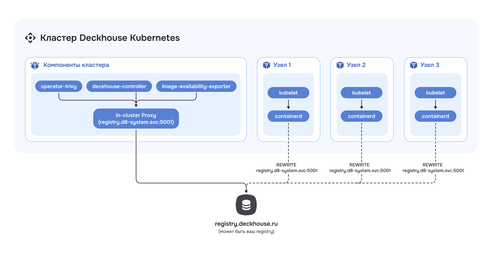
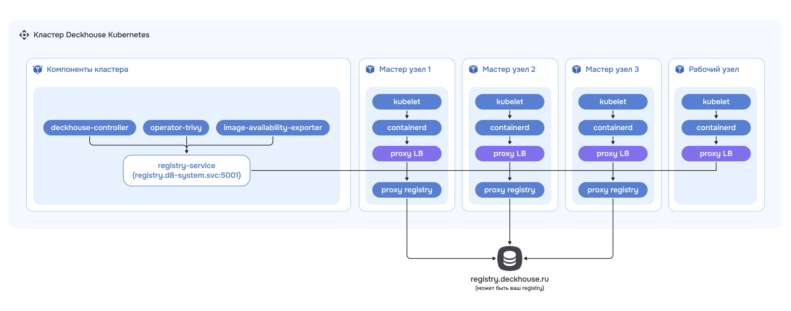
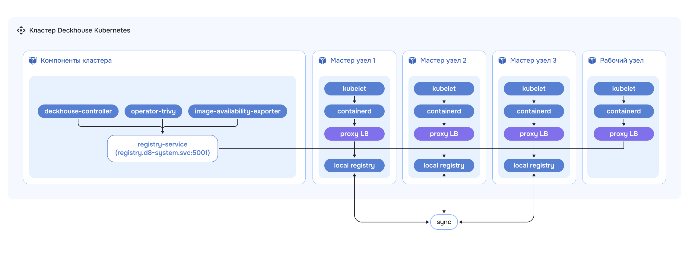

## Описание

Этот модуль решает, откуда кластер загружает образы контейнеров и каким путём.

По умолчанию он не решает ничего. Включение модуля само по себе ничего не меняет: при
`mode: Unmanaged` кластер продолжает загружать образы из того registry, с которым был
установлен, и никакие компоненты не создаются. Управление путём загрузки передаётся модулю
осознанно, через `mode: Managed` — параметры описаны в [настройках модуля](configuration.html).

Когда модуль управляет путём загрузки, всё, что он умеет, описывается двумя независимыми
настройками:

- задаёт ли `primary.upstream` registry, откуда загружать образы, или кластер изолирован;
- поднимает ли `storage.cache` внутрикластерный кеш на master-узлах.

Режимов, между которыми нужно переключаться, и конечного автомата, который нужно держать в
голове, здесь нет. Включение и выключение кеша, смена registry, смена учётных данных — каждое
из этих действий обычная перенастройка, возможная в любой момент и в любом порядке. Условие
привязано ровно к одному изменению: удаление upstream'а для перехода в air-gap ждёт, пока кеш
не будет держать весь ожидаемый набор образов, потому что это единственное изменение, которое
иначе могло бы оставить все узлы без источника образов.

## Архитектура

<!--- Source: mermaid code from docs/internal/MANAGED.md --->

### Агент на узле

На каждом узле работает небольшой агент — статическим подом. Container runtime один раз
направляется на него (`127.0.0.1:5001`, через каталог-фолбэк `_default` в containerd) и дальше
спрашивает у него про любой registry, передавая в запросе исходное имя registry.

На этом одном факте держится всё остальное:

- **Конфигурация узла статична.** Добавление registry, включение кеша, смена учётных данных —
  ничто из этого не переписывает ничего ни на одном узле, потому что runtime и так смотрит
  только в агент. Чтобы изменение вступило в силу, на узле не нужно перенастраивать ничего.
- **Учётные данные registry не попадают в конфигурационные файлы runtime.** Их держит агент и
  подставляет на каждый запрос.
- **Учётные данные не хранятся в ресурсах модуля.** RegistryNode, RegistryStorage и запись о
  действующем upstream указывают ключ в одном Secret'е, а не содержат сам ключ доступа. Это
  ресурсы кластерного уровня, и право читать их выдано каждому узлу, поэтому ключ внутри любого
  из них был бы доступен через API kubelet'у всего кластера. Доступ каждого компонента сужен до
  этого одного Secret'а по имени, а разрешённый ключ компонент хранит вместе со своей копией
  маршрутизации — поэтому загрузка образов работает и при недоступном API-сервере.
- **Загрузка образов работает, когда API-сервер недоступен.** Агент держит копию своей
  маршрутизации на диске и переходит на неё, потому что среди образов, которые он отдаёт, есть
  и те, что нужны для восстановления сломанного control plane. Узел, который никогда не
  дозвонился до API, использует маршрутизацию, с которой был установлен.

Ненастроенный registry проксируется без изменений, вместе с теми учётными данными, которые уже
были в запросе, — поэтому обычный `imagePullSecret` для какого-нибудь сторонного registry
продолжает работать, и объявлять для этого ничего не нужно.

### Внутрикластерный кеш

При включённом `storage.cache` на каждом master-узле работает registry, который держит блобы
на хосте в `/opt/deckhouse/registry`. Одна реплика держит lease и наполняется из upstream'а,
остальные реплицируют из неё заранее — чтобы потеря лидера не означала наполнение с нуля.

Это не обычные выборы lease. За него борется только реплика, которая держит весь ожидаемый
набор образов, а реплика, которая его держит, уступает, когда набор появляется у другой: роль
лидера здесь несимметрична — именно из него реплицируют остальные, и именно его полнота
открывает переход в air-gap. Без этого условия изолированный кластер мог бы застрять:
`d8 mirror push` попадает на ту реплику, которую выбрал ingress, а пустому лидеру не из чего
наливаться.

Агенты обращаются к реплике по адресу узла, а не по имени сервиса.
`registry.d8-system.svc:5001` — это то, из чего строится каждая ссылка на образ в кластере, и
то, с чем сопоставляется запрос, но никто по этому имени не дозванивается: агент работает в
сетевом пространстве хоста, где имя cluster DNS не разрешается.

Этот адрес вступает в силу в два шага, и порядок здесь важен. Узлы получают его сразу, как
только модуль начинает управлять путём загрузки образов, — тем же прогоном bashible, который
устанавливает агента. Ссылки на образы собственных компонентов платформы переезжают только
после того, как агент на каждом узле применил выданную ему конфигурацию: этот адрес не
разрешается ничем, кроме агента, поэтому перерендер кластера на него раньше указал бы каждой
нагрузке на то, что пока невозможно загрузить. До этого ссылки продолжают указывать на
registry, с которого кластер был установлен, — туда же они возвращаются, если модулю задать
`Unmanaged` или выключить его. Произошёл ли этот шаг, видно по ConfigMap
`registry-image-address` в `d8-system`.

Через того же агента загружает образы и сам deckhouse-controller — по адресу `127.0.0.1:5001`,
свой канал обновлений и принадлежащие ему источники модулей. Адрес другой, а агент тот же:
контроллер — это процесс, и ему нужно установить соединение, тогда как ссылка на образ
разрешается container runtime, которого drop-in перенаправляет на агента, поэтому она может
называть сервис, к которому никто не подключается. Именно это делает смену registry одним
изменением: конфигурация правится в одном месте, агенты переконфигурируются, и за ними следуют
и то, что тянут узлы, и то, что загружает контроллер, — при этом ни один адрес registry для
контроллера нигде не записан, а значит и не может остаться указывающим на прежний.


Используйте отдельные диски для данных кеша (`/opt/deckhouse/registry`) и для данных etcd.
Общий диск приводит к деградации etcd во время наполнения кеша.


### Изолированные кластеры

Если upstream не задан, кеш — единственный источник образов, а
[`d8 mirror push`](/products/kubernetes-platform/documentation/v1/cli/d8/) — единственный путь
внутрь. Он приходит через endpoint публикации, который помимо учётных данных требует
клиентский сертификат от ingress: это единственный путь, по которому образ можно заменить, и
утёкшего пароля не должно быть достаточно, чтобы им воспользоваться.

Этот endpoint существует только в такой конфигурации. Кластер, который просто кеширует, не
получает доступной извне точки записи, о которой не просил.

## Требования

- На узлах используется containerd или containerd v2 — задаётся параметром
  [`defaultCRI`](/products/kubernetes-platform/documentation/v1/reference/api/cr.html#clusterconfiguration-defaultcri)
  в ClusterConfiguration.
- Кластер полностью управляется DKP. В Managed Kubernetes модуль не работает.
- Внутрикластерный кеш использует диски master-узлов и поддерживается на статических кластерах.

## Предыдущая реализация

Всё, что ниже, описывает реализацию, от которой модуль уходит. Она сохранена, потому что на
ней всё ещё работают кластеры, и уводить кластер с неё — работа оператора, которую надо
выполнить до обновления, а не после.


Подготовьте кластер ДО обновления на этот релиз: обновление заблокировано, пока предыдущая
реализация работает в режиме `Proxy` или `Local`, а также в режиме `Direct` без настроенного
ModuleConfig `registry`.


Этот релиз не рендерит ни одного объекта предыдущей реализации, а переключение её режимов
выполняет код предыдущего релиза — поэтому вся подготовка выполняется на нём. Кластер в `Proxy`
переводится в `Unmanaged`. Изолированному кластеру в `Local` эта процедура не подходит: она идёт
через режим, в котором каждый узел загружает образы напрямую из внешнего registry, а у такого
кластера его нет, — поэтому для него есть отдельная процедура, описанная в разделе
[«Как мигрировать изолированный кластер из режима Local»](faq.html#как-мигрировать-изолированный-кластер-из-режима-local).

Кластеру в `Direct` переключение режима не нужно — только конфигурация этого модуля, записанная
до обновления. Его объекты сохраняются намеренно — предыдущий релиз помечает их так, чтобы они
пережили его собственное удаление, — и продолжают обслуживать внутрикластерный адрес, через
который загружают образы узлы, пока этот адрес не примет агент модуля. Порядок действий описан в
разделе [«Как мигрировать из режима Direct»](faq.html#как-мигрировать-из-режима-direct).

Она настраивается через [ModuleConfig `deckhouse`](/modules/deckhouse/configuration.html#parameters-registry),
а не через настройки самого модуля, и работает как конечный автомат с четырьмя режимами:

- `Direct` — прямой доступ к внешнему registry по фиксированному адресу
  `registry.d8-system.svc:5001/system/deckhouse`. Фиксированный адрес — это то, что позволяет
  избежать повторного скачивания образов Deckhouse и перезапуска компонентов при смене
  параметров registry.
- `Proxy` — внутренний кеширующий прокси-registry на master-узлах, доступный по тому же
  фиксированному адресу; сокращает количество запросов к внешнему registry.
- `Local` — полная локальная копия registry внутри кластера, для изолированных окружений.
- `Unmanaged` — без внутреннего registry; кластер обращается к внешнему напрямую. Существует в
  настраиваемой форме, управляемой через ModuleConfig `deckhouse`, и в устаревшей
  ненастраиваемой, задаваемой при
  [установке](/products/kubernetes-platform/documentation/v1/reference/api/cr.html#initconfiguration-deckhouse-imagesrepo).

Из четырёх режимов обновление на этот релиз переживают два, и по разным причинам. `Unmanaged` —
режим, объекты которого и так ничего не обслуживали, поэтому их удаление ничего не забирает, и
передача происходит сама. `Direct` переживает потому, что адрес, через который загружают образы
его узлы, обслуживает и этот модуль: предыдущий релиз помечает стоящие за этим адресом объекты
так, чтобы они пережили его собственное удаление, и они продолжают его обслуживать, пока адрес не
примет агент, — то есть такому кластеру нужна конфигурация этого модуля, а не переключение
режима. Оба пути описаны в [как устроена миграция](faq.html#как-устроена-миграция-на-модуль-registry). Обе
реализации никогда не управляют кластером одновременно: то, какая из них активна, определяет, что
вообще создаётся, поэтому состояния, в котором обе настраивают один узел, не существует.

`Proxy` и `Local` — дверь в одну сторону. Оба держат состояние, которое этот релиз учесть не
может: прокси со своим сертификатным материалом на каждом узле и, в случае `Local`, хранилище
образов на дисках master-узлов, — поэтому они идут через `Unmanaged`, а перевести кластер туда
можно только на релизе, который ещё рендерит предыдущую реализацию, то есть до обновления. Ту же
проверку изнутри кластера сообщает алерт `D8RegistryMigrationPreflightBlocked`.

### Ограничения переключения режимов

- Смена параметров registry и переключение режимов доступны только после полного завершения
  bootstrap-фазы.
- Для первого переключения выполните миграцию пользовательских конфигураций registry —
  процедура описана [в FAQ](faq.html).
- Переключение в ненастраиваемый режим `Unmanaged` доступно только из `Unmanaged`.
- Переключение между `Local` и `Proxy` возможно только через промежуточный `Direct` или
  `Unmanaged`. Например: `Local` → `Direct` → `Proxy`.
- Bootstrap в режимах `Local` и `Proxy` поддерживается только на статических кластерах.

### Архитектура режима Direct

В режиме `Direct` запросы к registry обрабатываются без промежуточного кеширования. Запросы
CRI перенаправляются на основании конфигурации containerd. Компоненты, обращающиеся к registry
напрямую — `operator-trivy`, `image-availability-exporter`, `deckhouse-controller` и другие, —
идут через внутрикластерный прокси на master-узлах.

<!--- Source: mermaid code from docs/internal/DIRECT.md --->

### Архитектура режима Proxy


Рекомендуется использовать отдельные диски для хранения данных registry
(`/opt/deckhouse/registry`) и данных etcd. Использование одного диска может привести к
деградации производительности etcd во время работы registry.


Кеширующий прокси-registry запускается статическими подами на master-узлах и хранит кешируемые
данные в `/opt/deckhouse/registry`. Перед ним на каждом узле стоит балансировщик, и
конфигурация containerd указывает на этот балансировщик. Компоненты, обращающиеся к registry
напрямую, идут через кеширующий прокси-registry.

<!--- Source: mermaid code from docs/internal/PROXY.md --->

### Архитектура режима Local


Рекомендуется использовать отдельные диски для хранения данных registry
(`/opt/deckhouse/registry`) и данных etcd. Использование одного диска может привести к
деградации производительности etcd во время работы registry.


Режим `Local` держит полную копию registry внутри кластера, синхронизированную между репликами
на master-узлах и наполняемую утилитой
[`d8`](/products/kubernetes-platform/documentation/v1/cli/d8/) командами
`d8 mirror push`/`d8 mirror pull`. В остальном работает так же, как кеширующий прокси.

<!--- Source: mermaid code from docs/internal/LOCAL.md --->

