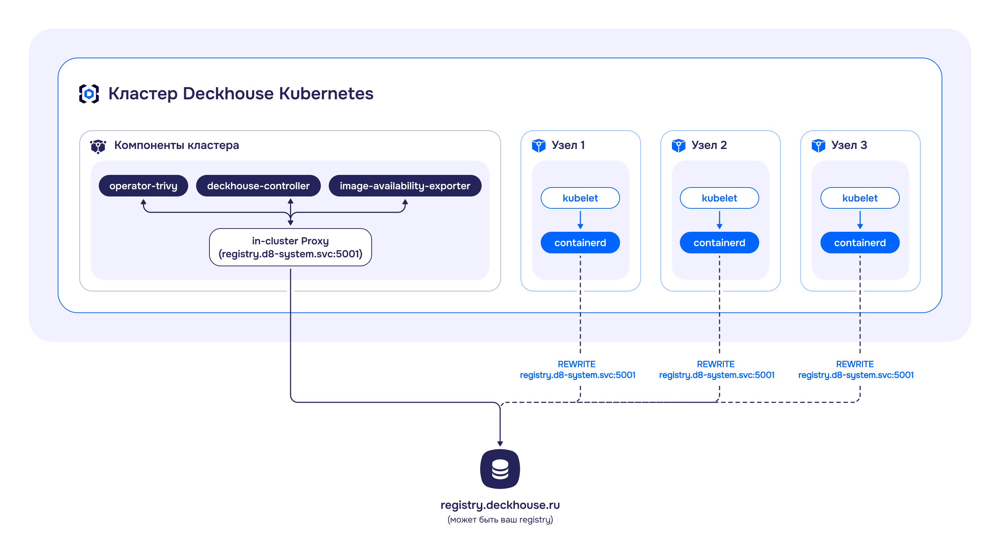

## Описание

Модуль отвечает за управление настройками registry компонентов DKP.

Модуль работает в следующих режимах:

- `Direct` — использование прямого доступа к внешнему registry по фиксированному адресу `registry.d8-system.svc:5001/system/deckhouse`. Фиксированный адрес, при изменении параметров registry, позволяет избежать повторного скачивания образов и перезапуска компонентов при смене параметров registry. Переключение между режимами и registry выполняется через [ModuleConfig `deckhouse`](/modules/deckhouse/configuration.html#parameters-registry). Переключение выполняется автоматически (ознакомьтесь с [примерами использования](examples.html)).

- `Proxy` — использование внутреннего кеширующего прокси-registry с обращением к внешнему registry, с запуском кеширующего прокси-registry на control-plane (master) узлах. Режим позволяет сократить количество запросов к внешнему registry за счёт кеширования образов. Кешируемые данные хранятся на control-plane (master) узлах. Обращение к внутреннему registry выполняется по фиксированному адресу `registry.d8-system.svc:5001/system/deckhouse` аналогично `Direct` режиму. Переключение между режимами и registry выполняется через [ModuleConfig `deckhouse`](/modules/deckhouse/configuration.html#parameters-registry). Переключение выполняется автоматически (ознакомьтесь с [примерами использования](examples.html)).

- `Local` — использование локального внутреннего registry, с запуском registry на control-plane (master) узлах. Режим позволяет кластеру работать в изолированной среде. Данные хранятся на control-plane (master) узлах. Обращение к внутреннему registry выполняется по фиксированному адресу `registry.d8-system.svc:5001/system/deckhouse` аналогично `Direct` и `Proxy` режимам. Переключение между режимами и registry выполняется через [ModuleConfig `deckhouse`](/modules/deckhouse/configuration.html#parameters-registry). Переключение выполняется автоматически (ознакомьтесь с [примерами использования](examples.html)).

- `Unmanaged` — работа без использования внутреннего registry. Обращение внутри кластера выполняется напрямую к внешнему registry.
  Существует 2 вида режима `Unmanaged`:
  - Конфигурируемый - режим, управляемый с помощью модуля `registry`. Переключение между режимами и registry выполняется через [ModuleConfig `deckhouse`](/modules/deckhouse/configuration.html#parameters-registry). Переключение выполняется автоматически (ознакомьтесь с [примерами использования](examples.html)).
  - Неконфигурируемый (deprecated) - режим используемый по умолчанию. Параметры конфигурации задаются [при установке кластера](/products/kubernetes-platform/documentation/v1/reference/api/cr.html#initconfiguration-deckhouse-imagesrepo), или при [изменении в развёрнутом кластере](/products/kubernetes-platform/documentation/v1/admin/configuration/registry/third-party.html) с помощью утилиты `helper change registry` (deprecated).

## Ограничения и особенности использования модуля

Модуль `registry` имеет ряд ограничений и особенностей, касающихся установки, условий работы и переключения режимов.

### Ограничения при установке кластера

- Bootstrap кластера DKP поддерживается только в `Direct`, `Unmanaged` и `Proxy` режимах (bootstrap в `Local` режиме не поддерживается). Registry во время установки кластера настраивается через [ModuleConfig `deckhouse`](/modules/deckhouse/configuration.html#parameters-registry).
- Для запуска кластера в неконфигурируемом `Unmanaged` режиме (Legacy), необходимо указать параметры registry в [`initConfiguration`](/products/kubernetes-platform/documentation/v1/reference/api/cr.html#initconfiguration-deckhouse-imagesrepo).

### Ограничения по условиям работы

Модуль работает при соблюдении следующих условий:

- Если на узлах кластера используется CRI containerd или containerd v2. Для настройки CRI ознакомьтесь с конфигурацией [`ClusterConfiguration`](/products/kubernetes-platform/documentation/v1/reference/api/cr.html#clusterconfiguration-defaultcri).
- Кластер полностью управляется DKP. В Managed Kubernetes кластерах он работать не будет.
- Работа режимов `Local` и `Proxy` поддерживаются только на статичных кластерах.

### Ограничения по переключению режимов

Ограничения по переключению режимов следующие:

- Изменение параметров registry и переключение режимов доступны только после полного завершения этапа bootstrap.
- При первом переключении необходимо выполнить миграцию пользовательских конфигураций реестра. Подробнее — в разделе [«Модуль registry: FAQ»](./faq.html).
- Переключение в неконфигурируемый `Unmanaged` режим доступно только из `Unmanaged` режима. Подробнее — в разделе [«Модуль registry: FAQ»](./faq.html).
- Переключение между режимами `Local` и `Proxy` возможно только через промежуточные режимы `Direct` или `Unmanaged`. Пример последовательности переключения: `Local`/`Proxy` → `Direct` → `Proxy`/`Local`.

## Архитектура режима Direct

В режиме `Direct` запросы к registry обрабатываются напрямую, без промежуточного кеширования.

Перенаправление запросов к registry от CRI осуществляется при помощи его настроек, которые указываются в конфигурации `containerd`.

В случае таких компонентов, как `operator-trivy`, `image-availability-exporter`, `deckhouse-controller` и ряда других, обращающихся к registry напрямую, запросы будут идти через in-cluster proxy, расположенный на master-узлах.

<!--- Source: mermaid code from docs/internal/DIRECT.md --->

## Архитектура режима Proxy


Рекомендуется использовать разные диски для хранения данных registry (`/opt/deckhouse/registry`) и etcd. Использование одного диска может привести к деградации производительности etcd при операциях с registry.


`Proxy` режим позволяет registry выступать в качестве промежуточного прокси-сервера между клиентом и удалённым registry.

Кеширующий proxy registry запускается в виде статических подов на узлах control-plane (master). Кешируемые данные хранятся на control-plane (master) узлах в директории `/opt/deckhouse/registry`.

Для обеспечения высокой доступности к кеширующему proxy registry используется балансировщик, установленный на каждый узел кластера. CRI обращается к proxy registry через балансировщик. Настройки для обращения к балансировщику указываются в конфигурации `containerd`.

В случае таких компонентов, как `operator-trivy`, `image-availability-exporter`, `deckhouse-controller` и ряда других, обращающихся к registry напрямую, запросы будут идти через кеширующий proxy registry.

<!--- Source: mermaid code from docs/internal/PROXY.md --->

## Архитектура режима Local


Рекомендуется использовать разные диски для хранения данных registry (`/opt/deckhouse/registry`) и etcd. Использование одного диска может привести к деградации производительности etcd при операциях с registry.


`Local` режим позволяет создавать локальную копию registry внутри кластера. Образы из удалённого registry полностью скопированы в локальное хранилище и синхронизированы между репликами локального registry.

Работа локального registry идентична работе кеширующего proxy registry. Локальный registry запускается в виде статических подов на узлах control-plane (master). Данные registry хранятся на control-plane (master) узлах в директории `/opt/deckhouse/registry`.

Для обеспечения высокой доступности к локальному registry используется балансировщик, установленный на каждый узел кластера. CRI обращается к локальному registry через балансировщик. Настройки для обращения к балансировщику указываются в конфигурации `containerd`.

В случае таких компонентов, как `operator-trivy`, `image-availability-exporter`, `deckhouse-controller` и ряда других, обращающихся к registry напрямую, запросы будут идти в локальный registry.

Локальный registry наполняется с помощью инструмента [`d8`](/products/kubernetes-platform/documentation/v1/cli/d8/) (команды `d8 mirror push/pull`). Подробнее — в разделе [«Модуль registry: пример использования»](examples.html)

<!--- Source: mermaid code from docs/internal/LOCAL.md --->

