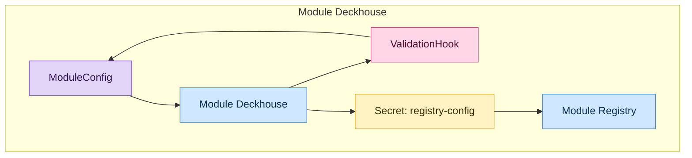
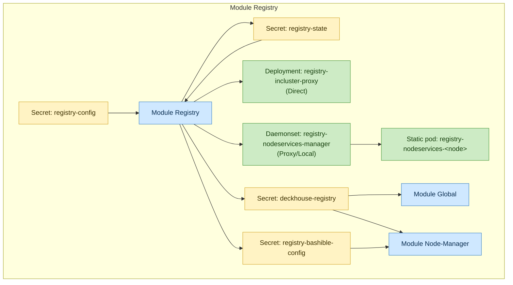
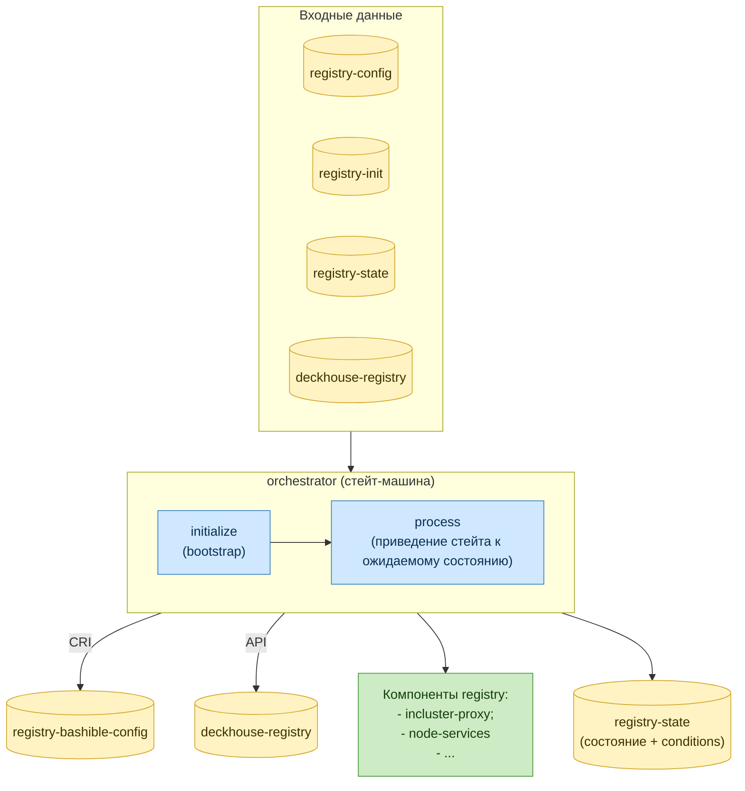
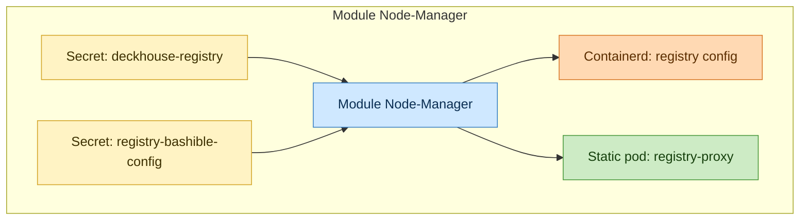
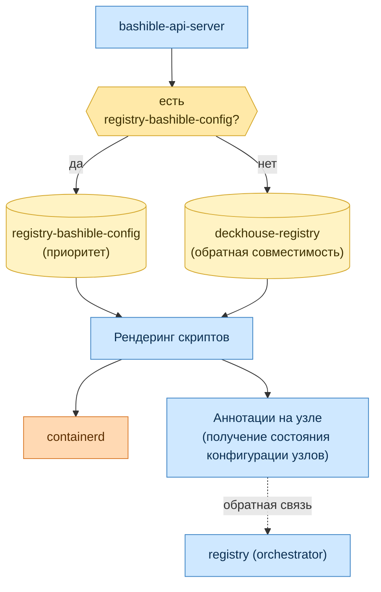
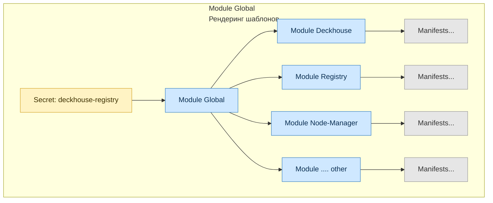

# Архитектура взаимодействия

Документ описывает архитектуру взаимодействия модуля `registry` с ключевыми
подсистемами Deckhouse Kubernetes Platform (DKP).

## Как было

Изначально управление registry выполнялось через единый секрет `deckhouse-registry`.
Этот секрет одновременно конфигурировал две разные подсистемы:

- **global** — рендеринг манифестов модулей с конфигурацией из
  `deckhouse-registry`;
- **node-manager** — рендеринг bashible-бандла с конфигурацией registry в containerd на узлах.

### Проблемы такой схемы

1. **Смешение двух разных контуров доступа в одном секрете.**

2. **Отсутствие оркестрации и этапности.**
   Любое изменение секрета приводило к одновременному (параллельному) применению новой
   конфигурации сразу во всех компонентах. Не было управляемого поэтапного перехода.
   Из-за этого некорректное изменение `deckhouse-registry` могло привести к поломке кластера:
   deckhouse брал новые параметры, перерендеривал манифесты и себя, но из-за отсутствия конфигураций на узлах впоследствии падал с `ImagePullBackOff`.
   Сам bashible не мог раскатить новые конфиги, так как ждал пробуждения deckhouse.

## Как стало

Модуль `registry` разделяет конфигурацию global и node-manager и вводит управляемый,
поэтапный переход между режимами работы registry:

1. **Разделение контуров доступа.**
   Введён отдельный секрет `registry-bashible-config` для конфигурации узлов. Таким образом:
   - для **API-доступа** (in-cluster) + рендеринга шаблонов используется `deckhouse-registry`;
   - для **CRI-доступа** (containerd на узлах) используется `registry-bashible-config`.

   Если модуль `registry` не используется, поведение остаётся обратно совместимым: node-manager
   конфигурирует containerd по `deckhouse-registry` (как раньше).

2. **Оркестрация и этапность.**
   Модуль `registry` содержит **orchestrator** — стейт-машину, которая управляет переходом
   между режимами (Direct / Proxy / Local / Unmanaged). Переход выполняется поэтапно.

Общая картина «с модулем registry» разбита на четыре части — по одной на каждый модуль. Они соединяются через секреты:
- модуль `deckhouse` создаёт `registry-config`;
- модуль `registry` считывает его и публикует `deckhouse-registry` и `registry-bashible-config`;
- модули `node-manager` и `global` используют полученные от модуля `registry` секреты.

**Module Deckhouse**

Модуль `deckhouse` выполняет:

- создание секрета `registry-config` — рендеринг секрета из переданных в `mc/deckhouse` параметров registry. Рендеринг позволяет заполнять параметры по-умолчанию (default-ы в openapi спеке `mc/deckhouse`);
- создание **validation webhook** — хук валидации входных параметров. Дополнительно есть go-хук,
  который извлекает текущий режим из registry, чтобы построить validation-хук, проверяющий
  допустимость редактирования `mc/deckhouse` и смену режимов.

**Module Registry**

Для модуля `registry` секрет `registry-config` является **входным** параметром (создаётся
модулем `deckhouse`).

**Входные параметры (snapshots orchestrator):**

- `registry-config` (secret) — конфигурация из deckhouse;
- `registry-init` (secret) — bootstrap-конфигурация;
- `registry-state` (secret) — сохранённое состояние стейт-машины;
- `deckhouse-registry` (secret) — текущие параметры registry;
- `registry-pki`, `registry-user-*` (secrets) — секреты состояния для PKI;
- `incluster-proxy`, `node-services` — компоненты модуля.

**Выходные параметры:**

- `incluster-proxy`, `node-services` и т. д. — компоненты registry;
- `registry-bashible-config` (secret) — конфигурация CRI для node-manager (bashible);
- `deckhouse-registry` (secret) — параметры API-доступа для global.

**Orchestrator** реализует стейт-машину, которая управляет переходом между режимами
(`Direct`, `Proxy`, `Local`, `Unmanaged`).

**Module Node-Manager**

`Node-manager` получает параметры registry и рендерит bashible bundle с подготовленной конфигурацией containerd.

Правило выбора секрета для рендеринга манифестов:
- если есть `registry-bashible-config` — используется он;
- иначе — используется `deckhouse-registry` (обратная совместимость).

Скрипты конфигурации на узле:

- применение настроек registry;
- запуск bashible-api-server;
- создание аннотаций на узле для обратной связи с модулем `registry`:
  - наличие кастомных скриптов в containerd — используется для preflight-проверки, можно ли
    запустить/переключить модуль;
  - применённая версия конфигурации модуля `registry`.

Аннотации на узлах — это канал обратной связи: orchestrator видит фактически применённую на
каждом узле версию и может вести переход поэтапно, не раскатывая новую конфигурацию на все
узлы одновременно.

**Module Global**

`global` считывает конфигурацию из `deckhouse-registry` и рендерит манифесты модулей всех
компонентов DKP. Дальнейшая работа с `deckhouse-registry` для API-доступа к registry
(operator-trivy, image-availability-exporter и т. д.) выполняется уже независимо другими
модулями.

## Архитектура переключения:

## Взаимодействие компонент модуля registry:

## Bootstrap кластера с модулем registry:

