# Architecture

This document describes the architecture of the `registry` module's interaction with the key
subsystems of the Deckhouse Kubernetes Platform (DKP).

## How it was before

Originally, registry management was performed through a single `deckhouse-registry` secret.
This secret simultaneously configured two different subsystems:

- **global** — rendering of module manifests using the configuration from
  `deckhouse-registry`;
- **node-manager** — rendering of the bashible bundle with the registry configuration for containerd on the nodes.

### Problems of the old switching mechanism

1. **Mixing two different access circuits in a single secret.**

2. **Lack of orchestration and staging.**
   Any change to the secret led to the new configuration being applied simultaneously (in parallel)
   across all components at once. There was no managed, staged transition.
   Because of this, an incorrect change to `deckhouse-registry` could break the cluster:
   deckhouse picked up the new parameters, re-rendered the manifests and itself, but because of the absence of configurations on the nodes it subsequently crashed with `ImagePullBackOff`.
   Bashible itself could not roll out the new configs, because it was waiting for deckhouse to wake up.

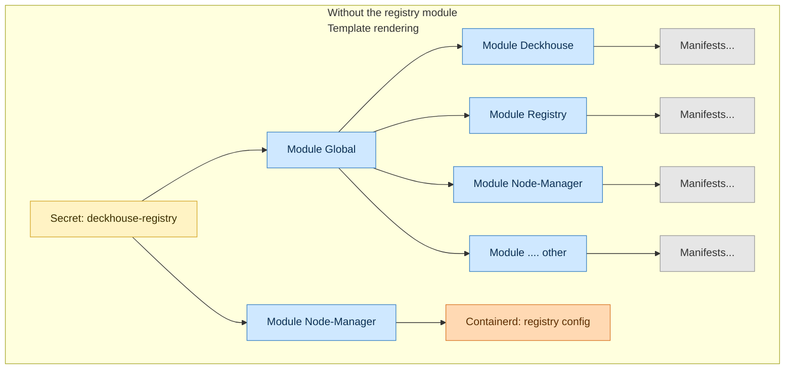

## How it is now

The `registry` module separates the global and node-manager configuration and introduces a managed,
staged transition between registry operating modes:

1. **Separation of access circuits.**
   A dedicated `registry-bashible-config` secret has been introduced for node configuration. As a result:
   - for **API access** (in-cluster) + template rendering, `deckhouse-registry` is used;
   - for **CRI access** (containerd on the nodes), `registry-bashible-config` is used.

   If the `registry` module is not used, the behavior remains backward compatible: node-manager
   configures containerd using `deckhouse-registry` (as before).

2. **Orchestration and staging.**
   The `registry` module contains an **orchestrator** — a state machine that manages the transition
   between modes (Direct / Proxy / Local / Unmanaged). The transition is performed in stages.

The overall picture "with the registry module" is split into four parts — one per module. They are connected through secrets:
- the `deckhouse` module creates `registry-config`;
- the `registry` module reads it and publishes `deckhouse-registry` and `registry-bashible-config`;
- the `node-manager` and `global` modules use the secrets received from the `registry` module.

**Module Deckhouse**

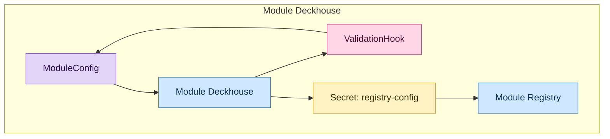

The `deckhouse` module performs:

- creation of the `registry-config` secret — rendering the secret from the registry parameters passed in `mc/deckhouse`. Rendering allows filling in default parameter values (defaults in the openapi spec of `mc/deckhouse`);
- creation of a **validation webhook** — a hook that validates the input parameters. Additionally, there is a go-hook
  that extracts the current mode from the registry in order to build a validation hook that checks
  the admissibility of editing `mc/deckhouse` and switching modes.

**Module Registry**

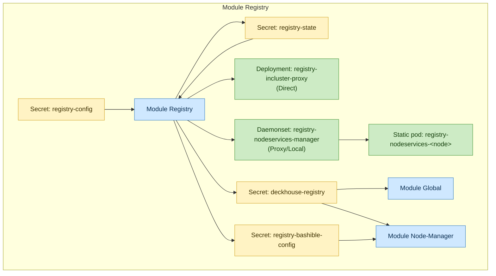

For the `registry` module, the `registry-config` secret is an **input** parameter (created
by the `deckhouse` module).

**Input parameters (orchestrator snapshots):**

- `registry-config` (secret) — configuration from deckhouse;
- `registry-init` (secret) — bootstrap configuration;
- `registry-state` (secret) — saved state of the state machine;
- `deckhouse-registry` (secret) — current registry parameters;
- `registry-pki`, `registry-user-*` (secrets) — state secrets for PKI;
- `incluster-proxy`, `node-services` — module components.

**Output parameters:**

- `incluster-proxy`, `node-services`, etc. — registry components;
- `registry-bashible-config` (secret) — CRI configuration for node-manager (bashible);
- `deckhouse-registry` (secret) — API access parameters for global.

The **orchestrator** implements a state machine that manages the transition between modes
(`Direct`, `Proxy`, `Local`, `Unmanaged`).

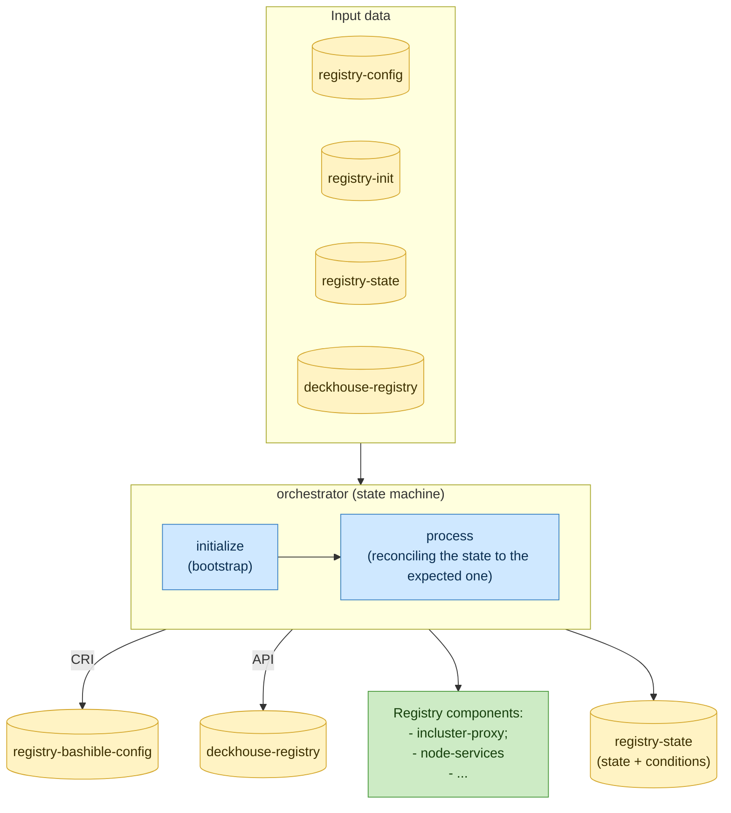

**Module Node-Manager**

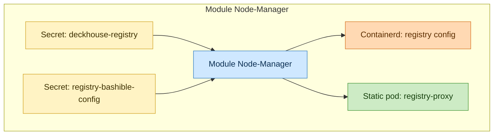

`Node-manager` receives the registry parameters and renders the bashible bundle with the prepared containerd configuration.

The rule for selecting the secret for manifest rendering:
- if `registry-bashible-config` exists — it is used;
- otherwise — `deckhouse-registry` is used (backward compatibility).

Configuration scripts on the node:

- applying the registry settings;
- starting the bashible-api-server;
- creating annotations on the node for feedback to the `registry` module:
  - the presence of custom scripts in containerd — used for the preflight check of whether the module
    can be started/switched;
  - the applied version of the `registry` module configuration.

Annotations on the nodes are a feedback channel: the orchestrator sees the version actually applied on
each node and can carry out the transition in stages, without rolling out the new configuration to all
nodes simultaneously.

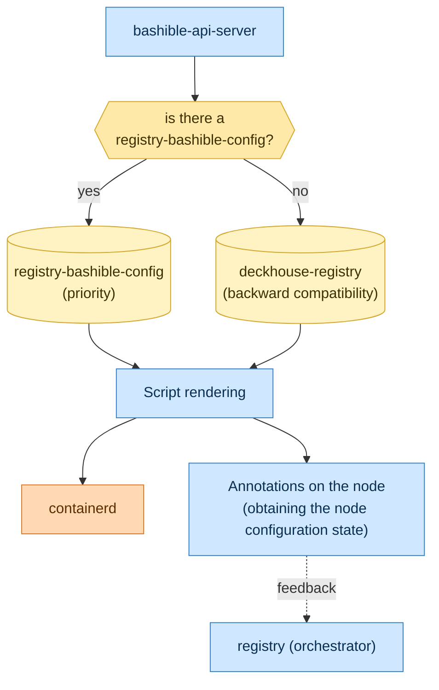

**Module Global**

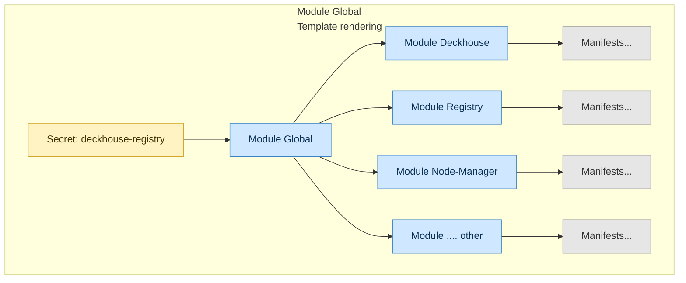

`global` reads the configuration from `deckhouse-registry` and renders the module manifests for all
DKP components. Further work with `deckhouse-registry` for API access to the registry
(operator-trivy, image-availability-exporter, etc.) is then performed independently by other
modules.

## Interaction of the registry module components:

### Direct

`containerd` accesses the external registry directly via the virtual address `registry.d8-system.svc:5001/system/deckhouse` thanks to the mirroring mechanism in containerd.

In-cluster access is performed through the non-caching proxy `registry-incluster-proxy`, available through the service `registry.d8-system.svc:5001`. At the proxy level the request is translated to the upstream registry.

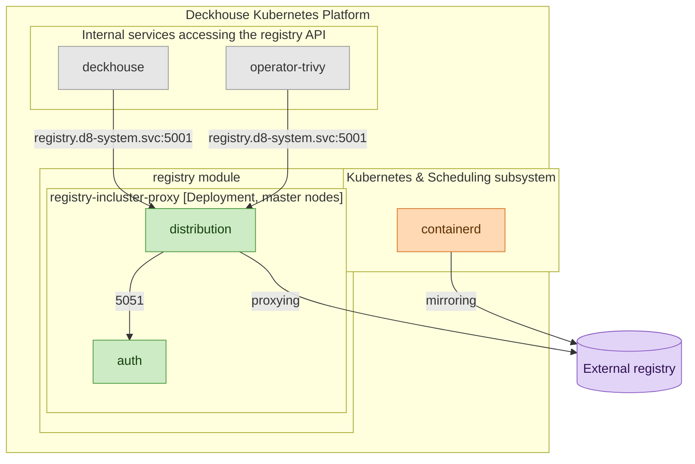

### Proxy

`containerd` accesses `127.0.0.1:5001` in the static pod `registry-proxy-<node>`, running on every node. `registry-proxy-<node>` balances requests across the `registry-nodeservices-<node>` components (static pods on master nodes, listening on `internal-ip:5001`), which operate in proxy mode and cache images from the upstream registry into local storage (`/opt/deckhouse/registry`).

In-cluster access is performed through the service `registry.d8-system.svc:5001` directly to the `registry-nodeservices-<node>` components.

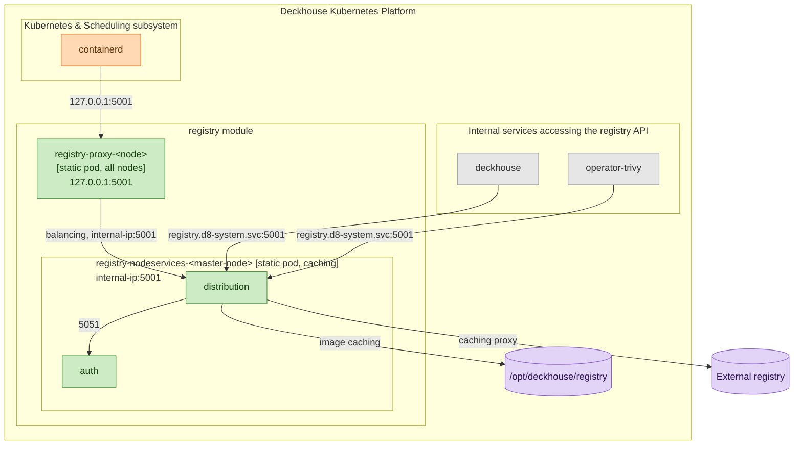

### Local

The network topology is identical to the `Proxy` mode: `containerd` accesses `127.0.0.1:5001` on the `registry-proxy-<node>` on each node, which balances requests across `registry-nodeservices-<node>` (static pods on master nodes, listening on `internal-ip:5001`). The difference is that `registry-nodeservices-<node>` operate in Local mode and serve images from local storage (`/opt/deckhouse/registry`) — there are no requests to the external registry.

Populating the local registry is performed via `ingress` (`registry.<PUBLIC_DOMAIN>`) using the `d8 mirror push` command.

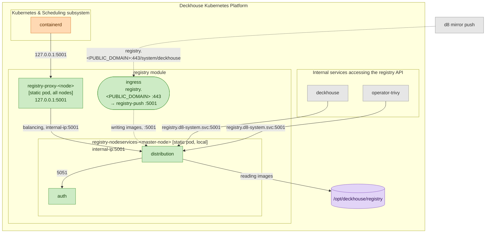

### Unmanaged

The internal registry components are not used.
In-cluster access and `containerd` go directly to the external registry.

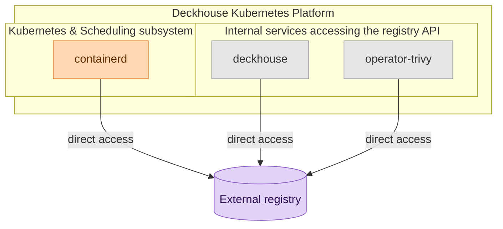
