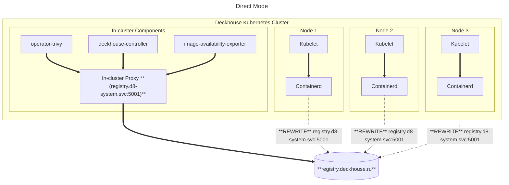

# Direct

## Architecture of the Direct mode

```mermaid
---
title: Direct Mode
---
flowchart TD
subgraph Cluster["Deckhouse Kubernetes Cluster"]
subgraph Node1["Node 1"]
kubelet[Kubelet]
containerd[Containerd]
end
subgraph Node2["Node 2"]
kubelet2[Kubelet]
containerd2[Containerd]
end
subgraph Node3["Node 3"]
kubelet3[Kubelet]
containerd3[Containerd]
end

kubelet ==> containerd
kubelet2 ==> containerd2
kubelet3 ==> containerd3
subgraph InCluster["In-cluster Components"]
operator[operator-trivy]
controller[deckhouse-controller]
exporter[image-availability-exporter]
registrySVC["In-cluster Proxy **(registry.d8-system.svc:5001)**"]
end
operator ==> registrySVC 
controller ==> registrySVC
exporter ==> registrySVC
end
registryRewritten[("**registry.deckhouse.ru**")]

registrySVC ==> registryRewritten
containerd -. "**REWRITE** registry.d8-system.svc:5001" .-> registryRewritten
containerd2 -. "**REWRITE** registry.d8-system.svc:5001" .-> registryRewritten
containerd3 -. "**REWRITE** registry.d8-system.svc:5001" .-> registryRewritten
```
