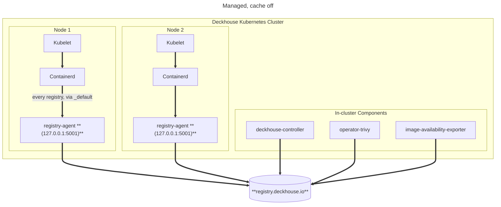
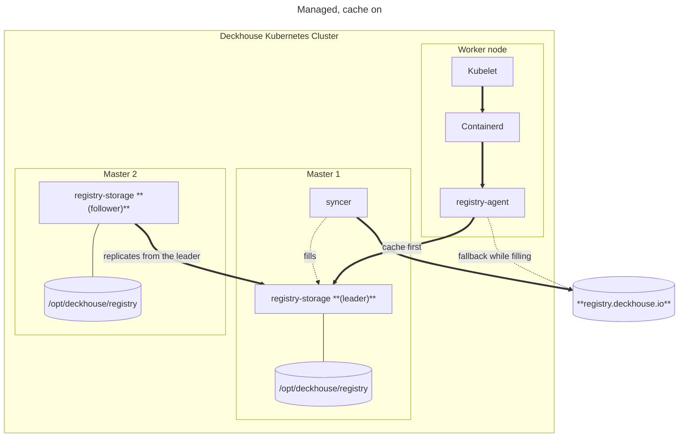
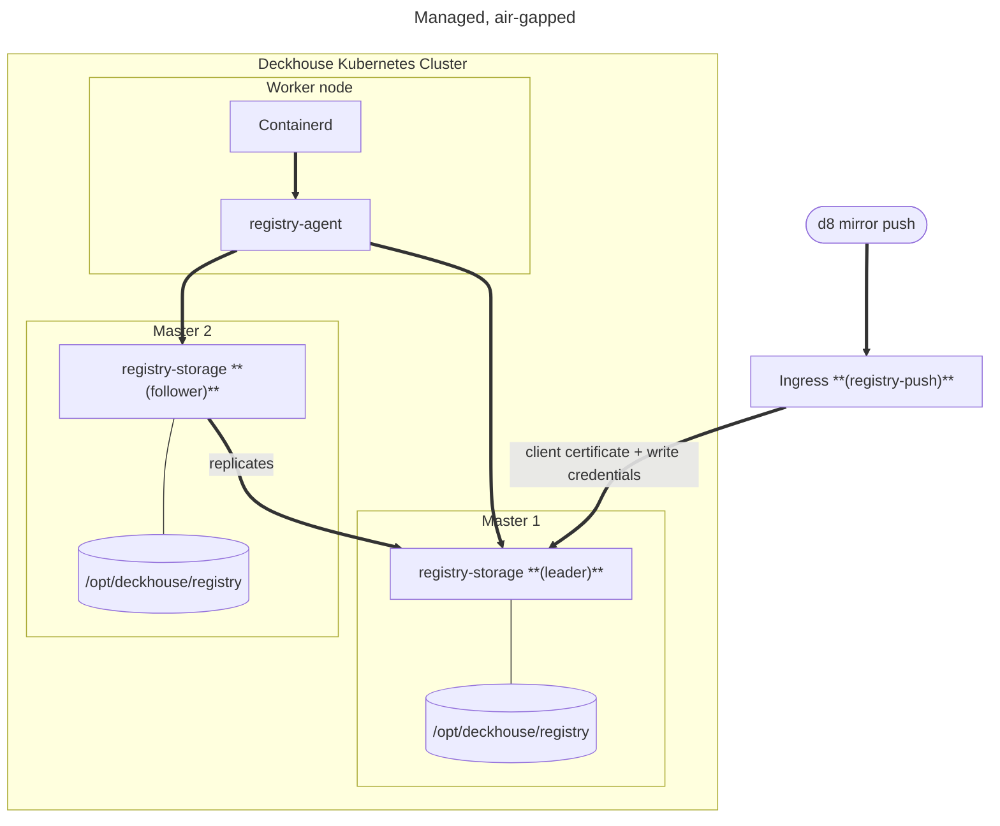

# Managed

Source for the architecture diagram of the current implementation. Rendered to
`docs/images/managed-{en,ru}.png` the same way the mode diagrams beside it are.

## Architecture, with the cache off

Every node runs an agent. The container runtime is pointed at it once — at
`127.0.0.1:5001`, through containerd's `_default` fallback — and asks it about every
registry, passing the original registry name along. The agent decides per request where
that goes.

This is what makes the node configuration static: turning the cache on, adding an upstream,
changing credentials — none of it rewrites anything on a node.

## Architecture, with the cache on

The cache runs on the control-plane nodes and keeps its blobs on the host. An agent reaches
a replica by node address, not by the service name: it runs in the host network, where a
cluster DNS name does not resolve — `registry.d8-system.svc:5001` identifies the image set
and is what image references are built from, but nothing dials it.

The upstream stays in each node's layout as a fallback while the cache is filling, so a
cache miss is a slower pull rather than a failed one.

## Architecture, air-gapped

With no upstream configured the cache is the only source of images, and `d8 mirror push`
is the only way in. It arrives through the publication endpoint, which requires a client
certificate from the ingress on top of credentials: this is the one path that can replace
an image, so a leaked password must not be enough to use it.

The upstream is removed from the node layouts only once the cache leader holds the whole
expected set — that is the single conditional transition in this design, and the only one
that could cut every node off from images.

