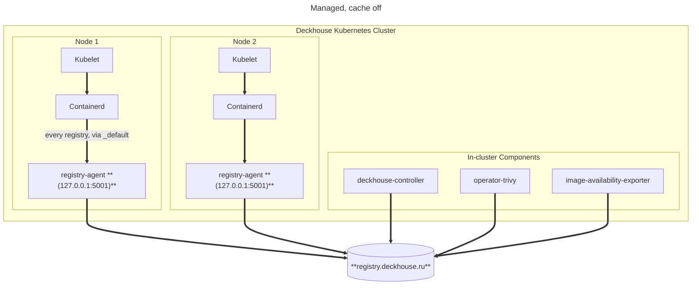
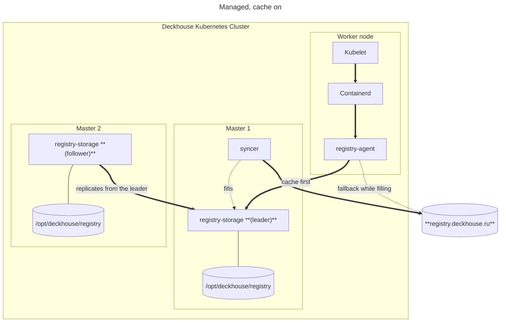
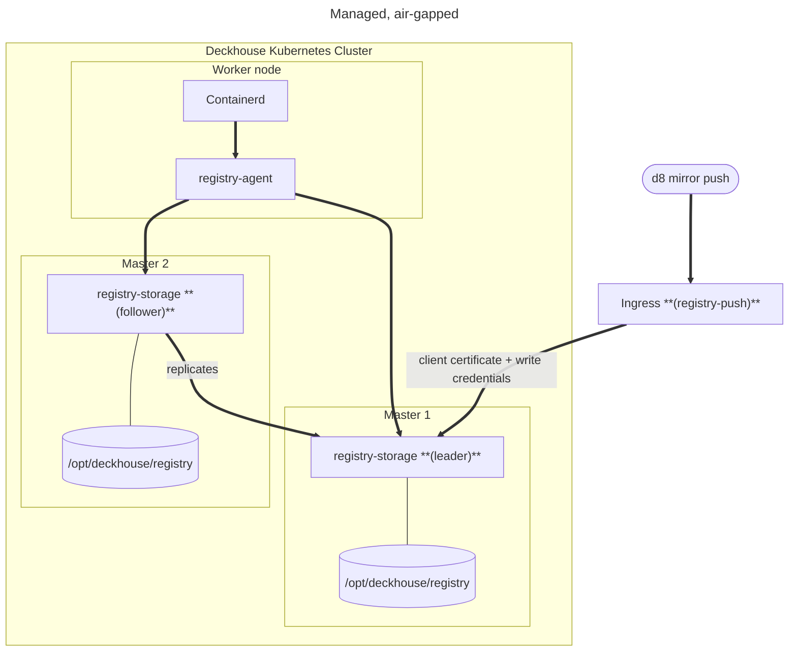

# Managed

Исходник схемы архитектуры текущей реализации. Рендерится в
`docs/images/managed-{en,ru}.png` так же, как лежащие рядом схемы режимов.

## Архитектура, кэш выключен

На каждом узле работает агент. Container runtime направляется на него один раз — на
`127.0.0.1:5001`, через fallback `_default` в containerd — и спрашивает его о любом
registry, передавая рядом исходное имя registry. Куда это уйдёт, агент решает на каждый
запрос.

Именно это делает конфигурацию узла статичной: включение кэша, добавление upstream, смена
учётных данных — ничто из этого не перезаписывает на узле ничего.

## Архитектура, кэш включён

Кэш работает на control-plane узлах и держит свои blob'ы на хосте. Агент обращается к
реплике по адресу узла, а не по имени сервиса: он работает в сетевом пространстве хоста, где
имя cluster DNS не разрешается — `registry.d8-system.svc:5001` идентифицирует набор образов
и из него строятся ссылки на образы, но никто по этому имени не дозванивается.

Upstream остаётся в конфигурации каждого узла как fallback, пока кэш наполняется, поэтому
промах кэша — это более медленная загрузка, а не неудачная.

## Архитектура, изолированный кластер

Если upstream не задан, кэш — единственный источник образов, а `d8 mirror push` —
единственный путь внутрь. Он приходит через endpoint публикации, который помимо учётных
данных требует клиентский сертификат от ingress: это единственный путь, по которому образ
можно заменить, и утёкшего пароля для него быть недостаточно.

Upstream убирается из конфигураций узлов только после того, как лидер кэша держит весь
ожидаемый набор — это единственный условный переход в этом дизайне и единственный, который
мог бы отрезать все узлы от образов.

