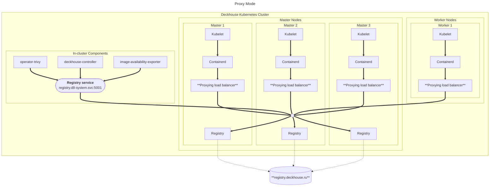

# Proxy

## Архитектура Proxy режима

```mermaid
---
title: Proxy Mode
---
flowchart TD
    subgraph DeckhouseK8sCluster["Deckhouse Kubernetes Cluster"]
        subgraph InCluster["In-cluster Components"]
            operator[operator-trivy]
            controller[deckhouse-controller]
            exporter[image-availability-exporter]
            registrySVC(["<b>Registry service</b><br/>registry.d8-system.svc:5001"])
        end

        subgraph MasterNodes["Master Nodes"]
            subgraph Master1["Master 1"]
                kubelet1[Kubelet]
                containerd1[Containerd]
                proxy1["**Proxying load balancer**"]
                registry1[Registry]
            end
            
            subgraph Master2["Master 2"]
                kubelet2[Kubelet]
                containerd2[Containerd]
                proxy2["**Proxying load balancer**"]
                registry2[Registry]
                centralPoint((" "))
            end
            
            subgraph Master3["Master 3"]
                kubelet3[Kubelet]
                containerd3[Containerd]
                proxy3["**Proxying load balancer**"]
                registry3[Registry]
            end
        end

        subgraph WorkerNodes["Worker Nodes"]
            subgraph Worker1["Worker 1"]
                kubelet4[Kubelet]
                containerd4[Containerd]
                proxy4["**Proxying load balancer**"]
            end
        end

        operator ==> registrySVC
        controller ==> registrySVC
        exporter ==> registrySVC

        registrySVC === centralPoint

        kubelet1 ==> containerd1
        kubelet2 ==> containerd2
        kubelet3 ==> containerd3
        kubelet4 ==> containerd4

        containerd1 ==> proxy1
        containerd2 ==> proxy2
        containerd3 ==> proxy3
        containerd4 ==> proxy4

        proxy1 === centralPoint
        proxy2 === centralPoint
        proxy3 === centralPoint
        proxy4 === centralPoint

        centralPoint ==> registry1
        centralPoint ==> registry2
        centralPoint ==> registry3
    end

    registryExternal[("**registry.deckhouse.ru**")]

    registry1 -.-> registryExternal
    registry2 -.-> registryExternal
    registry3 -.-> registryExternal
```
