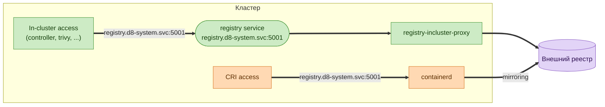
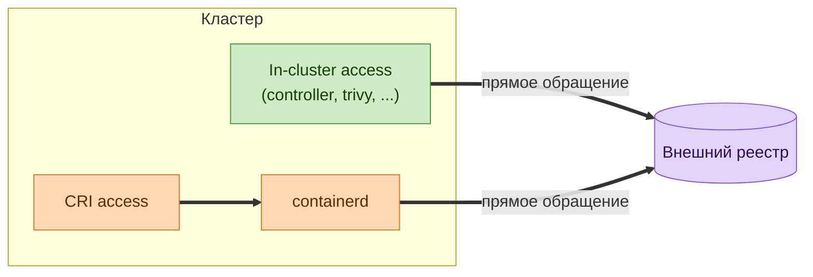
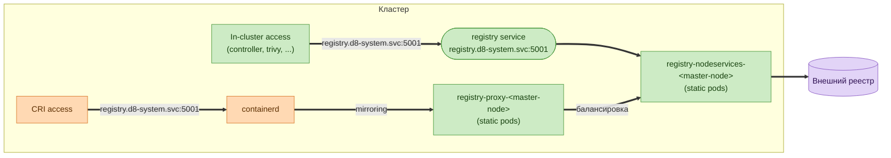
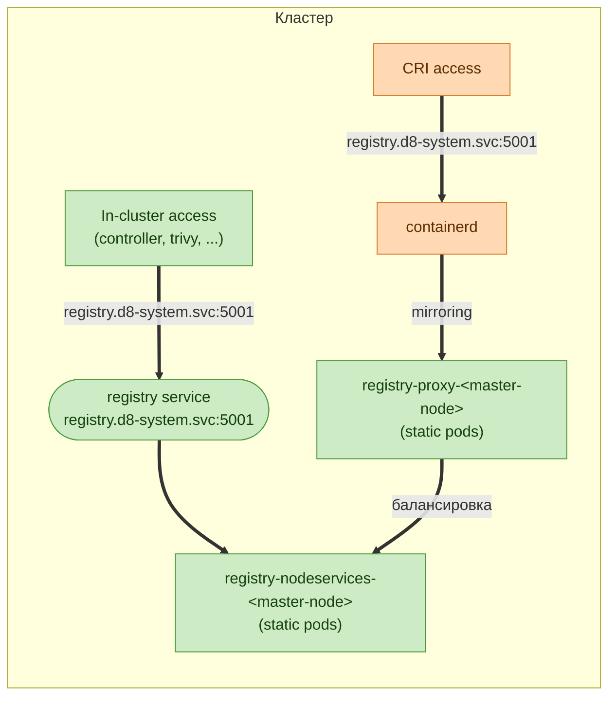

```mermaid
flowchart LR
    A["RegistryContainsRequiredImages<br/>проверка внешнего реестра"]
    B["ContainerdConfigPreflightReady<br/>preflight узлов"]
    C["TransitionContainerdConfigReady<br/>containerd: старый + новый источник"]
    D["InClusterProxyReady<br/>раскатка registry-incluster-proxy"]
    E["DeckhouseRegistrySwitchReady<br/>переключение DKP на новый registry"]
    F["FinalContainerdConfigReady<br/>containerd: только новый источник"]
    G["CleanupNodeServices<br/>остановка node-services (если были)"]
    H["Ready<br/>mode = Direct"]

    A --> B --> C --> D --> E --> F --> G --> H

    classDef cond fill:#fff3c4,stroke:#d4a72c,color:#3d3000;
    class A,B,C,D,E,F,G,H cond;
```

```mermaid
flowchart LR
    A["RegistryContainsRequiredImages<br/>проверка внешнего реестра"]
    B["TransitionContainerdConfigReady<br/>containerd: старый + новый источник"]
    C["DeckhouseRegistrySwitchReady<br/>переключение DKP на новый registry"]
    D["FinalContainerdConfigReady<br/>containerd: только новый источник (прямой)"]
    E["CleanupNodeServices<br/>удаление node-services (если были)"]
    F["CleanupInClusterProxy<br/>удаление registry-incluster-proxy (если был)"]
    G["Ready<br/>mode = Unmanaged"]

    A --> B --> C --> D --> E --> F --> G

    classDef cond fill:#fff3c4,stroke:#d4a72c,color:#3d3000;
    class A,B,C,D,E,F,G cond;
```

```mermaid
flowchart LR
    A["RegistryContainsRequiredImages<br/>проверка внешнего реестра"]
    B["ContainerdConfigPreflightReady<br/>preflight узлов"]
    C["NodeServicesReady<br/>раскатка registry-nodeservices-manager<br/>и static pod-ов registry-nodeservices-&lt;node&gt;"]
    D["TransitionContainerdConfigReady<br/>containerd: старый + новый источник,<br/>registry-proxy на узлах"]
    E["DeckhouseRegistrySwitchReady<br/>переключение DKP на новый registry"]
    F["FinalContainerdConfigReady<br/>containerd: только новый источник"]
    G["CleanupInClusterProxy<br/>удаление registry-incluster-proxy (если был)"]
    H["Ready<br/>mode = Proxy"]

    A --> B --> C --> D --> E --> F --> G --> H

    classDef cond fill:#fff3c4,stroke:#d4a72c,color:#3d3000;
    class A,B,C,D,E,F,G,H cond;
```

# Процесс переключения

Внутренний механизм переключения выполнен в виде finite state machine (orchestrator).
Orchestrator на каждой итерации вызова продвигает переключение на один шаг и фиксирует результат в conditions секрета
`registry-state`.
Пока текущий шаг не готов (`status: "False"`), orchestrator не переходит к следующему шагу.

## Компоненты и conditions

| Компонент                  | Описание                                                                                | В каких режимах используется |
| -------------------------- | --------------------------------------------------------------------------------------- | ---------------------------- |
| `registry-incluster-proxy` | `Deployment registry-incluster-proxy` — proxy для in-cluster обращения к registry       | `Direct`                     |
| `registry-nodeservices`    | static pod реестра на master-узлах (`registry-nodeservices-<node>`)                     | `Proxy`, `Local`             |
| `registry-proxy`           | proxy на каждом узле, балансирует запросы на `registry-nodeservices-<node>`             | `Proxy`, `Local`             |
| `service`                  | сервис `registry.d8-system.svc:5001` — точка входа для in-cluster обращения к registry  | `Direct`, `Proxy`, `Local`   |
| `ingress`                  | публичный доступ к локальному реестру (`registry.<PUBLIC_DOMAIN>`) для `d8 mirror push` | `Local`                      |
| `checker`                  | проверка наличия требуемых образов в целевом реестре                                    | все режимы                   |


| Condition                         | Описание                                                                                 |
| --------------------------------- | ---------------------------------------------------------------------------------------- |
| `RegistryContainsRequiredImages`  | проверка реестра на наличие образов DKP                                                  |
| `ContainerdConfigPreflightReady`  | preflight проверка наличия кастомных конфигов containerd                                 |
| `NodeServicesReady`               | раскатка `registry-nodeservices-manager` и static pod-ов `registry-nodeservices-<node>`  |
| `InClusterProxyReady`             | раскатка `registry-incluster-proxy` deployment-а                                         |
| `TransitionContainerdConfigReady` | bashible (transition) на узлы раскатан **переходный** конфиг containerd (старый + новый) |
| `DeckhouseRegistrySwitchReady`    | переключение DKP на новый registry (`deckhouse-registry` обновлён)                       |
| `FinalContainerdConfigReady`      | bashible (finalize) на узлах остался **только** новый источник, старый удалён            |
| `CleanupNodeServices`             | удалены `registry-nodeservices-manager` и static pod-ы `registry-nodeservices-<node>`    |
| `CleanupInClusterProxy`           | удален `registry-incluster-proxy` deployment                                             |
| `Ready`                           | итог, переход завершён, `mode == target_mode`                                            |
| `ErrTransitionNotSupported`       | ошибка, запрошен недопустимый переход (например `Proxy` → `Local`)                       |


## Переключение в режим Direct или смена параметров режима Direct

**Direct режим**:

Обращение containerd идёт напрямую в registry через виртуальный адрес `registry.d8-system.svc:5001/system/deckhouse`. Это выполняется за счет механизма mirroring в containerd. Обращение к `registry.d8-system.svc:5001/system/deckhouse` транслируется в upstream registry.

In-cluster обращение выполняется через внутренний некешируемый proxy-сервис `registry-incluster-proxy`. Обращение к нему выполняется через реальный сервис `registry.d8-system.svc`. На уровне `registry-incluster-proxy` обращение к `registry.d8-system.svc:5001/system/deckhouse` транслируется в upstream registry.

**Переключение**:




### Этап 1 — `RegistryContainsRequiredImages`

Данный этап выполняет внутренний компонент `checker`.
`checker` выполняет проверку наличия необходимых (critical) компонентов во внешнем registry.
```bash
# Checker проверит наличие образов следующих модулей
$ kubectl get modules -o json | jq -r '.items[] | select(.properties.critical == true and .properties.source == "Embedded") | .metadata.name'
cloud-provider-aws
cni-cilium
deckhouse
node-manager
registry
...
```

**Что делать, если этап не прошел**: см. [RUNBOOK.md → `RegistryContainsRequiredImages`](RUNBOOK.md#registrycontainsrequiredimages).


### Этап 2 — `ContainerdConfigPreflightReady`

На этом этапе выполняется проверка наличия старой версии кастомных конфигов registry в containerd v1, добавляемых через механизм `toml-merge` в скриптах bashible-бандла.
Проверка наличия конфигов выполняется через проверку лейбла `node.deckhouse.io/containerd-config-registry=custom` на узле, который устанавливает bashible.

Если кастомных конфигов нет — продолжится выполнение следующих шагов.

**Что делать, если этап не прошел**: см. [RUNBOOK.md → `ContainerdConfigPreflightReady`](RUNBOOK.md#containerdconfigpreflightready).


### Этап 3 — `TransitionContainerdConfigReady`

На узлы раскатывается переходный конфиг containerd: активны оба источника — старый и новый.

Взаимодействие выполняется через секрет `registry-bashible-config`. Его конфигурирует оркестратор, который следит за версией конфигурации через аннотацию `registry.deckhouse.io/version=...` на узле.

Данный конфиг получает `bashible-api-server`. Bashible конфигурирует registry-конфиг в containerd и проставляет на узле аннотацию с принятой раскатанной версией.

Если переключение выполнялось из режима Unmanaged, в директории конфигурации будет 2 папки:
```bash
$ ls -alh /etc/containerd/registry.d/
some-nexus.io # конфигурация Unmanaged режима
registry.d8-system.svc:5001 # Конфигурация Direct режима
...
```

Если переключение выполнялось из режима Proxy/Local/Direct в режим Direct, в конфигурации будет 1 папка:
```bash
$ ls -alh /etc/containerd/registry.d/
registry.d8-system.svc:5001 # Конфигурация Old + New
...
```

Внутри будет расположен файл конфигурации `host.toml` с mirror массивом для старой и новой версии конфигурации:
```bash
$ cat /etc/containerd/registry.d/registry.d8-system.svc:5001/host.toml
[host]
  [host."https://old-nexus.io"]
    capabilities = ["pull", "resolve"]
    [host."https://old-nexus.io".auth]
      username = "old nexus username"
      password = "old nexus password"
    [[host."https://old-nexus.io".rewrite]]
      regex = "^system/deckhouse"
      replace = "nexus/internal/registry/path"

  [host."https://new-nexus.io"]
    capabilities = ["pull", "resolve"]
    [host."https://new-nexus.io".auth]
      username = "new nexus username"
      password = "new nexus password"
    [[host."https://new-nexus.io".rewrite]]
      regex = "^system/deckhouse"
      replace = "nexus/internal/registry/path"
```

**Что делать, если этап не прошел**: см. [RUNBOOK.md → `TransitionContainerdConfigReady`](RUNBOOK.md#transitioncontainerdconfigready).


### Этап 4 — `InClusterProxyReady`

На данном этапе на master-узлах кластера поднимается `Deployment` `registry-incluster-proxy`.
Если кластер находится в HA режиме — поднимается несколько экземпляров.

На данном этапе только поднимается компонент. Переключение на его использование пока не выполняется.

> [!IMPORTANT]
> Данных этап в Direct режиме должен выполниться после раскатки bashible. Тк для раскатки bashible требудется RPP + старый registry.

**Что делать, если этап не прошел**: см. [RUNBOOK.md → `InClusterProxyReady`](RUNBOOK.md#inclusterproxyready).


### Этап 5 — `DeckhouseRegistrySwitchReady`

К данному этапу подготовлены:
- Старый и новый конфиг registry в containerd;
- Incluster proxy компонент для Direct режима;

Здесь выполняется переключение DKP на использование подготовленных компонентов registry.
В момент переключения выполняется:
1. Переключение сервиса `registry.d8-system.svc:5001` с компонентов прошлого режима (например, static pod из режима Proxy/Local) на компонент incluster-proxy.
2. Обновление секрета `deckhouse-registry` (это основная конфигурация registry для всего DKP).

После переключения DKP начинает смотреть на новый сконфигурированный режим/registry:
- внутренние компоненты — через `registry.d8-system.svc:5001` на `incluster-proxy`;
- containerd — использует новую конфигурацию (это либо отдельный конфиг, либо новый настроенный mirror).

Дополнительно запускается механизм ожидания DKP:
- проверка аннотации `registry.deckhouse.io/version=...` на deployment deckhouse (проверка, что deckhouse использует новую версию registry);
- проверка, что deckhouse находится в состоянии ready. Состояние ready описывает, выполнился ли первый прогон хуков и рендеринг манифестов для всех модулей.

После выполнения данного этапа запускается процесс очистки старой конфигурации registry.



**Что делать, если этап не прошел**: см. [RUNBOOK.md → `DeckhouseRegistrySwitchReady`](RUNBOOK.md#deckhouseregistryswitchready).


### Этап 6 — `FinalContainerdConfigReady`

На данном этапе выполняется очистка старой конфигурации registry в containerd.
На узлы раскатывается финальный конфиг containerd.

Взаимодействие выполняется через секрет `registry-bashible-config`. Его конфигурирует оркестратор, который следит за версией конфигурации через аннотацию `registry.deckhouse.io/version=...` на узле.

Данный конфиг получает `bashible-api-server`. Bashible конфигурирует registry-конфиг в containerd и проставляет на узле аннотацию с принятой раскатанной версией конфига.

На узлах должна остаться одна конфигурация registry:
```bash
$ cat /etc/containerd/registry.d/registry.d8-system.svc:5001/host.toml
[host]
  [host."https://new-nexus.io"]
    capabilities = ["pull", "resolve"]
    [host."https://new-nexus.io".auth]
      username = "new nexus username"
      password = "new nexus password"
    [[host."https://new-nexus.io".rewrite]]
      regex = "^system/deckhouse"
      replace = "nexus/internal/registry/path"
```

**Что делать, если этап не прошел**: см. [RUNBOOK.md → `FinalContainerdConfigReady`](RUNBOOK.md#finalcontainerdconfigready).


### Этап 7 — `CleanupNodeServices`

На данном этапе компоненты режима Local/Proxy уже не используются. Эти компоненты удаляются из кластера.

Daemonset `registry-nodeservices-manager` удаляет static pod-ы `registry-nodeservices-<node>` с master-узлов. После успешного удаления из кластера удаляется сам `registry-nodeservices-manager`.

**Что делать, если этап не прошел**: см. [RUNBOOK.md → `CleanupNodeServices`](RUNBOOK.md#cleanupnodeservices).


## Переключение в режим Unmanaged или смена параметров режима Unmanaged

**Unmanaged режим**:

В режиме Unmanaged обращение к внешнему registry идёт напрямую.

Никакие дополнительные компоненты не используются: `registry-incluster-proxy`, `registry-nodeservices-<node>` и `registry-proxy` не запускаются, сервис `registry.d8-system.svc:5001` отключён.

> [!IMPORTANT]
> Переход `Local` → неконфигурируемый `Unmanaged` **не поддерживается**.
> При недопустимом переходе выставляется ошибка `ErrTransitionNotSupported`.

**Переключение**:



### Этап 1 — `RegistryContainsRequiredImages`

Данный этап выполняет внутренний компонент `checker`.
`checker` выполняет проверку наличия необходимых (critical) компонентов во внешнем registry.
```bash
# Checker проверит наличие образов следующих модулей
$ kubectl get modules -o json | jq -r '.items[] | select(.properties.critical == true and .properties.source == "Embedded") | .metadata.name'
cloud-provider-aws
cni-cilium
deckhouse
node-manager
registry
...
```

**Что делать, если этап не прошел**: см. [RUNBOOK.md → `RegistryContainsRequiredImages`](RUNBOOK.md#registrycontainsrequiredimages).


### Этап 2 — `TransitionContainerdConfigReady`

На узлы раскатывается переходный конфиг containerd: активны оба источника — старый и новый.

Взаимодействие выполняется через секрет `registry-bashible-config`. Его конфигурирует оркестратор, который следит за версией конфигурации через аннотацию `registry.deckhouse.io/version=...` на узле.

Данный конфиг получает `bashible-api-server`. Bashible конфигурирует registry-конфиг в containerd и проставляет на узле аннотацию с принятой раскатанной версией.

В отличие от режимов `Direct`/`Proxy`/`Local`, новый источник в Unmanaged указывает **напрямую на реальный адрес внешнего registry** — без виртуального адреса `registry.d8-system.svc:5001` и без rewrite.

Если переключение выполнялось из режима Direct/Local/Proxy в режим Unmanaged, в конфигурации будет 2 папки:
```bash
$ ls -alh /etc/containerd/registry.d/
registry.d8-system.svc:5001 # конфигурация предыдущего режима (Direct/Local/Proxy)
some-nexus.io               # конфигурация Unmanaged режима
...
```

Внутри папки нового источника будет расположен файл конфигурации `host.toml` с прямым обращением к внешнему registry:
```bash
$ cat /etc/containerd/registry.d/some-nexus.io/host.toml
[host]
  [host."https://some-nexus.io"]
    capabilities = ["pull", "resolve"]
    [host."https://some-nexus.io".auth]
      username = "nexus username"
      password = "nexus password"
```

**Что делать, если этап не прошел**: см. [RUNBOOK.md → `TransitionContainerdConfigReady`](RUNBOOK.md#transitioncontainerdconfigready).


### Этап 3 — `DeckhouseRegistrySwitchReady`

К данному этапу подготовлены:
- Старый и новый конфиг registry в containerd (новый — с прямым обращением);

Здесь выполняется переключение DKP на использование внешнего registry напрямую.
В момент переключения выполняется:
1. Отключение сервиса `registry.d8-system.svc:5001` (`RegistryService = Disabled`) — точка входа предыдущего режима больше не используется.
2. Обновление секрета `deckhouse-registry` (это основная конфигурация registry для всего DKP) на прямой адрес.

После переключения DKP обращается во внешний registry без промежуточных компонентов:
- внутренние компоненты — без сервиса и proxy;
- containerd — использует новую конфигурацию.

Дополнительно запускается механизм ожидания DKP:
- проверка аннотации `registry.deckhouse.io/version=...` на deployment deckhouse (проверка, что deckhouse использует новую версию registry);
- проверка, что deckhouse находится в состоянии ready. Состояние ready описывает, выполнился ли первый прогон хуков и рендеринг манифестов для всех модулей.

После выполнения данного этапа запускается процесс очистки старой конфигурации registry.



**Что делать, если этап не прошел**: см. [RUNBOOK.md → `DeckhouseRegistrySwitchReady`](RUNBOOK.md#deckhouseregistryswitchready).


### Этап 4 — `FinalContainerdConfigReady`

На данном этапе выполняется очистка старой конфигурации registry в containerd.
На узлы раскатывается финальный конфиг containerd.

Взаимодействие выполняется через секрет `registry-bashible-config`. Его конфигурирует оркестратор, который следит за версией конфигурации через аннотацию `registry.deckhouse.io/version=...` на узле.

Данный конфиг получает `bashible-api-server`. Bashible конфигурирует registry-конфиг в containerd и проставляет на узле аннотацию с принятой раскатанной версией конфига.

На узлах должна остаться одна конфигурация registry — прямое обращение к внешнему registry:
```bash
$ ls -alh /etc/containerd/registry.d/
some-nexus.io # единственная конфигурация
...

$ cat /etc/containerd/registry.d/some-nexus.io/host.toml
[host]
  [host."https://some-nexus.io"]
    capabilities = ["pull", "resolve"]
    [host."https://some-nexus.io".auth]
      username = "nexus username"
      password = "nexus password"
```

**Что делать, если этап не прошел**: см. [RUNBOOK.md → `FinalContainerdConfigReady`](RUNBOOK.md#finalcontainerdconfigready).


### Этап 5 — `CleanupNodeServices`

На данном этапе компоненты режима Local/Proxy уже не используются. Эти компоненты удаляются из кластера.

Daemonset `registry-nodeservices-manager` удаляет static pod-ы `registry-nodeservices-<node>` с master-узлов. После успешного удаления из кластера удаляется сам `registry-nodeservices-manager`.

**Что делать, если этап не прошел**: см. [RUNBOOK.md → `CleanupNodeServices`](RUNBOOK.md#cleanupnodeservices).


### Этап 6 — `CleanupInClusterProxy`

На данном этапе компоненты режима Direct уже не используются. `Deployment` `registry-incluster-proxy` удаляется из кластера.

**Что делать, если этап не прошел**: см. [RUNBOOK.md → `CleanupInClusterProxy`](RUNBOOK.md#cleanupinclusterproxy).


## Переключение в режим Proxy или смена параметров режима Proxy

**Proxy режим**:

Обращение containerd идёт через виртуальный адрес `registry.d8-system.svc:5001/system/deckhouse` в компонент `registry-proxy`, запущенный на каждом узле. `registry-proxy` балансирует запрос на компоненты `registry-nodeservices-<node>`, расположенные на master-узлах. Компоненты `registry-nodeservices-<node>` запущены в proxy-режиме. Запросы к ним транслируются в upstream registry.

In-cluster обращение выполняется через компоненты `registry-nodeservices-<node>`. Обращение к ним выполняется через реальный сервис `registry.d8-system.svc`.

> [!IMPORTANT]
> Переход `Local` → `Proxy` **не поддерживается**.
> При недопустимом переходе выставляется ошибка `ErrTransitionNotSupported`.

**Переключение**:



### Этап 1 — `RegistryContainsRequiredImages`

Данный этап выполняет внутренний компонент `checker`.
`checker` выполняет проверку наличия необходимых (critical) компонентов во внешнем registry.
```bash
# Checker проверит наличие образов следующих модулей
$ kubectl get modules -o json | jq -r '.items[] | select(.properties.critical == true and .properties.source == "Embedded") | .metadata.name'
cloud-provider-aws
cni-cilium
deckhouse
node-manager
registry
...
```

**Что делать, если этап не прошел**: см. [RUNBOOK.md → `RegistryContainsRequiredImages`](RUNBOOK.md#registrycontainsrequiredimages).


### Этап 2 — `ContainerdConfigPreflightReady`

На этом этапе выполняется проверка наличия старой версии кастомных конфигов registry в containerd v1, добавляемых через механизм `toml-merge` в скриптах bashible-бандла.
Проверка наличия конфигов выполняется через проверку лейбла `node.deckhouse.io/containerd-config-registry=custom` на узле, который устанавливает bashible.

Если кастомных конфигов нет — продолжится выполнение следующих шагов.

**Что делать, если этап не прошел**: см. [RUNBOOK.md → `ContainerdConfigPreflightReady`](RUNBOOK.md#containerdconfigpreflightready).


### Этап 3 — `NodeServicesReady`

На данном этапе на master-узлах кластера поднимается `Daemonset` `registry-nodeservices-manager`.
Manager поднимает static pod-ы `registry-nodeservices-<node>` на master-узлах кластера.

На данном этапе только поднимаются компоненты. Переключение на их использование пока не выполняется.

**Что делать, если этап не прошел**: см. [RUNBOOK.md → `NodeServicesReady`](RUNBOOK.md#nodeservicesready).


### Этап 4 — `TransitionContainerdConfigReady`
На узлы раскатывается переходный конфиг containerd: активны оба источника — старый и новый.

Взаимодействие выполняется через секрет `registry-bashible-config`. Его конфигурирует оркестратор, который следит за версией конфигурации через аннотацию `registry.deckhouse.io/version=...` на узле.

Данный конфиг получает `bashible-api-server`. Bashible конфигурирует registry-конфиг в containerd и проставляет на узле аннотацию с принятой раскатанной версией.

Если переключение выполнялось из режима Unmanaged, в директории конфигурации будет 2 папки:
```bash
$ ls -alh /etc/containerd/registry.d/
some-nexus.io # конфигурация Unmanaged режима
registry.d8-system.svc:5001 # Конфигурация Proxy режима
...
```

Если переключение выполнялось из режима Direct в режим Proxy, в конфигурации будет 1 папка:
```bash
$ ls -alh /etc/containerd/registry.d/
registry.d8-system.svc:5001 # Конфигурация Old + New
...
```

Внутри будет расположен файл конфигурации `host.toml` с mirror массивом для старой и новой версии конфигурации:
```bash
$ cat /etc/containerd/registry.d/registry.d8-system.svc:5001/host.toml
[host]
  # старая конфигурация
  [host."https://old-nexus.io"]
    capabilities = ["pull", "resolve"]
    [host."https://old-nexus.io".auth]
      username = "old nexus username"
      password = "old nexus password"
    [[host."https://old-nexus.io".rewrite]]
      regex = "^system/deckhouse"
      replace = "nexus/internal/registry/path"

  # новая конфигурация (обращение через registry-proxy)
  [host."https://127.0.0.1:5001"]
    capabilities = ["pull", "resolve"]
    [host."https://127.0.0.1:5001".auth]
      username = "proxy registry username"
      password = "proxy registry password"
```

Также bashible запускает static pod `registry-proxy` на всех узлах кластера.
Данный static pod используется для балансировки обращений к registry, расположенным на master-узлах.

**Что делать, если этап не прошел**: см. [RUNBOOK.md → `TransitionContainerdConfigReady`](RUNBOOK.md#transitioncontainerdconfigready).


### Этап 5 — `DeckhouseRegistrySwitchReady`

К данному этапу подготовлены:
- Старый и новый конфиг registry в containerd;
- `registry-proxy` static pod на каждом узле;
- `registry-nodeservices-<node>` static pod на master-узлах;

Здесь выполняется переключение DKP на использование подготовленных компонентов registry.
В момент переключения выполняется:
1. Переключение сервиса `registry.d8-system.svc:5001` с компонентов прошлого режима (например, `registry-incluster-proxy` из режима Direct) на компоненты `registry-nodeservices-<node>`.
2. Обновление секрета `deckhouse-registry` (это основная конфигурация registry для всего DKP).

После переключения DKP начинает смотреть на новый сконфигурированный режим/registry:
- внутренние компоненты — через `registry.d8-system.svc:5001` на `registry-nodeservices-<node>`;
- containerd — через `registry-proxy` на `registry-nodeservices-<node>`;

Дополнительно запускается механизм ожидания DKP:
- проверка аннотации `registry.deckhouse.io/version=...` на deployment deckhouse (проверка, что deckhouse использует новую версию registry);
- проверка, что deckhouse находится в состоянии ready. Состояние ready описывает, выполнился ли первый прогон хуков и рендеринг манифестов для всех модулей.

После выполнения данного этапа запускается процесс очистки старой конфигурации registry.



**Что делать, если этап не прошел**: см. [RUNBOOK.md → `DeckhouseRegistrySwitchReady`](RUNBOOK.md#deckhouseregistryswitchready).

### Этап 6 — `FinalContainerdConfigReady`

На данном этапе выполняется очистка старой конфигурации registry в containerd.
На узлы раскатывается финальный конфиг containerd.

Взаимодействие выполняется через секрет `registry-bashible-config`. Его конфигурирует оркестратор, который следит за версией конфигурации через аннотацию `registry.deckhouse.io/version=...` на узле.

Данный конфиг получает `bashible-api-server`. Bashible конфигурирует registry-конфиг в containerd и проставляет на узле аннотацию с принятой раскатанной версией конфига.

На узлах должна остаться одна конфигурация registry:
```bash
$ cat /etc/containerd/registry.d/registry.d8-system.svc:5001/host.toml
[host]
  # новая конфигурация (обращение через registry-proxy)
  [host."https://127.0.0.1:5001"]
    capabilities = ["pull", "resolve"]
    [host."https://127.0.0.1:5001".auth]
      username = "proxy registry username"
      password = "proxy registry password"
```

**Что делать, если этап не прошел**: см. [RUNBOOK.md → `FinalContainerdConfigReady`](RUNBOOK.md#finalcontainerdconfigready).


### Этап 7 — `CleanupInClusterProxy`

На данном этапе компоненты режима Direct уже не используются. `Deployment` `registry-incluster-proxy` удаляется из кластера.

**Что делать, если этап не прошел**: см. [RUNBOOK.md → `CleanupInClusterProxy`](RUNBOOK.md#cleanupinclusterproxy).


## Переключение в режим Local

**Local режим**:

Обращение containerd идёт через виртуальный адрес `registry.d8-system.svc:5001/system/deckhouse` в компонент `registry-proxy`, запущенный на каждом узле. `registry-proxy` балансирует запрос на компоненты `registry-nodeservices-<node>`, расположенные на master-узлах. Компоненты `registry-nodeservices-<node>` запущены в Local-режиме. Образы берутся из Local хранилища локального реестра.

In-cluster обращение выполняется через компоненты `registry-nodeservices-<node>`. Обращение к ним выполняется через реальный сервис `registry.d8-system.svc`.

> [!IMPORTANT]
> Переход `Proxy` → `Local` **не поддерживается**.
> При недопустимом переходе выставляется ошибка `ErrTransitionNotSupported`.

**Переключение**:




```mermaid
flowchart LR
    A["ContainerdConfigPreflightReady<br/>preflight узлов"]
    B["NodeServicesReady<br/>раскатка registry-nodeservices-manager<br/>и static pod-ов registry-nodeservices-&lt;node&gt;"]
    C["RegistryContainsRequiredImages<br/>проверка локального реестра"]
    D["TransitionContainerdConfigReady<br/>containerd: старый + новый источник,<br/>registry-proxy на узлах"]
    E["DeckhouseRegistrySwitchReady<br/>переключение DKP на новый registry"]
    F["FinalContainerdConfigReady<br/>containerd: только новый источник"]
    G["CleanupInClusterProxy<br/>удаление registry-incluster-proxy (если был)"]
    H["Ready<br/>mode = Local"]

    A --> B --> C --> D --> E --> F --> G --> H

    classDef cond fill:#fff3c4,stroke:#d4a72c,color:#3d3000;
    class A,B,C,D,E,F,G,H cond;
```

### Этап 1 — `ContainerdConfigPreflightReady`

На этом этапе выполняется проверка наличия старой версии кастомных конфигов registry в containerd v1, добавляемых через механизм `toml-merge` в скриптах bashible-бандла.
Проверка наличия конфигов выполняется через проверку лейбла `node.deckhouse.io/containerd-config-registry=custom` на узле, который устанавливает bashible.

Если кастомных конфигов нет — продолжится выполнение следующих шагов.

**Что делать, если этап не прошел**: см. [RUNBOOK.md → `ContainerdConfigPreflightReady`](RUNBOOK.md#containerdconfigpreflightready).


### Этап 3 — `NodeServicesReady`

На данном этапе на master-узлах кластера поднимается `Daemonset` `registry-nodeservices-manager`.
Manager поднимает static pod-ы `registry-nodeservices-<node>` на master-узлах кластера.

На данном этапе только поднимаются компоненты. Переключение на их использование пока не выполняется.

**Что делать, если этап не прошел**: см. [RUNBOOK.md → `NodeServicesReady`](RUNBOOK.md#nodeservicesready).


### Этап 2 — `RegistryContainsRequiredImages`

Данный этап выполняет внутренний компонент `checker`.
`checker` выполняет проверку наличия необходимых (critical) компонентов в локальном registry.
```bash
# Checker проверит наличие образов следующих модулей
$ kubectl get modules -o json | jq -r '.items[] | select(.properties.critical == true and .properties.source == "Embedded") | .metadata.name'
cloud-provider-aws
cni-cilium
deckhouse
node-manager
registry
...
```

> [!IMPORTANT]
> Этап будет отображать ошибку, пока пользователь не выполнит `d8 mirror push` заранее подготовленного img bundle.


**Что делать, если этап не прошел**: см. [RUNBOOK.md → `RegistryContainsRequiredImages`](RUNBOOK.md#registrycontainsrequiredimages).


### Этап 4 — `TransitionContainerdConfigReady`
На узлы раскатывается переходный конфиг containerd: активны оба источника — старый и новый.

Взаимодействие выполняется через секрет `registry-bashible-config`. Его конфигурирует оркестратор, который следит за версией конфигурации через аннотацию `registry.deckhouse.io/version=...` на узле.

Данный конфиг получает `bashible-api-server`. Bashible конфигурирует registry-конфиг в containerd и проставляет на узле аннотацию с принятой раскатанной версией.

Если переключение выполнялось из режима Unmanaged, в директории конфигурации будет 2 папки:
```bash
$ ls -alh /etc/containerd/registry.d/
some-nexus.io # конфигурация Unmanaged режима
registry.d8-system.svc:5001 # Конфигурация Local режима
...
```

Если переключение выполнялось из режима Direct в режим Local, в конфигурации будет 1 папка:
```bash
$ ls -alh /etc/containerd/registry.d/
registry.d8-system.svc:5001 # Конфигурация Old + New
...
```

Внутри будет расположен файл конфигурации `host.toml` с mirror массивом для старой и новой версии конфигурации:
```bash
$ cat /etc/containerd/registry.d/registry.d8-system.svc:5001/host.toml
[host]
  # старая конфигурация
  [host."https://old-nexus.io"]
    capabilities = ["pull", "resolve"]
    [host."https://old-nexus.io".auth]
      username = "old nexus username"
      password = "old nexus password"
    [[host."https://old-nexus.io".rewrite]]
      regex = "^system/deckhouse"
      replace = "nexus/internal/registry/path"

  # новая конфигурация (обращение через registry-proxy)
  [host."https://127.0.0.1:5001"]
    capabilities = ["pull", "resolve"]
    [host."https://127.0.0.1:5001".auth]
      username = "local registry username"
      password = "local registry password"
```

Также bashible запускает static pod `registry-proxy` на всех узлах кластера.
Данный static pod используется для балансировки обращений к registry, расположенным на master-узлах.

**Что делать, если этап не прошел**: см. [RUNBOOK.md → `TransitionContainerdConfigReady`](RUNBOOK.md#transitioncontainerdconfigready).


### Этап 5 — `DeckhouseRegistrySwitchReady`

К данному этапу подготовлены:
- Старый и новый конфиг registry в containerd;
- `registry-proxy` static pod на каждом узле;
- `registry-nodeservices-<node>` static pod на master-узлах;

Здесь выполняется переключение DKP на использование подготовленных компонентов registry.
В момент переключения выполняется:
1. Переключение сервиса `registry.d8-system.svc:5001` с компонентов прошлого режима (например, `registry-incluster-proxy` из режима Direct) на компоненты `registry-nodeservices-<node>`.
2. Обновление секрета `deckhouse-registry` (это основная конфигурация registry для всего DKP).

После переключения DKP начинает смотреть на новый сконфигурированный режим/registry:
- внутренние компоненты — через `registry.d8-system.svc:5001` на `registry-nodeservices-<node>`;
- containerd — через `registry-proxy` на `registry-nodeservices-<node>`;

Дополнительно запускается механизм ожидания DKP:
- проверка аннотации `registry.deckhouse.io/version=...` на deployment deckhouse (проверка, что deckhouse использует новую версию registry);
- проверка, что deckhouse находится в состоянии ready. Состояние ready описывает, выполнился ли первый прогон хуков и рендеринг манифестов для всех модулей.

После выполнения данного этапа запускается процесс очистки старой конфигурации registry.



**Что делать, если этап не прошел**: см. [RUNBOOK.md → `DeckhouseRegistrySwitchReady`](RUNBOOK.md#deckhouseregistryswitchready).

### Этап 6 — `FinalContainerdConfigReady`

На данном этапе выполняется очистка старой конфигурации registry в containerd.
На узлы раскатывается финальный конфиг containerd.

Взаимодействие выполняется через секрет `registry-bashible-config`. Его конфигурирует оркестратор, который следит за версией конфигурации через аннотацию `registry.deckhouse.io/version=...` на узле.

Данный конфиг получает `bashible-api-server`. Bashible конфигурирует registry-конфиг в containerd и проставляет на узле аннотацию с принятой раскатанной версией конфига.

На узлах должна остаться одна конфигурация registry:
```bash
$ cat /etc/containerd/registry.d/registry.d8-system.svc:5001/host.toml
[host]
  # новая конфигурация (обращение через registry-proxy)
  [host."https://127.0.0.1:5001"]
    capabilities = ["pull", "resolve"]
    [host."https://127.0.0.1:5001".auth]
      username = "local registry username"
      password = "local registry password"
```

**Что делать, если этап не прошел**: см. [RUNBOOK.md → `FinalContainerdConfigReady`](RUNBOOK.md#finalcontainerdconfigready).


### Этап 7 — `CleanupInClusterProxy`

На данном этапе компоненты режима Direct уже не используются. `Deployment` `registry-incluster-proxy` удаляется из кластера.

**Что делать, если этап не прошел**: см. [RUNBOOK.md → `CleanupInClusterProxy`](RUNBOOK.md#cleanupinclusterproxy).


