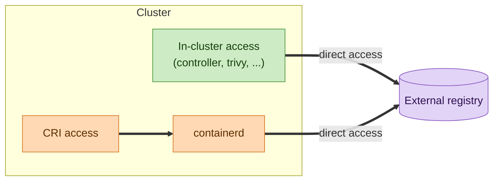
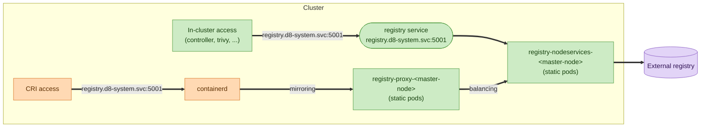
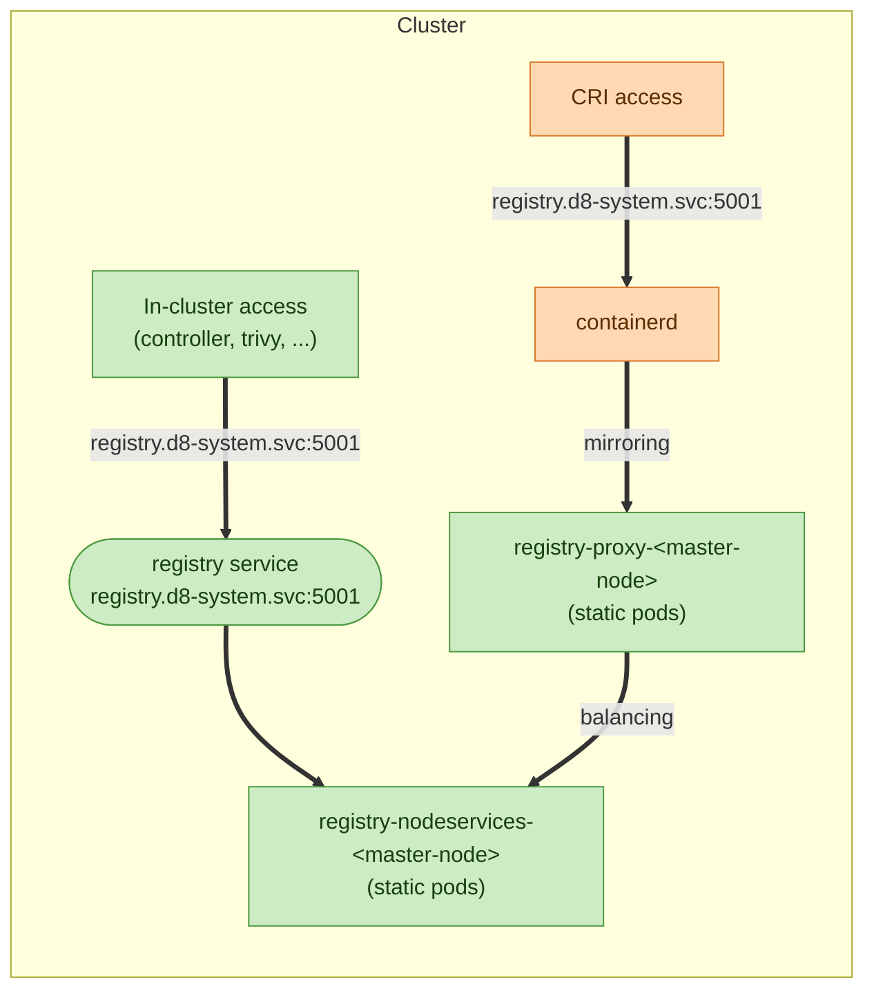

```mermaid
flowchart LR
    A["RegistryContainsRequiredImages<br/>checking the external registry"]
    B["ContainerdConfigPreflightReady<br/>node preflight"]
    C["TransitionContainerdConfigReady<br/>containerd: old + new source"]
    D["InClusterProxyReady<br/>rollout of registry-incluster-proxy"]
    E["DeckhouseRegistrySwitchReady<br/>switching DKP to the new registry"]
    F["FinalContainerdConfigReady<br/>containerd: only the new source"]
    G["CleanupNodeServices<br/>stopping node-services (if any)"]
    H["Ready<br/>mode = Direct"]

    A --> B --> C --> D --> E --> F --> G --> H

    classDef cond fill:#fff3c4,stroke:#d4a72c,color:#3d3000;
    class A,B,C,D,E,F,G,H cond;
```

```mermaid
flowchart LR
    A["RegistryContainsRequiredImages<br/>checking the external registry"]
    B["TransitionContainerdConfigReady<br/>containerd: old + new source"]
    C["DeckhouseRegistrySwitchReady<br/>switching DKP to the new registry"]
    D["FinalContainerdConfigReady<br/>containerd: only the new source (direct)"]
    E["CleanupNodeServices<br/>removing node-services (if any)"]
    F["CleanupInClusterProxy<br/>removing registry-incluster-proxy (if any)"]
    G["Ready<br/>mode = Unmanaged"]

    A --> B --> C --> D --> E --> F --> G

    classDef cond fill:#fff3c4,stroke:#d4a72c,color:#3d3000;
    class A,B,C,D,E,F,G cond;
```

```mermaid
flowchart LR
    A["RegistryContainsRequiredImages<br/>checking the external registry"]
    B["ContainerdConfigPreflightReady<br/>node preflight"]
    C["NodeServicesReady<br/>rollout of registry-nodeservices-manager<br/>and the registry-nodeservices-&lt;node&gt; static pods"]
    D["TransitionContainerdConfigReady<br/>containerd: old + new source,<br/>registry-proxy on the nodes"]
    E["DeckhouseRegistrySwitchReady<br/>switching DKP to the new registry"]
    F["FinalContainerdConfigReady<br/>containerd: only the new source"]
    G["CleanupInClusterProxy<br/>removing registry-incluster-proxy (if any)"]
    H["Ready<br/>mode = Proxy"]

    A --> B --> C --> D --> E --> F --> G --> H

    classDef cond fill:#fff3c4,stroke:#d4a72c,color:#3d3000;
    class A,B,C,D,E,F,G,H cond;
```

# Switching process

The internal switching mechanism is implemented as a finite state machine (orchestrator).
On each invocation iteration, the orchestrator advances the switching by one step and records the result in the conditions of the
`registry-state` secret.
As long as the current step is not ready (`status: "False"`), the orchestrator does not move on to the next step.

## Components and conditions

| Component                  | Description                                                                              | Modes in which it is used    |
| -------------------------- | ---------------------------------------------------------------------------------------- | ---------------------------- |
| `registry-incluster-proxy` | `Deployment registry-incluster-proxy` — proxy for in-cluster access to the registry      | `Direct`                     |
| `registry-nodeservices`    | registry static pod on master nodes (`registry-nodeservices-<node>`)                     | `Proxy`, `Local`             |
| `registry-proxy`           | proxy on each node, balances requests across `registry-nodeservices-<node>`              | `Proxy`, `Local`             |
| `service`                  | the `registry.d8-system.svc:5001` service — entry point for in-cluster access to registry | `Direct`, `Proxy`, `Local`   |
| `ingress`                  | public access to the local registry (`registry.<PUBLIC_DOMAIN>`) for `d8 mirror push`    | `Local`                      |
| `checker`                  | checks for the presence of the required images in the target registry                    | all modes                    |


| Condition                         | Description                                                                                |
| --------------------------------- | ------------------------------------------------------------------------------------------ |
| `RegistryContainsRequiredImages`  | checks the registry for the presence of DKP images                                         |
| `ContainerdConfigPreflightReady`  | preflight check for the presence of custom containerd configs                              |
| `NodeServicesReady`               | rollout of `registry-nodeservices-manager` and the `registry-nodeservices-<node>` static pods |
| `InClusterProxyReady`             | rollout of the `registry-incluster-proxy` deployment                                       |
| `TransitionContainerdConfigReady` | bashible (transition) rolled out the **transitional** containerd config (old + new) to the nodes |
| `DeckhouseRegistrySwitchReady`    | DKP switched to the new registry (`deckhouse-registry` updated)                            |
| `FinalContainerdConfigReady`      | bashible (finalize) left **only** the new source on the nodes, the old one removed         |
| `CleanupNodeServices`             | `registry-nodeservices-manager` and the `registry-nodeservices-<node>` static pods removed |
| `CleanupInClusterProxy`           | `registry-incluster-proxy` deployment removed                                              |
| `Ready`                           | result, transition complete, `mode == target_mode`                                         |
| `ErrTransitionNotSupported`       | error, an unsupported transition was requested (e.g. `Proxy` → `Local`)                    |


## Switching to Direct mode or changing Direct mode parameters

**Direct mode**:

containerd accesses the registry directly via the virtual address `registry.d8-system.svc:5001/system/deckhouse`. This is done thanks to the mirroring mechanism in containerd. A request to `registry.d8-system.svc:5001/system/deckhouse` is translated to the upstream registry.

In-cluster access is performed through the internal non-caching proxy service `registry-incluster-proxy`. It is accessed through the real service `registry.d8-system.svc`. At the `registry-incluster-proxy` level, a request to `registry.d8-system.svc:5001/system/deckhouse` is translated to the upstream registry.

**Switching**:




### Stage 1 — `RegistryContainsRequiredImages`

This stage is performed by the internal `checker` component.
The `checker` checks for the presence of the required (critical) components in the external registry.
```bash
# The checker will verify the presence of images for the following modules
$ kubectl get modules -o json | jq -r '.items[] | select(.properties.critical == true and .properties.source == "Embedded") | .metadata.name'
cloud-provider-aws
cni-cilium
deckhouse
node-manager
registry
...
```

**What to do if the stage failed**: see [RUNBOOK.md → `RegistryContainsRequiredImages`](RUNBOOK.md#registrycontainsrequiredimages).


### Stage 2 — `ContainerdConfigPreflightReady`

At this stage, a check is performed for the presence of the old version of custom registry configs in containerd v1, which are added through the `toml-merge` mechanism in the bashible bundle scripts.
The presence of the configs is checked through the label `node.deckhouse.io/containerd-config-registry=custom` on the node, which is set by bashible.

If there are no custom configs — the subsequent steps continue.

**What to do if the stage failed**: see [RUNBOOK.md → `ContainerdConfigPreflightReady`](RUNBOOK.md#containerdconfigpreflightready).


### Stage 3 — `TransitionContainerdConfigReady`

The transitional containerd config is rolled out to the nodes: both sources are active — the old and the new.

The interaction is performed through the `registry-bashible-config` secret. It is configured by the orchestrator, which tracks the configuration version through the `registry.deckhouse.io/version=...` annotation on the node.

This config is received by the `bashible-api-server`. Bashible configures the registry config in containerd and sets the annotation with the accepted, rolled-out version on the node.

If the switch was performed from Unmanaged mode, the configuration directory will contain 2 folders:
```bash
$ ls -alh /etc/containerd/registry.d/
some-nexus.io # configuration of Unmanaged mode
registry.d8-system.svc:5001 # configuration of Direct mode
...
```

If the switch was performed from Proxy/Local/Direct mode to Direct mode, the configuration will contain 1 folder:
```bash
$ ls -alh /etc/containerd/registry.d/
registry.d8-system.svc:5001 # Old + New configuration
...
```

Inside it there will be a `host.toml` configuration file with a mirror array for the old and the new configuration version:
```bash
$ cat /etc/containerd/registry.d/registry.d8-system.svc:5001/host.toml
[host]
  [host."https://old-nexus.io"]
    capabilities = ["pull", "resolve"]
    [host."https://old-nexus.io".auth]
      username = "old nexus username"
      password = "old nexus password"
    [[host."https://old-nexus.io".rewrite]]
      regex = "^system/deckhouse"
      replace = "nexus/internal/registry/path"

  [host."https://new-nexus.io"]
    capabilities = ["pull", "resolve"]
    [host."https://new-nexus.io".auth]
      username = "new nexus username"
      password = "new nexus password"
    [[host."https://new-nexus.io".rewrite]]
      regex = "^system/deckhouse"
      replace = "nexus/internal/registry/path"
```

**What to do if the stage failed**: see [RUNBOOK.md → `TransitionContainerdConfigReady`](RUNBOOK.md#transitioncontainerdconfigready).


### Stage 4 — `InClusterProxyReady`

At this stage, the `Deployment` `registry-incluster-proxy` is brought up on the cluster master nodes.
If the cluster is in HA mode — several instances are brought up.

At this stage the component is only brought up. Switching to using it is not yet performed.

> [!IMPORTANT]
> In Direct mode, this stage must be performed after the bashible rollout, because the bashible rollout requires RPP + the old registry.

**What to do if the stage failed**: see [RUNBOOK.md → `InClusterProxyReady`](RUNBOOK.md#inclusterproxyready).


### Stage 5 — `DeckhouseRegistrySwitchReady`

By this stage the following are prepared:
- The old and new registry config in containerd;
- The incluster proxy component for Direct mode;

Here, DKP is switched to using the prepared registry components.
At the moment of switching, the following is performed:
1. Switching the `registry.d8-system.svc:5001` service from the components of the previous mode (for example, a static pod from Proxy/Local mode) to the incluster-proxy component.
2. Updating the `deckhouse-registry` secret (this is the main registry configuration for the entire DKP).

After switching, DKP starts looking at the newly configured mode/registry:
- internal components — through `registry.d8-system.svc:5001` to `incluster-proxy`;
- containerd — uses the new configuration (this is either a separate config or a newly configured mirror).

Additionally, a DKP waiting mechanism is started:
- checking the `registry.deckhouse.io/version=...` annotation on the deckhouse deployment (checking that deckhouse uses the new registry version);
- checking that deckhouse is in the ready state. The ready state describes whether the first run of hooks and manifest rendering for all modules has completed.

After this stage completes, the process of cleaning up the old registry configuration is started.


**What to do if the stage failed**: see [RUNBOOK.md → `DeckhouseRegistrySwitchReady`](RUNBOOK.md#deckhouseregistryswitchready).


### Stage 6 — `FinalContainerdConfigReady`

At this stage, the old registry configuration in containerd is cleaned up.
The final containerd config is rolled out to the nodes.

The interaction is performed through the `registry-bashible-config` secret. It is configured by the orchestrator, which tracks the configuration version through the `registry.deckhouse.io/version=...` annotation on the node.

This config is received by the `bashible-api-server`. Bashible configures the registry config in containerd and sets the annotation with the accepted, rolled-out config version on the node.

Only one registry configuration must remain on the nodes:
```bash
$ cat /etc/containerd/registry.d/registry.d8-system.svc:5001/host.toml
[host]
  [host."https://new-nexus.io"]
    capabilities = ["pull", "resolve"]
    [host."https://new-nexus.io".auth]
      username = "new nexus username"
      password = "new nexus password"
    [[host."https://new-nexus.io".rewrite]]
      regex = "^system/deckhouse"
      replace = "nexus/internal/registry/path"
```

**What to do if the stage failed**: see [RUNBOOK.md → `FinalContainerdConfigReady`](RUNBOOK.md#finalcontainerdconfigready).


### Stage 7 — `CleanupNodeServices`

At this stage the Local/Proxy mode components are no longer used. These components are removed from the cluster.

The `registry-nodeservices-manager` daemonset removes the `registry-nodeservices-<node>` static pods from the master nodes. After successful removal, `registry-nodeservices-manager` itself is removed from the cluster.

**What to do if the stage failed**: see [RUNBOOK.md → `CleanupNodeServices`](RUNBOOK.md#cleanupnodeservices).


## Switching to Unmanaged mode or changing Unmanaged mode parameters

**Unmanaged mode**:

In Unmanaged mode, access to the external registry is direct.

No additional components are used: `registry-incluster-proxy`, `registry-nodeservices-<node>` and `registry-proxy` are not started, the `registry.d8-system.svc:5001` service is disabled.

> [!IMPORTANT]
> The transition `Local` → non-configurable `Unmanaged` is **not supported**.
> On an unsupported transition, the `ErrTransitionNotSupported` error is set.

**Switching**:



### Stage 1 — `RegistryContainsRequiredImages`

This stage is performed by the internal `checker` component.
The `checker` checks for the presence of the required (critical) components in the external registry.
```bash
# The checker will verify the presence of images for the following modules
$ kubectl get modules -o json | jq -r '.items[] | select(.properties.critical == true and .properties.source == "Embedded") | .metadata.name'
cloud-provider-aws
cni-cilium
deckhouse
node-manager
registry
...
```

**What to do if the stage failed**: see [RUNBOOK.md → `RegistryContainsRequiredImages`](RUNBOOK.md#registrycontainsrequiredimages).


### Stage 2 — `TransitionContainerdConfigReady`

The transitional containerd config is rolled out to the nodes: both sources are active — the old and the new.

The interaction is performed through the `registry-bashible-config` secret. It is configured by the orchestrator, which tracks the configuration version through the `registry.deckhouse.io/version=...` annotation on the node.

This config is received by the `bashible-api-server`. Bashible configures the registry config in containerd and sets the annotation with the accepted, rolled-out version on the node.

Unlike the `Direct`/`Proxy`/`Local` modes, the new source in Unmanaged points **directly to the real address of the external registry** — without the virtual address `registry.d8-system.svc:5001` and without rewrite.

If the switch was performed from Direct/Local/Proxy mode to Unmanaged mode, the configuration will contain 2 folders:
```bash
$ ls -alh /etc/containerd/registry.d/
registry.d8-system.svc:5001 # configuration of the previous mode (Direct/Local/Proxy)
some-nexus.io               # configuration of Unmanaged mode
...
```

Inside the new source folder there will be a `host.toml` configuration file with direct access to the external registry:
```bash
$ cat /etc/containerd/registry.d/some-nexus.io/host.toml
[host]
  [host."https://some-nexus.io"]
    capabilities = ["pull", "resolve"]
    [host."https://some-nexus.io".auth]
      username = "nexus username"
      password = "nexus password"
```

**What to do if the stage failed**: see [RUNBOOK.md → `TransitionContainerdConfigReady`](RUNBOOK.md#transitioncontainerdconfigready).


### Stage 3 — `DeckhouseRegistrySwitchReady`

By this stage the following are prepared:
- The old and new registry config in containerd (the new one — with direct access);

Here, DKP is switched to using the external registry directly.
At the moment of switching, the following is performed:
1. Disabling the `registry.d8-system.svc:5001` service (`RegistryService = Disabled`) — the entry point of the previous mode is no longer used.
2. Updating the `deckhouse-registry` secret (this is the main registry configuration for the entire DKP) to the direct address.

After switching, DKP accesses the external registry without intermediate components:
- internal components — without the service and proxy;
- containerd — uses the new configuration.

Additionally, a DKP waiting mechanism is started:
- checking the `registry.deckhouse.io/version=...` annotation on the deckhouse deployment (checking that deckhouse uses the new registry version);
- checking that deckhouse is in the ready state. The ready state describes whether the first run of hooks and manifest rendering for all modules has completed.

After this stage completes, the process of cleaning up the old registry configuration is started.



**What to do if the stage failed**: see [RUNBOOK.md → `DeckhouseRegistrySwitchReady`](RUNBOOK.md#deckhouseregistryswitchready).


### Stage 4 — `FinalContainerdConfigReady`

At this stage, the old registry configuration in containerd is cleaned up.
The final containerd config is rolled out to the nodes.

The interaction is performed through the `registry-bashible-config` secret. It is configured by the orchestrator, which tracks the configuration version through the `registry.deckhouse.io/version=...` annotation on the node.

This config is received by the `bashible-api-server`. Bashible configures the registry config in containerd and sets the annotation with the accepted, rolled-out config version on the node.

Only one registry configuration must remain on the nodes — direct access to the external registry:
```bash
$ ls -alh /etc/containerd/registry.d/
some-nexus.io # the only configuration
...

$ cat /etc/containerd/registry.d/some-nexus.io/host.toml
[host]
  [host."https://some-nexus.io"]
    capabilities = ["pull", "resolve"]
    [host."https://some-nexus.io".auth]
      username = "nexus username"
      password = "nexus password"
```

**What to do if the stage failed**: see [RUNBOOK.md → `FinalContainerdConfigReady`](RUNBOOK.md#finalcontainerdconfigready).


### Stage 5 — `CleanupNodeServices`

At this stage the Local/Proxy mode components are no longer used. These components are removed from the cluster.

The `registry-nodeservices-manager` daemonset removes the `registry-nodeservices-<node>` static pods from the master nodes. After successful removal, `registry-nodeservices-manager` itself is removed from the cluster.

**What to do if the stage failed**: see [RUNBOOK.md → `CleanupNodeServices`](RUNBOOK.md#cleanupnodeservices).


### Stage 6 — `CleanupInClusterProxy`

At this stage the Direct mode components are no longer used. The `Deployment` `registry-incluster-proxy` is removed from the cluster.

**What to do if the stage failed**: see [RUNBOOK.md → `CleanupInClusterProxy`](RUNBOOK.md#cleanupinclusterproxy).


## Switching to Proxy mode or changing Proxy mode parameters

**Proxy mode**:

containerd accesses the virtual address `registry.d8-system.svc:5001/system/deckhouse` on the `registry-proxy` component running on every node. `registry-proxy` balances the request across the `registry-nodeservices-<node>` components located on the master nodes. The `registry-nodeservices-<node>` components run in proxy mode. Requests to them are translated to the upstream registry.

In-cluster access is performed through the `registry-nodeservices-<node>` components. They are accessed through the real service `registry.d8-system.svc`.

> [!IMPORTANT]
> The transition `Local` → `Proxy` is **not supported**.
> On an unsupported transition, the `ErrTransitionNotSupported` error is set.

**Switching**:



### Stage 1 — `RegistryContainsRequiredImages`

This stage is performed by the internal `checker` component.
The `checker` checks for the presence of the required (critical) components in the external registry.
```bash
# The checker will verify the presence of images for the following modules
$ kubectl get modules -o json | jq -r '.items[] | select(.properties.critical == true and .properties.source == "Embedded") | .metadata.name'
cloud-provider-aws
cni-cilium
deckhouse
node-manager
registry
...
```

**What to do if the stage failed**: see [RUNBOOK.md → `RegistryContainsRequiredImages`](RUNBOOK.md#registrycontainsrequiredimages).


### Stage 2 — `ContainerdConfigPreflightReady`

At this stage, a check is performed for the presence of the old version of custom registry configs in containerd v1, which are added through the `toml-merge` mechanism in the bashible bundle scripts.
The presence of the configs is checked through the label `node.deckhouse.io/containerd-config-registry=custom` on the node, which is set by bashible.

If there are no custom configs — the subsequent steps continue.

**What to do if the stage failed**: see [RUNBOOK.md → `ContainerdConfigPreflightReady`](RUNBOOK.md#containerdconfigpreflightready).


### Stage 3 — `NodeServicesReady`

At this stage, the `Daemonset` `registry-nodeservices-manager` is brought up on the cluster master nodes.
The manager brings up the `registry-nodeservices-<node>` static pods on the cluster master nodes.

At this stage the components are only brought up. Switching to using them is not yet performed.

**What to do if the stage failed**: see [RUNBOOK.md → `NodeServicesReady`](RUNBOOK.md#nodeservicesready).


### Stage 4 — `TransitionContainerdConfigReady`
The transitional containerd config is rolled out to the nodes: both sources are active — the old and the new.

The interaction is performed through the `registry-bashible-config` secret. It is configured by the orchestrator, which tracks the configuration version through the `registry.deckhouse.io/version=...` annotation on the node.

This config is received by the `bashible-api-server`. Bashible configures the registry config in containerd and sets the annotation with the accepted, rolled-out version on the node.

If the switch was performed from Unmanaged mode, the configuration directory will contain 2 folders:
```bash
$ ls -alh /etc/containerd/registry.d/
some-nexus.io # configuration of Unmanaged mode
registry.d8-system.svc:5001 # configuration of Proxy mode
...
```

If the switch was performed from Direct mode to Proxy mode, the configuration will contain 1 folder:
```bash
$ ls -alh /etc/containerd/registry.d/
registry.d8-system.svc:5001 # Old + New configuration
...
```

Inside it there will be a `host.toml` configuration file with a mirror array for the old and the new configuration version:
```bash
$ cat /etc/containerd/registry.d/registry.d8-system.svc:5001/host.toml
[host]
  # old configuration
  [host."https://old-nexus.io"]
    capabilities = ["pull", "resolve"]
    [host."https://old-nexus.io".auth]
      username = "old nexus username"
      password = "old nexus password"
    [[host."https://old-nexus.io".rewrite]]
      regex = "^system/deckhouse"
      replace = "nexus/internal/registry/path"

  # new configuration (access through registry-proxy)
  [host."https://127.0.0.1:5001"]
    capabilities = ["pull", "resolve"]
    [host."https://127.0.0.1:5001".auth]
      username = "proxy registry username"
      password = "proxy registry password"
```

Bashible also starts the `registry-proxy` static pod on all cluster nodes.
This static pod is used for balancing requests to the registry located on the master nodes.

**What to do if the stage failed**: see [RUNBOOK.md → `TransitionContainerdConfigReady`](RUNBOOK.md#transitioncontainerdconfigready).


### Stage 5 — `DeckhouseRegistrySwitchReady`

By this stage the following are prepared:
- The old and new registry config in containerd;
- The `registry-proxy` static pod on each node;
- The `registry-nodeservices-<node>` static pod on the master nodes;

Here, DKP is switched to using the prepared registry components.
At the moment of switching, the following is performed:
1. Switching the `registry.d8-system.svc:5001` service from the components of the previous mode (for example, `registry-incluster-proxy` from Direct mode) to the `registry-nodeservices-<node>` components.
2. Updating the `deckhouse-registry` secret (this is the main registry configuration for the entire DKP).

After switching, DKP starts looking at the newly configured mode/registry:
- internal components — through `registry.d8-system.svc:5001` to `registry-nodeservices-<node>`;
- containerd — through `registry-proxy` to `registry-nodeservices-<node>`;

Additionally, a DKP waiting mechanism is started:
- checking the `registry.deckhouse.io/version=...` annotation on the deckhouse deployment (checking that deckhouse uses the new registry version);
- checking that deckhouse is in the ready state. The ready state describes whether the first run of hooks and manifest rendering for all modules has completed.

After this stage completes, the process of cleaning up the old registry configuration is started.



**What to do if the stage failed**: see [RUNBOOK.md → `DeckhouseRegistrySwitchReady`](RUNBOOK.md#deckhouseregistryswitchready).

### Stage 6 — `FinalContainerdConfigReady`

At this stage, the old registry configuration in containerd is cleaned up.
The final containerd config is rolled out to the nodes.

The interaction is performed through the `registry-bashible-config` secret. It is configured by the orchestrator, which tracks the configuration version through the `registry.deckhouse.io/version=...` annotation on the node.

This config is received by the `bashible-api-server`. Bashible configures the registry config in containerd and sets the annotation with the accepted, rolled-out config version on the node.

Only one registry configuration must remain on the nodes:
```bash
$ cat /etc/containerd/registry.d/registry.d8-system.svc:5001/host.toml
[host]
  # new configuration (access through registry-proxy)
  [host."https://127.0.0.1:5001"]
    capabilities = ["pull", "resolve"]
    [host."https://127.0.0.1:5001".auth]
      username = "proxy registry username"
      password = "proxy registry password"
```

**What to do if the stage failed**: see [RUNBOOK.md → `FinalContainerdConfigReady`](RUNBOOK.md#finalcontainerdconfigready).


### Stage 7 — `CleanupInClusterProxy`

At this stage the Direct mode components are no longer used. The `Deployment` `registry-incluster-proxy` is removed from the cluster.

**What to do if the stage failed**: see [RUNBOOK.md → `CleanupInClusterProxy`](RUNBOOK.md#cleanupinclusterproxy).


## Switching to Local mode

**Local mode**:

containerd accesses the virtual address `registry.d8-system.svc:5001/system/deckhouse` on the `registry-proxy` component running on every node. `registry-proxy` balances the request across the `registry-nodeservices-<node>` components located on the master nodes. The `registry-nodeservices-<node>` components run in Local mode. Images are taken from the local storage of the local registry.

In-cluster access is performed through the `registry-nodeservices-<node>` components. They are accessed through the real service `registry.d8-system.svc`.

> [!IMPORTANT]
> The transition `Proxy` → `Local` is **not supported**.
> On an unsupported transition, the `ErrTransitionNotSupported` error is set.

**Switching**:




```mermaid
flowchart LR
    A["ContainerdConfigPreflightReady<br/>node preflight"]
    B["NodeServicesReady<br/>rollout of registry-nodeservices-manager<br/>and the registry-nodeservices-&lt;node&gt; static pods"]
    C["RegistryContainsRequiredImages<br/>checking the local registry"]
    D["TransitionContainerdConfigReady<br/>containerd: old + new source,<br/>registry-proxy on the nodes"]
    E["DeckhouseRegistrySwitchReady<br/>switching DKP to the new registry"]
    F["FinalContainerdConfigReady<br/>containerd: only the new source"]
    G["CleanupInClusterProxy<br/>removing registry-incluster-proxy (if any)"]
    H["Ready<br/>mode = Local"]

    A --> B --> C --> D --> E --> F --> G --> H

    classDef cond fill:#fff3c4,stroke:#d4a72c,color:#3d3000;
    class A,B,C,D,E,F,G,H cond;
```

### Stage 1 — `ContainerdConfigPreflightReady`

At this stage, a check is performed for the presence of the old version of custom registry configs in containerd v1, which are added through the `toml-merge` mechanism in the bashible bundle scripts.
The presence of the configs is checked through the label `node.deckhouse.io/containerd-config-registry=custom` on the node, which is set by bashible.

If there are no custom configs — the subsequent steps continue.

**What to do if the stage failed**: see [RUNBOOK.md → `ContainerdConfigPreflightReady`](RUNBOOK.md#containerdconfigpreflightready).


### Stage 3 — `NodeServicesReady`

At this stage, the `Daemonset` `registry-nodeservices-manager` is brought up on the cluster master nodes.
The manager brings up the `registry-nodeservices-<node>` static pods on the cluster master nodes.

At this stage the components are only brought up. Switching to using them is not yet performed.

**What to do if the stage failed**: see [RUNBOOK.md → `NodeServicesReady`](RUNBOOK.md#nodeservicesready).


### Stage 2 — `RegistryContainsRequiredImages`

This stage is performed by the internal `checker` component.
The `checker` checks for the presence of the required (critical) components in the local registry.
```bash
# The checker will verify the presence of images for the following modules
$ kubectl get modules -o json | jq -r '.items[] | select(.properties.critical == true and .properties.source == "Embedded") | .metadata.name'
cloud-provider-aws
cni-cilium
deckhouse
node-manager
registry
...
```

> [!IMPORTANT]
> The stage will show an error until the user runs `d8 mirror push` of a previously prepared img bundle.


**What to do if the stage failed**: see [RUNBOOK.md → `RegistryContainsRequiredImages`](RUNBOOK.md#registrycontainsrequiredimages).


### Stage 4 — `TransitionContainerdConfigReady`
The transitional containerd config is rolled out to the nodes: both sources are active — the old and the new.

The interaction is performed through the `registry-bashible-config` secret. It is configured by the orchestrator, which tracks the configuration version through the `registry.deckhouse.io/version=...` annotation on the node.

This config is received by the `bashible-api-server`. Bashible configures the registry config in containerd and sets the annotation with the accepted, rolled-out version on the node.

If the switch was performed from Unmanaged mode, the configuration directory will contain 2 folders:
```bash
$ ls -alh /etc/containerd/registry.d/
some-nexus.io # configuration of Unmanaged mode
registry.d8-system.svc:5001 # configuration of Local mode
...
```

If the switch was performed from Direct mode to Local mode, the configuration will contain 1 folder:
```bash
$ ls -alh /etc/containerd/registry.d/
registry.d8-system.svc:5001 # Old + New configuration
...
```

Inside it there will be a `host.toml` configuration file with a mirror array for the old and the new configuration version:
```bash
$ cat /etc/containerd/registry.d/registry.d8-system.svc:5001/host.toml
[host]
  # old configuration
  [host."https://old-nexus.io"]
    capabilities = ["pull", "resolve"]
    [host."https://old-nexus.io".auth]
      username = "old nexus username"
      password = "old nexus password"
    [[host."https://old-nexus.io".rewrite]]
      regex = "^system/deckhouse"
      replace = "nexus/internal/registry/path"

  # new configuration (access through registry-proxy)
  [host."https://127.0.0.1:5001"]
    capabilities = ["pull", "resolve"]
    [host."https://127.0.0.1:5001".auth]
      username = "local registry username"
      password = "local registry password"
```

Bashible also starts the `registry-proxy` static pod on all cluster nodes.
This static pod is used for balancing requests to the registry located on the master nodes.

**What to do if the stage failed**: see [RUNBOOK.md → `TransitionContainerdConfigReady`](RUNBOOK.md#transitioncontainerdconfigready).


### Stage 5 — `DeckhouseRegistrySwitchReady`

By this stage the following are prepared:
- The old and new registry config in containerd;
- The `registry-proxy` static pod on each node;
- The `registry-nodeservices-<node>` static pod on the master nodes;

Here, DKP is switched to using the prepared registry components.
At the moment of switching, the following is performed:
1. Switching the `registry.d8-system.svc:5001` service from the components of the previous mode (for example, `registry-incluster-proxy` from Direct mode) to the `registry-nodeservices-<node>` components.
2. Updating the `deckhouse-registry` secret (this is the main registry configuration for the entire DKP).

After switching, DKP starts looking at the newly configured mode/registry:
- internal components — through `registry.d8-system.svc:5001` to `registry-nodeservices-<node>`;
- containerd — through `registry-proxy` to `registry-nodeservices-<node>`;

Additionally, a DKP waiting mechanism is started:
- checking the `registry.deckhouse.io/version=...` annotation on the deckhouse deployment (checking that deckhouse uses the new registry version);
- checking that deckhouse is in the ready state. The ready state describes whether the first run of hooks and manifest rendering for all modules has completed.

After this stage completes, the process of cleaning up the old registry configuration is started.



**What to do if the stage failed**: see [RUNBOOK.md → `DeckhouseRegistrySwitchReady`](RUNBOOK.md#deckhouseregistryswitchready).

### Stage 6 — `FinalContainerdConfigReady`

At this stage, the old registry configuration in containerd is cleaned up.
The final containerd config is rolled out to the nodes.

The interaction is performed through the `registry-bashible-config` secret. It is configured by the orchestrator, which tracks the configuration version through the `registry.deckhouse.io/version=...` annotation on the node.

This config is received by the `bashible-api-server`. Bashible configures the registry config in containerd and sets the annotation with the accepted, rolled-out config version on the node.

Only one registry configuration must remain on the nodes:
```bash
$ cat /etc/containerd/registry.d/registry.d8-system.svc:5001/host.toml
[host]
  # new configuration (access through registry-proxy)
  [host."https://127.0.0.1:5001"]
    capabilities = ["pull", "resolve"]
    [host."https://127.0.0.1:5001".auth]
      username = "local registry username"
      password = "local registry password"
```

**What to do if the stage failed**: see [RUNBOOK.md → `FinalContainerdConfigReady`](RUNBOOK.md#finalcontainerdconfigready).


### Stage 7 — `CleanupInClusterProxy`

At this stage the Direct mode components are no longer used. The `Deployment` `registry-incluster-proxy` is removed from the cluster.

**What to do if the stage failed**: see [RUNBOOK.md → `CleanupInClusterProxy`](RUNBOOK.md#cleanupinclusterproxy).
