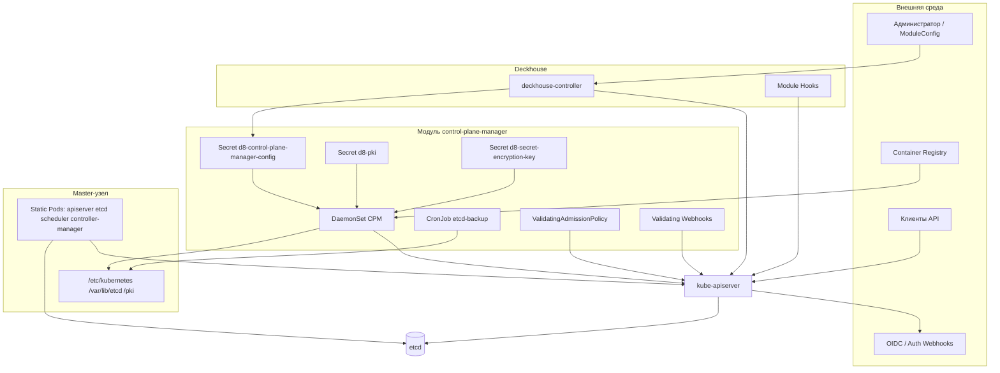

# Модель угроз безопасности информации модуля control-plane-manager

**Объект моделирования:** модуль Deckhouse Kubernetes Platform `control-plane-manager` (`deckhouse/modules/040-control-plane-manager`).

**Основание:** «Методика моделирования угроз и поверхности атаки» (`5.7-threat-modeling.md`), перечень угроз БДУ ФСТЭК России (новый раздел, `threats.csv`), термины (`abbr.md`).

**Дата моделирования:** 2026-05-19.

**Стадия:** эксплуатация / развитие (анализ фактической реализации в репозитории).

---

## 1. Определение целей и критичных функций модуля

Раздел выполнен по методике (результаты разделов 2–3 регламента НФТ в рамках данной задачи отсутствуют).

| Параметр                                   | Описание                                                                                                                                                                                                                                                                                                                                                                                                                                                                             |
| ------------------------------------------ | ------------------------------------------------------------------------------------------------------------------------------------------------------------------------------------------------------------------------------------------------------------------------------------------------------------------------------------------------------------------------------------------------------------------------------------------------------------------------------------ |
| **Наименование модуля**                    | `control-plane-manager` (модуль Deckhouse K8s Platform, путь `modules/040-control-plane-manager`, критичный, `critical: true`, подсистема `kubernetes`)                                                                                                                                                                                                                                                                                                                              |
| **Назначение**                             | Управление компонентами control plane кластера Kubernetes: жизненный цикл сертификатов PKI, генерация и синхронизация конфигураций и статических манифестов (`kube-apiserver`, `kube-controller-manager`, `kube-scheduler`, `etcd`), масштабирование master-узлов и членов etcd, координация обновления минорных/patch-версий Kubernetes, публикация Kubernetes API наружу (Ingress / LoadBalancer), настройка аудита, шифрования данных в etcd, расширение scheduler через webhooks |
| **Режим эксплуатации**                     | Распределённый, сетевой; компоненты модуля работают на всех узлах с меткой `node-role.kubernetes.io/control-plane` (и отдельный профиль на узлах `etcd-arbiter`)                                                                                                                                                                                                                                                                                                                     |
| **Среда исполнения**                       | Узлы control plane кластера Kubernetes; поды в `kube-system` (DaemonSet `d8-control-plane-manager`), статические поды control plane на хосте; контейнеры из реестра Deckhouse (`distroless` для бинаря CPM); хостовые каталоги `/etc/kubernetes`, `/var/lib/etcd`, `/pki`                                                                                                                                                                                                            |
| **Критичные функции**                      | Управление PKI и Secret `d8-pki`; выпуск/обновление сертификатов и kubeconfig (`admin.conf`, компонентные kubeconfig); управление etcd (join/leave, кворум); применение конфигурации apiserver (OIDC, webhooks authn/authz, admission, encryption, audit); публикация API; оркестрация upgrade/downgrade control plane; резервное копирование etcd (CronJob); валидация изменений через admission policies и webhooks                                                                |
| **Критичные последствия реализации угроз** | Полная компрометация кластера (несанкционированный cluster-admin доступ); подмена или утрата данных etcd (состояние кластера); недоступность Kubernetes API; компрометация ключей шифрования Secrets и чувствительных полей CRD; подмена control plane компонентов или их конфигурации; утечка учётных данных администратора и PKI                                                                                                                                                   |
| **Объекты защиты**                         | Secret `kube-system/d8-pki`, `d8-control-plane-manager-config`, `d8-secret-encryption-key`; файлы PKI и kubeconfig на master-узлах; данные etcd; конфигурации apiserver/scheduler/controller-manager; CR `control-plane.deckhouse.io` (`ControlPlaneNode`, `ControlPlaneOperation`); журналы аудита (`/var/log/kube-audit`); метрики CPM; ModuleConfig модуля; образы компонентов control plane из registry                                                                          |
| **Категории субъектов**                    | См. таблицу ниже                                                                                                                                                                                                                                                                                                                                                                                                                                                                     |

### Категории субъектов, взаимодействующих с модулем

| Категория | Предполагаемые полномочия | Характер доступа |
| --------- | ------------------------- | ---------------- |
| **Внешний клиент Kubernetes API** | Неаутентифицированный или аутентифицированный пользователь/сервис вне кластера | HTTPS к опубликованному API (Ingress `kubernetes-api`, LoadBalancer `d8-control-plane-apiserver`) при включённой публикации; недоверенный субъект |
| **Пользователь кластера (namespace/workload)** | RBAC согласно ролям кластера | Косвенное воздействие через API Kubernetes; ограниченно доверенный |
| **Администратор платформы / cluster-admin** | Полные права Kubernetes, изменение ModuleConfig, Node, CR модуля | Управление конфигурацией модуля, метками master, maintenance; высокий уровень доверия при корректном RBAC |
| **Deckhouse (deckhouse-controller)** | ServiceAccount `d8-system:deckhouse` | Рендер Helm-шаблонов, ModuleConfig, глобальная конфигурация; доверенный внутренний субъект платформы |
| **control-plane-manager (SA)** | `kube-system:d8-control-plane-manager` — ClusterRole на nodes, secrets (get/list/watch), CR control-plane, leases | Управление жизненным циклом control plane на узлах; доверенный компонент модуля |
| **Оператор с доступом к master-узлу (SSH)** | root на узле control plane | Чтение `/etc/kubernetes`, `/var/lib/etcd`, hostPath бэкапов; **требует уточнения:** границы моделирования доступа по SSH/PAM вне модуля |
| **Разработчик / CI** | Изменение исходного кода, сборка образов | Цепочка поставки (Fox, registry); внешний по отношению к runtime кластера |
| **Внешние зависимости** | OIDC-провайдер, webhooks authn/authz/audit (модули `user-authn`, `user-authz` и др.) | Ограниченно доверенные при TLS и проверке CA |

### Условия эксплуатации

| Аспект                      | Описание                                                                                                                                                                                                        |
| --------------------------- | --------------------------------------------------------------------------------------------------------------------------------------------------------------------------------------------------------------- |
| Обновление                  | Patch-версии control plane — с обновлением Deckhouse; минорные — через `ClusterConfiguration.kubernetesVersion` и контроллер `update-observer`; образы из `global.modulesImages.registry`                       |
| Удалённое администрирование | Через Kubernetes API и Deckhouse; опциональная публикация API; kubeconfig на узлах                                                                                                                              |
| Сопровождение               | Hooks Deckhouse (Go/Python), validating webhooks, ValidatingAdmissionPolicy; мониторинг Prometheus                                                                                                              |
| Зависимости модулей         | `user-authn`, `user-authz` (OIDC, RBAC, kubeconfig generator), `cert-manager` (TLS Ingress), `prometheus` (метрики) — **частично требует уточнения** полного списка обязательных связей для конкретной редакции |

---

## 2. Архитектурная модель модуля

### 2.1. Состав модуля

| Компонент                                    | Тип                                     | Назначение                                                                                                                                                                                 | Уровень доверия                          | Граница доверия                     |
| -------------------------------------------- | --------------------------------------- | ------------------------------------------------------------------------------------------------------------------------------------------------------------------------------------------ | ---------------------------------------- | ----------------------------------- |
| **control-plane-manager (бинарь)**           | Внутренний                              | Controller-runtime: `control-plane-configuration`, `control-plane-node`, `control-plane-operation`, `operations-approver`, `update-observer`; health `:8095`, metrics `:4296` (TLS + RBAC) | Доверенный субъект (SA)                  | Да — pod ↔ API server               |
| **DaemonSet `d8-control-plane-manager`**     | Внутренний                              | Запуск CPM на master-узлах; монтирование hostPath: etcd, pki, config, `/etc/kubernetes`                                                                                                    | Доверенный                               | Да — host ↔ pod                     |
| **DaemonSet image-holders**                  | Внутренний                              | Удержание digest образов apiserver/controller-manager/scheduler/etcd в registry                                                                                                            | Доверенный                               | Нет                                 |
| **Secret `d8-control-plane-manager-config`** | Внутренний                              | Base64-конфиги control plane (манифесты, policies, encryption)                                                                                                                             | Доверенный                               | Да — при доступе к Secret           |
| **Secret `d8-pki`**                          | Внутренний                              | Корневые CA, SA keys, ключи etcd CA                                                                                                                                                        | Доверенный                               | Да                                  |
| **Secret `d8-secret-encryption-key`**        | Внутренний                              | Ключ шифрования Secrets в etcd (при `encryptionEnabled`)                                                                                                                                   | Доверенный                               | Да                                  |
| **Статические поды control plane**           | Внутренний (управляемые)                | `kube-apiserver`, `kube-controller-manager`, `kube-scheduler`, `etcd` на хосте                                                                                                             | Доверенный                               | Да — сеть кластера / публикация API |
| **Hooks Deckhouse (Go)**                     | Внутренний                              | Подготовка values: версии, feature gates, audit, publish API, encryption key, etcd members                                                                                                 | Доверенный (контур deckhouse)            | Да                                  |
| **Validating webhooks (Python/bash)**        | Внутренний                              | Валидация ModuleConfig (feature gates), Secret encryption key                                                                                                                              | Доверенный                               | Да                                  |
| **ValidatingAdmissionPolicy**                | Внутренний                              | Защита CR control-plane, меток etcd-arbiter, resource-quota-overrides                                                                                                                      | Доверенный                               | Да                                  |
| **CronJob `d8-etcd-backup`**                 | Внутренний                              | Снимок etcd на hostPath master-узла                                                                                                                                                        | Доверенный                               | Да — host backup path               |
| **Ingress / Service LB API**                 | Внутренний (публикуемый)                | Внешний доступ к `kube-apiserver`                                                                                                                                                          | Ограниченно доверенный (после authn API) | Да — Internet/VPC ↔ cluster         |
| **Kubernetes API server**                    | Внешний по отношению к CPM              | Целевая среда управления; etcd backend                                                                                                                                                     | Доверенный компонент платформы           | Да                                  |
| **etcd**                                     | Внешний (для CPM) / внутренний кластера | Хранилище состояния                                                                                                                                                                        | Доверенный                               | Да                                  |
| **Deckhouse controller**                     | Внешний                                 | Helm render, ModuleConfig                                                                                                                                                                  | Доверенный                               | Да                                  |
| **Container registry**                       | Внешний                                 | Поставка образов Kubernetes, CPM, etcd-backup                                                                                                                                              | Ограниченно доверенный                   | Да                                  |
| **OIDC / auth webhooks**                     | Внешний                                 | Аутентификация/авторизация API (**модули user-authn/user-authz**)                                                                                                                          | Ограниченно доверенный                   | Да                                  |
| **Администратор кластера**                   | Внешний субъект                         | ModuleConfig, RBAC, Node labels                                                                                                                                                            | Зависит от RBAC                          | Да                                  |
| **Клиент API (kubectl, CI)**                 | Недоверенный                            | Запросы к API                                                                                                                                                                              | Недоверенный                             | Да                                  |

### 2.2. Стороннее и встроенное ПО (SBOM / oss.yaml)

| Компонент | Версия (по oss.yaml) | Назначение |
| --------- | -------------------- | ---------- |
| Kubernetes | по `candi/version_map.yml` | apiserver, controller-manager, scheduler |
| etcd | 3.6.10 | Хранилище control plane |
| Go-библиотеки CPM | **требует уточнения** (SBOM артефакта сборки WERF DK при наличии) | controller-runtime, client-go |

Документы `known_vulnerabilities.vex` присутствуют для образов: `control-plane-manager`, `kube-apiserver`, `kube-controller-manager`, `kube-scheduler`, `etcd`, `etcd-backup`.

### 2.3. Интерфейсы и потоки данных

| ID | Источник | Получатель | Данные / назначение | Протокол | Граница доверия |
| -- | -------- | ---------- | ------------------- | -------- | --------------- |
| IF-01 | deckhouse-controller | API server | Helm-объекты модуля, ModuleConfig | HTTPS (in-cluster) | d8-system ↔ API |
| IF-02 | CPM pod | API server | Watch/update Nodes, Secrets, CR control-plane | HTTPS + SA token | pod ↔ API |
| IF-03 | CPM | Host FS | Запись манифестов, PKI, kubeconfig, etcd data | Файловая система | pod ↔ host |
| IF-04 | kube-apiserver | etcd | Состояние кластера, Secrets (в т.ч. зашифрованные) | HTTPS mTLS | control plane |
| IF-05 | Клиент | kube-apiserver | Операции API | HTTPS (публикация: Ingress/LB) | Внешний ↔ API |
| IF-06 | kube-apiserver | OIDC / webhooks | Authn/Authz/Audit | HTTPS | API ↔ IdP |
| IF-07 | Prometheus | CPM `:4296` | Метрики | HTTPS + TokenReview/SAR | monitoring ↔ kube-system |
| IF-08 | Hooks | API server | Снимки ресурсов, patch values | HTTPS | deckhouse ↔ API |
| IF-09 | Validating webhook | API server | Admission review (encryption secret, feature gates) | HTTPS | API ↔ webhook |
| IF-10 | etcd-backup Job | Host `/var/lib/etcd`, `/var/backup` | Snapshot | Файлы + etcdctl | host |

### 2.4. Диаграмма компонентов (логическая)

---

## 3. Анализ поверхности атаки модуля

Поверхность атаки сформирована по архитектурной модели (раздел 2). Аппаратные уязвимости и сценарии с root ОС вне scope методики.

### 3.1. Перечень элементов поверхности атаки

| ID | Элемент | Компонент | Тип интерфейса | Уровень доступа | Характер взаимодействия | Недоверенные данные |
| -- | ------- | --------- | -------------- | --------------- | ----------------------- | ------------------- |
| AS-01 | Kubernetes API (все verbs к ресурсам кластера) | kube-apiserver | Программный | Публичный при `publishAPI`; иначе ограниченный (сеть кластера) | Внешний | Недоверенные |
| AS-02 | Ingress `kube-system/kubernetes-api` | publishAPI.ingress | Программный | Публичный (с whitelist CIDR) | Внешний | Недоверенные |
| AS-03 | Service LoadBalancer `d8-control-plane-apiserver` | publishAPI.loadBalancer | Программный | Публичный (sourceRanges — зависит от облака) | Внешний | Недоверенные |
| AS-04 | ModuleConfig `control-plane-manager` | Deckhouse / API | Программный | Привилегированный (право изменять ModuleConfig) | Внешний/внутренний | Недоверенные |
| AS-05 | Secret `d8-pki`, `d8-control-plane-manager-config` | CPM / API | Программный | Привилегированный (get Secret kube-system) | Внутренний | Недоверенные при компрометации SA/RBAC |
| AS-06 | Secret `d8-secret-encryption-key` | kube-apiserver encryption | Программный | Привилегированный | Внутренний | Недоверенные |
| AS-07 | CR `ControlPlaneNode` / `ControlPlaneOperation` | CPM controllers | Программный | Ограниченный (только SA deckhouse/CPM по VAP) | Внутренний | Недоверенные при обходе VAP |
| AS-08 | Метка maintenance `control-plane-manager.deckhouse.io/maintenance` на CPN | maintenance webhook + VAP | Программный | Привилегированный (админ с правом patch CPN) | Внутренний | Недоверенные |
| AS-09 | Метки/лейблы master `node-role.kubernetes.io/control-plane` | Node API | Программный | Привилегированный | Внешний/внутренний | Недоверенные |
| AS-10 | Метрики CPM `:4296/prometheus-metrics` | CPM metrics server | Программный | Ограниченный (RBAC SAR) | Внутренний | Недоверенные |
| AS-11 | Health/readiness `:8095` | CPM | Программный | Локальный (127.0.0.1) | Внутренний | Доверенные (loopback) |
| AS-12 | Host paths: `/etc/kubernetes`, `/var/lib/etcd`, `/pki` | DaemonSet mounts | Файловый | Привилегированный (host access) | Внутренний | Недоверенные при компрометации pod/host |
| AS-13 | `admin.conf`, `super-admin.conf` на узле | kubeconfig | Файловый | Привилегированный (root на master) | Внутренний | Недоверенные |
| AS-14 | Параметры apiserver: `certSANs`, `bindToWildcard`, admissionPlugins, feature gates | ModuleConfig → config Secret | Конфигурационный | Привилегированный | Внутренний | Недоверенные |
| AS-15 | OIDC / authn/authz webhook URLs и CA | ModuleConfig / user-authn CM | Конфигурационный | Привилегированный | Внутренний/внешний | Недоверенные |
| AS-16 | Audit policy Secret `kube-system/audit-policy` | apiserver | Конфигурационный | Привилегированный | Внутренний | Недоверенные |
| AS-17 | Validating webhooks модуля (feature gates, encryption key) | admission | Программный | Системный (API server → webhook) | Внутренний | Недоверенные (тело AdmissionReview) |
| AS-18 | `KubeSchedulerWebhookConfiguration` CR | scheduler config | Программный | Привилегированный | Внутренний | Недоверенные |
| AS-19 | etcd-backup CronJob hostPath `/var/backup` | etcd-backup | Файловый | Привилегированный | Внутренний | Недоверенные |
| AS-20 | Образы control plane из registry | image pull | Программный | Системный (kubelet) | Внешний | Недоверенные при компрометации registry |
| AS-21 | ClusterConfiguration.kubernetesVersion | глобальный CR Deckhouse | Конфигурационный | Привилегированный | Внутренний | Недоверенные |
| AS-22 | RBAC binding `kubeadm:cluster-admins` | rbac-for-us | Программный | Системный | Внутренний | Недоверенные при ошибке конфигурации |
| AS-23 | Журнал аудита `/var/log/kube-audit` | apiserver audit | Файловый | Ограниченный | Внутренний | Недоверенные при доступе к хосту |

### 3.2. Динамические компоненты и обновление

| Элемент | Описание |
| ------- | -------- |
| Обновление образов | Смена digest в `global.modulesImages` при релизе Deckhouse; image-holders на master |
| Upgrade Kubernetes | Контроллер `update-observer`, последовательная смена минорных версий, перезапуск static pods |
| Feature gates | Изменение ModuleConfig → hook → перезапуск компонентов; validating webhook |
| Включение `encryptionEnabled` | Необратимо; создание `d8-secret-encryption-key`; перезапуск apiserver |

### 3.3. Приоритизация для анализа

| Приоритет | Элементы | Обоснование |
| --------- | -------- | ----------- |
| Критический | AS-01–AS-06, AS-12–AS-14, AS-20 | Прямой путь к PKI, etcd, cluster-admin |
| Высокий | AS-02–AS-03, AS-07–AS-09, AS-21–AS-22 | Изменение топологии control plane и внешняя экспозиция API |
| Средний | AS-08, AS-10, AS-16–AS-19, AS-23 | Раскрытие информации, обход регламентов обслуживания |
| Низкий | AS-11 | Loopback health (исключение шифрования по методике) |

---

## 4. Идентификация угроз

Идентификация выполнена по STRIDE для компонентов и элементов поверхности атаки (раздел 3) с привязкой к угрозам нового раздела БДУ ФСТЭК (`threats.csv`, идентификаторы УБИ.1–УБИ.11).

### 4.1. Соответствие категорий STRIDE угрозам БДУ (новый раздел)

| STRIDE | Типовые угрозы БДУ |
| ------ | ------------------- |
| Spoofing | УБИ.4 (подмена), УБИ.2 (НСД при подмене субъекта) |
| Tampering | УБИ.3, УБИ.4 |
| Repudiation | УБИ.3 (искажение журналов), **требует уточнения** отдельной формулировки в новом перечне |
| Information Disclosure | УБИ.1, УБИ.11 |
| Denial of Service | УБИ.6, УБИ.8 |
| Elevation of Privilege | УБИ.2, УБИ.7 |

### 4.2. Перечень идентифицированных угроз

| Компонент | Элемент ПА | STRIDE | Идентификатор БДУ | Название угрозы (БДУ ФСТЭК) | Источник угрозы | Потенциал | Нарушаемые свойства (К/Ц/Д) |
| --------- | ---------- | ------ | ----------------- | ---------------------------- | --------------- | --------- | --------------------------- |
| kube-apiserver | AS-01, AS-02, AS-03 | Spoofing | УБИ.4 | Угроза несанкционированной подмены | Внешний нарушитель | Средний | Ц, К |
| kube-apiserver | AS-01 | Tampering | УБИ.3 | Угроза несанкционированной модификации (искажения) | Внешний нарушитель | Средний–Высокий | Ц |
| kube-apiserver | AS-01 | Information Disclosure | УБИ.1 | Угроза утечки информации | Внешний нарушитель | Средний | К |
| kube-apiserver | AS-01 | Denial of Service | УБИ.6 | Угроза отказа в обслуживании | Внешний нарушитель | Средний | Д |
| kube-apiserver | AS-01 | Elevation of Privilege | УБИ.2 | Угроза несанкционированного доступа | Внешний нарушитель | Средний–Высокий | К, Ц |
| publishAPI Ingress/LB | AS-02, AS-03 | Spoofing | УБИ.4 | Угроза несанкционированной подмены | Внешний нарушитель | Средний | Ц, К |
| publishAPI Ingress/LB | AS-02, AS-03 | Information Disclosure | УБИ.1 | Угроза утечки информации | Внешний нарушитель | Низкий–Средний | К |
| Secret `d8-pki` | AS-05 | Information Disclosure | УБИ.1 | Угроза утечки информации | Внутренний нарушитель | Средний | К, Ц |
| Secret `d8-pki` | AS-05 | Tampering | УБИ.3 | Угроза несанкционированной модификации | Внутренний нарушитель | Высокий | Ц |
| Secret `d8-secret-encryption-key` | AS-06 | Information Disclosure | УБИ.1 | Угроза утечки информации | Внутренний нарушитель | Высокий | К |
| Secret `d8-secret-encryption-key` | AS-06 | Tampering | УБИ.3 | Угроза несанкционированной модификации | Внутренний нарушитель | Высокий | Ц, Д |
| Host PKI / kubeconfig | AS-12, AS-13 | Information Disclosure | УБИ.1 | Угроза утечки информации | Внутренний нарушитель | Средний | К |
| Host PKI / kubeconfig | AS-12 | Tampering | УБИ.3 | Угроза несанкционированной модификации | Внутренний нарушитель | Высокий | Ц |
| ModuleConfig / config Secret | AS-04, AS-14 | Tampering | УБИ.3 | Угроза несанкционированной модификации | Внутренний нарушитель | Высокий | Ц, Д |
| ModuleConfig | AS-04 | Elevation of Privilege | УБИ.2 | Угроза несанкционированного доступа | Внутренний нарушитель | Высокий | К, Ц |
| CPM DaemonSet | AS-12 | Elevation of Privilege | УБИ.2 | Угроза несанкционированного доступа | Внешний нарушитель | Высокий | К, Ц |
| CPM SA / controllers | AS-07 | Tampering | УБИ.3 | Угроза несанкционированной модификации | Внутренний нарушитель | Высокий | Ц, Д |
| ControlPlaneOperation | AS-07 | Denial of Service | УБИ.8 | Угроза нарушения функционирования | Внутренний нарушитель | Средний | Д |
| etcd | AS-12, AS-04 | Tampering | УБИ.3 | Угроза несанкционированной модификации | Внутренний нарушитель | Высокий | Ц, Д |
| etcd | AS-12 | Information Disclosure | УБИ.1 | Угроза утечки информации | Внутренний нарушитель | Высокий | К |
| etcd | AS-12 | Denial of Service | УБИ.6 | Угроза отказа в обслуживании | Внешний/внутренний нарушитель | Средний | Д |
| etcd-backup | AS-19 | Information Disclosure | УБИ.1 | Угроза утечки информации | Внутренний нарушитель | Средний | К |
| etcd-backup | AS-19 | Tampering | УБИ.4 | Угроза несанкционированной подмены | Внутренний нарушитель | Средний | Ц |
| Container registry | AS-20 | Tampering / Spoofing | УБИ.9 | Угроза получения ресурсов из скомпрометированного источника | Внешний нарушитель | Высокий | Ц, Д |
| Container registry | AS-20 | Elevation of Privilege | УБИ.2 | Угроза несанкционированного доступа | Внешний нарушитель | Высокий | К, Ц |
| update-observer / version | AS-21 | Tampering | УБИ.3 | Угроза несанкционированной модификации | Внутренний нарушитель | Средний | Ц, Д |
| OIDC / webhooks | AS-15 | Spoofing | УБИ.4 | Угроза несанкционированной подмены | Внешний нарушитель | Средний | К, Ц |
| Audit log | AS-23 | Repudiation | УБИ.3 | Угроза несанкционированной модификации (искажения) | Внутренний нарушитель | Средний | Ц |
| Audit log | AS-23 | Information Disclosure | УБИ.1 | Угроза утечки информации | Внутренний нарушитель | Средний | К |
| Metrics | AS-10 | Information Disclosure | УБИ.11 | Угроза несанкционированного массового сбора информации | Внутренний нарушитель | Низкий–Средний | К |
| Validating webhook | AS-17 | Tampering | УБИ.3 | Угроза несанкционированной модификации | Внутренний нарушитель | Средний | Ц |
| Node labels (master) | AS-09 | Tampering | УБИ.3 | Угроза несанкционированной модификации | Внутренний нарушитель | Высокий | Ц, Д |
| kubeadm:cluster-admins RBAC | AS-22 | Elevation of Privilege | УБИ.2 | Угроза несанкционированного доступа | Внутренний нарушитель | Высокий | К, Ц |
| scheduler extenders | AS-18 | Tampering | УБИ.7 | Угроза ненадлежащего использования | Внутренний нарушитель | Низкий–Средний | Д, Ц |
| encryption + CRD sensitive | AS-06, AS-14 | Information Disclosure | УБИ.1 | Угроза утечки информации | Внешний нарушитель | Средний | К |
| encryption disabled | AS-06 | Information Disclosure | УБИ.1 | Угроза утечки информации | Внутренний нарушитель | Средний | К |
| CPM pod escape | AS-12 | Elevation of Privilege | УБИ.2 | Угроза несанкционированного доступа | Внешний нарушитель | Высокий | К, Ц |
| Malicious workload on master | AS-12 | Elevation of Privilege | УБИ.7 | Угроза ненадлежащего использования | Внутренний нарушитель | Средний | К, Ц |
| Mass API enumeration | AS-01 | Information Disclosure | УБИ.11 | Угроза несанкционированного массового сбора информации | Внешний нарушитель | Средний | К |
| Resource deletion etcd data | AS-12 | Tampering | УБИ.5 | Угроза удаления информационных ресурсов | Внутренний нарушитель | Высокий | Ц, Д |
| Spam via compromised API | AS-01 | **УБИ.10** | Угроза распространения противоправной информации | Внутренний нарушитель | Низкий | Ц | **Условно:** вторичный эффект при компрометации API |

### 4.3. Реализованные меры защиты (контекст для разделов 5–6)

| Область                 | Мера                                                                       | Источник в репозитории                                       |
| ----------------------- | -------------------------------------------------------------------------- | ------------------------------------------------------------ |
| Защита encryption key   | Validating webhook запрещает изменение/удаление `d8-secret-encryption-key` | `webhooks/validating/d8-secret-encryption-key-configuration` |
| Защита CR control-plane | ValidatingAdmissionPolicy: create/delete/update только deckhouse/CPM SA    | `templates/validation.yaml`                                  |
| Maintenance mode        | Webhook + VAP: только label maintenance при активных operations            | `maintenance-validation-webhook.yaml`, `validation.yaml`     |
| Метрики                 | TLS + TokenReview/SAR на subresource `daemonsets/prometheus-metrics`       | `manager.go`, `rbac-for-us.yaml`                             |
| Pod security            | readOnlyRootFilesystem, drop ALL capabilities, +SYS_CHROOT для CPM         | `daemonset.yaml`                                             |
| admin kubeconfig        | harden 0600, опциональное отключение symlink при user-authz                | `kubeconfig.go`, config-values                               |
| Ingress API             | whitelist CIDR, deny healthz/livez/readyz на Ingress                       | `kubernetes-api.yaml`                                        |
| etcd-arbiter label      | VAP запрет ручного изменения                                               | `validation.yaml`                                            |
| Feature gates           | Validating webhook по версии K8s                                           | `webhooks/validating/feature_gates.py`                       |
| Шифрование etcd         | encryption config + CRDSensitiveData feature gate                          | docs, `encryptionEnabled`                                    |
| Аудит                   | basic audit policy, маскирование sensitive полей                           | README, docs                                                 |

---

## 5. Моделирование сценариев атак

### Сценарий AS-TM-01

| Параметр                                | Значение                                                                                                                                                       |     |
| --------------------------------------- | -------------------------------------------------------------------------------------------------------------------------------------------------------------- | --- |
| **ID сценария**                         | AS-TM-01                                                                                                                                                       |     |
| **Связанные угрозы**                    | УБИ.2, УБИ.4 (STRIDE: Elevation of Privilege, Spoofing)                                                                                                        |     |
| **Элемент поверхности атаки**           | AS-02, AS-03 (публикация API)                                                                                                                                  |     |
| **Источник угрозы**                     | Внешний нарушитель                                                                                                                                             |     |
| **Начальный уровень доступа**           | Неаутентифицированный или слабые учётные данные                                                                                                                |     |
| **Вектор атаки**                        | Эксплуатация слабой аутентификации / украденный токен; MITM при некорректном TLS                                                                               |     |
| **Используемая уязвимость**             | Избыточная экспозиция API; отсутствие или слабый whitelist; компрометация kubeconfig с publish API                                                             |     |
| **Краткая последовательность действий** | 1) Сканирование опубликованного endpoint API; 2) Подбор/кража credentials или эксплуатация misconfiguration RBAC; 3) Выполнение привилегированных API-запросов |     |
| **Последствия**                         | НСД к ресурсам кластера, в т.ч. Secrets и конфигурации модуля                                                                                                  |     |

### Сценарий AS-TM-02

| Параметр | Значение |
| -------- | -------- |
| **ID сценария** | AS-TM-02 |
| **Связанные угрозы** | УБИ.1, УБИ.2 (STRIDE: Information Disclosure, Elevation of Privilege) |
| **Элемент поверхности атаки** | AS-05, AS-13 |
| **Источник угрозы** | Внутренний нарушитель (компрометация pod с доступом к host или SA) |
| **Начальный уровень доступа** | Доступ к worker/master (container escape) или RBAC get Secret |
| **Вектор атаки** | Чтение Secret `d8-pki` / файлов `admin.conf` на хосте |
| **Используемая уязвимость** | Избыточные RBAC-права; escape из менее защищённого pod на master |
| **Краткая последовательность действий** | 1) Компрометация workload или SA; 2) Чтение `d8-pki` или host kubeconfig; 3) Импersonation cluster-admin |
| **Последствия** | Полная компрометация PKI и кластера |

### Сценарий AS-TM-03

| Параметр                                | Значение                                                                                                                                                                             |
| --------------------------------------- | ------------------------------------------------------------------------------------------------------------------------------------------------------------------------------------ |
| **ID сценария**                         | AS-TM-03                                                                                                                                                                             |
| **Связанные угрозы**                    | УБИ.3, УБИ.5 (STRIDE: Tampering)                                                                                                                                                     |
| **Элемент поверхности атаки**           | AS-04, AS-14                                                                                                                                                                         |
| **Источник угрозы**                     | Внутренний нарушитель                                                                                                                                                                |
| **Начальный уровень доступа**           | Пользователь с правом изменять ModuleConfig / ClusterConfiguration                                                                                                                   |
| **Вектор атаки**                        | Изменение конфигурации модуля                                                                                                                                                        |
| **Используемая уязвимость**             | Недостаточное разграничение прав на ModuleConfig; отсутствие approval для критичных параметров                                                                                       |
| **Краткая последовательность действий** | 1) Изменение `apiserver.certSANs`, `bindToWildcard`, `admissionPlugins`, `encryptionEnabled`; 2) Пересборка config Secret hooks; 3) Перезапуск apiserver с вредоносной конфигурацией |
| **Последствия**                         | Ослабление admission, расширение поверхности API, необратимое включение шифрования (**операционный риск**)                                                                           |

### Сценарий AS-TM-04

| Параметр | Значение |
| -------- | -------- |
| **ID сценария** | AS-TM-04 |
| **Связанные угрозы** | УБИ.9, УБИ.3 (STRIDE: Tampering, Spoofing) |
| **Элемент поверхности атаки** | AS-20 |
| **Источник угрозы** | Внешний нарушитель (высокий потенциал) |
| **Начальный уровень доступа** | Доступ к registry или MITM при pull |
| **Вектор атаки** | Подмена образа kube-apiserver / CPM |
| **Используемая уязвимость** | Компрометация registry; отсутствие verify image signature (**требует уточнения** политики подписи в контуре заказчика) |
| **Краткая последовательность действий** | 1) Подмена digest в registry; 2) Pull на master; 3) Запуск вредоносного static pod / CPM |
| **Последствия** | RCE на master, полный контроль control plane |

### Сценарий AS-TM-05

| Параметр                                | Значение                                                                                                              |
| --------------------------------------- | --------------------------------------------------------------------------------------------------------------------- |
| **ID сценария**                         | AS-TM-05                                                                                                              |
| **Связанные угрозы**                    | УБИ.3, УБИ.8 (STRIDE: Tampering, DoS)                                                                                 |
| **Элемент поверхности атаки**           | AS-07, AS-09                                                                                                          |
| **Источник угрозы**                     | Внутренний нарушитель                                                                                                 |
| **Начальный уровень доступа**           | cluster-admin или обход VAP                                                                                           |
| **Вектор атаки**                        | Несанкционированное создание/изменение CR или меток master                                                            |
| **Используемая уязвимость**             | Ошибка в ValidatingAdmissionPolicy; уязвимость в API server CEL                                                       |
| **Краткая последовательность действий** | 1) Создание фальшивого ControlPlaneOperation; 2) Инициация join etcd / перегенерация certs; 3) Нарушение кворума etcd |
| **Последствия**                         | Потеря работоспособности control plane                                                                                |

### Сценарий AS-TM-06

| Параметр | Значение |
| -------- | -------- |
| **ID сценария** | AS-TM-06 |
| **Связанные угрозы** | УБИ.1 (STRIDE: Information Disclosure) |
| **Элемент поверхности атаки** | AS-06, AS-19 |
| **Источник угрозы** | Внутренний нарушитель |
| **Начальный уровень доступа** | get Secret / чтение host backup |
| **Вектор атаки** | Извлечение ключа шифрования и snapshot etcd |
| **Используемая уязвимость** | Незащищённый hostPath backup; утечка encryption key |
| **Краткая последовательность действий** | 1) Чтение `d8-secret-encryption-key`; 2) Копирование `/var/backup` etcd; 3) Офлайн-расшифровка Secrets |
| **Последствия** | Раскрытие всех Secrets и чувствительных полей CRD |

### Сценарий AS-TM-07

| Параметр                                | Значение                                                                                                       |
| --------------------------------------- | -------------------------------------------------------------------------------------------------------------- |
| **ID сценария**                         | AS-TM-07                                                                                                       |
| **Связанные угрозы**                    | УБИ.6, УБИ.8                                                                                                   |
| **Элемент поверхности атаки**           | AS-01, AS-12                                                                                                   |
| **Источник угрозы**                     | Внешний нарушитель                                                                                             |
| **Начальный уровень доступа**           | Сетевой доступ к API или etcd                                                                                  |
| **Вектор атаки**                        | Resource exhaustion / повреждение etcd                                                                         |
| **Используемая уязвимость**             | Отсутствие rate limit на уровне модуля; переполнение quota etcd                                                |
| **Краткая последовательность действий** | 1) Массовые запросы к API или запись в etcd; 2) Исчерпание quota (`etcdQuotaBackendBytes`); 3) Отказ apiserver |
| **Последствия**                         | Недоступность API (Д)                                                                                          |

### Сценарий AS-TM-08

| Параметр | Значение |
| -------- | -------- |
| **ID сценария** | AS-TM-08 |
| **Связанные угрозы** | УБИ.4, УБИ.2 |
| **Элемент поверхности атаки** | AS-15 |
| **Источник угрозы** | Внешний нарушитель |
| **Начальный уровень доступа** | Контроль сетевого пути к webhook/OIDC |
| **Вектор атаки** | Подмена ответа authentication/authorization webhook |
| **Используемая уязвимость** | Слабая проверка CA webhook; webhook по HTTP |
| **Краткая последовательность действий** | 1) MITM между apiserver и webhook; 2) Подмена TokenReview response; 3) Доступ от имени привилегированного пользователя |
| **Последствия** | Обход authz, НСД |

### Сценарий AS-TM-09

| Параметр                                | Значение                                                                                                           |
| --------------------------------------- | ------------------------------------------------------------------------------------------------------------------ |
| **ID сценария**                         | AS-TM-09                                                                                                           |
| **Связанные угрозы**                    | УБИ.3 (STRIDE: Repudiation)                                                                                        |
| **Элемент поверхности атаки**           | AS-23                                                                                                              |
| **Источник угрозы**                     | Внутренний нарушитель                                                                                              |
| **Начальный уровень доступа**           | root на master                                                                                                     |
| **Вектор атаки**                        | Изменение/удаление `/var/log/kube-audit/audit.log`                                                                 |
| **Используемая уязвимость**             | Локальное хранение аудита без централизованной неизменяемой копии (**требует уточнения** интеграции с log shipper) |
| **Краткая последовательность действий** | 1) Выполнение привилегированных действий; 2) Очистка локального audit log; 3) Сокрытие следов                      |
| **Последствия**                         | Невозможность расследования (репудиация)                                                                           |

### Сценарий AS-TM-10

| Параметр                                | Значение                                                                                         |
| --------------------------------------- | ------------------------------------------------------------------------------------------------ |
| **ID сценария**                         | AS-TM-10                                                                                         |
| **Связанные угрозы**                    | УБИ.2, УБИ.7                                                                                     |
| **Элемент поверхности атаки**           | AS-12 (CPM pod)                                                                                  |
| **Источник угрозы**                     | Внешний нарушитель                                                                               |
| **Начальный уровень доступа**           | RCE в CPM (уязвимость в бинаре)                                                                  |
| **Вектор атаки**                        | Эксплуатация уязвимости Go-бинаря / privileged mount                                             |
| **Используемая уязвимость**             | CVE в зависимостях CPM; capability SYS_CHROOT                                                    |
| **Краткая последовательность действий** | 1) Эксплуатация уязвимости в CPM; 2) Запись в `/etc/kubernetes/manifests`; 3) Подмена static pod |
| **Последствия**                         | Полный контроль control plane                                                                    |

### Сценарии без детальной проработки (подлежат тестированию)

| Элемент ПА | Угроза | Примечание                                                                                                 |
| ---------- | ------ | ---------------------------------------------------------------------------------------------------------- |
| AS-08      | УБИ.8  | Включение maintenance при активных operations блокируется — сценарий маловероятен при штатной конфигурации |
| AS-18      | УБИ.7  | Злонамеренный scheduler extender — **требует уточнения** модели угроз модуля-поставщика webhook            |
| AS-11      | —      | Исключён из сценариев (loopback health)                                                                    |

---

## 6. Оценка актуальности и формирование модели угроз

Критерии актуальности: наличие источника угрозы, реализуемого сценария, уязвимости/слабости и условий эксплуатации (раздел 6 методики).

### 6.1. Матрица оценки актуальности

| ID угрозы (БДУ) | ID сценария | Наличие уязвимости / слабости | Реализуемость сценария | Потенциальный ущерб | Итоговая категория | Решение | Обоснование |
| --------------- | ----------- | ----------------------------- | ---------------------- | ------------------- | ------------------ | ------- | ----------- |
| УБИ.2 | AS-TM-01 | Да (при publishAPI) | Средняя | Критический | **Критический** | **Актуальна** (условно) | Актуальна при включённой публикации API; компенсируется RBAC/OIDC и whitelist |
| УБИ.4 | AS-TM-01, AS-TM-08 | Да | Средняя | Высокий | Высокий | **Актуальна** | Зависит от TLS и доверия к webhooks/OIDC |
| УБИ.1 | AS-TM-02, AS-TM-06 | Да | Средняя | Критический | **Критический** | **Актуальна** | PKI и encryption key — критичные активы |
| УБИ.2 | AS-TM-02 | Да | Средняя | Критический | **Критический** | **Актуальна** | Компрометация `d8-pki` = cluster takeover |
| УБИ.3 | AS-TM-03 | Да | Средняя | Критический | **Критический** | **Актуальна** | Изменение ModuleConfig администратором — штатный, но опасный вектор |
| УБИ.9 | AS-TM-04 | **Требует уточнения** (подпись образов) | Низкая–Средняя | Критический | **Критический** | **Условно актуальна** | Зависит от защиты registry и политики подписи артефактов |
| УБИ.3, УБИ.8 | AS-TM-05 | Частично (VAP) | Низкая | Критический | Высокий | **Условно актуальна** | VAP ограничивает прямое создание CR; обход — при баге admission |
| УБИ.1 | AS-TM-06 | Да (backup на host) | Средняя | Критический | **Критический** | **Актуальна** | Snapshot etcd + ключ шифрования |
| УБИ.6, УБИ.8 | AS-TM-07 | Да | Средняя | Высокий | Высокий | **Актуальна** | DoS API/etcd — общая угроза Kubernetes |
| УБИ.4, УБИ.2 | AS-TM-08 | Да (misconfig) | Низкая–Средняя | Критический | Высокий | **Условно актуальна** | При корректном TLS и CA — снижается |
| УБИ.3 | AS-TM-09 | Да | Средняя | Средний | Средний | **Актуальна** | Локальный audit без централизации |
| УБИ.2 | AS-TM-10 | Зависит от CVE | Низкая | Критический | Высокий | **Условно актуальна** | VEX/SBOM; distroless, минимальные caps |
| УБИ.11 | — | Да | Средняя | Средний | Средний | **Актуальна** | Перечисление API/метрик при слабом RBAC |
| УБИ.5 | — | Да | Низкая | Критический | Высокий | **Условно актуальна** | Удаление etcd — только при привилегированном доступе |
| УБИ.7 | — | Да | Низкая | Средний | Низкий | **Неактуальна** / низкий | Scheduler extender — контролируется RBAC на CR |
| УБИ.10 | — | — | Низкая | Низкий | Низкий | **Неактуальна** | Вторичный эффект, не специфичен модулю |
| УБИ.1 (encryption off) | — | Да | Высокая | Высокий | Высокий | **Актуальна** | По умолчанию `encryptionEnabled: false` |
| УБИ.3 (encryption key) | — | Частично | Низкая | Критический | Высокий | **Неактуальна** (модификация) | Webhook блокирует изменение Secret |

### 6.2. Итоговая модель угроз (актуальные и условно актуальные)

| № | Угроза (БДУ) | Категория | Статус |
| - | ------------ | --------- | ------ |
| 1 | УБИ.1 — утечка PKI, kubeconfig, etcd backup, encryption key | Критический | Актуальна |
| 2 | УБИ.2 — НСД через API / украденный admin kubeconfig | Критический | Актуальна |
| 3 | УБИ.3 — модификация ModuleConfig, host manifests, etcd | Критический | Актуальна |
| 4 | УБИ.4 — подмена API endpoint / webhook / образов | Высокий–Критический | Условно актуальна |
| 5 | УБИ.5 — удаление данных etcd | Высокий | Условно актуальна |
| 6 | УБИ.6 — отказ API | Высокий | Актуальна |
| 7 | УБИ.8 — нарушение работоспособности control plane | Высокий | Актуальна |
| 8 | УБИ.9 — компрометация цепочки поставки образов | Критический | Условно актуальна |
| 9 | УБИ.11 — массовый сбор метаданных API/метрик | Средний | Актуальна |
| 10 | УБИ.3 — репудиация (локальный audit) | Средний | Актуальна |

### 6.3. Рекомендуемые меры по нейтрализации (для актуальных угроз)

| Угроза             | Мера                                                                                                                                                                                                      | Ответственность         |
| ------------------ | --------------------------------------------------------------------------------------------------------------------------------------------------------------------------------------------------------- | ----------------------- |
| УБИ.1 (PKI, keys)  | Ограничить RBAC на Secrets kube-system; не планировать workload на master; шифрование etcd (`encryptionEnabled`); защита hostPath backup (права, шифрование диска, **требует уточнения** политики бэкапа) | Эксплуатация / ИБ       |
| УБИ.2 (API)        | Минимизировать publishAPI; строгий whitelist; OIDC+MFA; отключить basic auth; регулярная ротация kubeconfig                                                                                               | Эксплуатация            |
| УБИ.3 (config)     | RBAC на ModuleConfig; approval workflow для изменений; GitOps audit                                                                                                                                       | Организационная + ИБ    |
| УБИ.4              | TLS 1.2+, публичные CA или pinning; проверка CA webhooks                                                                                                                                                  | Эксплуатация            |
| УБИ.9              | Подпись образов, приватный registry, SCA/VEX-процесс (артефакты VEX в модуле)                                                                                                                             | РБПО / SSDLC            |
| УБИ.6, УБИ.8       | Rate limiting API (вне модуля); мониторинг etcd quota; регламент масштабирования master                                                                                                                   | Эксплуатация            |
| УБИ.11             | Ограничение доступа к метрикам; не экспонировать Prometheus без auth                                                                                                                                      | Эксплуатация            |
| УБИ.3 (audit)      | Централизованный сбор audit logs (неизменяемое хранилище)                                                                                                                                                 | Эксплуатация            |
| УБИ.1 (encryption) | Включить `apiserver.encryptionEnabled` для новых кластеров после оценки необратимости                                                                                                                     | Заказчик / эксплуатация |

### 6.4. Контроль полноты модели угроз (приложение 2 методики)

| Проверка | Результат |
| -------- | --------- |
| Покрытие компонентов раздела 2 | Все основные компоненты имеют угрозы в табл. 4.2 |
| Покрытие STRIDE | Все 6 категорий представлены; Repudiation — через УБИ.3 |
| Трассируемость угроза → сценарий → решение | AS-TM-01…10 ↔ табл. 6.1 |
| Элементы ПА без сценария | AS-08, AS-18 — отмечены для тестирования (раздел 5) |

### 6.5. Порядок актуализации при изменениях

| Тип изменения | Пересматриваемые разделы |
| ------------- | ------------------------ |
| Minor (документация, мониторинг) | 3 (при новых endpoints), 6 |
| Major (новые контроллеры, publish API, PKI model) | 2, 3, 4, 5, 6 |
| Смена версии Kubernetes / образов | 2.2, 4, 5 (AS-TM-04, AS-TM-10), 6 |
| Новые угрозы БДУ ФСТЭК | 4, 6 |

---

## Источники анализа

| Артефакт | Путь / URL |
| -------- | ---------- |
| Исходный код модуля | `deckhouse/modules/040-control-plane-manager/` |
| Документация | `docs/README.md`, `docs/FAQ.md`, `openapi/config-values.yaml` |
| Методика | `5.7-threat-modeling.md` |
| Угрозы БДУ | `threats.csv` (новый раздел УБИ.1–УБИ.11) |
| Термины | `abbr.md` |

**Пометки «требует уточнения»:** политика подписи OCI-образов в контуре заказчика; централизация audit logs; границы моделирования SSH-доступа к master; полный SBOM бинаря CPM; обязательный набор связанных модулей для редакции.
