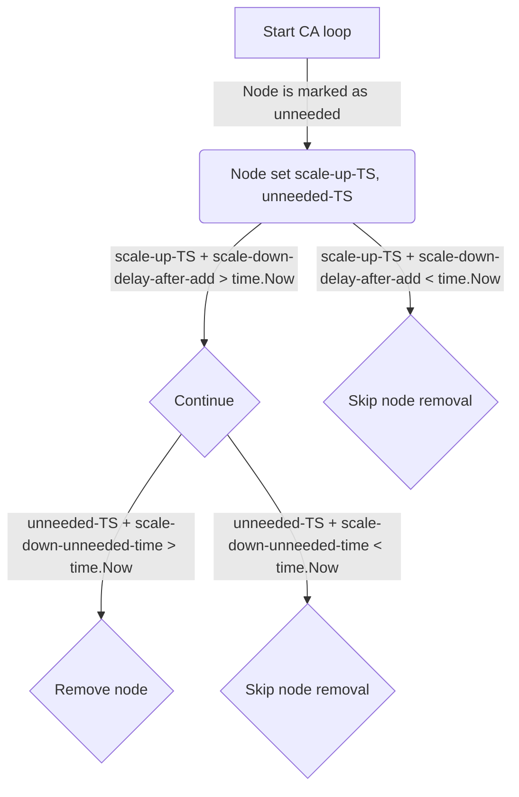

# Cluster autoscaler logics

## Scale-down timings

We have 2 modified arguments for scaling down:
- `scale-down-delay-after-add`
- `scale-down-unneeded-time`

They respected like this:
- If `scale-down-delay-after-add` > `scale-down-unneeded-time` then `scale-down-delay-after-add` will be respected.
- If `scale-down-delay-after-add` < `scale-down-unneeded-time` then `scale-down-unneeded-time` will be respected.
  
First of all, unneeded node will set a timestamp.
Then `scale-down-delay-after-add` will be checked. If for current loop `lastScaleUpTS` + `scale-down-delay-after-add` < `time.Now()` — node will be skipped (cooldown reason).
If node is not in cooldown, then `scale-down-unneeded-time` will be checked. If `nodeTS` + `scale-down-unneeded-time` > `time.Now()` — it will be removed.

