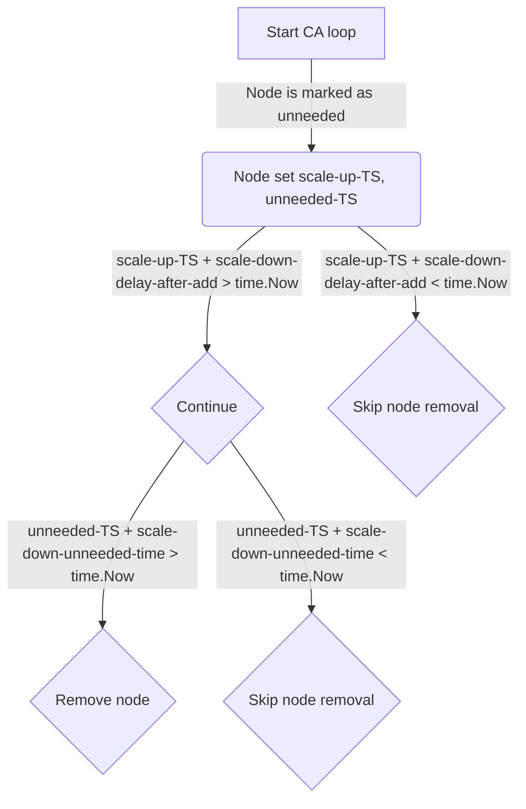

# Cluster autoscaler logics

## Scale-down timings

We have 2 modified arguments for scaling down:
- `scale-down-delay-after-add`
- `scale-down-unneeded-time`

They respected like this:
- If `scale-down-delay-after-add` > `scale-down-unneeded-time` then `scale-down-delay-after-add` will be respected.
- If `scale-down-delay-after-add` < `scale-down-unneeded-time` then `scale-down-unneeded-time` will be respected.
  
First of all, unneeded node will set a timestamp.
Then `scale-down-delay-after-add` will be checked. If for current loop `lastScaleUpTS` + `scale-down-delay-after-add` < `time.Now()` — node will be skipped (cooldown reason).
If node is not in cooldown, then `scale-down-unneeded-time` will be checked. If `nodeTS` + `scale-down-unneeded-time` > `time.Now()` — it will be removed.


```mermaid
graph TD
    A[Start CA loop] -->|Node is marked as unneeded| B(Node set scale-up-TS, unneeded-TS)
    B -->|scale-up-TS + scale-down-delay-after-add > time.Now| C{Continue}
    B -->|scale-up-TS + scale-down-delay-after-add < time.Now| D{Skip node removal}
    C -->|unneeded-TS + scale-down-unneeded-time > time.Now| F{Remove node}
    C -->|unneeded-TS + scale-down-unneeded-time < time.Now| E{Skip node removal}
```

## Image build

The `cluster-autoscaler` entry in `modules/040-node-manager/oss.yaml` maps each Kubernetes minor to a gardener autoscaler tag. The `cluster-autoscaler-<k8s minor>` image is built from that tag with the patches from `images/cluster-autoscaler/patches/<tag minor>/`, so one patch set can serve several Kubernetes minors (gardener `v1.36.0` is used for both 1.36 and 1.37).

Deckhouse runs one binary with two cloud providers: `--cloud-provider=clusterapi` for CAPI node groups and `--cloud-provider=mcm` for MCM node groups (a separate `cluster-autoscaler-mcm` Deployment when a cluster has both). The binary must contain both providers.

### The `mcm` build tag

Since gardener `v1.36.0` cloud providers register themselves through `cloudprovider/router`. The mcm provider is compiled in only with the `mcm` build tag (`router_mcm.go` is `//go:build mcm`); `router_all.go`, built without tags, brings in clusterapi and the other providers but not mcm. Gardener builds with `-tags mcm` too (`.ci/build`).

`werf.inc.yaml` therefore passes `-tags mcm` to `go build` for gardener tags `>= 1.36`. Without it the image builds and the unit tests pass, but cluster-autoscaler started with `--cloud-provider=mcm` exits with `Unknown cloud provider: mcm`. Tags up to `v1.35.x` list mcm in `cloudprovider/builder/builder_all.go` and have no file behind the tag, so the tag is not passed for them and their images stay unchanged.

When bumping to a new tag, check that both providers are still in the build, from the `cluster-autoscaler` directory of the patched source:

```shell
go list -tags mcm -deps . | grep -E 'cloudprovider/(mcm|clusterapi)$'
```

Also compare the build flags with gardener's `.ci/build`, and check that `cluster-autoscaler --help` lists `mcm` in the `--cloud-provider` values.

### Flags

`templates/cluster-autoscaler/deployment.yaml` passes the same flags to every built version. A flag that only a newer version knows makes the older ones exit on an unknown flag, so gate such a flag by version. For example, 1.36 added `--max-startup-time` (20m by default); with our `--max-failing-time=120m` cluster-autoscaler raises it to 2h on its own and logs a warning, so the flag is not passed.
