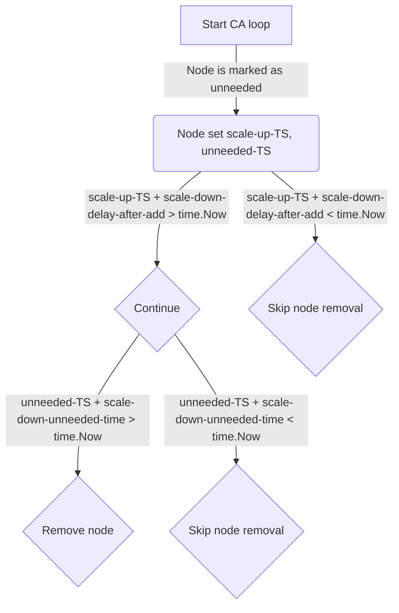

# Логика cluster autoscaler

## Тайминги scale-down

Для scale-down изменены два аргумента:
- `scale-down-delay-after-add`
- `scale-down-unneeded-time`

Они учитываются так:
- Если `scale-down-delay-after-add` > `scale-down-unneeded-time`, действует `scale-down-delay-after-add`.
- Если `scale-down-delay-after-add` < `scale-down-unneeded-time`, действует `scale-down-unneeded-time`.

Сначала для ненужного (unneeded) узла запоминается отметка времени.
Затем проверяется `scale-down-delay-after-add`. Если в текущем цикле `lastScaleUpTS` + `scale-down-delay-after-add` < `time.Now()`, узел пропускается (причина — cooldown).
Если узел не в cooldown, проверяется `scale-down-unneeded-time`. Если `nodeTS` + `scale-down-unneeded-time` > `time.Now()`, узел удаляется.



## Сборка образа

Запись `cluster-autoscaler` в `modules/040-node-manager/oss.yaml` сопоставляет каждой минорной версии Kubernetes тег gardener autoscaler. Образ `cluster-autoscaler-<минор k8s>` собирается из этого тега с патчами из `images/cluster-autoscaler/patches/<минор тега>/`, поэтому один набор патчей может обслуживать несколько минорных версий Kubernetes (gardener `v1.36.0` используется и для 1.36, и для 1.37).

Deckhouse запускает один бинарник с двумя cloud provider: `--cloud-provider=clusterapi` для групп узлов на CAPI и `--cloud-provider=mcm` для групп на MCM (отдельный Deployment `cluster-autoscaler-mcm`, если в кластере есть оба вида). В бинарнике должны быть оба провайдера.

### Тег сборки `mcm`

Начиная с gardener `v1.36.0` cloud provider регистрируются через `cloudprovider/router`. Провайдер mcm попадает в сборку только с тегом сборки `mcm` (`router_mcm.go` помечен `//go:build mcm`); `router_all.go`, который собирается без тегов, подключает clusterapi и остальные провайдеры, но не mcm. Сам gardener тоже собирает с `-tags mcm` (`.ci/build`).

Поэтому `werf.inc.yaml` передаёт `go build` флаг `-tags mcm` для тегов gardener `>= 1.36`. Без него образ собирается и юнит-тесты проходят, но cluster-autoscaler с `--cloud-provider=mcm` завершается с ошибкой `Unknown cloud provider: mcm`. В тегах до `v1.35.x` mcm подключён в `cloudprovider/builder/builder_all.go`, и файлов под этим тегом там нет, поэтому для них тег не передаётся и их образы не меняются.

При переходе на новый тег проверьте, что в сборке остались оба провайдера (из каталога `cluster-autoscaler` пропатченного исходного кода):

```shell
go list -tags mcm -deps . | grep -E 'cloudprovider/(mcm|clusterapi)$'
```

Также сравните флаги сборки с `.ci/build` в gardener и проверьте, что `cluster-autoscaler --help` перечисляет `mcm` среди значений `--cloud-provider`.

### Флаги

`templates/cluster-autoscaler/deployment.yaml` передаёт одни и те же флаги всем собираемым версиям. Флаг, который знает только более новая версия, заставит более старые завершиться с ошибкой о неизвестном флаге, поэтому такой флаг нужно включать в зависимости от версии. Например, в 1.36 появился `--max-startup-time` (по умолчанию 20m); при нашем `--max-failing-time=120m` cluster-autoscaler сам поднимает его до 2h и пишет предупреждение, поэтому флаг не передаётся.
