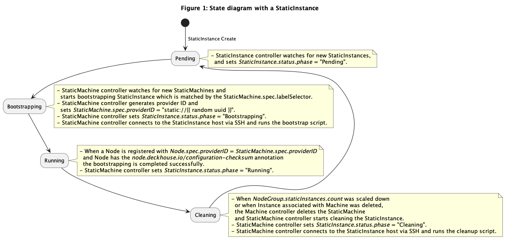

# StaticMachine Controller

The StaticMachine controller main responsibilities are:

* Manage the lifecycle of the StaticMachine and StaticInstance objects.
* Bootstrap StaticInstances.
* Cleanup StaticInstances.
* Setting the `StaticMachine.spec.providerID` field.

By convention, the `StaticMachine` object **must** have `spec` and `status` objects.

The `spec` object have the following fields defined:

* `providerID` - a static provider ID identifying the machine.
* `labelSelector` - a label selector that is used to select pending StaticInstance.

The `status` object have the following fields defined:

* `ready` - a boolean field indicating if the infrastructure is ready to be used or not.
It is equal to true only if associated StaticInstance is running.
* `failureReason` - is a string that explains why a fatal error has occurred, if possible.
* `failureMessage` - is a string that holds the message contained by the error.
* `addresses` - is a `MachineAddresses` (a list of `MachineAddress`) which represents host names, external IP addresses, internal IP addresses,
external DNS names, and/or internal DNS names for the provider's machine instance. `MachineAddress` is
defined as:
  - `type` (string): one of `Hostname`, `ExternalIP`, `InternalIP`, `ExternalDNS`, `InternalDNS`
  - `address` (string)

## State diagram with a StaticInstance

