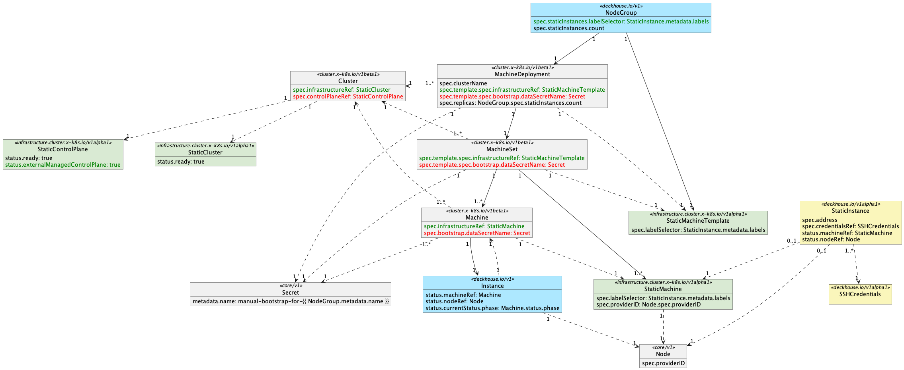

# CustomResourceDefinitions relationships

There are many resources that appear in the Cluster API Provider Static. In this section, we use diagram to illustrate the most common relationships between Cluster API Provider Static resources.

<aside class="note">

<h1>Info</h1>

The straight lines represent "management". For example, "MachineSet manages Machines". The dotted line represents "reference". For example, "Machine's `spec.infrastructureRef` field references StaticMachine".

The direction of the arrows indicates the direction of "management" or "reference". For example, "the relationship between MachineSet and Machine is management from MachineSet to Machine", so the arrow points from MachineSet to Machine.

</aside>

