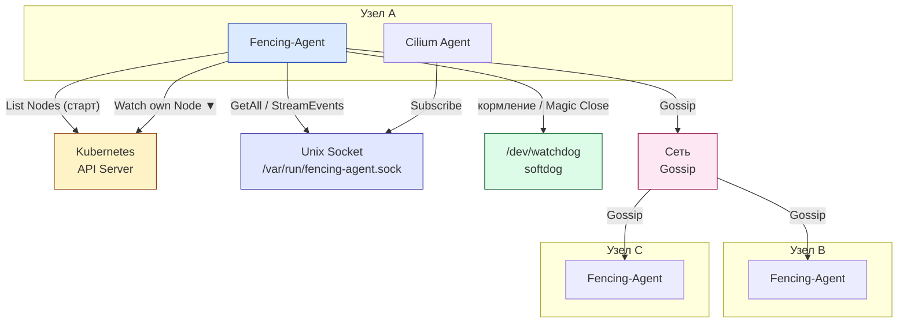
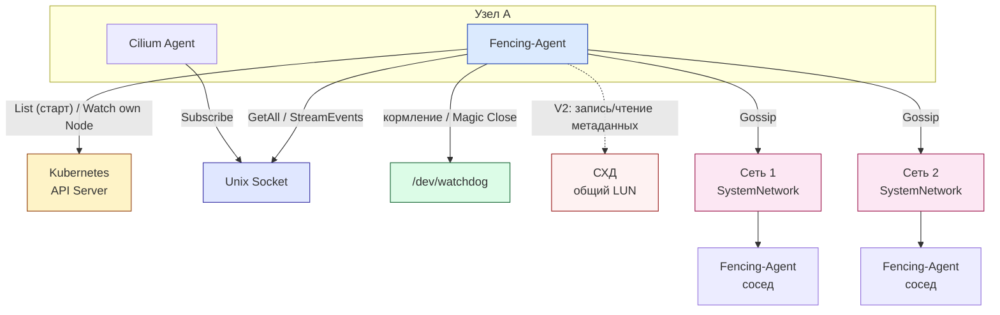
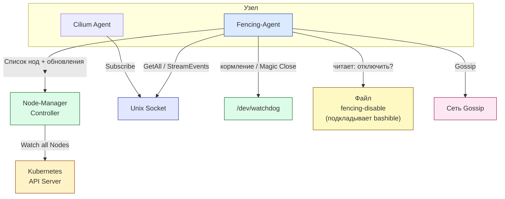

# ADR: Fencing-agent на основе memberlist с механизмом Lifeguard

## Описание

Документ описывает архитектуру и реализацию fencing-agent, использующего библиотеку memberlist от HashiCorp для построения распределенного кворума узлов кластера без зависимости от Kubernetes API Server. Агент использует механизм Lifeguard для предотвращения ложных срабатываний watchdog при временных сетевых задержках.

### Контекст

- [Текущая реализация fencing-agent](https://github.com/deckhouse/deckhouse/blob/main/modules/040-node-manager/templates/fencing-agent) использует Kubernetes API для проверки доступности узлов
- [Библиотека memberlist от HashiCorp](https://github.com/hashicorp/memberlist) реализует gossip-based membership протокол SWIM для распределенного обнаружения отказов
- Механизм [Lifeguard](https://github.com/hashicorp/memberlist/blob/master/awareness.go) в memberlist (situational awareness — «осведомлённость о ситуации») предотвращает ложные срабатывания при временных сетевых проблемах (медленная обработка сообщений из‑за нагрузки на CPU, задержек или потерь в сети). Подробности — в [README memberlist, раздел Protocol](https://github.com/hashicorp/memberlist) и в статье «Lifeguard: SWIM-ing with Situational Awareness». Он работает следующим образом:
  - **[Suspicion механизм](https://github.com/hashicorp/memberlist/blob/master/suspicion.go)**: Когда узел не отвечает на heartbeat, он не сразу помечается как мертвый, а переходит в состояние "suspect". Другие узлы должны подтвердить подозрение (NACK), и только после подтверждения от достаточного количества узлов узел помечается как мертвый
  - **Адаптивное обнаружение отказов**: Lifeguard отслеживает исторические данные о задержках сети между узлами, вычисляет вероятность того, что узел действительно мертв на основе паттернов задержек, и адаптирует пороги чувствительности в зависимости от сетевых условий
  - **Incarnation Numbers**: Каждый узел имеет incarnation number, который увеличивается при перезапуске, что предотвращает проблемы с "зомби" узлами и позволяет различать реальные перезапуски от временных сетевых проблем
- В обычном Kubernetes реализован только базовый HA, который требует полного следования 12-факторной методологии. В Deckhouse необходимо реализовать enterprise HA, который мгновенно определяет недоступность узлов и переключает нагрузку с них

## Мотивация / Боль

Текущая реализация fencing-agent имеет следующие проблемы:

1. **Зависимость от Kubernetes API Server**: Фенсинг узлов завязан на доступность control-plane. Агент каждые 5 секунд опрашивает API Server для проверки доступности узла. При недоступности control-plane агент не может определить, отвалился ли узел от кластера или это control-plane недоступен. Это критическая проблема, так как без правильного определения невозможно принять решение о фенсинге узла.

2. **Медленное удаление endpoints в CNI**: Без control-plane не работает удаление endpoints в network. Скорость удаления endpoints в Cilium измеряется секундами, а не миллисекундами, что не позволяет быстро переключить нагрузку с недоступного узла. Это приводит к задержкам в переключении трафика и потенциальной потере данных.

3. **Ложные срабатывания watchdog**: При временных сетевых задержках или высокой нагрузке на API Server агент может перестать успевать "кормить" watchdog, что приведет к нештатному перезапуску узла, хотя узел полностью работоспособен.

4. **Отсутствие кворума узлов**: Невозможно определить, какой список узлов реально доступен в кластере без обращения к control-plane. Это не позволяет ответить на ключевые вопросы:
  - Это я отвалился от кластера, или это control-plane отвалился от кластера?
  - Какой список узлов реально доступен в кластере (даже если control-plane лежит)?


### Пользовательские истории

#### История 1: Сетевой раздел кластера
Пользователь имеет кластер с 5 узлами. Произошло разделение сети: 3 узла остались в основной сети, 2 узла оказались в изолированной сети. Текущий fencing-agent не может определить, кто отвалился - он сам или control-plane. В результате либо происходит ложное срабатывание watchdog, либо узлы продолжают работать в изолированной сети, создавая split-brain ситуацию.

#### История 2: Высокая нагрузка на API Server
При высокой нагрузке на кластер API Server может отвечать с задержками. Текущий агент может не успеть получить ответ от API Server в течение 5 секунд, что приведет к нештатному перезапуску узла, хотя узел полностью работоспособен.

#### История 3: Быстрое переключение нагрузки
При недоступности узла необходимо быстро удалить его endpoints из Cilium, чтобы переключить нагрузку на другие узлы. Текущая реализация требует обращения к API Server, что занимает секунды. Нужно удаление за миллисекунды.

## Область

**Платформа:** `Kubernetes` (DKP)

**Компонент:** Модуль `node-manager`, компонент `fencing-agent`

### Цели

1. Реализовать распределенный кворум узлов без зависимости от Kubernetes API Server
2. Обеспечить быстрое (миллисекунды) удаление endpoints в CNI при недоступности узла
3. Предотвратить ложные срабатывания watchdog при временных сетевых задержках
4. Определить, отвалился ли узел от кластера или это control-plane недоступен
5. Минимизировать использование Kubernetes API (только при старте и в крайних случаях)

### Не цели

- Замена Kubernetes API Server для всех операций
- Реализация собственного gossip протокола (используем memberlist)
- Управление подами и другими ресурсами Kubernetes (только определение доступности узлов)

## Детальное описание решения

### Архитектура

Fencing включается в рамках **NodeGroup** (CRD). Может быть несколько NodeGroup с включённым fencing. Агенты запускаются на всех нодах таких групп, но **не объединяются в один общий memberlist**: каждая NodeGroup образует свою gossip-сеть. Агент обязан знать имя своей группы и при старте получать список нод только с лейблом `node.deckhouse.io/group=<имя_группы>`, чтобы join’иться только к агентам той же группы. Имя node-group передаётся при рендеринге манифеста (например, переменная окружения или поле в конфиге).

Fencing-agent реализуется как DaemonSet, который запускается на узлах одной NodeGroup. Каждый агент:

1. **Использует memberlist для построения распределенного кворума**:
  - Создает gossip-сеть между всеми агентами на узлах
  - Мониторит связь узлов друг с другом по всем доступным сетям (все сетевые интерфейсы узлов)
  - Опционально (V2) использует общий LUN на СХД для дополнительной проверки и арбитража при равном split — см. раздел «V2: Проверка через общий LUN (СХД)»
  - Обменивается heartbeat сообщениями с другими агентами
  - Определяет доступность узлов без обращения к Kubernetes API

2. **Реализует механизм Lifeguard**:
  - Отслеживает исторические данные о задержках сети
  - Использует suspicion механизм для предотвращения ложных срабатываний
  - Адаптивно определяет реальные отказы узлов

3. **Предоставляет gRPC API**:
  - Unix socket для локального доступа
  - Методы `GetAll()` и `StreamEvents()` для получения списка узлов и событий
  - Используется другими компонентами (например, для быстрого удаления endpoints в Cilium)

4. **Управляет watchdog**:
  - "Кормит" watchdog только пока по локальной картине memberlist виден кворум (достижимых узлов ≥ кворум). При потере кворума перестаёт кормить — узел уходит в фенсинг. Подробнее см. раздел «Решение „кормить или не кормить“ watchdog» ниже.
  - Lifeguard не даёт слишком рано считать кворум потерянным при кратковременных сбоях.

### Архитектура системы (межкомпонентное взаимодействие)

Ниже — схемы взаимодействия fencing-agent с внешними компонентами по версиям. Показаны только границы компонентов и потоки данных, без внутренней реализации агента.

#### V1: API Server при старте + watch своей Node



#### V2: + LUN (опционально), несколько сетей для gossip



#### V3: node-manager controller как единый источник; отключение watchdog через файл от bashible



В V3 агрегация данных о нодах и аннотациях переносится в node-manager controller: он один подписан на все Node и отдаёт fencing-agent’ам список нод и обновления (по gRPC/WebSocket или через смонтированный конфиг). Альтернатива отключению watchdog по аннотациям — файл на ноде, который подкладывает bashible при входе в maintenance (например, наличие `/var/run/fencing-agent/disable` означает «watchdog не трогать»).

### Механизм Lifeguard

[Lifeguard](https://github.com/hashicorp/memberlist/blob/master/awareness.go) — набор расширений протокола SWIM в memberlist, делающий его устойчивее при медленной обработке сообщений (нагрузка на CPU, задержки и потери в сети). Подробнее — в [README memberlist, раздел Protocol](https://github.com/hashicorp/memberlist) и в статье «Lifeguard: SWIM-ing with Situational Awareness». Он работает следующим образом:

#### 1. [Suspicion механизм](https://github.com/hashicorp/memberlist/blob/master/suspicion.go)

Когда узел не отвечает на heartbeat, он не сразу помечается как мертвый. Вместо этого он переходит в состояние "suspicion":

- Узел помечается как "suspect" (подозрительный)
- Другие узлы должны подтвердить подозрение (NACK)
- Только после подтверждения от достаточного количества узлов узел помечается как мертвый
- Это предотвращает ложные срабатывания при временных сетевых проблемах

**Применимость:** Suspicion подходит для принятия решения о **списке живых узлов** (кто достижим, кого убрать из списка): на узле, который остался в кластере, есть другие узлы, которые могут подтвердить подозрение. Он **не подходит** для решения о **прекращении кормления watchdog** на изолированной ноде: той ноде некому подтвердить отключение — она сама ни с кем не связна. Поэтому в fencing-agent реализуются **два раздельных механизма**: (1) для формирования списка узлов и событий LEFT/JOIN — используется состояние memberlist (в т.ч. suspicion), результат отдаётся через gRPC (`GetAll`, `StreamEvents`); (2) для решения «кормить или не кормить» watchdog — используется только **кворум** по числу достижимых (alive) узлов на этой ноде, без ожидания подтверждений от других.

#### 2. Adaptive Failure Detection

Lifeguard использует адаптивный алгоритм обнаружения отказов:

- Отслеживает исторические данные о задержках сети между узлами
- Вычисляет вероятность того, что узел действительно мертв, на основе паттернов задержек
- Адаптирует пороги чувствительности в зависимости от сетевых условий

#### 3. Incarnation Numbers

Каждый узел имеет incarnation number, который увеличивается при перезапуске:

- Предотвращает проблемы с "зомби" узлами (старые сообщения от перезапущенного узла)
- Позволяет различать реальные перезапуски от временных сетевых проблем

#### 4. Решение «кормить или не кормить» watchdog: потеря кворума, а не подтверждение от других

Изолированный узел (тот, который отпал от кластера) не получает от остальных никаких сообщений — ему некому «подтвердить», что он отключился. Поэтому критерий переставания кормить watchdog не может звучать как «ждём подтверждения от других узлов». Он должен опираться только на **локальную картину memberlist** на этом узле.

**Правильная логика:**

- Агент на каждом узле смотрит на свой локальный список членов memberlist: с **сколькими узлами я ещё в контакте** (alive, не в suspect/dead)?
- Задаётся **кворум** (например, строго больше половины узлов кластера или конфигурируемый порог).
- **Кормим watchdog** только пока «я вижу кворум» — т.е. число достижимых узлов (включая себя) ≥ кворум.
- **Перестаём кормить watchdog**, когда «я потерял кворум» — достижимых узлов меньше кворума. Это значит: с точки зрения этого узла от кластера отвалился он сам (или он в явном меньшинстве), и нужно выполнить фенсинг себя — перестать кормить watchdog и дать узлу упасть по таймауту.

**Почему изолированный узел перестанет кормить:**

Когда узел физически отпал от кластера (partition), он перестаёт получать heartbeat’ы от большинства. В его локальной картине memberlist сначала часть узлов уйдёт в suspect, затем (после таймаутов по протоколу) — в dead. Число «достижимых» узлов станет меньше кворума (фактически останется только он сам). Критерий «я не вижу кворум» выполнится — агент перестаёт кормить watchdog, узел уходит в фенсинг.

**Роль Lifeguard:**

Lifeguard и suspicion не используются для «получения подтверждений от других» в решении о watchdog. Они нужны, чтобы **не считать кворум потерянным слишком рано** при кратковременных задержках и лагах: узлы не помечаются мёртвыми по одному пропущенному пакету, а только после устойчивой потери связи. Таким образом, при временных сетевых или нагрузочных проблемах узел продолжает «видеть» кворум дольше и продолжает кормить watchdog, что уменьшает ложные срабатывания фенсинга.

#### 5. Поведение при split-brain (раздел кластера на две части)

При разделении сети кластер может распасться на две или более частей (partition). Критерий по кворуму гарантирует однозначный исход:

- **Кворум задаётся как строго больше половины узлов** (например, `quorum = floor(N/2) + 1` при N узлах в кластере).
- В каждой части каждый узел считает только достижимых (alive) в **своей** части.
- **Часть с большинством** узлов видит достижимых ≥ кворум → продолжает кормить watchdog → живёт.
- **Часть с меньшинством** видит достижимых < кворум → перестаёт кормить watchdog → все узлы в этой части уходят в фенсинг.

Примеры:
- 5 узлов, кворум = 3. Раздел 3+2: «тройка» видит 3 ≥ 3 → кормит; «двойка» видит 2 < 3 → не кормит → фенсинг. Итог: остаётся одна часть из 3 узлов.
- 10 узлов, кворум = 6. Раздел 6+4: часть из 6 узлов жива, часть из 4 — фенсится.
- 100 узлов, кворум = 51. Раздел 50+50: каждая часть видит только свои 50 < 51 → по одной сети ни одна не набирает кворум.

**Равный split (N/2 vs N/2) — разбор по версиям:**

- **V1 (fallback на Kubernetes API):** при равном разводе ни одна часть по memberlist не набирает кворум. В V1 используется fallback: агент пытается достучаться до Kubernetes API.
  - **API недоступен** на этой половине → эта половина считается сбойной и отключается (перестаём кормить watchdog, фенсинг).
  - **API доступен** → эта половина считается живой, продолжаем кормить watchdog.
  - **Достучались до API обе половины** → обе считаются живыми (обе продолжают кормить watchdog).  
    Итог: выживает хотя бы та часть, которая видит control-plane; если видят обе — работают обе.

- **V2 (доп. fallback через LUN):** поверх проверки API добавляется арбитраж через общий LUN. Порядок определения «жива ли часть»: сначала кворум по сети, при равном split — проверка API, при необходимости — проверка/арбитраж через LUN. См. раздел «V2: Проверка через общий LUN (СХД)».

### Адаптация настроек под размер кластера (автоматическая)

Агент при старте и при изменении размера кластера (по memberlist) оценивает число узлов N и **автоматически** подбирает параметры протокола и кворума, чтобы балансировать скорость сходимости, устойчивость к сбоям и нагрузку на сеть.

| Узлов (N) | Кворум        | Gossip interval | Probe interval | Suspicion timeout (примерно) | Примечания |
|-----------|---------------|------------------|----------------|------------------------------|------------|
| 3         | 2             | 200 ms           | 500 ms         | 1–2 s                        | Минимум для HA, быстрая сходимость |
| 10        | 6             | 250 ms           | 750 ms         | 2–3 s                        | Небольшой кластер |
| 50        | 26            | 400 ms           | 1 s            | 4–6 s                        | Средний кластер |
| 100       | 51            | 500 ms           | 1.5 s          | 6–10 s                       | Умеренный трафик |
| 300       | 151           | 700 ms           | 2 s            | 10–15 s                      | Ограничение fan-out (см. V2) |
| 500       | 251           | 1 s              | 2.5 s          | 12–18 s                      | Явное снижение частоты обмена |
| 1000      | 501           | 1.5 s            | 3 s            | 15–25 s                      | Режим V2 (снижение трафика) |

- **Кворум**: всегда `floor(N/2) + 1` при автоматическом режиме; при необходимости может задаваться вручную (например, при разнородных узлах).
- **Gossip / Probe**: с ростом N интервалы увеличиваются, чтобы не раздувать трафик. Конкретные формулы (линейные/логарифмические) задаются в конфигурации или по умолчанию в агенте.
- **Suspicion timeout**: растёт с N, чтобы в больших кластерах не объявлять узлы мёртвыми из‑за временных лагов и очередей.

Все значения в таблице — ориентиры; точные числа и формулы закрепляются в коде/конфиге агента и при необходимости переопределяются через NodeGroup или глобальные настройки модуля.

### Интеграция с Kubernetes API (V1: комбинированный вариант)

Использование API сводится к двум видам обращений, без периодического опроса списка нод с каждой ноды:

1. **При старте**:
  - Один раз запросить у API Server список Node **только с лейблом** `node.deckhouse.io/group=<имя_своей_node_group>`. Имя группы агент получает при рендеринге манифеста (env или конфиг). Из выбранных Node извлечь имена и адреса для инициализации memberlist и определения своего имени/адресов. Агенты разных NodeGroup не объединяются в один memberlist.

2. **Далее — только своя Node (Watch)**:
  - Подписаться на **watch** своего объекта Node (по имени узла) и получать обновления об аннотациях и статусе.
  - По аннотациям (disruption-approved, approved, fencing-disable) решать, отключать ли watchdog (Magic Close и не кормить).
  - По статусу и событиям понимать, что нода **ожидаемо выводится из кластера** (уменьшение размера NodeGroup, перезаказ нод, удаление Node и т.п.). В этом случае агент должен **корректно завершать watchdog** (Magic Close, закрыть `/dev/watchdog`), чтобы не допустить неожиданной перезагрузки во время планового удаления ноды.

Такой подход даёт актуальные аннотации и сигнал «нас выводят» без периодического List: с API Server идёт одна долгоживущая подписка watch на одну Node с данной ноды, нагрузка на API минимальна даже при большом числе узлов.

3. **Fallback при равном split (V1)**:
  - Когда по memberlist достижимых узлов ровно N/2, кворума нет. Агент проверяет доступность Kubernetes API. Доступность API трактуется как «часть жива»; недоступность — как «часть сбойная», фенсинг. См. раздел «Поведение при split-brain».

4. **Не используется для**:
  - Обычного определения доступности узлов (memberlist)
  - Построения кворума при наличии большинства (memberlist)
  - Периодического опроса списка Node или аннотаций (только watch своей Node после старта)

### V2: Снижение трафика на больших кластерах (≈100–1000 узлов)

При большом числе узлов постоянный обмен по принципу «каждый с каждым» или с большим fan-out даёт высокий трафик и нагрузку на CPU. В **V2** предусматриваются меры по снижению трафика:

1. **Ограничение fan-out**: каждый узел обменивается gossip/проверками не со всеми, а с ограниченным подмножеством (например, фиксированное число случайных соседей или O(log N)). Состав соседей периодически обновляется (shuffle).
2. **Увеличение интервалов**: для N выше порога (например 100) автоматически включаются более редкие GossipInterval и ProbeInterval по таблице выше; для 500–1000 узлов — ещё более консервативные значения.
3. **Локальность событий**: широковещательные обновления (broadcast) не рассылаются по всей сетке, а передаются только выбранным соседям; сходимость остаётся за счёт многошагового распространения.
4. **Сжатие и инкрементальность**: передача дельт состояния (кто появился/исчез) вместо полного снимка там, где это поддерживается memberlist или обёрткой.

Цель V2 — удержать суммарный трафик и нагрузку на узел в разумных пределах при 300–1000 узлах, не отказываясь от кворума и фенсинга по потере большинства.

**V2: Gossip по нескольким сетевым интерфейсам**

Чтобы учесть топологию с несколькими сетями (например, отдельная management-сеть и data-сеть), в V2 поддерживается gossip по нескольким интерфейсам. Для этого в конфиге задаётся несколько **SystemNetwork** — список сетей, по которым участвуем в memberlist. Агент ведёт обмен и проверки по каждой из указанных сетей и строит общую картину достижимости: узел считается достижимым, если он доступен хотя бы по одной из этих сетей (или по заданной политике — например, по всем). Точное имя поля конфига (например, `systemNetworks` / `SystemNetwork`) и семантика (ИЛИ/И по сетям) закрепляются в спецификации конфигурации агента и NodeGroup.

### V2: Проверка через общий LUN (СХД)

**Назначение:** дополнительный канал для проверки доступности узлов и разбора ситуации «равный split» (N/2 vs N/2), когда по сети нельзя решить, какая часть должна уцелеть. В V2 при равном split поверх fallback на Kubernetes API добавляется fallback через LUN: если проверка API не даёт однозначного решения (или API недоступен с обеих частей), арбитром выступает доступ к общему LUN и консистентность метаданных на нём.

**Идея:**
- Выделяется **общий небольшой LUN** (логический диск на СХД), доступный на запись с каждого узла кластера (iSCSI/FC и т.п.).
- Агент на каждом узле периодически взаимодействует с этим LUN (например, обновляет свой «слот» в общем блоке метаданных или использует SCSI reservation / координированную запись с таймаутами).
- По успешности доступа к LUN и по консистентности метаданных на LUN делается вывод, видит ли узел «остальной мир»: те, кто потерял и сеть, и устойчивый доступ к LUN, считают потерю кворума и перестают кормить watchdog.

**Варианты использования:**

1. **Дополнительный сенсор связности:** узел считает себя «достижимым» для кворума только если он либо видит достаточно узлов по memberlist, либо сохраняет связь с LUN и видит на LUN актуальные записи от большинства узлов. Это помогает при асимметричных отказах (сеть до части узлов пропала, до СХД — нет).
2. **Арбитр при равном split:** при разводе 50/50 ни одна часть по сети не набирает кворум. Если в схеме участвует LUN, правила могут требовать: «кворум = (сеть И LUN)» или «при равном разводе смотрим, кто последний успешно обновил LUN» — и только эта часть продолжает работать. Тем самым избегаем полного двойного фенсинга.
3. **Детекция «я один отвалился»:** узел потерял сеть до всех, но ещё видит LUN. По метаданным на LUN он может понять, что остальной кластер жив и обновляет LUN, а он — изолирован, и принять решение о фенсинге себя.

**Реализационные моменты (кратко):**
- На LUN хранится структура с метаданными: номер поколения, последние временные метки по узлам, при необходимости incarnation.
- Запись выполняется с таймаутами и повторными попытками; при недоступности LUN в течение заданного времени запись считается неуспешной.
- SCSI reservations / координированная запись используются так, чтобы не портить общий блок при одновременной записи с разных узлов (атомарность или краткие lock’и под запись).
- Если LUN недоступен, но сеть и memberlist в порядке, поведение должно оставаться «по кворуму по сети»: LUN — доп. источник истины, а не единственный. То есть при конфигурации «LUN включён» задаётся явная политика: как комбинировать условие по сети и по LUN (И/ИЛИ, приоритеты).

Подробная схема форматов на LUN, таймауты и сценарии (равный split, отказ СХД, отказ сети) выносятся в отдельную спецификацию(V2).

### V3: Единый источник от node-manager controller и отключение watchdog через файл

**Цель:** убрать с fencing-agent обращение к API Server после старта. Список нод и обновления (в т.ч. сигналы «нода выводится», аннотации) приходят из **одного источника** — node-manager controller, который подписан на все Node и раздаёт данные агентам.

**Схема V3:**
- Node-manager controller (требует доработки/переписывания) подписан на все Node через API Server.
- Каждый fencing-agent при старте и далее получает от controller’а:
  - начальный список узлов для memberlist;
  - поток обновлений по своей ноде (аннотации, статус, признак «нода планируется к удалению»).
- Агент не вызывает API Server сам: один контроллер обслуживает все ноды, нагрузка на API не растёт с числом узлов.
- Канал доставки — на усмотрение реализации: gRPC/WebSocket от controller к агенту, либо смонтированный конфиг/volume, который controller переписывает, либо отдельный минимальный sidecar на ноде, получающий обновления и пишущий в локальный файл.

**Альтернатива отключению по аннотациям/сигналу от controller:** отключение watchdog через **файл на ноде**, который подкладывает bashible. Например, наличие файла `/var/run/fencing-agent/disable` (или путь из конфига) означает «не кормить watchdog и выполнить Magic Close». Bashible выставляет этот файл при входе ноды в maintenance (или по шагам обновления). Агент периодически проверяет наличие файла и при наличии — отключает watchdog. Это не требует ни API, ни controller’а для сценария «плановый вывод ноды».

В V3 допустимы оба способа сигнала «отключить watchdog»: от controller’а (в потоке обновлений) или по файлу от bashible. Конфиг может задавать приоритет (сначала файл, затем controller, или наоборот).

### gRPC API

Агент предоставляет gRPC API через Unix socket (`/var/run/fencing-agent.sock`). API позволяет другим компонентам (например, Cilium) получать информацию о доступных узлах и подписываться на события без обращения к Kubernetes API Server.

Полное определение protobuf API:

```protobuf
syntax = "proto3";

package fencing.v1;
option go_package = "fencing-agent/pkg/api/v1";

import "google/protobuf/timestamp.proto";
import "google/protobuf/empty.proto";

message Node {
  string name = 1;
  map<string, string> addresses = 2; // eht0: InternalIP
  optional google.protobuf.Timestamp prevDisconnectTime = 3;
}

enum EventType {
  UNDEFINED = 0;
  LEFT = 1;
  JOIN = 2;
}

message Event {
  Node node = 1;
  google.protobuf.Timestamp time = 2;
  EventType type = 3;
  optional string sourceName = 4;
}

message AllNodes {
  repeated Node nodes = 1;
}

service Fencing {
  // Получить список всех узлов в memberlist
  rpc GetAll(google.protobuf.Empty) returns (AllNodes);
  
  // Подписаться на события о подключении/отключении узлов
  rpc StreamEvents(google.protobuf.Empty) returns (stream Event);
}
```

События генерируются при:
- Подключении нового узла (JOIN) - узел появился в memberlist
- Отключении узла (LEFT) - узел подтвержден как недоступный через Lifeguard
- Изменении состояния узла (suspect -> dead, dead -> alive)

Каждое событие содержит:
- Информацию об узле (имя, адреса по всем сетевым интерфейсам)
- Время события
- Тип события (JOIN/LEFT)
- Опционально: источник события (для отладки)

### Управление watchdog

Агент управляет watchdog устройством (`/dev/watchdog`) следующим образом:

1. **Кормление watchdog**:
  - Происходит только пока по локальной картине memberlist виден кворум (число достижимых, alive, узлов ≥ заданного кворума). Как только достижимых узлов становится меньше кворума, кормление прекращается. Lifeguard не даёт считать кворум потерянным при кратковременных задержках.
  - Интервал кормления: каждые 5 секунд (как в текущей реализации)

2. **Отключение watchdog**:
  - При наличии аннотаций на узле (disruption-approved, approved, fencing-disable) — по данным из watch своей Node (V1) или из node-manager controller / файла от bashible (V3).
  - При **ожидаемом выводе ноды из кластера** (уменьшение NodeGroup, перезаказ, удаление Node и т.п.): по событиям watch своей Node агент выполняет Magic Close и прекращает кормление, чтобы нода не ушла в неожиданную перезагрузку во время планового удаления.
  - При **потере кворума с точки зрения этого узла**: по локальной картине memberlist достижимых (alive) узлов стало меньше заданного кворума — перестаём кормить watchdog. Подробнее см. раздел «Решение „кормить или не кормить“ watchdog» выше.
  - Используется Magic Close символ 'V' для softdog.

3. **Защита от ложных срабатываний**:
  - Lifeguard и suspicion не дают слишком быстро помечать узлы как мёртвые при кратковременных задержках. Поэтому «потеря кворума» фиксируется только при устойчивой недоступности большинства узлов, а не по одному сбою — нештатные перезапуски из‑за временных лагов снижаются.

### Политики при отказе связности (NodeGroup)

В спецификации NodeGroup (или в отдельном параметре, привязанном к node-manager / fencing) задаётся **политика при потере кворума или потере связности** — что делать узлам в этой группе при отказе:

1. **Ничего не делать, ждать восстановления связи**  
   При потере кворума узел не перестаёт кормить watchdog (или watchdog не задействован). Узел остаётся в работе, пока не восстановится связь с большинством. Риск: в изолированной части возможна работа «в холостую» и split-brain, если на приложении нет своей защиты.

2. **Крашить ноду (перестать кормить watchdog)**  
   При потере кворума узел перестаёт кормить watchdog → срабатывает таймаут → нода уходит в панику/перезагрузку (фенсинг). Стандартное поведение для HA: изолированная часть гарантированно останавливается.

3. **Исключать из списка узлов (для Cilium и др.), без фенсинга**  
   Узел при потере кворума не крашится, но **исключается из списка «доступных» узлов**, отдаваемого по gRPC (GetAll/StreamEvents). Cilium и другие потребители видят его как ушедший (LEFT), снимают с него трафик и обновляют свои представления о топологии, при этом сам узел продолжает работать и ждёт восстановления связи. Подходит для сценариев, где жёсткий фенсинг нежелателен, но переключение нагрузки нужно.

Политика задаётся в NodeGroup (или аналоге) для каждой группы узлов и влияет на поведение агента и на то, что он отдаёт в gRPC API (включая события для Cilium).

### Быстрое удаление endpoints в CNI и патч Cilium

Чтобы переключать нагрузку с недоступного узла за миллисекунды, списки узлов и события об уходе узлов должны попадать в CNI без обращения к Kubernetes API. Для этого используется **патч Cilium**: Cilium на каждой ноде получает список адресов узлов (и подписку на события LEFT/JOIN) **локально с этой же ноды** — от fencing-agent по gRPC через Unix-сокет, а не из Kubernetes API.

**Как устроено:**

1. **Источник данных на ноде:** На каждой ноде рядом с Cilium работает под fencing-agent. Cilium (в патченной сборке) при необходимости списка узлов и их адресов обращается к локальному экземпляру fencing-agent по Unix-сокету (например, `unix:///var/run/fencing-agent.sock`), вызывая `GetAll()` и при необходимости подписываясь на `StreamEvents()`.
2. **Никаких обращений к API при обновлении узлов:** Обновление списка узлов и удаление endpoints при событии `LEFT` выполняются по данным от fencing-agent. API Server не используется для этого пути, поэтому скорость не упирается в задержки и доступность control-plane.
3. **Поведение при старте и fallback:** До первого ответа от fencing-agent Cilium может использовать прежний источник (Kubernetes API) или кэш. Как только fencing-agent отдал актуальный `GetAll()` и поток событий, переключение на него полноценно. При недоступности fencing-agent на ноде (например, под не запущен) возможен fallback на API с логированием.

**Итог:** Cilium получает список адресов узлов и события «узел покинул кластер» напрямую из локального fencing-agent, что даёт быстрое удаление endpoints (порядка миллисекунд) и независимость от доступности Kubernetes API в момент сбоя узла.

### Имплементация

#### Компоненты

1. **Memberlist клиент**:
  - Инициализация memberlist с конфигурацией
  - Подключение к gossip-сети
  - Обработка событий о подключении/отключении узлов

2. **Lifeguard интеграция**:
  - Использование встроенного механизма Lifeguard в memberlist
  - Настройка параметров suspicion и адаптивного обнаружения отказов
  - Обработка состояний узлов (alive, suspect, dead)

3. **gRPC сервер**:
  - Реализация protobuf API
  - Unix socket для локального доступа
  - Потоковая передача событий

4. **Watchdog менеджер**:
  - Управление `/dev/watchdog` устройством
  - Интеграция с Lifeguard для принятия решений
  - Обработка аннотаций Kubernetes

5. **Kubernetes клиент** (минимальный):
  - Получение списка узлов при старте
  - Периодическая верификация (раз в несколько минут)
  - Проверка аннотаций

#### Конфигурация

```go
type Config struct {
    // Memberlist конфигурация
    MemberlistConfig *memberlist.Config
    
    // Lifeguard параметры
    LifeguardEnabled bool
    SuspicionTimeout time.Duration
    AdaptiveThreshold float64
    
    // Watchdog параметры
    WatchdogDevice string
    WatchdogInterval time.Duration
    
    // Kubernetes параметры
    K8sClient kubernetes.Interface
    K8sCheckInterval time.Duration
    
    // gRPC параметры
    GRPCSocketPath string
}
```

#### Алгоритм работы

1. **Старт агента**:
   ```
   - Получить список узлов из Kubernetes API
   - Инициализировать memberlist с этим списком
   - Запустить gRPC сервер
   - Начать кормление watchdog
   ```

2. **Основной цикл**:
   ```
   Каждые 5 секунд:
     - Обновить локальную картину memberlist (alive/suspect/dead по каждому узлу)
     - Посчитать число достижимых узлов (alive, включая себя)
     - Если достижимых ≥ кворум -> кормить watchdog
     - Если достижимых < кворум -> не кормить watchdog (потеря кворума, фенсинг себя)
     - Отправить события через gRPC API при изменении состава
   ```

3. **Обработка событий memberlist**:
   ```
   При событии от memberlist:
     - Обновить локальное состояние узлов
     - Использовать Lifeguard для фильтрации ложных срабатываний
     - Отправить событие через gRPC StreamEvents
   ```

4. **Периодическая верификация**:
   ```
   Каждые 5 минут:
     - Проверить существование узла в Kubernetes API
     - Обновить список узлов для memberlist (если изменился)
   ```

### Пользовательский опыт

#### Для операторов

1. **Включение fencing-agent**:
  - Настройка через NodeGroup (как в текущей реализации)
  - В NodeGroup задаётся политика при отказе связности: ждать восстановления, крашить ноду (watchdog), либо исключать узел из списка для Cilium без фенсинга (см. раздел «Политики при отказе связности (NodeGroup)»)
  - Агент автоматически подключается к gossip-сети
  - Не требует дополнительной конфигурации

2. **Мониторинг**:
  - Проверка состояния через gRPC API
  - Логи агента показывают события memberlist
  - Метрики о состоянии узлов в кластере

3. **Отключение watchdog**:
  - Использование тех же аннотаций, что и в текущей реализации
  - Агент автоматически отключает watchdog при наличии аннотаций

#### Для разработчиков

1. **Интеграция с Cilium (патч)**:
  - Cilium патчится так, чтобы брать список адресов узлов и подписку на события (LEFT/JOIN) у **локального** fencing-agent по gRPC через Unix-сокет на той же ноде, а не из Kubernetes API.
  - Быстрое удаление endpoints при событии `LEFT` по данным от fencing-agent, без обращения к API Server.

2. **Расширение функциональности**:
  - Добавление новых методов в gRPC API
  - Использование событий для других компонентов

### Тестирование

#### Unit тесты

1. **Memberlist интеграция**:
  - Тестирование подключения к gossip-сети
  - Обработка событий о подключении/отключении узлов
  - Проверка работы Lifeguard механизма

2. **Lifeguard логика**:
  - Тестирование suspicion механизма
  - Проверка адаптивного обнаружения отказов
  - Защита от ложных срабатываний

3. **Watchdog управление**:
  - Тестирование кормления watchdog
  - Проверка отключения при аннотациях
  - Защита от ложных срабатываний

#### Интеграционные тесты

1. **Сетевые разделы**:
  - Симуляция разделения сети
  - Проверка правильного определения отвалившихся узлов
  - Отсутствие ложных срабатываний watchdog

2. **Высокая нагрузка**:
  - Симуляция задержек сети
  - Проверка работы Lifeguard при временных проблемах
  - Отсутствие ложных срабатываний

3. **Интеграция с Cilium**:
  - Проверка быстрого удаления endpoints
  - Работа без Kubernetes API Server

## Минусы внедрения решения

1. **Дополнительная сложность**:
  - Использование memberlist добавляет новый компонент в систему
  - Требуется понимание gossip протокола и Lifeguard механизма
  - Больше кода для поддержки

2. **Дополнительный сетевой трафик**:
  - Gossip протокол создает дополнительный трафик между узлами
  - Heartbeat сообщения каждые несколько секунд
  - Может быть проблемой в сетях с ограниченной пропускной способностью

3. **Настройка параметров**:
  - Требуется настройка параметров Lifeguard для конкретной среды
  - Неправильная настройка может привести к задержкам в обнаружении отказов
  - Или к ложным срабатываниям (хотя Lifeguard должен это предотвращать)

4. **Зависимость от библиотеки**:
  - Зависимость от внешней библиотеки (memberlist)
  - Изменения в библиотеке могут повлиять на работу агента
  - Требуется мониторинг обновлений библиотеки

5. **Потенциальные задержки**:
  - Lifeguard может задержать обнаружение реальных отказов
  - Suspicion механизм требует времени для подтверждения
  - Может быть проблемой для критических систем

## Рассмотренные альтернативы

### Альтернатива 1: Использование etcd для кворума

**Описание**: Использовать etcd (который уже есть в кластере) для построения кворума узлов.

**Почему не выбрано**:
- etcd может быть недоступен при проблемах с control-plane
- Требует дополнительной нагрузки на etcd
- Не решает проблему быстрого удаления endpoints в CNI

### Альтернатива 2: Использование Cilium для кворума

**Описание**: Использовать встроенные механизмы Cilium для определения доступности узлов.

**Почему не выбрано**:
- Cilium может быть недоступен при сетевых проблемах
- Не решает проблему определения, кто отвалился - узел или control-plane
- Требует изменений в Cilium
- Зависит от kubernetes api

### Альтернатива 3: Собственный gossip протокол

**Описание**: Реализовать собственный gossip протокол для кворума узлов.

**Почему не выбрано**:
- Требует значительных усилий на разработку и тестирование
- memberlist - проверенная библиотека с большим сообществом
- Lifeguard механизм уже реализован в memberlist

### Альтернатива 4: Улучшение текущей реализации

**Описание**: Улучшить текущую реализацию, добавив таймауты и retry логику.

**Почему не выбрано**:
- Не решает проблему зависимости от Kubernetes API
- Не решает проблему быстрого удаления endpoints
- Не решает проблему определения, кто отвалился

## Вопросы на будущее и дальнейшие планы

### Вопросы для проработки

1. **Настройка параметров Lifeguard**:
  - Какие значения suspicion timeout использовать?
  - Как настроить adaptive threshold для разных сред?
  - Нужны ли разные настройки для разных типов узлов?

2. **Интеграция с СХД (V2, опционально)**:
  - Базовая идея и сценарии описаны в разделе «V2: Проверка через общий LUN (СХД)».
  - В проработке: точные форматы метаданных на LUN, таймауты, политика при недоступности LUN при живой сети, арбитраж при равном split (50/50).

3. **Мониторинг и метрики**:
  - Какие метрики экспортировать для мониторинга?
  - Как отслеживать работу Lifeguard?
  - Как обнаружить проблемы с gossip-сетью?

4. **Безопасность**:
  - Как защитить gossip-сеть от атак?
  - Нужна ли аутентификация между агентами?
  - Как защитить gRPC API?

5. **Производительность**:
  - Какое влияние на производительность сети?
  - Как масштабируется на большие кластеры (100+ узлов)?
  - Нужны ли оптимизации для больших кластеров?

### Дальнейшие планы

1. **Фаза 1: Базовая реализация**:
  - Интеграция memberlist в fencing-agent
  - Реализация gRPC API
  - Базовое управление watchdog

2. **Фаза 2: Lifeguard интеграция**:
  - Полная интеграция Lifeguard механизма
  - Настройка параметров для разных сред
  - Тестирование защиты от ложных срабатываний

3. **Фаза 3: Интеграция с Cilium**:
  - Интеграция с Cilium для быстрого удаления endpoints
  - Тестирование производительности
  - Документация для пользователей

4. **Фаза 4: Оптимизация**:
  - Оптимизация для больших кластеров
  - Улучшение мониторинга и метрик
  - Документация и примеры использования

## Ответственные контактные лица
yuriy.losev@flant.com

