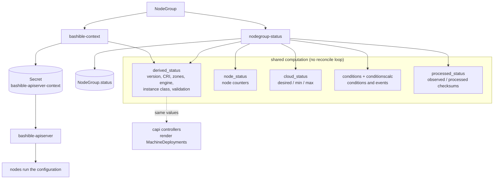
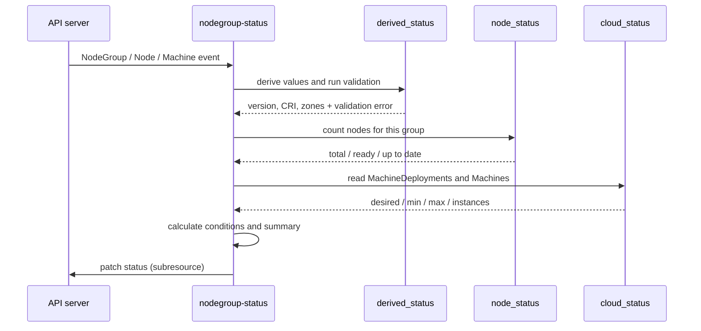
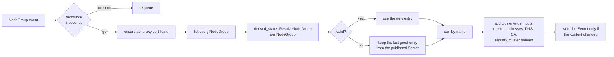

# NodeGroup controllers

This directory holds the two controllers that react to `NodeGroup` objects, plus the packages
they compute with. Both controllers watch the same object but answer different questions:

| Controller | Question it answers | What it writes |
| --- | --- | --- |
| `nodegroup-status` (`controller.go`) | What is the state of this NodeGroup right now? | `NodeGroup.status` |
| `bashible-context` (`bashiblecontext/`) | What configuration should the nodes of every NodeGroup run? | Secret `d8-cloud-instance-manager/bashible-apiserver-context` |

Everything else here is a plain package: it takes data in and returns data out, with no
reconcile loop of its own. The same packages are also used by the `capi` controllers, which
render MachineDeployments from the very same derived values.

Most of this logic used to live in the `get_crds` shell-operator hook. Keeping the derived
values identical to what that hook produced is a hard requirement: they end up in the machine
templates and in the node configuration checksum, so a difference reboots or replaces nodes.

## How the pieces fit together

## nodegroup-status

Keeps `NodeGroup.status` in step with the real world.

**Watches:** `NodeGroup` (spec and annotation changes only), `Node`, MCM and CAPI `Machine`,
MCM and CAPI `MachineDeployment`, the `configuration-checksums` Secret, the cloud-provider
Secret, and the provider `InstanceClass` kinds.

**Writes:** `status.nodes`, `ready`, `upToDate`, `desired`, `min`, `max`, `instances`,
`kubernetesVersion`, `error`, `conditions`, `conditionSummary`, `lastMachineFailures`, and — in a
second patch through `processed_status` — `status.deckhouse.observed`, `processed` and `synced`.

Its own status writes are filtered out of its triggers. Without that filter every patch would
wake the controller again, and during a burst of NodeGroups the echo multiplied the work many
times over.

Cloud counters are only filled for `CloudEphemeral` groups; for other node types they are reset
to zero rather than left stale.

## bashible-context

Builds one document that describes every NodeGroup, and publishes it as a Secret.
`bashible-apiserver` reads that Secret and turns it into the scripts each node runs.

**Watches:** `NodeGroup`, Secrets and ConfigMaps in `kube-system` and
`d8-cloud-instance-manager`, the DNS `Service`, the kube-apiserver `Pod`s, the `kubernetes`
`EndpointSlice`, and the provider `InstanceClass` kinds. Its own output Secret is excluded — a
write must not trigger the next build.

**Writes:** Secret `d8-cloud-instance-manager/bashible-apiserver-context`. It also issues and
renews the `kubernetes-api-proxy-discovery-cert` Secret in `kube-system`.

Two rules matter here:

- **One NodeGroup must not break the others.** A group that fails validation keeps its previous
  entry, so the rest of the cluster still gets a complete document.
- **Write only on a real change.** The Secret is compared before writing. Every write makes
  bashible-apiserver rebuild the scripts for all groups, and a changed checksum makes every node
  re-apply its configuration.

The certificate step is deliberately separate from the assembly. On a fresh cluster the signer
may not be ready yet; the context is still published, just without the proxy certificates.

## Shared packages

### derived_status

The heart of the migration. For one NodeGroup it derives the values the old hook produced:
engine (MCM, CAPI or none), effective Kubernetes version, CRI type, zones, node capacity, the
resolved instance class, serialized labels and taints, and the update epoch. It also runs the
validation checks and assembles the `ResolvedNodeGroup` — the per-NodeGroup document used both
by the bashible context and by the MachineDeployment renderer.

Two entry points:

- `ComputeWithCloudChecks` — derived values plus validation, used by `nodegroup-status`.
- `ResolveNodeGroup` — the same, returned as a `ResolvedNodeGroup`, used by
  `bashible-context` and by the `capi` controllers. Its `ToMap` is the only place that value
  turns into the map the published context and the provider templates consume.

The effective Kubernetes version is clamped so that nodes never run ahead of the control plane.
The clamp reads the **kube-apiserver** version from the annotation control-plane-manager puts on
its static pods. It must not read the kubelet version of the control-plane nodes: this same
value decides which kubelet package bashible installs, so a kubelet-based clamp would hold
itself down and no minor upgrade could ever finish.

### node_status

Counts the nodes of a group: how many exist, how many are ready, and how many already run the
desired configuration checksum.

### cloud_status

Reads MachineDeployments and Machines of a cloud group and reports `desired`, `min`, `max` and
`instances`, plus the recent machine failures.

### conditions and conditionscalc

`conditionscalc` is pure arithmetic over plain structs: given counters and node states it
returns the conditions (`Ready`, `Updating`, `WaitingForDisruptiveApproval`, `Error`, …) and the
summary. `conditions` wraps it with the API types and emits Kubernetes events, skipping messages
that were already reported.

### processed_status

Records whether Deckhouse has already processed the current spec. It filters the NodeGroup down
to the fields that matter, checksums them, and patches `status.deckhouse.observed`, `processed`
and `synced`. `nodegroup-status` calls it at the end of its reconcile, and the patch is skipped
when nothing changed.

Both checksums are written from the same reconcile, so they always describe the same spec. The
hook that used to write `observed` ran before helm, and a NodeGroup could sit with `synced:
False` forever if the two halves disagreed.

### machineclass

Renders the provider templates that come from the cloud-provider Secrets: the MachineClass or
machine template, and the checksum that names them. It is a small template engine with helm's
function set, minus the parts that make no sense outside helm.

The checksum matters more than it looks: it becomes part of the CAPI machine template name and
of the MCM MachineClass name, and both objects are immutable. A checksum that changes renames
them, which rolls the MachineDeployment and recreates every virtual machine in it. That is why
the package carries literal golden checksums copied from the helm implementation.

### nodegroupfilter and common

`nodegroupfilter` holds the plain structs used to snapshot a NodeGroup spec for checksums.
`common` holds the small shared pieces: GroupVersionKinds, the functions that map an event on a
Node, Machine or MachineDeployment back to its NodeGroup, and condition conversions.

## Things worth knowing before changing this code

- **Derived values reach the nodes.** Anything in the resolved NodeGroup ends up in the node
  configuration checksum. A field that changes for no reason makes every node re-apply its configuration.
- **The instance-class checksum reaches the machines.** See `machineclass` above: it renames
  immutable objects and rolls them.
- **Read errors are not all treated alike.** Some readers return an error so the reconcile
  retries; some fall back to a zero value. A fallback that reaches the resolved NodeGroup
  publishes a changed document, so prefer returning the error.
- **Events are filtered on purpose.** The predicates on both controllers exist because
  unfiltered events multiplied the work during NodeGroup bursts. Removing one is easy to do by
  accident and expensive at scale.
