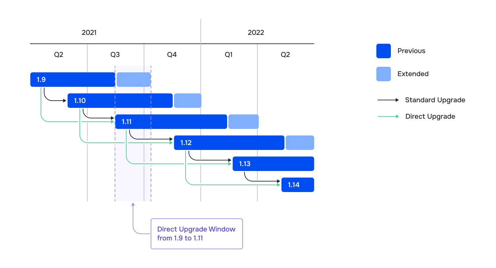

## Circuit Breaker

Для выявления проблемных эндпоинтов используются настройки `outlierDetection` в кастомном ресурсе [DestinationRule](istio-cr.html#destinationrule).
Более подробно алгоритм Outlier Detection описан [в документации Envoy](https://www.envoyproxy.io/docs/envoy/latest/intro/arch_overview/upstream/outlier).

Пример:

```yaml
apiVersion: networking.istio.io/v1beta1
kind: DestinationRule
metadata:
  name: reviews-cb-policy
spec:
  host: reviews.prod.svc.cluster.local
  trafficPolicy:
    connectionPool:
      tcp:
        maxConnections: 100 # Максимальное число соединений в сторону host, суммарно для всех эндпоинтов.
      http:
        maxRequestsPerConnection: 10 # Каждые 10 запросов, соединение будет пересоздаваться.
    outlierDetection:
      consecutive5xxErrors: 7 # Допустимо 7 ошибок (включая пятисотые, TCP-таймауты и HTTP-таймауты)
      interval: 5m            # в течение пяти минут,
      baseEjectionTime: 15m   # после которых эндпоинт будет исключен из балансировки на 15 минут.
```

А также для настройки HTTP-таймаутов используется ресурс [VirtualService](istio-cr.html#virtualservice). Эти таймауты также учитываются при подсчете статистики ошибок на эндпоинтах.

Пример:

```yaml
apiVersion: networking.istio.io/v1beta1
kind: VirtualService
metadata:
  name: my-productpage-rule
  namespace: myns
spec:
  hosts:
  - productpage
  http:
  - timeout: 5s
    route:
    - destination:
        host: productpage
```

## Балансировка gRPC


Чтобы балансировка gRPC-сервисов заработала автоматически, присвойте имя с префиксом или значением `grpc` для порта в соответствующем сервисе.


## Locality Failover

При необходимости ознакомьтесь с [документацией Istio о Locality Failover](https://istio.io/latest/docs/tasks/traffic-management/locality-load-balancing/failover/).

Istio позволяет настроить приоритетный географический failover между эндпоинтами. Для определения зоны Istio использует лейблы узлов с соответствующей иерархией:

* `topology.istio.io/subzone`;
* `topology.kubernetes.io/zone`;
* `topology.kubernetes.io/region`.

Это полезно для межкластерного failover при использовании совместно с [мультикластером](#устройство-мультикластера-из-двух-кластеров-с-помощью-ресурса-istiomulticluster).


Для включения Locality Failover используется ресурс DestinationRule, в котором также необходимо настроить `outlierDetection`.


Пример:

```yaml
apiVersion: networking.istio.io/v1beta1
kind: DestinationRule
metadata:
  name: helloworld
spec:
  host: helloworld
  trafficPolicy:
    loadBalancer:
      localityLbSetting:
        enabled: true # Включили Locality Failover.
    outlierDetection: # outlierDetection включить обязательно.
      consecutive5xxErrors: 1
      interval: 1s
      baseEjectionTime: 1m
```

## Retry

С помощью ресурса [VirtualService](istio-cr.html#virtualservice) можно настроить Retry для запросов.


По умолчанию при возникновении ошибок все запросы (включая POST-запросы) выполняются повторно до трех раз.


Пример:

```yaml
apiVersion: networking.istio.io/v1beta1
kind: VirtualService
metadata:
  name: ratings-route
spec:
  hosts:
  - ratings.prod.svc.cluster.local
  http:
  - route:
    - destination:
        host: ratings.prod.svc.cluster.local
    retries:
      attempts: 3
      perTryTimeout: 2s
      retryOn: gateway-error,connect-failure,refused-stream
```

## Canary

Istio отвечает лишь за гибкую маршрутизацию запросов, которая опирается на спецзаголовки запросов (например, cookie) или просто на случайность. За настройку этой маршрутизации и переключение между канареечными версиями отвечает CI/CD-система.

Подразумевается, что в одном неймспейсе развёрнуты два Deployment с разными версиями приложения. У подов разных версий разные лейблы (`version: v1` и `version: v2`).

Требуется настроить два кастомных ресурса:

* [DestinationRule](istio-cr.html#destinationrule) с описанием, как идентифицировать разные версии вашего приложения (subset);
* [VirtualService](istio-cr.html#virtualservice) с описанием, как распределять трафик между разными версиями приложения.

Пример:

```yaml
apiVersion: networking.istio.io/v1beta1
kind: DestinationRule
metadata:
  name: productpage-canary
spec:
  host: productpage
  # subset доступны только при обращении к хосту через VirtualService из пода под управлением Istio.
  # Эти subset должны быть указаны в маршрутах.
  subsets:
  - name: v1
    labels:
      version: v1
  - name: v2
    labels:
      version: v2
```

### Распределение по наличию cookie

```yaml
apiVersion: networking.istio.io/v1beta1
kind: VirtualService
metadata:
  name: productpage-canary
spec:
  hosts:
  - productpage
  http:
  - match:
    - headers:
       cookie:
         regex: "^(.*;?)?(canary=yes)(;.*)?"
    route:
    - destination:
        host: productpage
        subset: v2 # Ссылка на subset из DestinationRule.
  - route:
    - destination:
        host: productpage
        subset: v1
```

### Распределение по вероятности

```yaml
apiVersion: networking.istio.io/v1beta1
kind: VirtualService
metadata:
  name: productpage-canary
spec:
  hosts:
  - productpage
  http:
  - route:
    - destination:
        host: productpage
        subset: v1 # Ссылка на subset из DestinationRule.
      weight: 90 # Процент трафика, который получат поды с лейблом version: v1.
  - route:
    - destination:
        host: productpage
        subset: v2
      weight: 10
```

## Ingress для публикации приложений

### Istio Ingress Gateway

Кастомный ресурс [IngressIstioController](cr.html#ingressistiocontroller) разворачивает выделенный прокси Istio Ingress Gateway. Каждый экземпляр контроллера получает собственный класс шлюза, и нужный экземпляр выбирается из ресурса Istio `Gateway` по соответствующему лейблу `istio.deckhouse.io/ingress-gateway-class`. Модуль управляет рабочей нагрузкой шлюза и его ресурсом `Service`, тогда как ресурсы `Gateway` и маршрутизации (`VirtualService`) остаются под вашим управлением.

Начните с создания `IngressIstioController`. В примере ниже HTTP и HTTPS публикуются на выбранных frontend-узлах через host-порты:

```yaml
apiVersion: deckhouse.io/v1alpha1
kind: IngressIstioController
metadata:
  name: main
spec:
  # Значение, которое выбирается ресурсами Gateway через лейбл istio.deckhouse.io/ingress-gateway-class.
  ingressGatewayClass: istio-hp
  # IngressIstioController поддерживает инлеты LoadBalancer, NodePort и HostPort.
  inlet: HostPort
  hostPort:
    httpPort: 80
    httpsPort: 443
  nodeSelector:
    node-role.deckhouse.io/frontend: ""
  tolerations:
    - effect: NoExecute
      key: dedicated.deckhouse.io
      operator: Equal
      value: frontend
  resourcesRequests:
    mode: VPA
```

Обратите внимание, что ресурс Secret с TLS для ingress gateway должен быть создан в пространстве имён `d8-ingress-istio`, а не в пространстве имён приложения — эту деталь легко упустить.

```yaml
apiVersion: v1
kind: Secret
metadata:
  name: app-tls-secret
  namespace: d8-ingress-istio # Обратите внимание, неймспейс не является app-ns.
type: kubernetes.io/tls
data:
  tls.crt: |
    <tls.crt data>
  tls.key: |
    <tls.key data>
```

```yaml
apiVersion: networking.istio.io/v1beta1
kind: Gateway
metadata:
  name: gateway-app
  namespace: app-ns
spec:
  selector:
    # Селектор лейблов для использования Istio Ingress Gateway main-hp.
    istio.deckhouse.io/ingress-gateway-class: istio-hp
  servers:
    - port:
        # Стандартный шаблон для использования протокола HTTP.
        number: 80
        name: http
        protocol: HTTP
      hosts:
        - app.example.com
    - port:
        # Стандартный шаблон для использования протокола HTTPS.
        number: 443
        name: https
        protocol: HTTPS
      tls:
        mode: SIMPLE
        # Ресурс Secret с сертификатом и ключом, который должен быть создан в нейсмпейсе d8-ingress-istio.
        # Поддерживаемые форматы ресурсов Secret можно посмотреть по ссылке https://istio.io/latest/docs/tasks/traffic-management/ingress/secure-ingress/#key-formats.
        credentialName: app-tls-secret
      hosts:
        - app.example.com
```

```yaml
apiVersion: networking.istio.io/v1beta1
kind: VirtualService
metadata:
  name: vs-app
  namespace: app-ns
spec:
  gateways:
    - gateway-app
  hosts:
    - app.example.com
  http:
    - route:
        - destination:
            host: app-svc
```

Полный список настроек контроллера — аннотации балансировщика нагрузки, топология сети, планирование и управление ресурсами — приведён в [справочнике по кастомному ресурсу IngressIstioController](cr.html#ingressistiocontroller).

#### Сохранение атрибутов клиента за внешними прокси

Когда шлюз развёрнут за другими прокси или балансировщиками нагрузки (например, за облачным балансировщиком или обратным прокси), настройте [`spec.networkTopology`](cr.html#ingressistiocontroller-v1alpha1-spec-networktopology), чтобы шлюз мог корректно извлекать исходные атрибуты клиента, например IP-адрес источника. Подробнее — [в документации Istio о топологии сети шлюза](https://istio.io/latest/docs/ops/configuration/traffic-management/network-topologies/).

Используйте [`numTrustedProxies`](cr.html#ingressistiocontroller-v1alpha1-spec-networktopology-numtrustedproxies), когда вышестоящие прокси передают IP-адрес клиента в заголовке `X-Forwarded-For`. Укажите количество доверенных прокси, развёрнутых перед шлюзом, чтобы Istio извлекал корректный адрес клиента и заполнял заголовок `X-Envoy-External-Address` для вышестоящих сервисов. Например, если перед шлюзом находятся облачный балансировщик и обратный прокси, укажите значение `2`:

```yaml
apiVersion: deckhouse.io/v1alpha1
kind: IngressIstioController
metadata:
  name: main
spec:
  ingressGatewayClass: istio-hp
  inlet: LoadBalancer
  networkTopology:
    numTrustedProxies: 2
  nodeSelector:
    node-role.deckhouse.io/frontend: ""
  resourcesRequests:
    mode: VPA
```

Используйте [`proxyProtocol`](cr.html#ingressistiocontroller-v1alpha1-spec-networktopology-proxyprotocol), когда вышестоящий L4/TCP-балансировщик передаёт атрибуты клиента через [PROXY-протокол](https://www.haproxy.org/download/1.8/doc/proxy-protocol.txt), а не через HTTP-заголовки. При включении этого параметра шлюз начинает разбирать заголовок PROXY-протокола во входящих TCP-соединениях:

```yaml
apiVersion: deckhouse.io/v1alpha1
kind: IngressIstioController
metadata:
  name: main
spec:
  ingressGatewayClass: istio-hp
  inlet: LoadBalancer
  networkTopology:
    proxyProtocol: true
  nodeSelector:
    node-role.deckhouse.io/frontend: ""
  resourcesRequests:
    mode: VPA
```


`numTrustedProxies` и `proxyProtocol` можно использовать вместе. Если настроены оба параметра и входящий запрос содержит заголовок `X-Forwarded-For`, Istio использует доверенную цепочку `X-Forwarded-For` вместо атрибутов PROXY-протокола.


#### Управление запросами ресурсов шлюза

Используйте [`spec.resourcesRequests`](cr.html#ingressistiocontroller-v1alpha1-spec-resourcesrequests) для управления запросами (requests) CPU и памяти для подов ingress gateway. Доступны два режима:

- `Static` — запросы задаются напрямую и остаются фиксированными:

  ```yaml
  apiVersion: deckhouse.io/v1alpha1
  kind: IngressIstioController
  metadata:
    name: main
  spec:
    ingressGatewayClass: istio-hp
    inlet: HostPort
    hostPort:
      httpPort: 80
      httpsPort: 443
    resourcesRequests:
      mode: Static
      static:
        cpu: 100m
        memory: 128Mi
  ```

- `VPA` — [Vertical Pod Autoscaler](https://github.com/kubernetes/design-proposals-archive/blob/main/autoscaling/vertical-pod-autoscaler.md) изменяет запросы в заданных пределах `min`/`max`. Начиная с версии DKP 1.75, рекомендуемым режимом VPA является `InPlaceOrRecreate`: он изменяет ресурсы пода «на месте» (in-place), если это поддерживается кластером, и пересоздаёт под в противном случае (устаревший режим `Auto` всегда пересоздаёт под):

  ```yaml
  apiVersion: deckhouse.io/v1alpha1
  kind: IngressIstioController
  metadata:
    name: main
  spec:
    ingressGatewayClass: istio-hp
    inlet: HostPort
    hostPort:
      httpPort: 80
      httpsPort: 443
    resourcesRequests:
      mode: VPA
      vpa:
        mode: InPlaceOrRecreate
        cpu:
          min: 100m
          max: 1000m
        memory:
          min: 128Mi
          max: 2000Mi
  ```

### Ingress NGINX

Для работы с Ingress NGINX требуется подготовить:

* Ingress-контроллер, добавив к нему сайдкар от Istio. В нашем случае — включить параметр `enableIstioSidecar` в кастомном ресурсе [IngressNginxController](/modules/ingress-nginx/cr.html#ingressnginxcontroller) модуля [ingress-nginx](/modules/ingress-nginx/).
* Ingress-ресурс, который ссылается на Service. Обязательные аннотации для Ingress-ресурса:
  * `nginx.ingress.kubernetes.io/service-upstream: "true"` — с этой аннотацией Ingress-контроллер будет отправлять запросы на ClusterIP сервиса (из диапазона Service CIDR) вместо того, чтобы слать их напрямую в поды приложения. Sidecar-контейнер `istio-proxy` перехватывает трафик только в сторону диапазона Service CIDR, остальные запросы отправляются напрямую;
  * `nginx.ingress.kubernetes.io/upstream-vhost: myservice.myns.svc` — с данной аннотацией сайдкар сможет идентифицировать прикладной сервис, для которого предназначен запрос.

Примеры:

```yaml
apiVersion: networking.k8s.io/v1
kind: Ingress
metadata:
  name: productpage
  namespace: bookinfo
  annotations:
    # Просим nginx проксировать трафик на ClusterIP вместо собственных IP подов.
    nginx.ingress.kubernetes.io/service-upstream: "true"
    # В Istio вся маршрутизация осуществляется на основе `Host:` заголовка запросов.
    # Чтобы не сообщать Istio о существовании внешнего домена `productpage.example.com`,
    # мы просто используем внутренний домен, о котором Istio осведомлен.
    nginx.ingress.kubernetes.io/upstream-vhost: productpage.bookinfo.svc
spec:
  rules:
    - host: productpage.example.com
      http:
        paths:
        - path: /
          pathType: Prefix
          backend:
            service:
              name: productpage
              port:
                number: 9080
```

```yaml
apiVersion: v1
kind: Service
metadata:
  name: productpage
  namespace: bookinfo
spec:
  ports:
  - name: http
    port: 9080
  selector:
    app: productpage
  type: ClusterIP
```

## Примеры настройки авторизации

### Алгоритм принятия решения

Как только для приложения создается AuthorizationPolicy, начинает работать следующий алгоритм принятия решения о судьбе запроса:

* Если запрос попадает под политику DENY — запретить запрос.
* Если для данного приложения нет политик ALLOW — разрешить запрос.
* Если запрос попадает под политику ALLOW — разрешить запрос.
* Все остальные запросы — запретить.

Иными словами, если вы явно что-то запретили, работает только ваш запрет. Если же вы что-то явно разрешили, теперь разрешены только явно одобренные запросы (запреты никуда не исчезают и имеют приоритет).


Для работы политик, основанных на высокоуровневых параметрах, таких как неймспейсы или principal, необходимо, чтобы все вовлеченные сервисы работали под управлением Istio. Также между приложениями должен быть организован Mutual TLS.


Примеры:
* Запретим POST-запросы для приложения myapp. Отныне, так как для приложения появилась политика, согласно алгоритму выше будут запрещены только POST-запросы к приложению.

  ```yaml
  apiVersion: security.istio.io/v1beta1
  kind: AuthorizationPolicy
  metadata:
    name: deny-post-requests
    namespace: foo
  spec:
    selector:
      matchLabels:
        app: myapp
    action: DENY
    rules:
    - to:
      - operation:
          methods: ["POST"]
  ```

* Для приложения создана разрешающая политика ALLOW. При ней будут разрешены только запросы из неймспейса `bar`, остальные запрещены.

  ```yaml
  apiVersion: security.istio.io/v1beta1
  kind: AuthorizationPolicy
  metadata:
    name: deny-all
    namespace: foo
  spec:
    selector:
      matchLabels:
        app: myapp
    action: ALLOW # default, можно не указывать.
    rules:
    - from:
      - source:
          namespaces: ["bar"]
  ```

* Здесь для приложения создана политика ALLOW. При этом она не содержит ни одного правила, вследствие чего ни один запрос не попадает под критерии фильтрации. Однако сам факт наличия политики активирует алгоритм проверки, где всё, что не разрешено явно, считается запрещенным. В данном случае блокируются абсолютно все запросы

  ```yaml
  apiVersion: security.istio.io/v1beta1
  kind: AuthorizationPolicy
  metadata:
    name: deny-all
    namespace: foo
  spec:
    selector:
      matchLabels:
        app: myapp
    action: ALLOW # default, можно не указывать.
    rules: []
  ```

* Здесь для приложения создана политика ALLOW (это default) и одно пустое правило. Под это правило попадает любой запрос и автоматически получает разрешение.

  ```yaml
  apiVersion: security.istio.io/v1beta1
  kind: AuthorizationPolicy
  metadata:
    name: allow-all
    namespace: foo
  spec:
    selector:
      matchLabels:
        app: myapp
    rules:
    - {}
  ```

### Запретить все действия в рамках неймспейса foo

Два способа:

* Запретить явно. Здесь мы создаем политику DENY с единственным универсальным фильтром `{}`, под который попадают все запросы:

  ```yaml
  apiVersion: security.istio.io/v1beta1
  kind: AuthorizationPolicy
  metadata:
    name: deny-all
    namespace: foo
  spec:
    action: DENY
    rules:
    - {}
  ```

* Неявно. Здесь мы создаем политику ALLOW (по умолчанию), но не создаем ни одного фильтра, так что ни один запрос под нее не попадет и будет автоматически запрещен.

  ```yaml
  apiVersion: security.istio.io/v1beta1
  kind: AuthorizationPolicy
  metadata:
    name: deny-all
    namespace: foo
  spec: {}
  ```

### Запретить доступ только из неймспейса foo

```yaml
apiVersion: security.istio.io/v1beta1
kind: AuthorizationPolicy
metadata:
 name: deny-from-ns-foo
 namespace: myns
spec:
 action: DENY
 rules:
 - from:
   - source:
       namespaces: ["foo"]
```

### Разрешить запросы только в рамках нашего неймспейса foo

```yaml
apiVersion: security.istio.io/v1beta1
kind: AuthorizationPolicy
metadata:
 name: allow-intra-namespace-only
 namespace: foo
spec:
 action: ALLOW
 rules:
 - from:
   - source:
       namespaces: ["foo"]
```

### Разрешить из любого места в нашем кластере

```yaml
apiVersion: security.istio.io/v1beta1
kind: AuthorizationPolicy
metadata:
 name: allow-all-from-my-cluster
 namespace: myns
spec:
 action: ALLOW
 rules:
 - from:
   - source:
       principals: ["mycluster.local/*"]
```

### Разрешить любые запросы только кластеров foo или bar

```yaml
apiVersion: security.istio.io/v1beta1
kind: AuthorizationPolicy
metadata:
 name: allow-all-from-foo-or-bar-clusters-to-ns-baz
 namespace: baz
spec:
 action: ALLOW
 rules:
 - from:
   - source:
       principals: ["foo.local/*", "bar.local/*"]
```

### Разрешить любые запросы только от сущностей из неймспейса baz кластеров foo или bar

```yaml
apiVersion: security.istio.io/v1beta1
kind: AuthorizationPolicy
metadata:
 name: allow-all-from-foo-or-bar-clusters-to-ns-baz
 namespace: baz
spec:
 action: ALLOW
 rules:
 - from:
   - source: # Правила ниже логически перемножаются.
       namespaces: ["baz"]
       principals: ["foo.local/*", "bar.local/*"]
```

### Разрешить из любого кластера (по mTLS)


Если есть запрещающие правила, у них будет приоритет. Подробнее — в разделе [«Алгоритм принятия решения»](#алгоритм-принятия-решения).


Пример:

```yaml
apiVersion: security.istio.io/v1beta1
kind: AuthorizationPolicy
metadata:
 name: allow-all-from-any-cluster-with-mtls
 namespace: myns
spec:
 action: ALLOW
 rules:
 - from:
   - source:
       principals: ["*"] # Принудительное использование mTLS.
```

### Разрешить вообще откуда угодно (в том числе без mTLS)

```yaml
apiVersion: security.istio.io/v1beta1
kind: AuthorizationPolicy
metadata:
 name: allow-all-from-any
 namespace: myns
spec:
 action: ALLOW
 rules: [{}]
```

## Устройство федерации из двух кластеров с помощью кастомного ресурса IstioFederation

Доступно в редакциях Enterprise Edition и Certified Security Edition Pro.

Cluster A:

```yaml
apiVersion: deckhouse.io/v1alpha1
kind: IstioFederation
metadata:
  name: cluster-b
spec:
  metadataEndpoint: https://istio.k8s-b.example.com/metadata/
  trustDomain: cluster-b.local
```

Cluster B:

```yaml
apiVersion: deckhouse.io/v1alpha1
kind: IstioFederation
metadata:
  name: cluster-a
spec:
  metadataEndpoint: https://istio.k8s-a.example.com/metadata/
  trustDomain: cluster-a.local
```

## Устройство мультикластера из двух кластеров с помощью ресурса IstioMulticluster

Доступно в редакциях Enterprise Edition и Certified Security Edition Pro.

Cluster A:

```yaml
apiVersion: deckhouse.io/v1alpha1
kind: IstioMulticluster
metadata:
  name: cluster-b
spec:
  metadataEndpoint: https://istio.k8s-b.example.com/metadata/
```

Cluster B:

```yaml
apiVersion: deckhouse.io/v1alpha1
kind: IstioMulticluster
metadata:
  name: cluster-a
spec:
  metadataEndpoint: https://istio.k8s-a.example.com/metadata/
```

## Ambient mesh

Доступно только в Enterprise Edition и Certified Security Edition Pro.


Режим ambient можно включить в кластерах, использующих мультикластер или федерацию DKP, однако функции мультикластера и федерации не поддерживаются для подов, подключённых к ambient.


Упоминаемые в этом подразделе компоненты ambient mesh описаны [на странице с основным описанием модуля](./#ambient-mesh).

### Включение ambient mesh

Для работы режима ambient требуются Istio 1.25 или более новой версии и режим перенаправления трафика [`CNIPlugin`](#ограничения-режима-перенаправления-прикладного-трафика-cniplugin).

Пример конфигурации модуля с включенным режимом ambient:

```yaml
apiVersion: deckhouse.io/v1alpha1
kind: ModuleConfig
metadata:
  name: istio
spec:
  enabled: true
  version: 2
  settings:
    dataPlane:
      trafficRedirectionSetupMode: CNIPlugin
    ambient:
      enabled: true
```

Включение режима ambient устанавливает DaemonSet `ztunnel` и контроллер waypoint-ов, но не изменяет существующие рабочие нагрузки с сайдкарами и не подключает прикладные неймспейсы автоматически. Это позволяет подготовить data plane ambient до миграции приложений.

### Подключение рабочих нагрузок к ambient (L4)

Добавьте лейбл `istio.io/dataplane-mode=ambient` на неймспейс, чтобы перехватывать трафик подов в этом неймспейсе с помощью `ztunnel`. Это обеспечивает взаимный TLS, идентификацию рабочих нагрузок, L4 авторизацию и L4 телеметрию без сайдкаров:

```shell
d8 k label namespace myns istio.io/dataplane-mode=ambient --overwrite
```

Существующие подходящие поды без сайдкаров подключаются без перезапуска. Поды, уже содержащие сайдкар Istio, остаются в режиме сайдкара, потому что перехват трафика сайдкаром имеет приоритет. Чтобы мигрировать такие поды, отключите инъекцию сайдкаров и пересоздайте их, как описано ниже.

### Добавление сервисного waypoint-а для L7 возможностей

Сервисный waypoint добавляет маршрутизацию HTTP, L7 авторизацию, аутентификацию запросов и более подробную телеметрию для трафика, адресованного сервисам Kubernetes. Создайте ресурс [WaypointInstance](cr.html#waypointinstance) в прикладном неймспейсе:

```yaml
apiVersion: network.deckhouse.io/v1alpha1
kind: WaypointInstance
metadata:
  name: main
  namespace: myns
spec:
  waypointFor: Service
  replicasManagement:
    mode: Static
    static:
      replicas: 2
  resourcesManagement:
    mode: VPA
    vpa:
      mode: InPlaceOrRecreate
      cpu:
        min: 100m
        max: 1000m
      memory:
        min: 128Mi
        max: 2000Mi
```

Контроллер создаёт инфраструктуру waypoint, включая Deployment, Service, Gateway, VPA, а также PDB, когда эффективное количество реплик не менее двух. Для ресурса `WaypointInstance` с именем `main` сгенерированный Gateway и другие ресурсы неймспейса получают имя `d8-waypoint-main`.

Контроллер не подключает сервисы к waypoint. Чтобы подключить все сервисы неймспейса, добавьте на неймспейс лейбл с именем сгенерированного Gateway:

```shell
d8 k label namespace myns istio.io/use-waypoint=d8-waypoint-main --overwrite
```

Как альтернатива, подключите отдельный сервис:

```shell
d8 k -n myns label service myservice istio.io/use-waypoint=d8-waypoint-main --overwrite
```


Приведённая ниже процедура бесшовной миграции поддерживает сервисные waypoint-ы и трафик, отправляемый на адрес сервиса Kubernetes. Workload waypoint, прямой трафик на IP подов и headless-сервисы не обеспечивают такой же совместимости и на них нельзя полагаться при бесшовной миграции.


### Миграция из режима сайдкара в режим ambient

DKP поддерживает постепенную и бесшовную миграцию по одному неймспейсу и сервису. После включения ambient-а существующие сайдкары продолжают работать. Когда сервис подключён к сервисному waypoint-у, сайдкары, которые ещё не были удалены, маршрутизируют трафик, адресованный сервису, через этот waypoint. Поэтому маршрутизацию через waypoint и политики L7 можно проверить ещё до того, как какой-либо прикладной под будет перезапущен без сайдкара.

Мигрируйте один неймспейс полностью и проверьте его, прежде чем переходить к следующему.

#### 1. Аудит и резервное копирование текущей конфигурации

Перед продолжением убедитесь, что неймспейс и его зависимости удовлетворяют следующим предварительным условиям:

- каждая ревизия control plane Istio, используемая неймспейсом и клиентами его сервисов, имеет версию 1.25 или новее. Это включает ревизии, используемые существующими сайдкарами во время перехода
- модуль использует режим перенаправления трафика `CNIPlugin`, и режим ambient включён
- прикладной трафик не зависит от функций мультикластера или федерации DKP
- в mesh нет VM-нагрузок, которые должны взаимодействовать как ambient-нагрузки, потому что VM-нагрузки не могут присоединяться к сети ambient
- ни одна применимая `PeerAuthentication` не использует `mode: DISABLE`, потому что сеть ambient всегда использует Mutual TLS между нагрузками mesh
- ни одна необходимая конфигурация не зависит от `EnvoyFilter`, потому что waypoint не поддерживают `EnvoyFilter`
- для каждого необходимого egress-ограничения и маршрута есть ambient-совместимая замена, которая протестирована из ambient-нагрузки


Механизмы контроля egress-трафика сайдкара не мигрируются автоматически. Удаление сайдкара может прервать необходимый внешний трафик или разрешить трафик, который ранее был ограничен. Считайте неразрешённое поведение egress-трафика блокером миграции.


Устраните каждую несовместимую зависимость перед миграцией неймспейса.

Перед изменением неймспейса:

- зафиксируйте, использует ли неймспейс `istio-injection=enabled` или `istio.io/rev=<revision>`, и найдите все шаблоны подов с явно заданным лейблом или аннотацией `sidecar.istio.io/inject`, включая значения `true` и `false`
- проведите инвентаризацию всех ресурсов, управляющих подами, включая Deployment, StatefulSet, DaemonSet, Job, CronJob, отдельные ReplicaSet, самостоятельные поды и рабочие нагрузки под управлением сторонних операторов
- проведите инвентаризацию ресурсов `VirtualService`, `DestinationRule`, `ServiceEntry`, `Sidecar`, `AuthorizationPolicy`, `RequestAuthentication`, `PeerAuthentication`, `Telemetry`, `WasmPlugin` и `EnvoyFilter`
- определите всех клиентов сервисов неймспейса, включая ingress-трафик и клиентов в других неймспейсах
- определите механизмы контроля egress-трафика сайдкара, такие как `outboundTrafficPolicy: REGISTRY_ONLY`, `Sidecar.egress.hosts`, `ServiceEntry.exportTo`, а также маршруты через egress-шлюзы
- сохраните резервную копию неймспейса, рабочих нагрузок и ресурсов Istio в репозитории конфигурации или экспортируйте их с помощью `d8 k get ... -o yaml`
- запишите каждый изменяемый лейбл неймспейса и сервисов, политику и маршрут, чтобы откат был воспроизводимым

#### 2. Подготовка L7 маршрутизации и политик

На протяжении всей миграции добавляйте ambient-эквиваленты рядом с существующими политиками сайдкаров, а не заменяйте их. Оба набора применяются параллельно, поэтому трафик остаётся защищённым независимо от того, проходит ли он через сайдкар или через waypoint. Удаляйте устаревшие L7-политики на основе селекторов (см. шаг 4) только после проверки пути через waypoint, сохраняя при этом L4-политики на основе селекторов, которые ztunnel должен продолжать применять.

Применение политик смещается, когда трафик начинает использовать сервисный waypoint: waypoint применяет политики для трафика, адресованного сервису, а ztunnel адресата применяет политики L4, нацеленные на под. Подготовьте ambient-эквиваленты до подключения сервисов к waypoint.

Ресурсы маршрутизации требуют отдельного контролируемого переключения. `HTTPRoute`, чей `parentRefs` указывает на сервис, может повлиять на существующие сайдкары сразу после того, как маршрут принят, даже до подключения сервиса к waypoint. Не предполагайте, что `VirtualService` остаётся авторитетным до подключения waypoint.

| Ресурс режима сайдкара | Действие при миграции |
| --- | --- |
| `VirtualService` | Мигрируйте на `HTTPRoute` Gateway API. Поддержка `VirtualService` с ambient-waypoint имеет статус Alpha. Сначала сделайте `HTTPRoute` поведенчески эквивалентным `VirtualService`, затем примените его как контролируемое переключение маршрутизации. Немедленно проверьте трафик существующих сайдкаров и оперативно удалите `VirtualService`. Не полагайтесь на приоритет между пересекающимися ресурсами и не оставляйте оба ресурса настроенными для одного сервиса. |
| `DestinationRule` traffic policy | Как правило, не требует изменений. Waypoint применяет поддерживаемые политики трафика. |
| `DestinationRule` subsets, используемые для маршрутизации | Создайте отдельный Kubernetes Service для каждой версии и сошлитесь на эти сервисы в `HTTPRoute.backendRefs`. |
| L4 `AuthorizationPolicy` | Политики на основе селекторов, содержащие только L4-атрибуты, могут остаться и применяются ztunnel. Добавьте политику, нацеленную на сервис, если то же решение должно применяться и на waypoint, и убедитесь, что политика рабочей нагрузки разрешает доступ с waypoint-а. |
| L7 `AuthorizationPolicy` | Скопируйте правила в политику с `targetRefs`, указывающими на защищаемый сервис. Удалите старую L7-политику на основе селекторов после проверки трафика через waypoint и до перезапуска подов без сайдкаров. |
| `RequestAuthentication` и `WasmPlugin` | Привяжите к сервису или waypoint-у через `targetRefs`. |
| `EnvoyFilter` | Не поддерживается waypoint. Замените его или считайте блокером миграции. |

Например, политика авторизации L7 для сервиса `reviews` должна быть нацелена на сервис, а не на его поды:

```yaml
apiVersion: security.istio.io/v1
kind: AuthorizationPolicy
metadata:
  name: reviews-get
  namespace: myns
spec:
  targetRefs:
    - group: ""
      kind: Service
      name: reviews
  action: ALLOW
  rules:
    - to:
        - operation:
            methods: ["GET"]
```

Waypoint не выдаёт себя за исходного клиента. Целевой под видит в качестве источника сервисный аккаунт waypoint-а. Если существующая `ALLOW`-политика L4 на основе селекторов ограничивает principal-ы клиента, неймспейсы или сервисные аккаунты, добавьте нацеленное на под правило, разрешающее сервисный аккаунт waypoint-а. Без этого активация waypoint-а может блокировать трафик, даже если политика waypoint-а пропускает запрос. Сохраните любые другие нацеленные на под правила L4, которые ztunnel должен продолжать применять.

Возьмите сервисный аккаунт сгенерированного waypoint перед написанием политики:

```shell
d8 k -n myns get deployment d8-waypoint-main -o jsonpath='{.spec.template.spec.serviceAccountName}'
```

Например, следующая политика разрешает сгенерированному waypoint-у обращаться к подам с лейблом `app: reviews`. Замените `cluster.local`, если используется другой trust domain:

```yaml
apiVersion: security.istio.io/v1
kind: AuthorizationPolicy
metadata:
  name: reviews-from-waypoint
  namespace: myns
spec:
  selector:
    matchLabels:
      app: reviews
  action: ALLOW
  rules:
    - from:
        - source:
            principals:
              - cluster.local/ns/myns/sa/d8-waypoint-main
```

Сохраняйте политики, ориентированные на сайдкары, рядом с их ambient-эквивалентами во время валидации трафика через waypoint. Политики на основе селекторов, содержащие атрибуты L7, невалидны для ambient-нагрузок: ztunnel не может вычислять HTTP-атрибуты и применяет их в режиме fail-safe, что может запретить все подходящие соединения. Удалите эти старые L7-политики после проверки пути через waypoint и до перезапуска любых подов без сайдкара.

Подробные примеры конвертации ресурсов и политик см. в разделе [Migrate policies](https://istio.io/latest/docs/ambient/migrate/migrate-policies/) документации Istio.


Документация Istio может предупреждать, что трафик от пода с сайдкаром обходит сервисные waypoint-ы адресата во время миграции. Сборки Istio DKP добавляют совместимость с сервисными waypoint-ами, поэтому это ограничение не распространяется на подходящий трафик, адресованный сервису, от сайдкаров в DKP. Но это ограничение обхода всё ещё актуально для прямого трафика на IP пода и других путей, которые не обращаются к Kubernetes Service-у.



Проверьте ресурсы `DestinationRule`, использующие балансировку на основе consistent hash. Waypoint адресата может не сохранить выбор эндпойнта на стороне источника, выполняемый сайдкаром, даже если ресурс принят. Если требуется affinity, проверьте её явно или считайте эту зависимость блокером миграции.


При замене `VirtualService` используйте следующую последовательность действий:

1. Создайте поведенчески эквивалентный `HTTPRoute`, включая эквивалентные matches, rewrites, redirects, timeouts, retries и веса backend-ов там, где это поддерживается.
2. Примените `HTTPRoute` и дождитесь, пока его условия `Accepted` и `ResolvedRefs` не станут `True`.
3. Сразу проверьте репрезентативный трафик от существующих сайдкаров. Применение `HTTPRoute` — это переключение маршрутизации, а не просто подготовка к подключению waypoint-а.
4. Оперативно удалите заменённый `VirtualService` и снова проверьте трафик.

Применение и удаление двух разных ресурсов не является атомарным. Может возникнуть короткий интервал сосуществования, но его следует рассматривать как часть контролируемого переключения. Если `HTTPRoute` намеренно изменяет поведение или не может воспроизвести требуемое поведение `VirtualService`, протестируйте и запланируйте это изменение отдельно, а не совмещайте его с удалением сайдкара.

#### 3. Развёртывание и активация сервисного waypoint-а

Создайте `WaypointInstance` с `spec.waypointFor: Service`, как показано выше. Развёртывание waypoint-а само по себе не изменяет путь трафика. Дождитесь, пока экземпляр не синхронизируется и его Deployment не станет доступным:

```shell
d8 k -n myns get waypointinstance main
d8 k -n myns rollout status deployment/d8-waypoint-main
```

После подготовки политик подключайте сервисы к waypoint-у по одному, чтобы каждый путь трафика можно было проверить независимо:

```shell
d8 k -n myns label service myservice istio.io/use-waypoint=d8-waypoint-main --overwrite
```

Трафик, адресованный этому сервису, теперь маршрутизируется через waypoint как от существующих сайдкаров, так и от ambient-нагрузок. Проверьте репрезентативные прикладные пути и убедитесь в связности, маршрутизации, авторизации и телеметрии. Если проверка не удалась, отключите сервис от waypoint-а на время диагностики:

```shell
d8 k -n myns label service myservice istio.io/use-waypoint-
```

Повторите для каждого сервиса, которому требуется waypoint. Рабочим нагрузкам, которым нужны только L4-возможности ambient, waypoint не требуется. Waypoint нужен сервису не только когда к нему применяется L7-маршрутизация или L7-политика авторизации, но и когда его клиенты зависят от балансировки на уровне запросов (L7): ztunnel обеспечивает взаимный TLS и балансировку L4 между эндпойнтами, но не распределяет отдельные HTTP-запросы. В случае сомнений подключите waypoint. Сохраняйте лейблы отдельных сервисов, если обработка L7 нужна только выбранным сервисам. Если waypoint должны использовать все сервисы неймспейса, добавьте лейбл на неймспейс, проверьте трафик, а затем удалите `istio.io/use-waypoint` с каждого сервиса, подключённого явно:

```shell
d8 k label namespace myns istio.io/use-waypoint=d8-waypoint-main --overwrite
d8 k -n myns label service myservice istio.io/use-waypoint-
```

Перед удалением сайдкаров из клиентского неймспейса убедитесь, что каждый сервис-адресат, от которого зависят поды в этом неймспейсе, имеет проверенный waypoint и поддерживает трафик от ambient-клиентов. Это предотвращает пропуск маршрутизации или применения L7 политик на межнеймспейсных путях.

Ingress gateway-и Istio по умолчанию обходят waypoint-ы. Если ingress-трафик должен подчиняться политикам waypoint-а сервиса назначения, включите это явно на каждом внешне доступном сервисе и отдельно проверьте ingress-путь:

```shell
d8 k -n myns label service myservice istio.io/ingress-use-waypoint=true --overwrite
```

#### 4. Удаление устаревших политик L7 и перевод неймспейса в режим ambient

После проверки пути через waypoint удалите ресурсы L7 `AuthorizationPolicy` на основе селекторов, правила которых теперь применяются политиками waypoint на основе `targetRefs`. Не удаляйте L4-политики на основе селекторов, которые ztunnel должен применять и в дальнейшем. Продолжайте только после подтверждения, что весь трафик, зависящий от удалённых L7-политик, использует адрес Kubernetes Service-а с включённым waypoint. Прямой трафик на IP пода и пути через headless-сервисы являются блокерами миграции, потому что они могут обходить сервисный waypoint и терять применение L7 политик.

Затем подключите неймспейс к режиму ambient:

```shell
d8 k label namespace myns istio.io/dataplane-mode=ambient --overwrite
```

Убедитесь, что поды известны ztunnel перед изменением инжекции сайдкара. Запустите `istioctl` из debug-контейнера DKP, как описано в разделе [Диагностика Istio с помощью istioctl из debug-контейнера](#диагностика-istio-с-помощью-istioctl-из-debug-контейнера):

```shell
istioctl ztunnel-config workloads -n d8-istio | grep myns
```

Поды должны быть в списке с протоколом `HBONE`. Поды, у которых сейчас есть сайдкары, продолжают обслуживаться своими сайдкарами, даже если они присутствуют в конфигурации рабочих нагрузок ztunnel.

Затем удалите лейбл инжекции сайдкара с неймспейса. Соблюдение этого порядка позволяет избежать периода, когда вновь созданные поды не используют ни сайдкары, ни ztunnel:

```shell
# Неймспейс, использующий ревизию Istio по умолчанию.
d8 k label namespace myns istio-injection-

# Неймспейс, закреплённый через istio.io/rev=<revision>.
d8 k label namespace myns istio.io/rev-
```

Также удалите любой лейбл или аннотацию `sidecar.istio.io/inject=true` на уровне шаблонов подов. Такое переопределение может продолжать инжектить сайдкар даже после отключения инъекции на уровне неймспейса.

Лейбл ambient динамически подключает подходящие запущенные поды без сайдкаров, но не удаляет уже внедрённые сайдкары и не изменяет шаблон пода. Поды, у которых всё ещё есть сайдкары, остаются в режиме сайдкара. Пересоздайте поды постепенно с учётом типа управляющего ими контроллера:

- перезапустите Deployment, StatefulSet и DaemonSet по одному и дождитесь готовности каждого развёртывания
- обновите шаблоны Job в ресурсах CronJob, чтобы новые Job создавались без сайдкаров
- обновите и пересоздайте самостоятельные поды, отдельные ReplicaSet и нагрузки под управлением сторонних операторов через их исходные манифесты или предусмотренные операторами процедуры

Например:

```shell
d8 k -n myns rollout restart deployment/myapp
d8 k -n myns rollout status deployment/myapp
```

Во время развёртывания старые поды с сайдкарами и новые ambient-поды могут сосуществовать и взаимодействовать через сервисный waypoint. Не продолжайте, пока каждый значимый запущенный прикладной под не будет пересоздан без сайдкара.

#### 5. Проверка мигрированного неймспейса

Убедитесь, что:

- прикладные поды больше не содержат контейнер `istio-proxy`
- под `ztunnel` готов на каждом узле, где запущены прикладные поды
- `WaypointInstance/main` синхронизирован, а `deployment/d8-waypoint-main` доступен
- трафик между мигрированными нагрузками, оставшимися нагрузками с сайдкарами и ingress-клиентами успешен
- HTTP маршрутизация, авторизация, аутентификация запросов, телеметрия, retries и обработка отказов работают ожидаемым образом

Следующая команда выводит незавершённые прикладные поды, которые всё ещё содержат сайдкар. Сгенерированные поды waypoint исключены, поскольку их контейнер Envoy также называется `istio-proxy`:

```shell
d8 k -n myns get pods -o json | jq -r '
  .items[]
  | select(.status.phase != "Succeeded" and .status.phase != "Failed")
  | select(.metadata.labels["gateway.networking.k8s.io/gateway-name"] == null)
  | select(any(.spec.containers[]?; .name == "istio-proxy"))
  | .metadata.name'
```

Проверьте каждый найденный под. Перед внесением изменений определите управляющий им ресурс:

```shell
d8 k -n myns get pod <pod-name> \
  -o jsonpath='{range .metadata.ownerReferences[*]}{.kind}{"/"}{.name}{"\n"}{end}'
```

Перед тем как считать неймспейс полностью мигрированным, команда не должна возвращать ни одного пода. Не мигрируйте следующий неймспейс, пока текущий не прошёл все свои прикладные проверки.

#### 6. Очистка переходной конфигурации

После того как все поды неймспейса работают в режиме ambient и новое поведение политик проверено:

- убедитесь, что не осталось устаревших L7-политик на основе селекторов
- убедитесь, что ни один заменённый `VirtualService` не пересекается с `HTTPRoute` для одного сервиса
- сохраните L4-политики на основе селекторов, которые ztunnel всё ещё применяет, включая политики, ограничивающие прямой доступ к рабочей нагрузке waypoint-ом, где это необходимо
- сохраните `WaypointInstance`, привязку `istio.io/use-waypoint` и ambient-политики

### Откат неймспейса в режим сайдкара

Сохраняйте waypoint, подключение к ambient и ambient-политики во время восстановления сайдкаров. Восстановите исходный лейбл инъекции неймспейса, не удаляя лейбл ambient:

```shell
# Для ревизии по умолчанию:
d8 k label namespace myns istio-injection=enabled --overwrite

# Или восстановите исходную ревизию:
d8 k label namespace myns istio.io/rev=<original-revision> --overwrite
```

Восстановите исходные настройки инъекции на уровне рабочих нагрузок. В частности, удалите явно заданные настройки `sidecar.istio.io/inject=false`, которые препятствуют инъекции сайдкара. Обновите исходные шаблоны подов и постепенно пересоздайте поды с учётом типа управляющего ими контроллера:

- перезапустите Deployment, StatefulSet и DaemonSet по одному
- обновите шаблоны CronJob, чтобы новые Job получали сайдкары
- пересоздайте самостоятельные поды, отдельные ReplicaSet и нагрузки сторонних операторов с помощью их штатных процедур управления

Проверьте каждую нагрузку перед продолжением:

```shell
d8 k -n myns rollout restart deployment/myapp
d8 k -n myns rollout status deployment/myapp
```

Вновь созданные поды получат сайдкары, а поды, ещё не перезапущенные, останутся под защитой ztunnel. Следующая команда выводит незавершённые прикладные поды, в которых нет контейнера `istio-proxy`; сгенерированные поды waypoint исключены:

```shell
d8 k -n myns get pods -o json | jq -r '
  .items[]
  | select(.status.phase != "Succeeded" and .status.phase != "Failed")
  | select(.metadata.labels["gateway.networking.k8s.io/gateway-name"] == null)
  | select(any(.spec.containers[]?; .name == "istio-proxy") | not)
  | .metadata.name'
```

Проверьте каждый найденный под и исправьте управляющий им ресурс или шаблон пода. Перед удалением подключения к ambient команда не должна возвращать ни одного пода:

```shell
d8 k label namespace myns istio.io/dataplane-mode-
```

Если отключить подключение к ambient, пока хотя бы один запущенный прикладной под остаётся без сайдкара, этот под окажется вне обоих data plane-ов Istio.

Восстановите ресурсы маршрутизации, авторизации и egress сайдкара, удалённые во время миграции, перед отключением waypoint-ов. Замените каждый ambient-`HTTPRoute` поведенчески эквивалентным исходным `VirtualService` как контролируемое переключение: примените `VirtualService`, немедленно проверьте трафик сайдкаров, оперативно удалите пересекающийся `HTTPRoute` и снова проверьте. Не полагайтесь на приоритет между двумя ресурсами и не оставляйте оба настроенными для одного сервиса. Поскольку применение и удаление отдельных ресурсов не атомарно, запланируйте любое намеренное изменение маршрутизации отдельно. Восстанавливайте L7-политики на основе селекторов только после того, как у затронутых нагрузок появятся сайдкары.


Не восстанавливайте L7-политики на основе селекторов, пока остаются затронутые поды без сайдкаров. Ztunnel не может вычислять их HTTP-атрибуты и может запретить подходящие соединения.


Отключайте сервисы от waypoint-ов по одному и проверяйте маршрутизацию и политики после каждого изменения. Удалите лейбл с неймспейса, если использовалось подключение на уровне неймспейса, или с каждого отдельно подключённого сервиса. Также удалите ingress-opt-in там, где он был добавлен:

```shell
d8 k label namespace myns istio.io/use-waypoint-
d8 k -n myns label service myservice istio.io/use-waypoint-
d8 k -n myns label service myservice istio.io/ingress-use-waypoint-
```

После того как все сервисы работают через сайдкары без waypoint-ов, удалите ambient-специфические политики и маршруты, а затем удалите `WaypointInstance`. Восстановление сайдкаров может быть постепенным, но переключение ресурсов маршрутизации и политик не обязательно атомарно. Протестируйте процедуру отката перед применением в production окружении.

### Отключение ambient mesh


Перед отключением режима ambient мигрируйте или удалите все ambient-нагрузки и удалите все ресурсы WaypointInstance. При отключенном режиме ambient контроллер waypoint не запускается и не может согласовывать или удалять ресурсы waypoint. Это приводит к появлению осиротевших ресурсов, о чём DKP сигнализирует алертом [`D8IstioActiveWaypointsWithAmbientDisabled`](/products/kubernetes-platform/documentation/v1/reference/alerts.html#istio-d8istioactivewaypointswithambientdisabled).


Чтобы отключить режим ambient:

1. Для каждого неймспейса, подключённого к ambient, перед отключением режима выберите один из следующих вариантов:
   - Вернуться в режим сайдкара: Выполните процедуру из раздела [Откат неймспейса в режим сайдкара](#откат-неймспейса-в-режим-сайдкара). Перед удалением `istio.io/dataplane-mode=ambient` убедитесь, что все рабочие нагрузки, которые должны остаться в mesh, получили сайдкары.
   - Покинуть mesh: Удаляйте `istio.io/dataplane-mode=ambient` только после подтверждения, что рабочие нагрузки без сайдкаров могут работать без Istio mTLS, авторизации, маршрутизации и телеметрии. После удаления этого лейбла такие нагрузки немедленно окажутся вне обоих data plane Istio.

   После выполнения выбранного варианта удалите устаревшие лейблы подключения к waypoint на уровне неймспейса и сервисов.
2. Проверьте наличие и удалите каждый `WaypointInstance`:

   ```shell
   d8 k get waypointinstance -A
   d8 k -n myns delete waypointinstance main
   ```

3. Установите значение `false` для параметра [`ambient.enabled`](configuration.html#parameters-ambient-enabled) в настройках модуля.

## Управление поведением data plane

### Предотвращение завершения работы istio-proxy до завершения соединений основного приложения

По умолчанию в процессе остановки пода все контейнеры, включая istio-proxy, получают сигнал SIGTERM одновременно. Но некоторым приложениям для правильного завершения работы необходимо время и иногда дополнительная сетевая активность. Это невозможно, если istio-proxy завершился раньше.

Решение — добавить в istio-proxy preStop-хук для оценки активности прикладных контейнеров, а единственный доступный метод — это выявление сетевых сокетов приложения, и если таковых нет, тогда можно останавливать контейнер.

Аннотация ниже добавляет описанный выше preStop-хук в контейнер istio-proxy прикладного пода:

```yaml
annotations:
  inject.istio.io/templates: "sidecar,d8-hold-istio-proxy-termination-until-application-stops"
```

<span id="telemetry-api-mesh-observability"></span>

## Telemetry API: метрики mesh и журналы доступа

[Istio Telemetry API](https://istio.io/latest/docs/tasks/observability/telemetry/) (`telemetry.istio.io`) —  рекомендуемый способ настройки сбора данных о работе сервисов (метрики, access log, провайдеры трассировки) в связке с `meshConfig`.

Модуль поддерживает два режима, задаваемые параметром [`telemetryAPI.enabled`](configuration.html#parameters-telemetryapi-enabled):

| Режим | Поведение |
|-------|-----------|
| `false` (по умолчанию) | Прежний режим (без Telemetry API): полностью включён `telemetry.v2` в ресурсе Istio Operator / `Istio` (в том числе `telemetry.v2.prometheus` для Sail). Модуль всегда создаёт `Telemetry` `d8-main` в `d8-istio` только для access log; без `spec.metrics` / `spec.tracing` и без `defaultProviders.metrics` |
| `true` | Режим Telemetry API: в `meshConfig` выставлен `defaultProviders.metrics: [prometheus]`, фильтры `telemetry.v2` выключены; тот же `Telemetry` `d8-main` дополняется `spec.metrics` (и при настроенной трассировке — `spec.tracing` через `deckhouse-tracing` из [`tracing.collector`](configuration.html#parameters-tracing-collector)). Формат журнала — [в `dataPlane.accessLog`](configuration.html#parameters-dataplane-accesslog) |

### Включение режима Telemetry API

Пример `ModuleConfig`:

```yaml
apiVersion: deckhouse.io/v1alpha1
kind: ModuleConfig
metadata:
  name: istio
spec:
  version: 1
  enabled: true
  settings:
    telemetryAPI:
      enabled: true
```

Дождитесь применения манифеста `Istio` / `IstioOperator` в неймспейсе `d8-istio` и обновления конфигурации сайдкаров; при необходимости перезапустите прикладные поды после появления трафика, если метрики ещё не видны на дашбордах.

### Проверка метрик и логов

После генерации трафика между сервисами mesh используйте команду:

```shell
# Текст метрик Prometheus через admin API сайдкара (в istio-proxy есть pilot-agent, curl нет).
istio_pod="$(
  d8 k -n my-namespace get pods -l app=my-app -o jsonpath='{.items[0].metadata.name}'
)"
d8 k exec -n my-namespace "${istio_pod}" -c istio-proxy -- \
  /usr/local/bin/pilot-agent request GET stats/prometheus | head
```

Пример успешного вывода:

```text
# TYPE istio_requests_total counter
istio_requests_total{...} 12
istio_request_duration_milliseconds_bucket{...} 12
istio_request_bytes_bucket{...} 12
istio_response_bytes_bucket{...} 12
```

Если в выводе присутствуют метрики вида `istio_requests_total`, сбор настроен корректно.

### Prometheus и Grafana

При включённом модуле [`operator-prometheus`](/modules/operator-prometheus/) для метрик сайдкаров создаётся [`PodMonitor`](/modules/prometheus/). Набор неймспейсов под мониторинг вычисляется автоматически по членству в mesh (инъекция Istio); чтобы исключить неймспейс из сборщика метрик, на объект Namespace можно выставить лейбл `istio.deckhouse.io/discard-metrics: "true"`.

Если в Grafana пустые панели «workload», а control plane в порядке, необходимо определить причину отсутствия workload-метрик. Для этого проверьте:

- у подов есть сайдкар и лейбл `service.istio.io/canonical-name`;
- на неймспейсе приложения нет `istio.deckhouse.io/discard-metrics: "true"`.

### Дополнительные политики `Telemetry` (по желанию)

Дополнительные `Telemetry` удобно задавать с явным workload‑селектором или `targetRef`. Два объекта `Telemetry` в одном неймспейсе без селектора провайдеру применять нельзя: Istio выдаёт [IST0160](https://istio.io/latest/docs/reference/config/analysis/ist0160/). Модуль уже создаёт в `d8-istio` единственный объект без селектора (`d8-main`); второй там же без селектора не добавляйте без осознанной замены.

Пример ограниченной политики в прикладном неймспейсе:

```yaml
apiVersion: telemetry.istio.io/v1alpha1
kind: Telemetry
metadata:
  name: team-a-prometheus-defaults
  namespace: team-a
spec:
  metrics:
  - providers:
    - name: prometheus
```

Тонкая настройка тегов и отключение отдельных метрик описана [в документации Istio](https://istio.io/latest/docs/tasks/observability/metrics/telemetry-api/).

### Трассировка через Telemetry API

[`tracing.collector`](configuration.html#parameters-tracing-collector) — единая точка настройки mesh-wide экспорта (Zipkin или OpenTelemetry).

- При `telemetryAPI.enabled: false` и [`tracing.enabled`](configuration.html#parameters-tracing-enabled) `true` — только прежний режим: `meshConfig.defaultConfig.tracing.zipkin` из [`tracing.collector.zipkin.address`](configuration.html#parameters-tracing-collector) (`host:port`, порт Jaeger Zipkin `9411`). Экспорт по OTLP (OpenTelemetry Protocol) требует режима Telemetry API.
- При `telemetryAPI.enabled: true` и `tracing.enabled: true` модуль создаёт `deckhouse-tracing`, если заданы [`tracing.collector.opentelemetry`](configuration.html#parameters-tracing-collector-opentelemetry) `service` и `port`, или при [`tracing.collector.zipkin.address`](configuration.html#parameters-tracing-collector) (при одновременной настройке приоритет у OpenTelemetry). `defaultConfig.tracing` не заполняется; в `Telemetry` `d8-main` добавляется `spec.tracing` ([`tracing.sampling`](configuration.html#parameters-tracing-sampling) → `randomSamplingPercentage`, по умолчанию `1.0`).

Нестандартные провайдеры — через `Telemetry` с `selector` в неймспейсе приложения, не второй CR без селектора в `d8-istio` ([IST0160](https://istio.io/latest/docs/reference/config/analysis/ist0160/)). Подробнее о [настройке трассировки через Telemetry API](https://istio.io/latest/docs/tasks/observability/distributed-tracing/telemetry-api/) — в документации Istio.

#### Пример — Telemetry API + Jaeger через Zipkin

```yaml
apiVersion: deckhouse.io/v1alpha1
kind: ModuleConfig
metadata:
  name: istio
spec:
  version: 1
  enabled: true
  settings:
    telemetryAPI:
      enabled: true
    tracing:
      enabled: true
      sampling: 25
      collector:
        zipkin:
          address: "jaeger-collector.observability.svc.cluster.local:9411"
```

Дождитесь применения CR `Istio`/`IstioOperator` из `d8-istio`; при проблемах с дашбордами перегенерируйте трафик и перепроверьте сайдкары.

#### Kiali

Для UI в Kiali задайте [`tracing.kiali`](configuration.html#parameters-tracing-kiali) (Jaeger UI + корректный gRPC endpoint для запросов Kiali из кластера).

#### Пример — mesh-wide OTLP через ModuleConfig

Экспорт OpenTelemetry в модуле соответствует [распределённой трассировке с OpenTelemetry](https://istio.io/v1.25/docs/tasks/observability/distributed-tracing/opentelemetry/) на Istio 1.25+. На Istio 1.21 используйте Zipkin/Jaeger через [`tracing.collector.zipkin`](configuration.html#parameters-tracing-collector) или обновите ревизию control plane.

Разверните Collector, доступный из mesh, включите Telemetry API и укажите [`tracing.collector.opentelemetry`](configuration.html#parameters-tracing-collector-opentelemetry). Модуль добавит провайдер `deckhouse-tracing` и `spec.tracing` в `d8-main` — не дописывайте OTLP вручную в `meshConfig` CR `Istio` / `IstioOperator`.

```yaml
apiVersion: deckhouse.io/v1alpha1
kind: ModuleConfig
metadata:
  name: istio
spec:
  version: 1
  enabled: true
  settings:
    telemetryAPI:
      enabled: true
    tracing:
      enabled: true
      sampling: 10
      collector:
        opentelemetry:
          service: opentelemetry-collector.observability.svc.cluster.local
          port: 4317
```

Для HTTP OTLP задайте `collector.opentelemetry.http.path` (и при необходимости `timeout`) в параметре [`tracing.collector.opentelemetry.http`](configuration.html#parameters-tracing-collector-opentelemetry).

Точечные настройки по workload — `Telemetry` с `selector` в неймспейсе приложения, ссылаясь на `deckhouse-tracing` (или на другой провайдер, который вы определите сами вне `d8-istio`). В `d8-istio` не создавайте второй `Telemetry` без селектора ([IST0160](https://istio.io/latest/docs/reference/config/analysis/ist0160/)).

#### Пример — трассировка только для части приложений

Используйте `selector` (или `targetRef`), чтобы Telemetry применялась только к подходящим подам — пример ниже безопасен с точки зрения IST0160. В одном неймспейсе без селектора может существовать не больше одного объекта `Telemetry`; не создавайте несколько манифестов без селектора в одном неймспейсе.

```yaml
apiVersion: telemetry.istio.io/v1alpha1
kind: Telemetry
metadata:
  name: checkout-tracing
  namespace: shop
spec:
  selector:
    matchLabels:
      app: checkout
  tracing:
  - providers:
    - name: jaeger-zipkin
    randomSamplingPercentage: 100.0
```

#### Пример — отключить отправку спанов (например, у ingress)

В DKP при включённом модуле `ingress-nginx` модуль Istio дополнительно создаёт `Telemetry` `ingress-nginx-disable-span-reporting` в неймспейсе `d8-ingress-nginx` и выставляет `tracing.disableSpanReporting`, чтобы контроллер с `istio-proxy` не отправлял спаны в бэкенд трассировки. Другие случаи — своим объектом:

```yaml
apiVersion: telemetry.istio.io/v1alpha1
kind: Telemetry
metadata:
  name: no-tracing-example
  namespace: my-namespace
spec:
  tracing:
  - disableSpanReporting: true
```

### Возврат к прежнему режиму метрик

```yaml
spec:
  settings:
    telemetryAPI:
      enabled: false
```

Управляемые модулем `Telemetry` для этого режима будут убраны при следующей синхронизации; снова включится прежний `telemetry.v2`.

## Диагностика Istio с помощью istioctl из debug-контейнера

В debug-контейнер DKP входят бинарные файлы `istioctl` для поддерживаемых версий Istio. Используйте их, когда нужно проверить конфигурацию Istio, запустить анализаторы или получить конфигурацию Envoy из прикладных подов.

Перед запуском debug-контейнера создайте отдельный ServiceAccount и выдайте ему права, необходимые для команд `istioctl`, которые вы планируете запускать. Например, следующий манифест предоставляет права, необходимые для выполнения команды `istioctl proxy-config` для подов в одном прикладном неймспейсе:

```yaml
apiVersion: v1
kind: ServiceAccount
metadata:
  name: istioctl-debug
  namespace: <debug-namespace>
---
apiVersion: rbac.authorization.k8s.io/v1
kind: Role
metadata:
  name: istioctl-debug
  namespace: <target-namespace>
rules:
  - apiGroups: [""]
    resources:
      - pods
    verbs:
      - get
      - list
  - apiGroups: [""]
    resources:
      - pods/portforward
    verbs:
      - create
---
apiVersion: rbac.authorization.k8s.io/v1
kind: RoleBinding
metadata:
  name: istioctl-debug
  namespace: <target-namespace>
subjects:
  - kind: ServiceAccount
    name: istioctl-debug
    namespace: <debug-namespace>
roleRef:
  apiGroup: rbac.authorization.k8s.io
  kind: Role
  name: istioctl-debug
```

Замените `<debug-namespace>` на неймспейс, в котором будет создан временный debug-под, а `<target-namespace>` — на неймспейс прикладного пода, который нужно проверить. Создайте ресурсы Role и RoleBinding для каждого целевого неймспейса, где `istioctl` должен получать доступ к подам.

Этот RBAC-манифест рассчитан на команды, которые обращаются к поду напрямую, например, к ресурсу вида `<pod-name>.<target-namespace>`. Если использовать имена типизированных ресурсов, например `deployment/<name>`, выдайте дополнительный доступ на чтение этих типов ресурсов, чтобы `istioctl` смог определить соответствующие поды.


Создание подов в системных неймспейсах, таких как `d8-system`, и использование системных ServiceAccount, таких как `deckhouse`, обычно требует прав уровня `cluster-admin`. Используйте отдельный ServiceAccount с минимально необходимыми правами.


Запустите временный debug-под со встроенным debug-образом:

```shell
IMG="$(d8 k -n d8-system get cm debug-container -o jsonpath='{.data.image}')"

d8 k -n <debug-namespace> run istioctl-debug \
  --rm -it \
  --restart=Never \
  --image="$IMG" \
  --overrides='{"spec":{"serviceAccountName":"istioctl-debug","automountServiceAccountToken":true}}' \
  -- bash
```

Выберите минорную версию Istio, которая используется нужным control plane:

```shell
export ISTIOCTL_VERSION=1.21
```

Доступные значения: `1.21`, `1.25` и `1.27`. Также можно запустить конкретный бинарный файл напрямую: `istioctl-1.21`, `istioctl-1.25` или `istioctl-1.27`.

Пример:

```shell
istioctl pc all <pod-name>.<target-namespace>
```

Для команд `istioctl pc` у целевого пода должен быть добавлен сайдкар `istio-proxy`. Если у целевого пода нет сайдкара, административный порт Envoy `15000` будет недоступен.


Приведённого выше RBAC-манифеста недостаточно для выполнения команд `istioctl analyze` или `istioctl analyze -A`. Для них нужны дополнительные права на чтение неймспейсов, а также Kubernetes- и Istio-ресурсов, которые проверяют анализаторы. Выдавайте такие права отдельно в соответствии с вашей политикой безопасности.


## Ограничения режима перенаправления прикладного трафика CNIPlugin

В отличие от режима `InitContainer`, настройка перенаправления осуществляется в момент создании пода, а не в момент срабатывания init-контейнера `istio-init`. Это значит, что прикладные init-контейнеры не смогут взаимодействовать с остальными сервисами так как весь трафик будет перенаправлен на обработку в sidecar-контейнер `istio-proxy`, который ещё не запущен. Обходные пути:

* Запустить прикладной init-контейнер от пользователя с uid `1337`. Запросы данного пользователя не перехватываются под управление Istio.
* Исключить IP-адрес или порт сервиса из-под контроля Istio с помощью аннотаций `traffic.sidecar.istio.io/excludeOutboundIPRanges` или `traffic.sidecar.istio.io/excludeOutboundPorts`.


Каждый из обходных вариантов выводит трафик из-под контроля Istio и отключает шифрование между прикладными сервисами.

UID `1337` зарезервирован Istio для сайдкар-контейнера `istio-proxy`. Не запускайте прикладные контейнеры с этим UID — их трафик полностью обойдёт Istio (без правил маршрутизации, mTLS и телеметрии). Используйте UID `1337` только в init-контейнерах, когда сетевые запросы нужны до запуска сайдкара.


## Обновление Istio

### Обновление control plane Istio

* DKP позволяет установить несколько версий control plane одновременно:
  * Одна глобальная, обслуживает неймспейсы или поды без явного указания версии (лейбл у неймспейсов `istio-injection: enabled`). Настраивается параметром [`globalVersion`](configuration.html#parameters-globalversion).
  * Остальные — дополнительные, обслуживают неймспейсы или поды с явным указанием версии (лейбл у неймспейса или пода `istio.io/rev: v1x21`). Настраиваются параметром [`additionalVersions`](configuration.html#parameters-additionalversions).
* Istio заявляет обратную совместимость между data plane и control plane в диапазоне двух минорных версий:

* Алгоритм обновления (для примера, с версии `1.21` на версию `1.25`):
  * Добавить желаемую версию в параметр модуля [additionalVersions](configuration.html#parameters-additionalversions) (`additionalVersions: ["1.25"]`).
* Дождаться появления соответствующего пода `istiod-v1x25-xxx-yyy` в неймспейсе `d8-istio`.
* Для каждого прикладного неймспейса, где включен Istio:
  * поменять лейбл `istio-injection: enabled` на `istio.io/rev: v1x25`;
  * по очереди пересоздать поды в неймспейсе, параллельно контролируя работоспособность приложения.
* Поменять настройку `globalVersion` на `1.25` и удалить `additionalVersions`.
* Убедиться, что старый под `istiod` удалился.
* Поменять лейблы прикладных неймспейсов на `istio-injection: enabled`.

Чтобы найти все поды под управлением старой ревизии Istio (в примере — версия 21), выполните команду:

```shell
d8 k get pods -A -o json | jq --arg revision "v1x21" \
  '.items[] | select(.metadata.annotations."sidecar.istio.io/status" // "{}" | fromjson |
   .revision == $revision) | .metadata.namespace + "/" + .metadata.name'
```

Обновление до версии Istio 1.25 возможно только с версии 1.21.

<span id="auto-upgrading-istio-data-plane"></span>

### Автоматическое обновление data plane Istio

Доступно в редакциях Enterprise Edition и Certified Security Edition Pro.

Для автоматизации обновления istio-сайдкаров установите лейбл `istio.deckhouse.io/auto-upgrade="true"` на `Namespace` либо на отдельный ресурс — `Deployment`, `DaemonSet` или `StatefulSet`.

Автоматическое обновление срабатывает, когда у пода с istio-сайдкаром текущая версия data plane отличается от желаемой. Добавление версии в параметр [`additionalVersions`](configuration.html#parameters-additionalversions) само по себе не перезапускает прикладные поды. Обычно расхождение появляется в следующих случаях:

* изменился параметр [`globalVersion`](configuration.html#parameters-globalversion) для неймспейса, где используется глобальная версия Istio (`istio-injection=enabled` или `istio.io/rev=default`);
* изменился лейбл `istio.io/rev` на неймспейсе или на поде;
* обновилась патч-версия установленного control plane.

Перед перезапуском рабочей нагрузки модуль проверяет, что соответствующий control plane установлен и готов к работе. Затем модуль добавляет или обновляет аннотацию `istio.deckhouse.io/full-version` в `spec.template.metadata.annotations`, а Kubernetes выполняет штатный rollout. В одном неймспейсе модуль не начинает обновлять следующую рабочую нагрузку, пока предыдущая обновляемая рабочая нагрузка не готова.

Лейбл `istio.deckhouse.io/auto-upgrade="true"` должен быть установлен на той же сущности, которая определяет использование Istio для рабочей нагрузки:

* Если инъекция включена на уровне неймспейса с помощью `istio-injection=enabled`, `istio.io/rev=<REVISION>` или `istio.io/rev=default`, лейбл `istio.deckhouse.io/auto-upgrade="true"` можно установить на этот же неймспейс.
* Если сайдкар включён на уровне рабочей нагрузки или pod template, например с помощью `sidecar.istio.io/inject="true"`, установите `istio.deckhouse.io/auto-upgrade="true"` на соответствующий Deployment, DaemonSet или StatefulSet.
* Неймспейс с одним только лейблом `istio.deckhouse.io/auto-upgrade="true"` не включает автоматическое обновление рабочей нагрузки, если инъекция настроена только на уровне рабочей нагрузки или pod template.

Автоматическое обновление поддерживается только для ресурсов Deployment, DaemonSet и StatefulSet. Ресурсы Job, CronJob, отдельные поды и кастомные контроллеры, в том числе Kruise `AdvancedDaemonSet`, не обрабатываются. Если ingress-контроллера управляется через `AdvancedDaemonSet`, лейбл `istio.deckhouse.io/auto-upgrade="true"` на таком ресурсе будет проигнорирован. Обновляйте такие ingress-контроллеры вручную по процедуре [обновления control plane Istio](#обновление-control-plane-istio) и в разделе [Ingress NGINX](#ingress-nginx).

Для обнаружения подов, у которых патч-версия data plane отличается от версии control plane (сценарий, который закрывает автоматическое обновление), используйте алерт [`D8IstioDataPlaneVersionMismatch`](/products/kubernetes-platform/documentation/v1/reference/alerts.html#istio-d8istiodataplaneversionmismatch). Алерт [`D8IstioActualDataPlaneVersionNotEqualDesired`](/products/kubernetes-platform/documentation/v1/reference/alerts.html#istio-d8istioactualdataplaneversionnotequaldesired) сигнализирует о несовпадении ревизии Istio и обычно требует изменения лейблов неймспейса или пода перед обновлением сайдкаров.


Не удаляйте старый control plane Istio вручную во время обновления. Старый `istiod` и связанные с ним ресурсы удаляются автоматически после того, как в кластере не останется сайдкаров, подключённых к старой ревизии. Ручное удаление может нарушить штатную автоматику обновления.


## Настройка ресурсов istio-proxy sidecar

Для переопределения глобальных ограничений ресурсов для сайдкара istio-proxy в отдельных рабочих нагрузках используются аннотации. Поддерживаются следующие аннотации:

### Поддерживаемые аннотации

| Аннотация                          | Описание                   | Пример значения |
|-------------------------------------|----------------------------|---------------|
| `sidecar.istio.io/proxyCPU`         | Запрос CPU для сайдкара    | `200m`        |
| `sidecar.istio.io/proxyCPULimit`    | Лимит CPU для сайдкара     | `"1"`         |
| `sidecar.istio.io/proxyMemory`      | Запрос памяти для сайдкара | `128Mi`       |
| `sidecar.istio.io/proxyMemoryLimit` | Лимит памяти для сайдкара  | `512Mi`       |

### Примеры конфигурации

Для Deployment:

```yaml
apiVersion: apps/v1
kind: Deployment
metadata:
# ...
spec:
  template:
    metadata:
      annotations:
          sidecar.istio.io/proxyCPU: 200m
          sidecar.istio.io/proxyCPULimit: "1"
          sidecar.istio.io/proxyMemory: 128Mi
          sidecar.istio.io/proxyMemoryLimit: 512Mi
# ... остальная часть манифеста
```

Для ReplicaSet:

```yaml
apiVersion: apps/v1
kind: ReplicaSet
metadata:
# ...
spec:
  template:
    metadata:
      annotations:
          sidecar.istio.io/proxyCPU: 200m
          sidecar.istio.io/proxyCPULimit: "1"
          sidecar.istio.io/proxyMemory: 128Mi
          sidecar.istio.io/proxyMemoryLimit: 512Mi
# ... остальная часть манифеста
```

Для Pod:

```yaml
apiVersion: v1
kind: Pod
metadata:
  annotations:
    sidecar.istio.io/proxyCPU: 200m
    sidecar.istio.io/proxyCPULimit: "1"
    sidecar.istio.io/proxyMemory: 128Mi
    sidecar.istio.io/proxyMemoryLimit: 512Mi
# ... остальная часть манифеста
```

Все четыре параметра должны быть указаны вместе — `sidecar.istio.io/proxyCPU`, `sidecar.istio.io/proxyCPULimit`, `sidecar.istio.io/proxyMemory` и `sidecar.istio.io/proxyMemoryLimit`. Частичная конфигурация не поддерживается.
