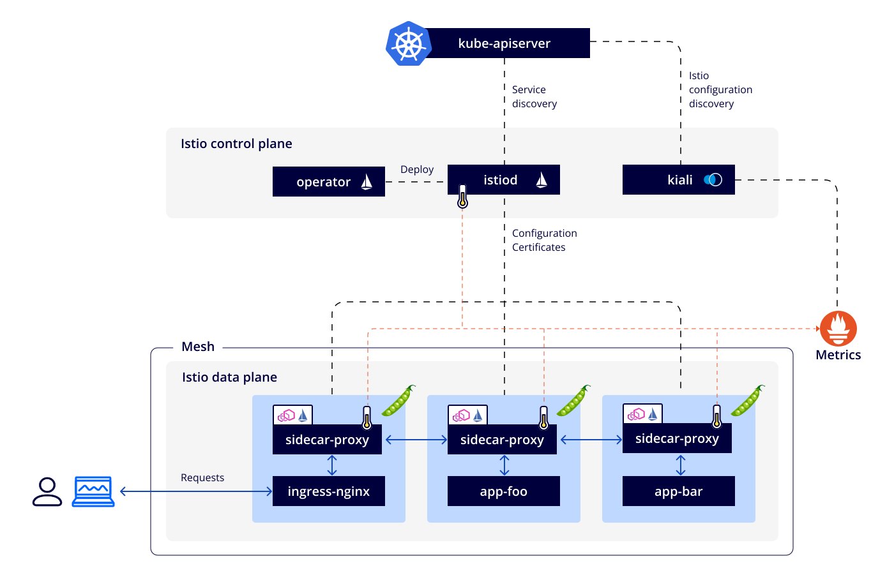

## Таблица совместимости поддерживаемых версий

| Версия Istio | Версии K8S, поддерживаемые Istio | Статус в текущем релизе D8 |
|:------------:|:------------------------------------------------------------------------------------------------------------------------------:|:--------------------------:|
|     1.25      |                                                1.29, 1.30, 1.31, 1.32                                                | Поддерживается |
|     1.21     |                                           1.26, 1.27, 1.28, 1.29, 1.30, 1.31                                          |  Поддерживается  |
|     1.19     |                                                     1.25<sup>*</sup>, 1.26, 1.27, 1.28, 1.28, 1.29, 1.30                                                     |       Устарела и будет удалена       |

<sup>*</sup> — версия Kubernetes **НЕ поддерживается** в текущем релизе Deckhouse Kubernetes Platform.

{::options parse_block_html="false" /}

## Задачи, которые решает Istio

[Istio](https://istio.io/) — фреймворк централизованного управления сетевым трафиком, реализующий подход Service Mesh.

Istio решает для приложений следующие задачи:

- [Таблица совместимости поддерживаемых версий](#таблица-совместимости-поддерживаемых-версий)
- [Задачи, которые решает Istio](#задачи-которые-решает-istio)
- [Mutual TLS](#mutual-tls)
- [Авторизация](#авторизация)
- [Маршрутизация запросов](#маршрутизация-запросов)
- [Управление балансировкой запросов между эндпойнтами сервиса](#управление-балансировкой-запросов-между-эндпойнтами-сервиса)
- [Observability](#observability)
  - [Трассировка](#трассировка)
  - [Grafana](#grafana)
  - [Kiali](#kiali)
- [Архитектура кластера с включенным Istio](#архитектура-кластера-с-включенным-istio)
- [Архитектура прикладного сервиса с включенным Istio](#архитектура-прикладного-сервиса-с-включенным-istio)
  - [Особенности](#особенности)
  - [Жизненный цикл пользовательского запроса](#жизненный-цикл-пользовательского-запроса)
    - [Приложение с выключенным Istio](#приложение-с-выключенным-istio)
    - [Приложение с включенным Istio](#приложение-с-включенным-istio)
- [Как активировать Istio для приложения](#как-активировать-istio-для-приложения)
- [Федерация и мультикластер](#федерация-и-мультикластер)
  - [Федерация](#федерация)
    - [Требования к кластерам](#требования-к-кластерам)
    - [Общие принципы федерации](#общие-принципы-федерации)
    - [Включение федерации](#включение-федерации)
    - [Управление федерацией](#управление-федерацией)
  - [Мультикластер](#мультикластер)
    - [Требования к кластерам](#требования-к-кластерам-1)
    - [Общие принципы](#общие-принципы)
    - [Включение мультикластера](#включение-мультикластера)
    - [Управление мультикластером](#управление-мультикластером)
- [Накладные расходы](#накладные-расходы)
  - [control-plane](#control-plane)
  - [data-plane](#data-plane)


Рекомендуем ознакомиться с [видео](https://www.youtube.com/watch?v=9CUfaeT3T-A), где рассмотрена архитектура Istio и оценены накладные расходы.


## Mutual TLS

Это основной метод взаимной аутентификации сервисов. Принцип основан на том, что для всех исходящих запросов проверяется сертификат сервера, а для входящих - клиентский сертификат. После проверки sidecar-proxy получает возможность идентифицировать удаленный узел и использовать эти данные для аутентификации или для прикладных целей.

Каждый сервис получает собственный идентификатор в формате `<TrustDomain>/ns/<Namespace>/sa/<ServiceAccount>`, где `TrustDomain` в нашем случае — это домен кластера. Каждому сервису можно выделять собственный ServiceAccount или использовать стандартный «default». Полученный идентификатор сервиса можно использовать как в правилах авторизации, так и в прикладных целях. Именно этот идентификатор используется в качестве удостоверяемого имени в TLS-сертификатах.

Данные настройки можно переопределить на уровне namespace.

## Авторизация

Управление авторизацией осуществляется с помощью ресурса [AuthorizationPolicy](istio-cr.html#authorizationpolicy). В момент, когда для сервиса создается этот ресурс, начинает работать следующий алгоритм принятия решения о судьбе запроса:

- Если запрос попадает под политику DENY — запретить запрос.
- Если для данного сервиса нет политик ALLOW — разрешить запрос.
- Если запрос попадает под политику ALLOW — разрешить запрос.
- Все остальные запросы — запретить.

Иными словами, если явно что-то запретить, работает только запрет. Если же что-то явно разрешить, будут разрешены только явно одобренные запросы (запреты при этом имеют приоритет).

Для написания правил авторизации доступны следующие аргументы:

- идентификаторы сервисов и wildcard на их основе (`mycluster.local/ns/myns/sa/myapp` или `mycluster.local/*`);
- пространства имён;
- диапазоны IP;
- HTTP-заголовки;
- JWT-токены из прикладных запросов.

## Маршрутизация запросов

Основной ресурс для управления маршрутизацией — [VirtualService](istio-cr.html#virtualservice), он позволяет переопределять судьбу HTTP- или TCP-запроса. Доступные аргументы для принятия решения о маршрутизации:

- Host и любые другие заголовки;
- URI;
- метод (GET, POST и пр.);
- лейблы пода или namespace источника запросов;
- dst-IP или dst-порт для не-HTTP-запросов.

## Управление балансировкой запросов между эндпойнтами сервиса

Основной ресурс для управления балансировкой запросов — [DestinationRule](istio-cr.html#destinationrule), он позволяет настроить нюансы исходящих из подов запросов:

- лимиты/таймауты для TCP;
- алгоритмы балансировки между эндпойнтами;
- правила определения проблем на стороне эндпойнта для выведения его из балансировки;
- нюансы шифрования.


Все настраиваемые лимиты работают для каждого пода клиента по отдельности! Если настроить для сервиса ограничение на одно TCP-соединение, а клиентских подов — три, то сервис получит три входящих соединения.


## Observability

### Трассировка

Istio позволяет осуществлять сбор трейсов с приложений и инъекцию трассировочных заголовков, если таковых нет. При этом важно понимать следующее:

- Если запрос инициирует на сервисе вторичные запросы, для них необходимо наследовать трассировочные заголовки средствами приложения.
- Jaeger для сбора и отображения трейсов потребуется устанавливать самостоятельно.

### Grafana

В стандартной комплектации с модулем предоставлены дополнительные дашборды:

- дашборд для оценки производительности и успешности запросов/ответов между приложениями;
- дашборд для оценки работоспособности и нагрузки на control plane.

### Kiali

Инструмент для визуализации дерева сервисов вашего приложения. Позволяет быстро оценить обстановку в сетевой связности благодаря визуализации запросов и их количественных характеристик непосредственно на схеме.

## Архитектура кластера с включенным Istio

Компоненты кластера делятся на две категории:

- control plane — управляющие и обслуживающие сервисы. Под control plane обычно подразумевают поды istiod.
- data plane — прикладная часть Istio. Представляет собой контейнеры sidecar-proxy.


<!--- Исходник: https://docs.google.com/drawings/d/1wXwtPwC4BM9_INjVVoo1WXj5Cc7Wbov2BjxKp84qjkY/edit --->

Все сервисы из data plane группируются в mesh. Его характеристики:

- Общее пространство имен для генерации идентификатора сервиса в формате `<TrustDomain>/ns/<Namespace>/sa/<ServiceAccount>`. Каждый mesh имеет идентификатор TrustDomain, который в нашем случае совпадает с доменом кластера. Например: `mycluster.local/ns/myns/sa/myapp`.
- Сервисы в рамках одного mesh имеют возможность аутентифицировать друг друга с помощью доверенных корневых сертификатов.

Элементы control plane:

- `istiod` — ключевой сервис, обеспечивающий решение следующих задач:
  - Непрерывная связь с API Kubernetes и сбор информации о прикладных сервисах.
  - Обработка и валидация с помощью механизма Kubernetes Validating Webhook всех Custom Resources, которые связаны с Istio.
  - Компоновка конфигурации для каждого sidecar-proxy индивидуально:
    - генерация правил авторизации, маршрутизации, балансировки и пр.;
    - распространение информации о других прикладных сервисах в кластере;
    - выпуск индивидуальных клиентских сертификатов для организации схемы Mutual TLS. Эти сертификаты не связаны с сертификатами, которые использует и контролирует сам Kubernetes для своих служебных нужд.
  - Автоматическая подстройка манифестов, определяющих прикладные поды через механизм Kubernetes Mutating Webhook:
    - внедрение дополнительного служебного контейнера sidecar-proxy;
    - внедрение дополнительного init-контейнера для адаптации сетевой подсистемы (настройка DNAT для перехвата прикладного трафика);
    - перенаправление readiness- и liveness-проб через sidecar-proxy.
- `operator` — компонент, отвечающий за установку всех ресурсов, необходимых для работы control plane определенной версии.
- `kiali` — панель управления и наблюдения за ресурсами Istio и пользовательскими сервисами под управлением Istio, позволяющая следующее:
  - Визуализировать связи между сервисами.
  - Диагностировать проблемные связи между сервисами.
  - Диагностировать состояние control plane.

Для приема пользовательского трафика необходима доработка Ingress-контроллера:

- К подам контроллера добавляется sidecar-proxy, который обслуживает только трафик от контроллера в сторону прикладных сервисов (параметр IngressNginxController [`enableIstioSidecar`](../ingress-nginx/cr.html#ingressnginxcontroller-v1-spec-enableistiosidecar) у ресурса IngressNginxController).
- Сервисы не под управлением Istio продолжают работать как раньше, запросы в их сторону не перехватываются сайдкаром контроллера.
- Запросы в сторону сервисов под управлением Istio перехватываются сайдкаром и обрабатываются в соответствии с правилами Istio (подробнее о том, [как активировать Istio для приложения](#как-активировать-istio-для-приложения)).

Контроллер istiod и каждый контейнер sidecar-proxy экспортируют собственные метрики, которые собирает кластерный Prometheus.

## Архитектура прикладного сервиса с включенным Istio

### Особенности

- Каждый под сервиса получает дополнительный контейнер — sidecar-proxy. Технически этот контейнер содержит два приложения:
  - **Envoy** — проксирует прикладной трафик и реализует все функции, которые предоставляет Istio, включая маршрутизацию, аутентификацию, авторизацию и пр.
  - **pilot-agent** — часть Istio, отвечает за поддержание конфигурации Envoy в актуальном состоянии, а также содержит в себе кэширующий DNS-сервер.
- В каждом поде настраивается DNAT входящих и исходящих прикладных запросов в sidecar-proxy. Делается это с помощью дополнительного init-контейнера. Таким образом, трафик будет перехватываться прозрачно для приложений.
- Так как входящий прикладной трафик перенаправляется в sidecar-proxy, readiness/liveness-трафика это тоже касается. Подсистема Kubernetes, которая за это отвечает, не рассчитана на формирование проб в формате Mutual TLS. Для адаптации все существующие пробы автоматически перенастраиваются на специальный порт в sidecar-proxy, который перенаправляет трафик на приложение в неизменном виде.
- Для приема запросов извне кластера необходимо использовать подготовленный Ingress-контроллер:
  - Поды контроллера аналогично имеют дополнительный контейнер sidecar-proxy.
  - В отличие от подов приложения, sidecar-proxy Ingress-контроллера перехватывает только трафик от контроллера к сервисам. Входящий трафик от пользователей обрабатывает непосредственно сам контроллер.
- Ресурсы типа Ingress требуют минимальной доработки в виде добавления аннотаций:
  - `nginx.ingress.kubernetes.io/service-upstream: "true"` — Ingress-контроллер в качестве upstream будет использовать ClusterIP сервиса вместо адресов подов. Балансировкой трафика между подами теперь занимается sidecar-proxy. Используйте эту опцию, только если у вашего сервиса есть ClusterIP.
  - `nginx.ingress.kubernetes.io/upstream-vhost: "myservice.myns.svc"` — sidecar-proxy Ingress-контроллера принимает решения о маршрутизации на основе заголовка Host. Без данной аннотации контроллер оставит заголовок с адресом сайта, например `Host: example.com`.
- Ресурсы типа Service не требуют адаптации и продолжают выполнять свою функцию. Приложениям все так же доступны адреса сервисов вида servicename, servicename.myns.svc и пр.
- DNS-запросы изнутри подов прозрачно перенаправляются на обработку в sidecar-proxy:
  - Требуется для разыменования DNS-имен сервисов из соседних кластеров.

### Жизненный цикл пользовательского запроса

#### Приложение с выключенным Istio

<div data-presentation="presentations/request_lifecycle_istio_disabled_ru.pdf"></div>
<!--- Source: https://docs.google.com/presentation/d/1_lw3EyDNTFTYNirqEfrRANnEAVjGhrOCdFJc-zCOuvs/ --->

#### Приложение с включенным Istio

<div data-presentation="presentations/request_lifecycle_istio_enabled_ru.pdf"></div>
<!--- Source: https://docs.google.com/presentation/d/1gQfX9ge2vhp74yF5LOfpdK2nY47l_4DIvk6px_tAMPU/ --->

## Как активировать Istio для приложения

Основная цель активации — добавить sidecar-контейнер к подам приложения, после чего Istio сможет управлять трафиком.

Рекомендованный способ добавления sidecar-ов — использовать sidecar-injector. Istio умеет «подселять» к вашим подам sidecar-контейнер с помощью механизма [Admission Webhook](https://kubernetes.io/docs/reference/access-authn-authz/extensible-admission-controllers/). Настраивается с помощью лейблов и аннотаций:

- Лейбл к `namespace` — обозначает ваше пространство имён для компонента sidecar-injector. После применения лейбла к новым подам будут добавлены sidecar-контейнеры:
  - `istio-injection=enabled` — использует глобальную версию Istio (`spec.settings.globalVersion` в `ModuleConfig`);
  - `istio.io/rev=v1x16` — использует конкретную версию Istio для этого пространства имён.
- Аннотация к **поду** `sidecar.istio.io/inject` (`"true"` или `"false"`) позволяет локально переопределить политику `sidecarInjectorPolicy`. Эти аннотации работают только в пространствах имён, обозначенных лейблами из списка выше.

Также существует возможность добавить sidecar к индивидуальному поду в пространстве имён без установленных лейблов `istio-injection=enabled` или `istio.io/rev=vXxYZ` путем установки лейбла `sidecar.istio.io/inject=true`.

**Важно!** Istio-proxy, который работает в качестве sidecar-контейнера, тоже потребляет ресурсы и добавляет накладные расходы:

- Каждый запрос DNAT'ится в Envoy, который обрабатывает это запрос и создает еще один. На принимающей стороне — аналогично.
- Каждый Envoy хранит информацию обо всех сервисах в кластере, что требует памяти. Больше кластер — больше памяти потребляет Envoy. Решение — CustomResource [Sidecar](istio-cr.html#sidecar).

Также важно подготовить Ingress-контроллер и Ingress-ресурсы приложения:

- Включите [`enableIstioSidecar`](../ingress-nginx/cr.html#ingressnginxcontroller-v1-spec-enableistiosidecar) у ресурса IngressNginxController.
- Добавьте аннотации на Ingress-ресурсы приложения:
  - `nginx.ingress.kubernetes.io/service-upstream: "true"` — Ingress-контроллер в качестве upstream использует ClusterIP сервиса вместо адресов подов. Балансировкой трафика между подами теперь занимается sidecar-proxy. Используйте эту опцию, только если у вашего сервиса есть ClusterIP;
  - `nginx.ingress.kubernetes.io/upstream-vhost: "myservice.myns.svc"` — sidecar-proxy Ingress-контроллера принимает решения о маршрутизации на основе заголовка Host. Без этой аннотации контроллер оставит заголовок с адресом сайта, например `Host: example.com`.

## Федерация и мультикластер


Доступно в редакциях Enterprise Edition и Certified Security Edition Pro (1.67).


Поддерживаются две схемы межкластерного взаимодействия:

- [федерация](#федерация);
- [мультикластер](#мультикластер).

Принципиальные отличия:

- Федерация объединяет суверенные кластеры:
  - у каждого кластера собственное пространство имен (для namespace, Service и пр.);
  - доступ к отдельным сервисам между кластерами явно обозначен.
- Мультикластер объединяет созависимые кластеры:
  - пространство имен у кластеров общее — каждый сервис доступен для соседних кластеров так, словно он работает на локальном кластере (если это не запрещают правила авторизации).

### Федерация

#### Требования к кластерам

- У каждого кластера должен быть уникальный домен в параметре [`clusterDomain`](/products/kubernetes-platform/documentation/v1/reference/api/cr.html#clusterconfiguration-clusterdomain) ресурса [ClusterConfiguration](/products/kubernetes-platform/documentation/v1/reference/api/cr.html#clusterconfiguration). Обратите внимание, что ни один из кластеров не должен иметь домен `cluster.local`, который является значением по умолчанию.

  > `cluster.local` — неизменяемый псевдоним для домена локального кластера.
  > Указание `cluster.local` как principals в AuthorizationPolicy всегда будет указывать на локальный кластер, даже если в mesh существует кластер, у которого [`clusterDomain`](/products/kubernetes-platform/documentation/v1/reference/api/cr.html#clusterconfiguration-clusterdomain) явно определен как `cluster.local` ([источник — документация Istio](https://istio.io/latest/docs/tasks/security/authorization/authz-td-migration/#best-practices)).
- Подсети сервисов и подов в параметрах [`serviceSubnetCIDR`](/products/kubernetes-platform/documentation/v1/reference/api/cr.html#clusterconfiguration-servicesubnetcidr) и [`podSubnetCIDR`](/products/kubernetes-platform/documentation/v1/reference/api/cr.html#clusterconfiguration-podsubnetcidr) ресурса [ClusterConfiguration](/products/kubernetes-platform/documentation/v1/reference/api/cr.html#clusterconfiguration) должны быть уникальными для каждого кластера.

  > - При анализе HTTP и HTTPS запросов *(в терминологии istio)* идентифицировать их и принять решение о дальнейшей маршрутизации, запрещении или разрешении возможно по заголовкам.
  > - А при анализе TCP-запросов *(в терминологии istio)* идентифицировать их и принять решение о дальнейшей маршрутизации, запрещении или разрешении возможно только по IP-адресу назначения и номеру порта.
  >
  > Если IP-адреса сервисов или подов пересекутся между кластерами, то под маршрутизирующие, запрещающие или разрешающие правила istio могут попасть запросы других подов иных кластеров.
  > Пересечение подсетей сервисов и подов жестко запрещено в single-network режиме, и допустимо, но не рекомендуется в режиме multi-networks ([источник — документация Istio](https://istio.io/latest/docs/ops/deployment/deployment-models/#single-network)).
  >
  > - В режиме single-network поды разных кластеров могут взаимодействовать друг с другом напрямую.
  > - В режиме multi-networks поды разных кластеров могут взаимодействовать друг с другом только при использовании istio-gateway.

#### Общие принципы федерации

- Федерация требует установления взаимного доверия между кластерами. Соответственно, для установления федерации нужно в кластере A сделать кластер Б доверенным и аналогично в кластере Б сделать кластер А доверенным. Это достигается взаимным обменом корневыми сертификатами.
- Для прикладной эксплуатации федерации необходимо также обменяться информацией о публичных сервисах. Чтобы опубликовать сервис bar из кластера Б в кластере А, необходимо в кластере А создать ресурс ServiceEntry, который описывает публичный адрес ingress-gateway кластера Б.

<div data-presentation="presentations/federation_common_principles_ru.pdf"></div>
<!--- Source: https://docs.google.com/presentation/d/1EI2MQMuVCGACnLNBXMGVDNJVhwU3vJYtVcHhrWfjLDc/ --->

#### Включение федерации

При включении федерации (параметр модуля `istio.federation.enabled = true`) происходит следующее:

- В кластер добавляется сервис `ingressgateway`, чья задача — проксировать mTLS-трафик извне кластера на прикладные сервисы.
- В кластер добавляется сервис, который экспортирует метаданные кластера наружу:
  - корневой сертификат Istio (доступен без аутентификации);
  - список публичных сервисов в кластере (доступен только для аутентифицированных запросов из соседних кластеров);
  - список публичных адресов сервиса `ingressgateway` (доступен только для аутентифицированных запросов из соседних кластеров).

#### Управление федерацией

<div data-presentation="presentations/federation_istio_federation_ru.pdf"></div>
<!--- Source: https://docs.google.com/presentation/d/1MpmtwJwvSL32EdwOUNpJ6GjgWt0gplzjqL8OOprNqvc/ --->

Для построения федерации необходимо сделать следующее:

- В каждом кластере создать набор ресурсов `IstioFederation`, которые описывают все остальные кластеры.
  - После успешного автосогласования между кластерами, в ресурсе `IstioFederation` заполнятся разделы `status.metadataCache.public` и `status.metadataCache.private` служебными данными, необходимыми для работы федерации.
- Каждый ресурс(`service`), который считается публичным в рамках федерации, пометить лейблом `federation.istio.deckhouse.io/public-service: ""`.
  - В кластерах из состава федерации, для каждого `service` создадутся соответствующие `ServiceEntry`, ведущие на `ingressgateway` оригинального кластера.


В разделе `.spec.ports` этих `service` у каждого порта должно быть заполнено поле `name`.


### Мультикластер

#### Требования к кластерам

- Домены кластеров в параметре [`clusterDomain`](/products/kubernetes-platform/documentation/v1/reference/api/cr.html#clusterconfiguration-clusterdomain) ресурса [ClusterConfiguration](/products/kubernetes-platform/documentation/v1/reference/api/cr.html#clusterconfiguration) должны быть одинаковыми для всех членов мультикластера. По умолчанию значение параметра — `cluster.local`.
* Подсети сервисов и подов в параметрах [`serviceSubnetCIDR`](/products/kubernetes-platform/documentation/v1/reference/api/cr.html#clusterconfiguration-servicesubnetcidr) и [`podSubnetCIDR`](/products/kubernetes-platform/documentation/v1/reference/api/cr.html#clusterconfiguration-podsubnetcidr) ресурса [ClusterConfiguration](/products/kubernetes-platform/documentation/v1/reference/api/cr.html#clusterconfiguration) должны быть уникальными для каждого кластера.

  > - При анализе HTTP и HTTPS запросов *(в терминологии istio)* идентифицировать их и принять решение о дальнейшей маршрутизации, запрещении или разрешении возможно по заголовкам.
  > - А при анализе TCP запросов *(в терминологии istio)* идентифицировать их и принять решение о дальнейшей маршрутизации, запрещении или разрешении возможно только по IP-адресу назначения и номеру порта.
  >
  > Если IP адреса сервисов или подов пересекутся между кластерами, то под маршрутизирующие, запрещающие или разрешающие правила istio могут попасть запросы других подов иных кластеров.
  > Пересечение подсетей сервисов и подов жестко запрещено в single-network режиме, и не рекомендуется в режиме multiple-networks ([источник — документация Istio](https://istio.io/latest/docs/ops/deployment/deployment-models/#single-network))
  >
  > - В режиме single-network поды разных кластеров могут взаимодействовать друг с другом напрямую.
  > - В режиме multiple-networks поды разных кластеров могут взаимодействовать друг с другом только при использовании istio-gateway.

#### Общие принципы

<div data-presentation="presentations/multicluster_common_principles_ru.pdf"></div>
<!--- Source: https://docs.google.com/presentation/d/1WeNrp0Ni2Tz3_Az0f45rkWRUZxZUDx93Om5MB3sEod8/ --->

- Мультикластер требует установления взаимного доверия между кластерами. Соответственно, для построения мультикластера нужно в кластере A сделать кластер Б доверенным и в кластере Б сделать кластер А доверенным. Технически это достигается взаимным обменом корневыми сертификатами.
- Для сбора информации о соседних сервисах Istio подключается напрямую к API-серверу соседнего кластера. Данный модуль Deckhouse берет на себя организацию соответствующего канала связи.

#### Включение мультикластера

При включении мультикластера (параметр модуля `istio.multicluster.enabled = true`) происходит следующее:

- В кластер добавляется прокси для публикации доступа к API-серверу посредством стандартного Ingress-ресурса:
  - Доступ через данный публичный адрес ограничен авторизацией на основе Bearer-токенов, подписанных доверенными ключами. Обмен доверенными публичными ключами происходит автоматически средствами Deckhouse при взаимной настройке мультикластера.
  - Сам прокси имеет read-only-доступ к ограниченному набору ресурсов.
- В кластер добавляется сервис, который экспортирует метаданные кластера наружу:
  - Корневой сертификат Istio (доступен без аутентификации).
  - Публичный адрес, через который доступен API-сервер (доступен только для аутентифицированных запросов из соседних кластеров).
  - Список публичных адресов сервиса `ingressgateway` (доступен только для аутентифицированных запросов из соседних кластеров).
  - Публичные ключи сервера для аутентификации запросов к API-серверу и закрытым метаданным (см. выше).

#### Управление мультикластером

<div data-presentation="presentations/multicluster_istio_multicluster_ru.pdf"></div>
<!--- Source: https://docs.google.com/presentation/d/1D3nuoC0okJQRCOY4teJ6p598Bd4JwPXZT5cdG0hW8Hc/ --->

Для сборки мультикластера необходимо в каждом кластере создать набор ресурсов `IstioMulticluster`, которые описывают все остальные кластеры.

В случае проблем при работе с мультикластером необходимо проверить в каждом кластере:
1. Состояние ресурсов `IstioMultiCluster`. Для этого выполните команду `d8 k describe istiomulticluster cluster-name`. Важно, чтобы в статусе ресурса был указан `Root CA` и в поле `Public Last Fetch Timestamp` была свежая метка времени.
2. В поле `Ingress Gateways` ресурса `IstioMultiCluster` должен быть указан корректный адрес (IP или FQDN) IngressGateway второго кластера.
3. С помощью утилиты `istioctl` ([как установить...](https://istio.io/v1.25/docs/setup/additional-setup/download-istio-release/)):

```console
istioctl remote-clusters -i d8-istio
NAME          SECRET                                     STATUS     ISTIOD
cluster-b     d8-istio/istio-remote-secret-cluster-b     synced     istiod-v1x21-5c57d85b54-k8pl7
```

## Накладные расходы

Внедрение Istio повлечёт за собой дополнительные расходы ресурсов, как для **control-plane** (контроллер istiod), так и для **data-plane** (istio-сайдкары приложений).

### control-plane

Контроллер istiod непрерывно наблюдает за конфигурацией кластера, компонует настройки для istio-сайдкаров data-plane и рассылает их по сети. Соответственно, чем больше приложений и их экземпляров, чем больше сервисов и чем чаще эта конфигурация меняется, тем больше требуется вычислительных ресурсов и больше нагрузка на сеть. При этом, поддерживается два подхода для снижения нагрузки на экземпляры контроллеров:

- горизонтальное масштабирование (настройка модуля [`controlPlane.replicasManagement`](configuration.html#parameters-controlplane-replicasmanagement)) — чем больше экземпляров контроллеров, тем меньше экземпляров istio-сайдкаров обслуживать каждому из них и тем меньше нагрузка на CPU и на сеть.
- сегментация data-plane с помощью ресурса [*Sidecar*](istio-cr.html#sidecar) (рекомендуемый подход) — чем меньше область видимости у отдельного istio-сайдкара, тем меньше требуется обновлять данных в data-plane и тем меньше нагрузка на CPU и на сеть.

Примерная оценка накладных расходов для экземпляра control-plane, который обслуживает 1000 сервисов и 2000 istio-сайдкаров — 1 vCPU и 1.5 GB RAM.

### data-plane

На потребление ресурсов data-plane (istio-сайдкары) влияет множество факторов:

- количество соединений,
- интенсивность запросов,
- размер запросов и ответов,
- протокол (HTTP/TCP),
- количество ядер CPU,
- сложность конфигурации Service Mesh.

Примерная оценка накладных расходов для экземпляра istio-сайдкара — 0.5 vCPU на 1000 запросов/сек и 50 MB RAM.

istio-сайдкары также вносят задержку в сетевые запросы — примерно 2.5мс на запрос.
